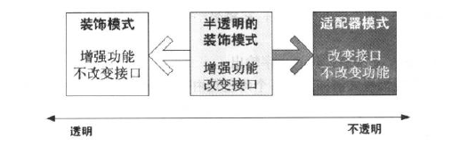

# 总结
## 一、设计模式概览
### 1.1 创建模式
创建模式是对类的实例化过程的抽象。分为类的创建模式和对象的创建模式。
* 类的创建模式：使用继承关系，把类的创建延迟到子类。这是一种静态的过程，多次创建得到的对象的内部表象是固定的。
* 对象的创建模式：使用委派关系，将对象的创建过程动态的委派给另一个对象。

#### 1.1.1 简单工厂模式（静态工厂模式）--类的创建模式
#### 1.1.2 工厂方法模式（多态工厂模式）--类的创建模式
#### 1.1.3 抽象工厂模式--对象的创建模式
#### 1.1.4 单例模式--对象的创建模式
[Ref](https://cloud.tencent.com/developer/article/1497592)
* 1.饿汉式- 静态属性
* 2.饿汉式- 枚举类
    单例类本身是个枚举类
* 3.懒汉式- 线程不安全
* 4.懒汉式- synchronized
* 5.懒汉式- volatile + doubleCheck
  > volatile 解决指令重排序问题； 
  > doubleCheck提供效率更高获取实例方法
* 6.懒汉式- 内部静态类
* 7.懒汉式- 内部枚举类 本质上上第6中
#### 1.1.5 多例模式--对象的创建模式
多例类自行创建，管理自己的实例，并向外界提供自己的实例
#### 1.1.5 建造模式--对象的创建模式
将产品内部表象和产品的生产过程分割开来，可以创建具有不同内部表象的产品对象。

与Java Bean的builder类似，只是在其基础上增加了Director角色，使得可以通过一个construct方法（建造过程）就可以生成不同的产品。
建造者模式的关键是可以使得建造出来的对象具有不同的内部表象（即成员变量的值不一样），所以称为对象的创建模式
抽象工厂模式由于可以对产品族进行组装，所以得到的对象也是不同的对象，也是一种对象的创建模式
而像简单工厂模式，工厂方法模式，创建出来的都是相同的对象(因为继承关系是静态的。)，所以是一种类的创建模式。 

建造者模式可以先利用抽象工厂模式创建出对象，然后再在Builder中设置相关性质。

比如spring的BeanDefinitionBuilder
    
#### 1.1.6 原型模式--对象的创建模式
基于原型对象来复制更多的同类型对象

### 1.2 结构模式
结构模式描述如何将类或者对象结合在一起形成一个更大的结构。
* 类的结构模式：使用继承关系把类、接口等组合在一起，形成更大的结构。类的结构模式是静态的。
    * 比如类形式的适配器
* 对象的结构模式：使用关联/聚合/组合的方式将不同类型的对象组合在一起，以实现新的功能。对象的结构模式是动态的

#### 1.2.1 适配器模式 Adapter -- 类的结构模式(类形式的适配器模式) / 对象的结构模式(对象形式的适配器模式)
适配器模式通过一个adapter类将一个类的接口(adaptee)变换成客户端所期待的另外一种接口(target).
适配器模式是包裹(wrapper)模式的一种。

#### 1.2.2 缺省适配器模式 Default Adapter -- 类的结构模式
缺省适配器模式是特殊的适配器模式，adaptee和target是同一个接口，adapter是为这个接口提供缺省实现，使得子类不必从原有接口进行拓展。

#### 1.2.3 合成模式 Composite -- 对象的结构模式
合成模式用来描述整体与部分的关系，可以将对象组织到树结构中。客户端可以将单纯元素和符合元素同等看待。

#### 1.2.4 装饰模式 Decorator -- 对象的结构模式
装饰模式通过委派的方式而非继承的方式来对一个对象的功能加以拓展。
装饰模式是包裹(wrapper)模式的一种。
装饰模式与适配器模式：
    适配器模式：适配器包装的对象与适配器类实现不同的接口，将一种API转换为另外一种API
    装饰模式：装饰包装的对象与装饰类实现相同的接口，目的是增强功能
InputStreamReader 是一个适配器类，将InputStream的API转换成Reader的API
BufferedInputStream 是一个装饰类，包装InputStream提供缓冲功能    

如果装饰模式的装饰角色提供了更多的宽接口，而不是和抽象构建角色的完全一样，这时，这个装饰角色实际上也称为了适配器角色，这种装饰模式属于半透明化的装饰模式(介于适配器模式和装饰模式之间)。

很难找到理想的装饰模式，因为对一个对象进行增强的时候，都会导致加入新的行为。

比如BufferedReader对Reader增强了缓冲的功能，就可以实现按行读取操作，所以额外提供了readLine()方法.

一个装饰类提供的新的方法越多，离纯粹的装饰模式的距离也就越远，离适配器模式就越近。

#### 1.2.5 代理模式 Proxy -- 对象的结构模式
代理模式通过代理对象控制原对象的行为，达到“挟天子以令诸侯”的效果，并不是为了增强原有对象的功能。

代理模式的结构与装饰模式的结构比较类似，两者的区别主要是用意上：

装饰模式主要是为对象增强功能，使得对象可以做更多事；

代理模式主要是用于控制对象，何时调用对象的功能，之前做些什么，之后做些。

#### 1.2.6 享元模式 Flyweight -- 对象的结构模式
享元模式通过只包含不随环境变化的内蕴状态的享元对象来实现共享，来支持大量细粒度的对象。

#### 1.2.7 门面模式 Facade -- 对象的结构模式
门面模式通过一个门面对象来屏蔽子系统内部的协作细节，向外部提供统一的更高层次的接口。

#### 1.2.8 桥梁模式 Bridge/Interface -- 对象的结构模式
桥梁模式可以将一个等级结构通过组合复用的脱耦层抽象化和实现化两个等级结构，使得两个等级结构可以独立的进行演化。

* 一个典型例子：

  

  上面的继承关系有两个可变性，飞机的种类与飞机的制造商，当需要引入新的飞机或者引入新的飞机制造商，都需要进行组合，耦合性过强。

  可以根据组合/聚合复用原则，使用桥梁模式来达到开闭原则的要求。

  

### 1.3 行为模式
行为模式是对不同对象之间划分责任和算法的抽象化

#### 1.3.1 不变模式 Immutable
一个对象的状态在被创建之后就不再变化

#### 1.3.2 策略模式 Strategy -- 对象的行为模式
策略算法将不同的算法封装到不同的具体策略类中，使得算法可以在不影响客户端的情况下发生变化

#### 1.3.3 模版方法模式 Template Method -- 类的行为模式
模版方法模使得抽象类可以实现公共部分的逻辑，提供抽象方法来让子类实现剩余的不通用的逻辑

####  1.3.4 观察者模式 Observer -- 对象的行为模式
观察者模式可以让多个观察者对象同时监听一个主题对象，使得主题对象发生变化的时候，可以得到通知，做出反应。

#### 1.3.5 迭代子模式 Iterator/Cursor --对象的行为模式
迭代子模式使得可以顺序的访问一个聚集中的元素，而不必暴露聚集的内部表象。

#### 1.3.6 责任链模式 Chain of Responsibility -- 对象的行为模式
责任链模式中每个对象持有对下家的引用形成一条链，请求最终在这条上上的某个对象进行处理。
客户端不需要也不知道具体会是哪个对象处理。因此可以在不影响客户端的情况下重新组织或者分配责任。

#### 1.3.7 命令模式 Command -- 对象的行为模式
命名模式将一个请求或者操作封装到一个Command对象中，相当于将客户端的请求或者操作参数化了，将发号命令与执行命令的责任分离了。
这个请求或者操作就可以被执行命令的几个角色干预，进行排队或者记录日志。
结合备忘录模式，可以实现命令的撤销和恢复

#### 1.3.8 备忘录模式 Memento/Snapshot -- 对象的行为模式
备忘录模式将一个对象的状态捕捉住存储起来，从而可以在将来合适的时候把这个对象还原到之前的状态

#### 1.3.9 状态模式 State -- 对象的行为模式
状态模式使得一个对象在状态改变时状态对象也发生了改变，使得其行为也发生了改变。

#### 1.3.10 访问者模式 Visitor -- 对象的行为模式
访问者模式通过双重委派的机制使得数据结构与作用于该数据结构不同类型元素的操作得以脱耦。
当某个操作需要修改的时候，这个数据结构就不需要改变。

#### 1.3.11 解释器模式 Interpret -- 类的行为模式
解释器模式可以根据定义的文法，通过解释器来解释给定的表达式。

#### 1.3. 12 调停者模式 Mediator -- 对象的行为模式
调停者模式包装了一系列对象的相互作用的方式，使得这些对象不必互相明显引用，可以比较松散地耦合在一起。
使得这些相互作用可以彼此独立的变化。

## 二、四大原则
### 2.1 可维护性Maintainability与可复用性 Reuseability
一般来说，一个可维护性好的系统，就是复用率高的系统；而一个复用率高的系统，就是一个可维护性好的系统。
但是两者是两个独立的目标，并不总是方向一致的。

在面向过程的设计中，如果A和B同时使用另外一个模块C的功能，当A需要C增加一个新的行为时，B可能不需要甚至不允许，这时如果强行复用，就需要在C内部进行判断调用者，牺牲了可维护性，如果新增一个相同的方法，就会牺牲可复用性。

因此对于面向对象的软件系统设计来说，核心问题是在支持可维护性的同时，提高系统的可复用性。也就是如何抓住这两只同时在跑的兔子。

在像Java这样的面向对象的语言中，数据的抽象化，继承，封装，多态是最终要的语言特性，这些特性使得一个系统可以在更高的层次上提供可复用性。

* 抽象化和继承 使得概念和定义可以复用
* 多态 使得实现和应用可复用
* 抽象化和封装可以保持和促进系统的可维护性

这样，复用的焦点不再是函数和算法等具体实现细节，而是集中在最重要的含有宏观商业逻辑的抽象层次上。换言之，复用的焦点发生了倒转。

发生复用焦点的倒转并不是因为实现细节的复用不重要，而是因为这些细节的复用往往都已经做的很好了（比如数据结构和算法等等），而抽象层次时比这些细节更加值得强调的复用焦点，因为它们是在提高复用性的同时保持和提高可维护性的关键。

可维护性低包括以下方面：

* 过于僵硬Rigidity：添加新功能涉及很多其他模块。
* 过于脆弱Fragility：修改已有代码无法准确预测波及到的地方。
* 复用率低Immobility：已有代码依赖一堆其他东西，无法复用。
* 粘度过高Viscosity：遵循原有设计意愿的代价过高，宁愿使用特例。

一个好的系统设计应该有以下性质：
* 可拓展性Extensibility，解决【过于僵硬】的问题，很容易地【新增】功能
* 灵活性Flexibility，解决【过于脆弱】的问题，【修改】不会导致其他地方异常。
* 可插入性Pluggability，解决【粘度过高】问题，很容易地【插入/删除】新的类

在面向对象的设计中，可维护性复用是以【设计原则】和【设计模式】为基础的。

* 可拓展性：通过恰当的提高系统的可复用性，可以提高系统的可拓展性。对抽象接口的复用，允许新的实现类替换旧的实现类，客户端基于抽象接口，因此不会受到影响。

  > 系统的可拓展性是由“开-闭”原则，里氏代换原则，依赖倒转原则和组合/聚合复用原则保证。

* 灵活性：恰当提供系统的可复用性，可以提高系统的灵活性。在一个设计得当的系统中，每一个模块都相对于其他模块独立存在，并只保持与其他模块的尽可能少的通信。这样，使得修改的压力不会传递到其他模块。

  > 系统的灵活性是由“开-闭”原则，迪米特法则，接口隔离原则所保证的。

* 可插入性：恰当提供系统的可复用性，可以提高系统的可插入性。在一个满足“开-闭”原则的系统中，抽象层封装了与商业逻辑有关的重要行为，这些行为的具体实现由实现层给出，当某个实现类不再满足要求了，系统的设计可以保证旧的类可以被拔出，新的类可以被插入

  > 系统的可插入性是由“开-闭“原则，里氏代换原则，依赖倒转原则和组合/聚合原则保证的。

因此，下面的六大设计原则是在提高一个系统的可维护性的同时，提高可复用性的指导原则。依照这些设计原则进行系统设计，就可以抓到这两只同时奔跑的兔子。

设计模式是设计原则的体现。但是设计模式不能保证一个系统的可复用性和可维护性。

### 2.2 "开-闭"原则 （Open-Closed Principle）OCP

1. 定义：对扩展(Extension)开放，对修改(Modification)关闭

   > 从另外一个角度，“开-闭”原则是“对可变性的封装原则“。即找到一个系统的可变因素，将其封装起来。继承就是一种封装变化的方法
   >
   > 改变一个类的代码都算是修改了，不管是新增方法还是其他。

2. 理解：设计一个模块的时候，应当使得这个模块可以在不被修改的情况下被扩展。换言之，应当可以不修改源代码的情况下改变这个模块的行为。

3. 如何实现：抽象化是关键。

   > * 抽象层预见了所有可能的拓展，因此可以在任何拓展情况下都不会改变。因此满足了“对修改关闭”
   > * 通过抽象层导出的不同具体类可以改变系统的行为，满足了“对拓展开放”

   基于“对可变性的封装原则”来实现。也就是说我们要分析出那些是可变的因素。

   * 一个可变性应当被封装一个对象里面，而不应当散落在代码的很多角落，一种可变性的不同表象对应同一个继承等级结构的具体子类
   * [**单一职责原则**] 一种可变性不应当与另外一种可变性混合在一起。比如飞机种类与飞机的制造商，不能再在具体的飞机种类下面再派生出各种制造商飞机的子类了。

4. 与其他设计原则的关系

   * 与里氏代换原则：是对“开-闭”原则的补充。：“开-闭”原则的关键步骤是抽象化，而基类与子类的继承关系就是抽象化的具体体现。所以里氏代换原则是对实现抽象化的具体步骤的规范。

     >  里氏代换原则：任何基类可以出现的地方，子类一定可以出现。

   * 与依赖倒转原则: 依赖倒转原则是“开-闭”原则的实现手段，要求在使用继承关系的时候，必须满足这个条件。“开-闭”原则是依赖倒转原则的目标。所以违反依赖倒转原则，就不可能实现“开-闭”原则。

     > 依赖倒转原则：要依赖于抽象，不要依赖于实现。

   * 与组合/聚合复用原则：组合/聚合原则也是“开-闭”原则的实现手段，要求设计师首先考虑组合/聚合关系。违背该原则，也无法实现“开-闭”原则。
     
     > 组合/聚合原则：要尽量使用组合/聚合，而不是继承关系达到复用
     
    * 与迪米特法则：迪米特法则也是“开-闭”原则的实现手段。
   
      > 迪米特法则：一个实体应当与尽可能少的实体发生相互作用。
      >
      > 迪米特法则使得模块之间的相对独立性更强，修改某个模块时，就不会修改压力传递给其他模块。因此可以更容易实现对修改的关闭。
   
   * 与接口隔离原则：接口隔离也是“开-闭”原则的实现手段
   
     > 接口隔离原则：应该为客户端提供尽可能小的接口，而不要提供大的总接口。
     >
     > 接口隔离原则与广义迪米特法则都是对一个软件实体与其他实体之间通信的限制。
     >
     > 广义迪米特限制了通信的宽度和深度，接口隔离原则限制了通信的宽度。
     >
     > 接口隔离原则同样会使得修改的压力不会传递到其他对象。
     >
     > 比如一个具体类实现了多个小的接口，那么在利用里氏代换和依赖倒转时，客户端拿到的是一个小的接口，就不会访问到其他不相关的方法。

5. 与设计模式的关系

   设计模式都是对不同的可变性的封装，使得系统在不同的角度上达到“开-闭”原则。

   > 特别注意，是在不同的角度

   * 策略模式
     * 对算法可变的封装。允许加入新的算法
   * 简单工厂模式
     * 对产品可变的封装。允许新的产品加入系统，工厂角色需要修改，但是产品的消费角色不需要修改。因此对工厂角色不满足开闭原则，但是对于消费角色满足
   * 工厂方法模式
     * 对产品可变的封装。允许的新的产品加入系统，工厂角色也不需要修改，只需要再加入一个新的具体工厂就可以了。换言之，工厂方法模式完全支持“开-闭”原则
   * 抽象工厂模式
     * 对产品族可变性的封装。允许加入新的产品族，只需要使用新的抽象产品族工厂类就可以重新构建一个新的产品对象家族。
     * 但是如果需要在产品族中增加一种产品，也就是增加一种产品等级结构，这需要对所有的产品族工厂进行修改。
     * 抽象工厂方法也以一种倾斜的方式支持开闭原则
   * 建造模式
     * 对产品内部表象的可变性的封装。一个产品的内部表象发生了变化，只需要引入新的builder就可以了。
   * 桥梁模式
     * 对抽象逻辑和实现逻辑的可变性的封装。对于实现逻辑来说，所有的实现类都有共同的接口，可以通过创建新的具体实现化类加入都系统里面。
   * 门面模式
     * 对子系统可变性的封装。子系统内部功能的变化不会影响到外部系统。
   * 调停者模式
     * 对相互作用可变性的封装。当需要添加新的相互作用的时候，已有的同事对象不需要修改，**但是调停者需要修改**，因此调停者是部分支持开闭原则。
   * 访问者模式
     * 对节点访问处理可变性的封装。当需要拓展节点的访问逻辑时很容易，只需要加入新的访问者类，该类中使用新的访问逻辑即可。但是如果需要拓展一个新的节点类型，就需要在抽象类上添加对该节点的重载方法，无法对修改关闭。因此访问者模式提供了倾斜的可拓展性。
   * 迭代子模式
     * 对聚集对象内部结构的可变性的封装。由于聚集存储逻辑和迭代逻辑独立演变，使得对聚集对象的内部结构进行拓展无需修改迭代子的客户端。
   * todo 其他模式

6. 总结：从开闭原则可以看出，面向对象设计的重要原则是创建抽象化，并从抽象化导出具体化。

### 2.3 里氏代换原则（Liskov Substitution Principle）LSP

从抽象化导出到具体化，需要使用继承关系以及里氏代换原则。

1. 定义：可以使用基类的地方，一定也适用其子类。是对开闭原则的补充。

### 2.4 依赖倒转原则（Dependency Inversion Principle）DIP

1. 定义：要依赖于抽象，不要依赖于具体
2. 如何理解“倒转”：在面向过程的系统设计中，倾向于让高层次的模块依赖于低层次的模块，也就是抽象层依赖于具体层，而这个原则是要把这个依赖关系倒转过来。
3. 实现：**面向接口编程**
4. 缺点：
   1. 为了避免对具体类的直接引用，可能需要使用大量的对象工厂，导致大量的类。
   2. 依赖倒转原则假定了所有的具体类都会发生变化，则并不总是正确的，有些具体类可能是稳定的，完全可以被直接依赖，而不必声明抽象类。

### 2.5 接口隔离原则（Interface Segregation Principle）ISP

1. 定义：使用多个专门的接口，比使用单一的总接口要好。

   形象比喻：**“看人下菜碟”**

   从客户端的角度，也就是一个类对另外一个类的依赖性应当是建立在最小的接口上的。

   臃肿的大接口是对角色和接口的污染。

2. 与迪米特法则的关系：迪米特法则要求一个实体，尽可能少的与外界通信，如果必须通信，也要控制通信的广度和深度。

3. 比如备忘录模式中的宽接口和窄接口。宽接口为发起人originator提供，窄接口为负责人caretaker提供

   比如迭代子模式中的宽接口和窄接口。

### 2.6 组合/聚合复用原则（Composite/Aggregation Principle）CARP
1. 定义：要尽量使用组合/聚合关系，尽量不要使用继承关系。
   继承是一种静态关系，而委派是一种动态关系。

   继承是一种Is A的关系, 而委派是一种Has A的关系。

   > Is A说明一个类的对象只能是这类代表的含义，比如学生、经理、老板 extends 人，一个学生也可能是经理，也可能是老板，因此这种不是Is A的关系

   只有两个类满足里氏代换原则，才有可能是Is A关系。

2. 为什么尽量不要使用继承复用：

   1. 超类的实现发生变化，子类的实现不得不发生改变
   2. 继承是一种静态关系，子类从超类继承而来的实现，不能在运行时发生改变。
   3. 破坏了超类的封装，超类的实现暴露给了子类。必要时，需要通过final来禁止继承。

### 2.7 迪米特法则 （Law of  Demeter） LoD

1. 定义：一个软件实体应当尽可能少的与其他实体直接相互作用

   形象比如：**“不要和陌生人说话”**；“知道的越少越好，避免被殃及“

2. 狭义的迪米特法则：如果两个类**不必直接通信**，就不应当发生**直接的相互作用**，如果需要调用另外一个类（陌生者）的方法，可以通过**第三者（朋友）来转发**这个调用

   * 优点：改动仅仅会影响到第三者这个角色。
   * 缺点：
     * 会有很多小的转发方法，转发方法没有商业逻辑，容易造成迷惑。
     * 通信效率降低，间接作用代替了直接作用，导致通信效率降低。
   * 相关设计模式：门面模式、调停者模式

3. 广义迪米特法则：控制对象之间信息流量，流向以及信息的影响。

   * 设计上的体现：

     * 优先考虑将一个类设置为不变类

     * 尽量减低类的访问权限

     * 尽量降低类成员的访问权限。

     * 谨慎使用Serializable。

       > 因为客户端可以将这个了串行化再并行化，如果这个类的内部private结构发生了变化，那么客户端试图根据新版本的结构反序列化老版本的串行化结构就会报错。

   * 在代码层次上的体现
     * 限制局与变量的有效范围

### 2.8 【额外】单一职责原则 （Single Responsibility Principle） SRP

一个类应该只有一个可变性，一个可变性意味着一个职责，如果一个类承担的职责过多，那么一个职责的变化可能影响到其他职责的完成。也就是要解耦和增强内聚性。

## 三 UML 相关

UML(统一建模语言，Unified Modeling Language)
包括以下图，
* 结构型
    * 包图   Package
    * 类图   Class    
    * 对象图 Object    一个系统中对象的快照
    * 构件图 Component 描述可以部署的软件构件（比如jar包，EJB等）之间的关系
    * 部署图 Deploy    描述一个系统的拓扑图
* 行为型
    * 用例图 Use Case  描述角色与使用案例及他们之间的关系，用来对一个系统的最基本行为建模
    * 活动图 Activity  用例图的具体化，描述不同过程之间的动态接触
    * 状态图 State     一系列对象的内部状态及状态的变化和转移，一个类不能有两个不同的状态图
    * 序列图 Sequence  一种相互作用图，描述不同对象之间信息传递的时序
    * 合作图 Collaboration 一种相互作用图，描述发送信息和接收信息的一系列对象的<b>组织</b>结构
    其中用例图，类图和时序图是最有用的。
    只要有意义，所有类型的UML图是可以混合在一起使用的。
    一个系统的设计，从用例图开始，而且一个设计应当是案例驱动的。

描述设计模式一般使用类图，时序图，状态图就可以了。

### 3.1 类图
* 结构层次
    * 类名
    * 字段
    * 方法：静态方法有下划线
    * 属性
* 修饰符
    * '+' ：public
    * '#' ：protected
    * '-' ：private
* 关系
    * 依赖关系（Dependency）：【虚线】关系的对象出现在局部变量或者方法参量中，或者关系的类的静态方法被调用
      
        > 依赖总是单向的，代表一个类依赖于另外一个类的定义。
    * 关联关系（Association）：【实线】作为实例变量出现
        > 使一个类知道另一个类的属性和方法。不鼓励双向的关联（双向可以省略两边的箭头）。
        > 更多的是在同一个层次上的两个类
    * 聚合关系（Aggregation）：【实线+空心菱形】作为实例变量出现，且是整体与部分之间的关系
        > 较强的关联关系，涉及的两个类处在不平等的层次上，一个代表整体比如汽车，一个代表部分，比如轮胎，引擎以及其他零部件
        > 如果不确定是否为聚合关系，可以设置为关联关系
    * 组合关系（Composition）：【实线+实心菱形】作为成员变量出现，且维护关系对象的生命周期
        > 最强的关联关系，要求代表整体的对象负责代表部分的对象的生命周期。
        > 合成关系是不能共享的，也就是代表部分的对象只能由一个代表整体的对象所持有。
        > 代表整体的对象可以将代表部分的对象传递给另外一个对象，由后者负此对象的生命周期。
        > 比如人和心脏，四肢等。
    * 一般化关系：【实线+空心三角形】extends
    * 实现关系：【虚线+空心三角形】implements
    
### 3.2 时序图
 * 结构
    * 生命线：垂直的虚线
    * 激活条：小矩形，代表持续的时间
> 当没有返回值(void)的时候，返回的箭头可以不标注

### 3.3 状态图
* 结构
    * 起始状态：黑点
    * 过渡连线：由两部分组成(方框内是事件的保护条件，满足条件才会发生过渡），引起过渡的事件[保护条件]/事件发生引起的操作，
            第一部分是发生在该对象的事件(该对象是宾语），第二部分是该对象会产生什么响应操作。
    * 历史状态图标：记住系统离开时的状态
    * 终态图标：代表对象湮灭的状态
> 状态可以嵌套，大的状态叫父状态或者超状态，小的叫子状态。    

### 3.4 UML工具
一些是绘图工具，一些是具有代码生成能力的，甚至有些可以双向工作，代码与URML双向转换，或者时序图与合作图双向转换。
常见的有 Microsoft Visio, StarUML, Diagrams.net, PlantUML等
[PlantUML](https://plantuml.com/zh/)可以在Typora中使用, 并且有idea插件

## 四 重构相关

### 4.1 将条件转移语句改写为多态性

这种做法是指将一个进行多次条件转移的商业逻辑封装到不同的具体子类中去，使用多态性代替条件转移语句。

之所以可以使用多态来改写的原因在于，条件转移语句往往意味着可变性，使用多态可以将这种可变性封装起来。

但是这种重构方法不能保证开闭原则，仅仅是对条件语句中的商业逻辑部分实现了对修改关闭，其他部分未知。而且这种做法是由明显的缺点的：

* 首先，使用条件转移语句并非错误，更不是什么罪恶
* 使用多态性代替条件转移，意味着大量的类被创建出来，如果一个类有多个方法，每个方法都有多个条件转移语句。这样他们都用多态性代替的话，就有9个不同的类，很难明白他们之间的关系。

那么何时使用这种重构做法

* 应当从开闭原则出发，如果一个条件转移语句确实封装了某种商务逻辑的可变性，那么就符合开闭原则的设计思想了。

  如果条件转移语句没有涉及重要的商务逻辑，而且不会随着时间的变化而变化，也就是没有任何的可拓展性，也就没有任何意义的可变性。这个时候如果改写成多态，就是一种多态性污染。

### 4.2 抽象类应当拥有可能多的公共代码，尽可能少的数据

数据放在抽象类中，对于不需要该数据的具体子类，就是一种内存的浪费了。

## 五、专题
### 5.1 Java IO与设计模式
java语言采用流的机制来实现输入和输出。分为InputStream和OutputStream。像FileOutputStream这样可以读取文件作为输入的处理器称为流处理器。
java的io库提供了一个称为链接（chaining）的机制，可以将一个流处理器与另外一个流处理器收尾相接，第一个流处理器的输出作为输入。
比如DataInputStream可以将FileInputStream的Byte类型数据转换为java 原始类型和String类型的数据。
同理，对于DataOutputStream可以将原始类型和String类型的数据转换成Byte类型，FileOutputStream就可以接受Byte类型的数据输出到文件中。
根据流处理器的源头，可以分为
* 数组，String，File等，叫做原始流源
* 同类型的流用作链接流类的流源，叫做链接流源。

#### 5.1.1 java IO库的设计原则
java的io库设计中使用了装饰模式和适配器模式。

* 两个对称性：输入-输出对称；Byte-Char对称
  * InputStream--Byte输入流
  * OutputStrean--Byte输出流
  * Reader--Char输入流
  * Writer--Char输出流
* 两个设计模式：适配器模式与装饰模式。
  * InputStream，OutputStream, Reader, writer 均有装饰模式的等级结构，提供改善了的功能的流处理器。
  * InputStream与Reader，OutputStream与Writer之间可以通过适配器进行适配。
* 

#### 5.1.2 I/O库中的装饰模式

* 为什么需要使用专柜模式

  * I/O库需要很多性能，而且这些性能是可组合的。如果都用继承的方法来实现，那么一个等级结构就会有很多个可变性，不满足开闭原则的要求，每一种组合都需要一个类，造成类膨胀。如果采用装饰模式，类的数量将会大大减少。所以说装饰模式是Java I/O库的基本模式。

  * 当然引入了装饰模式，灵活性增加了，复杂性也会增加。

  * 整个Java I/O库是由一些基本的原始的流处理器和围绕他们的装饰流处理器所组成。

* InputStream

  

  

  * 流处理器的分类--按照输入流的源

    * 原始流处理器 4种

      * ByteArrayInputStream  接收Byte数组作为流的源，为多线程通信提供缓冲区操作功能

      * FileInputStream     接收File对象作为流的源

      * PipedInputStream  接收数据管道上的数据，比如接收PipedOutputStream的数据

        > 虽然PipedInputStream接收一个流作为流源，但是这个流是PipedOutputStream，而不是InputStream，所以也是原始流处理器。

      * StringBufferInputStream 接受字符串缓冲区的数据，也就是一个String类型的对象作为流源。

    * 链接流处理器  3大类

      * FilterInputStream  提供过滤功能

        * BufferInputStream  提供输入缓冲功能，使不会对每一次的读入操作都产生一个物理读盘动作。涉及到物理流的时候，比如控制台I/O, 文件I/O，等，都应当使用这个装饰流处理器。

        * DataInputStream  提供基于多字节的读取方法，可以读取原始数据类型和String类型的数据

          > 提供了很多readXX方法，比如readByte(), readShort(), readChar() 等

        * LineNumberInputStream 提供带有行计数功能，使得可以按照行号读取

        * PushbackInputStream 提供一种特殊的功能，将已经读取的直接“推回”到输入流中，即可以在读取过程后退一个字符。

          > LineNumberInputStream与PushBackInputStream 是为了支持用java语言制作编译器而准备的。

      * ObjectInputStream 提供已经串行化了(通过ObjectOutputStream)的原型数据类型和对象的重新并行化

      * SequenceInputStream 提供将多个输入流连接起来，形成一个输入流的功能。

* OutputStream

  

  * 原始流处理器 3种
    * ByteArrayOutputStream  输出Byte[]数组，为多线程通信提供缓冲区操作功能
    * FileOutputStream  输出到一个File对象
    * PipedOutputStream  输出到一个数据管道，比如PipedInputStream
  * 链接流处理器 2大类
    * FilterOutputStream 过滤输出流
      * BufferedOutputStream  提供输出缓冲功能，输出到内存缓冲区，然后将缓冲区数据输出到硬盘中。涉及到物理流的时候，比如控制台I/O, 文件I/O，等，都应当使用这个装饰流处理器。
      * DataOutputStream  提供基于多字节的写出方法，可以写出原始数据类型的数据。
      * PrintStream  提供格式化输出。System.out就是一个PrintStream。
    * ObjectOutputStream  提供将原始数据和对象串行化的功能

* Reader

  

  * 原始流处理器 4种
    * CharArrayReader  从charArray读取 为多线程的通信提供缓冲区操作功能
    * InputStreamReader  从inputStream读取
      * FileReader  从文件读取
    * PipedReader   从PipedWriter读取
    * StringReader  从StringBuffer读取
  * 链接流处理器 2大类
    * FilterReader   提供过滤
      * PushbackReaer
    * BufferedReader  提供输入缓冲
      * LineNumberReader  提供根据行号读取

* Writer

  

  * 原始流处理器 4种
    * CharArrayWriter  输出到charArray 为多线程的通信提供缓冲区操作功能
    * OutputStreamWriter 输出到OutputStream
      * FileWriter  输出到文件
    * PipedWriter  输出到PipedReader
    * StringWriter  输出到StringBuffer
  * 链接流处理器
    * FilterWriter 提供过滤
    * BufferedWriter 提供输出缓冲
    * PrintWriter 提供格式化输出

  

#### 5.1.3 I/O库中的适配器模式

ByteArrayInputStream是一个适配器类，将byte数组适配层InputStream流处理器的接口，使得InputStream可以从byte数组中读取。

同理，FileInputStream也是一个适配器类，将FileDescriptor文件描述符对象适配层InputStream类型的对象形式的适配器模式。

同理，CharArrayReader，StringReader，InputStreamReader，CharArrayWriter都是对象类型的适配器。

比较特殊的是PipedWriter这个适配器类，是将PipedReader适配成Writer

其中InputStreamReader 在注释上称为InputStream和Reader的桥梁，但是这个不是桥梁模式的引用，而是适配器模式。OutputStreamWriter同理。

经典的读取控制台输入的高性能例子，同时使用了适配器模式和装饰模式

