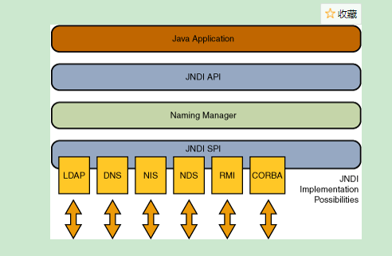

# JNDI
## 命名-目录服务
命名-目录服务将一个对象与一个名字联系起来，使得客户可以通过对象的名字找到这个对象。
目录服务允许对象有属性，客户端找到对象后还可以获取到相关的属性，也可以根据属性来查询对象。
常见的目录服务有轻量级目录访问协议(Ligthweight Directory Access Protocol)LDAP 和 DNS(Domain Name Service)

## JNDI 
JNDI 是java 命名和地址界面/命名和目录接口(Java Naming And Directory Interface)。
目的是为java系统提供支持各种目录类型的访问。
JNDI架构由JNDI API 和JNDI SPI组成。
API(Application Programming Interface)使得java应用程序可以使用一系列的命名与目录服务。
SPI(Service Provider Interface)使得服务提供商能够以对应用程序透明的方式插入到系统中。

