## 专题：ParNew+CMS收集器问题分析与解决

[TOC]

总结自[Java中9种常见的CMS GC问题分析与解决](https://tech.meituan.com/2020/11/12/java-9-cms-gc.html)

### 1.如何系统的分析和处理问题

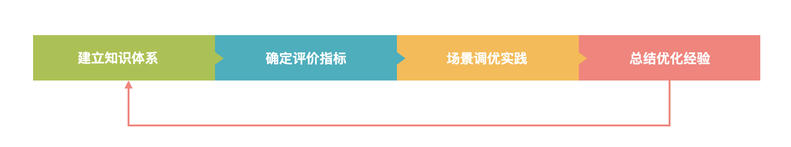

* **建立知识体系**：从JVM的内存机构到垃圾收集的算法和收集器，学些GC的基础知识，掌握常用的分析工具
* **确定评价指标**：了解GC的评价方法，摸清如何设定独立系统的指标，以及在业务场景中判断GC是否存在问题的手段
* **场景调优实践**：利用掌握的知识和评价指标，分析解决常见的GC问题
* **总结优化经验**： 对过程做出总结，将经验完善到知识体系中。


### 2.GC基础

#### 2.1 基础概念

* GC:  一般值Garbage Collection，垃圾收集，名词

* Mutator：生产垃圾的角色，也就是应用程序，通过Allocator进行allocate和free

* TLAB：Thread Local Allocate Buffer，基于CAS的独享线程（Mutator thread），可以优先将对象分配在这块区域中，这块区域是线程独享的，不存在资源竞争，分配速度快。

* Card Table：卡表，用来标记卡页的状态，每个卡表项对应一个卡页。当卡页中一个对象引用有写操作时，写屏障会将该卡页标记为dirty。卡表用来解决跨代引用的问题。

  > 详见源码cardTableRS.app或者StackOverflow问题解答[how-actually-card-table-and-writer-barrier-works](https://stackoverflow.com/questions/19154607/how-actually-card-table-and-writer-barrier-works)

#### 2.2 内存划分

JDK8中划分如下


GC主要工作在Heap区和MetaSapce区，在Direct Memory中，如果使用的是DirectByteBuffer，则在分配内存不足时这时GC通过Cleaner#clean间接管理

> 这里与《深入理解java虚拟机》说的不一样，这里的应该是对的。


#### 2.3 对象的分配

Java中对象的地址操作主要使用Unsafe调用了C的allocate和free两个系统调用。

有两种分配方式：

* 空闲链表：通过链表结构存储空闲的地址，通过空间换取时间的方式，将随机IO变成顺序IO，目前使用的是这种较多
* 碰撞指针：仅将指针移动与对象大小相同的距离，使用场景优先


#### 2.4 对象的收集

##### 2.4.1 如何识别垃圾

* 引用计数法：Reference Counting

  * 会导致循环引用(可以采用Recycler算法解决)

    > 面试中不要说只是因为导致循环引用而被弃用了，是可以解决的。
    >
    > Recycler算法核心：《垃圾回收算法手册》
    >
    > 1. 状态定义：
    >    * 黑色：确定存活的对象
    >    * 白色：确定死亡的对象
    >    * 紫色：可能存在环状应用的对象
    >    * 绿色：不可能存在环状应用的对象
    >    * 灰色：开始扫描该节点到结束该节点扫描之前（找到其所有的子节点之前），这段时间内为灰色。
    > 2. 步骤： 
    >    1. 找到可能是环状应用的一个对象，试着“打破”这个环
    >    2. 打破环之后，沿着该对象触发进行遍历，对每一个对象的引用计数都减少1，本质上是在消除内部引用
    >    3. 判断如果对象引用计数不为0，说明有环外的对象引用了该对象，那么就从该对象触发修正它可达的对象的引用
    >    4. 最后将引用计数为0的对象删除

  * 多线程环境下，计数变更需要进行昂贵的同步操作，性能较低

* 可达性分析/引用链法：Reference Tracing

  从GC Root开始对象搜索，可以搜索到的为可达对象，此时还不足以判断对象是否存活/死亡，需要进行多次标记才能更加准确确定，最后连通图之外的对象便可以作为垃圾被回收掉。

  目前采用此算法。


##### 2.4.2 如何回收垃圾--收集算法

* mark-sweep 标记-清除

  在不同实现中会使用三色标记法，位图标记等技术来提高效率，存活对象比较多时，效率较高。

  > 三色标记法：
  >
  > * 黑色：已经标记，而且field也全部被标记
  > * 灰色：已经标记，但是field还未标记完
  > * 白色：没有被标记，最后将会被收集掉

* mark-compact 标记-整理

  主要实现由双指针（Two-Finder)回收算法，滑动回收（Lisp2）算法和应用整理（Threaded Compaction）

* copy  复制

  主要实现由递归算法，迭代算法，和解决了前两者递归栈，缓存行等问题的近似优先搜索算法。

  可以通过指针碰撞的方式快速分配内存，但是整体空间利用率不高，大对象的复制成本高等缺点


几种动作的耗时如下：


> compaction和copy都涉及对象的移动，但compaction可能要先计算一次对象的目标地址，然后修正指针，最后再移动对象；而copy可以将这几件事情合为一体来做，所以更快一些。
>
> 另外，使用这些算法不能仅仅计算GC过程的开销，还要计算因为使用这种算法，Allocator的分配方式的开销，比如如果不会产生碎片的话，可以采用指针碰撞的方式来分配对象空间，这种是比较快的；否则需要使用freelist来管理，分配速度要慢一些。


##### 2.5 收集器

有两大类收集器，未来会向分区收集进行发展


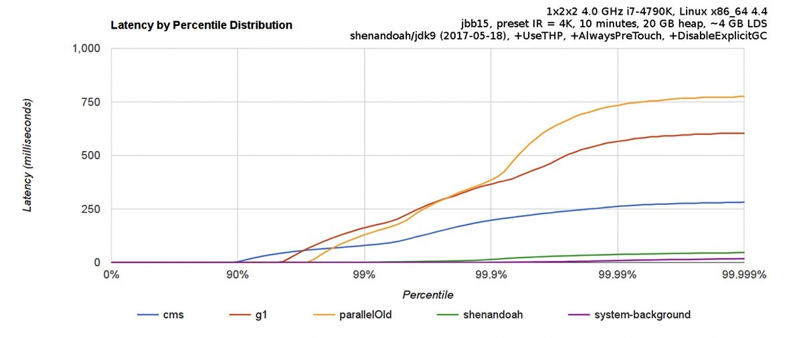

* 分代收集器
  * ParNew：复制算法，基于多线程，整个过程STW，可通过-XX:ParallelGCThreads控制收集的线程数。
  * CMS：标记-清除算法，以最短停顿时间为目标，4大步骤，其中initial-mark和remark会STW，目前多用于互联网站或者B/S系统服务器上，JDK9标记为弃用，G1设置为默认。

* 分区收集器
  * G1：以短停顿时间为目标，服务器端的垃圾收集器，应用于多处理器和大容量内存环境中，在实现高吞吐的同时，尽可能满足用户定义的软停顿时间目标。
  * ZGC：以短停顿时间为目标，适用于大内存。在官方的测试中128G内存，最大停顿时间仅需要1.68ms，远远胜于G1和CMS。
    * Shanandoah：RedHat团队开发，与G1类似，基于Region设计，当不需要RSet或者CardTable来记录跨region引用，停顿时间与对的大小没有关系。停顿时间与ZGC接近。

* 其他
  * JDK11上提供了一个仅用于性能分析的Epsilon收集器


目前使用最多的是CMS和G1收集器。


#### 2.6 常用工具

##### 2.6.1 命令行终端

* 标准：jps，jinfo，jstat，jstack，jmap
* 功能整合：jcmd，vjtools，**arthas**，greys

##### 2.6.2 可视化界面

* 简易：jconsole，jvisualvm，HA，GCHisto，GCViewer
* 进阶：MAT，**Jprofiler**

推荐arthas和Jprofiler，还有一些在线平台 [gceasy](https://gceasy.io/)、[heaphero](https://heaphero.io/)、[fastthread](https://fastthread.io/) ，美团内部的 Scalpel（一款自研的 JVM 问题诊断工具，暂时未开源）也比较好用


### 3. GC问题判断

#### 3.1 判断GC有没有问题

##### 3.1.1 设定评价标准

两个核心指标：

* 延迟Latency（停顿时间）：即垃圾收集过程中依次STW的最长时间，越短越好，可以接受频次的增大。

  > 这时GC技术发展的主要方向。

* 吞吐量Throughput：即Mutator运行的时间占系统总运行时间的百分比。越大越好，可以接受较长的停顿时间。

目前主要都是追求低时延，但是也不能不顾吞吐量，两个指标具体需要结合应用的SLA来定义，主要如下两点来判断。

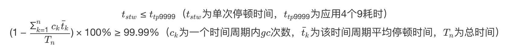

即一次停顿时间不超过应用的TP9999，GC的吞吐量不小于99.99%。

> 举个例子，假设某个服务 A 的 TP9999 为 80 ms，平均 GC 停顿为 30 ms，那么该服务的最大停顿时间最好不要超过 80 ms，GC 频次控制在 5 min 以上一次(30ms/0.01%=300s=5分钟，也就是5分钟的平均停顿时间为30ms，一分钟的停顿时间就是6ms）。如果满足不了，那就需要调优或者通过更多资源来进行并联冗余。（大家可以先停下来，看看监控平台上面的 gc.meantime 分钟级别指标，如果超过了 6 ms 那单机 GC 吞吐量就达不到 4 个 9 了。）

除了这两个指标之外还有 Footprint（资源量大小测量）、反应速度等指标，互联网这种实时系统追求低延迟，而很多嵌入式系统则追求 Footprint。


##### 3.1.2 读懂GC Cause

通过GC日志，我们可以简单分析GC情况，通过一些工具，可以比较直观的看出Cause的分布

比如下面通过[gceasy](https://gceasy.io/)GC log在线分析工具绘制的图标

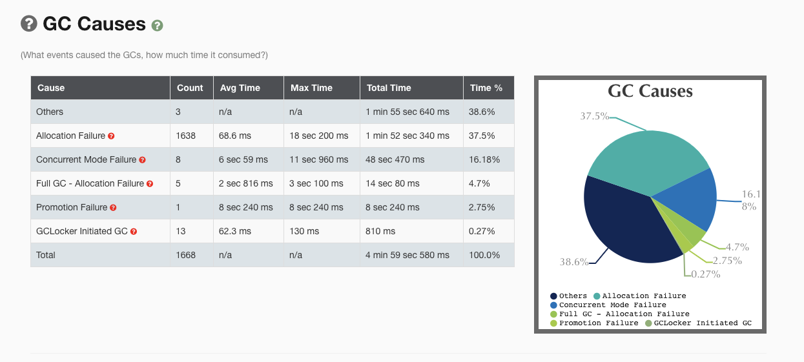

关于GC的cause，可以查看Hotspot源码src/share/vm/gc/shared/gcCause.hpp 和 src/share/vm/gc/shared/gcCause.cpp。

```c++
const char* GCCause::to_string(GCCause::Cause cause) {
  switch (cause) {
    case _java_lang_system_gc:
      return "System.gc()";

    case _full_gc_alot:
      return "FullGCAlot";

    case _scavenge_alot:
      return "ScavengeAlot";

    case _allocation_profiler:
      return "Allocation Profiler";

    case _jvmti_force_gc:
      return "JvmtiEnv ForceGarbageCollection";

    case _gc_locker:
      return "GCLocker Initiated GC";

    case _heap_inspection:
      return "Heap Inspection Initiated GC";

    case _heap_dump:
      return "Heap Dump Initiated GC";

    case _wb_young_gc:
      return "WhiteBox Initiated Young GC";

    case _wb_conc_mark:
      return "WhiteBox Initiated Concurrent Mark";

    case _wb_full_gc:
      return "WhiteBox Initiated Full GC";

    case _no_gc:
      return "No GC";

    case _allocation_failure:
      return "Allocation Failure";

    case _tenured_generation_full:
      return "Tenured Generation Full";

    case _metadata_GC_threshold:
      return "Metadata GC Threshold";

    case _metadata_GC_clear_soft_refs:
      return "Metadata GC Clear Soft References";

    case _cms_generation_full:
      return "CMS Generation Full";

    case _cms_initial_mark:
      return "CMS Initial Mark";

    case _cms_final_remark:
      return "CMS Final Remark";

    case _cms_concurrent_mark:
      return "CMS Concurrent Mark";

    case _old_generation_expanded_on_last_scavenge:
      return "Old Generation Expanded On Last Scavenge";

    case _old_generation_too_full_to_scavenge:
      return "Old Generation Too Full To Scavenge";

    case _adaptive_size_policy:
      return "Ergonomics";

    case _g1_inc_collection_pause:
      return "G1 Evacuation Pause";

    case _g1_humongous_allocation:
      return "G1 Humongous Allocation";

    case _dcmd_gc_run:
      return "Diagnostic Command";

    case _last_gc_cause:
      return "ILLEGAL VALUE - last gc cause - ILLEGAL VALUE";

    default:
      return "unknown GCCause";
  }
  ShouldNotReachHere();
}
```

重点有以下几个GC Cause：

* System.gc() :   手动触发
* CMS: CMS GC 执行过程中的一些动作，重点关注CMS Initial Mark和CMS Final Remark两个STW阶段。
* Promotion Failure： Old区没有足够的空间分配给Young区晋升的对象
* Concurrent Mode Failure：CMS GC运行期间，Old区预留的空间不足以分配给新的对象，此时，收集器发生退化为串行Serial Old收集器，严重影响GC性能。
* GCLocker Initiated GC: 如果线程在执行JNI临界区时，刚好要进行GC，此时GC Loker会阻止GC的发生，同时阻止其他线程进入JNI临界区，直到最后一个线程退出临界区时触发一次GC

什么收集器使用这些cause触发回收，可以查看CMS代码 /src/hotspot/share/gc/cms/concurrentMarkSweepGeneration.cpp

```c++
bool CMSCollector::shouldConcurrentCollect() {
  LogTarget(Trace, gc) log;

  if (_full_gc_requested) {
    log.print("CMSCollector: collect because of explicit  gc request (or GCLocker)");
    return true;
  }

  FreelistLocker x(this);
  // ------------------------------------------------------------------
  // Print out lots of information which affects the initiation of
  // a collection.
  if (log.is_enabled() && stats().valid()) {
    log.print("CMSCollector shouldConcurrentCollect: ");

    LogStream out(log);
    stats().print_on(&out);

    log.print("time_until_cms_gen_full %3.7f", stats().time_until_cms_gen_full());
    log.print("free=" SIZE_FORMAT, _cmsGen->free());
    log.print("contiguous_available=" SIZE_FORMAT, _cmsGen->contiguous_available());
    log.print("promotion_rate=%g", stats().promotion_rate());
    log.print("cms_allocation_rate=%g", stats().cms_allocation_rate());
    log.print("occupancy=%3.7f", _cmsGen->occupancy());
    log.print("initiatingOccupancy=%3.7f", _cmsGen->initiating_occupancy());
    log.print("cms_time_since_begin=%3.7f", stats().cms_time_since_begin());
    log.print("cms_time_since_end=%3.7f", stats().cms_time_since_end());
    log.print("metadata initialized %d", MetaspaceGC::should_concurrent_collect());
  }
  // ------------------------------------------------------------------

  // If the estimated time to complete a cms collection (cms_duration())
  // is less than the estimated time remaining until the cms generation
  // is full, start a collection.
  if (!UseCMSInitiatingOccupancyOnly) {
    if (stats().valid()) {
      if (stats().time_until_cms_start() == 0.0) {
        return true;
      }
    } else {
   
      if (_cmsGen->occupancy() >= _bootstrap_occupancy) {
        log.print(" CMSCollector: collect for bootstrapping statistics: occupancy = %f, boot occupancy = %f",
                  _cmsGen->occupancy(), _bootstrap_occupancy);
        return true;
      }
    }
  }
  if (_cmsGen->should_concurrent_collect()) {
    log.print("CMS old gen initiated");
    return true;
  }

  CMSHeap* heap = CMSHeap::heap();
  if (heap->incremental_collection_will_fail(true /* consult_young */)) {
    log.print("CMSCollector: collect because incremental collection will fail ");
    return true;
  }

  if (MetaspaceGC::should_concurrent_collect()) {
    log.print("CMSCollector: collect for metadata allocation ");
    return true;
  }

  // CMSTriggerInterval starts a CMS cycle if enough time has passed.
  if (CMSTriggerInterval >= 0) {
    if (CMSTriggerInterval == 0) {
      // Trigger always
      return true;
    }

    // Check the CMS time since begin (we do not check the stats validity
    // as we want to be able to trigger the first CMS cycle as well)
    if (stats().cms_time_since_begin() >= (CMSTriggerInterval / ((double) MILLIUNITS))) {
      if (stats().valid()) {
        log.print("CMSCollector: collect because of trigger interval (time since last begin %3.7f secs)",
                  stats().cms_time_since_begin());
      } else {
        log.print("CMSCollector: collect because of trigger interval (first collection)");
      }
      return true;
    }
  }

  return false;
}
```


#### 3.2 判断是不是GC引发的问题？

如何判断GC是故障的原因还是故障的结果或者表象呢？

通常一个RT上涨故障会表现为GC耗时增大，线程block增多，慢查询增多，cpu负载（使用率？）高四个表象。

如何判断哪个是根因呢？以下方法论可以借鉴：

* 时序分析：先发生的事件是根因的概率更大。可通过监控手段分析各个指标的异常时间点，还原事件时间线。

  > 比如先观察到CPU负载高（要有足够的时间Gap），那么整个问题可能是，cpu负载高->慢查询增多->GC耗时大->线程block增多-> RT上涨

* 概率分析：会用统计概率学，结合历史问题的经验进行推断，由近到远按类型分析。

  > 比如过往慢查询的问题比较多，那么整个问题的影响链就是：慢查询增多->GC耗时增大-> CPU负载高->线程block增多->RT上涨

* 实验分析：通过故障演练等方式对问题进行模拟，控制变量，触发其中一个或者一部分，查看是否发生问题

  > 比如触发线程block，就会导致问题，那么影响链就可能是：线程Block增多->CPU负载高->慢查询增多->GC耗时增大->RT上涨。

* 反证分析：对其中一个表项进行反证，即判断表像的发生与不发生与结果是否有相关性

  > 比如例如我们从整个集群的角度观察到**某些**节点慢查和 CPU 都正常，但也出了问题，那么整个问题影响链就可能是：GC 耗时增大 -> 线程 Block 增多 -> RT 上涨。

不同的根因，后续的分析方法是不同的：

* 如果是cpu负载高，可能需要使用火焰图看下热点
* 如果是慢查询增多，可能需要看下DB情况
* 如果是线程block，可能需要看下锁竞争情况，有没有活锁或者死锁情况

如果其他表象没有问题，就可能是GC确实存在问题了。


#### 3.3 问题分类导读

##### 3.3.1 Mutator类型

根据对象存活时间比例图来看主要有两种

* **IO 交互型：**互联网大部分都属于该类型，比如分布式RPC,MQ,HTTP网关服务等，对内存要求并不大，大部分对象在TP9999时间内都会死亡，Young区越大越好
* **MEM 计算型**：主要是分布式数据计算Hadoop，分布式存储Hbase，Cassandra，自建的分布式缓存等，对内存要求高，对象存活事件长，Old区越大越好

当然，除了两者之外，还有介于两者之间的场景，这里主要针对第一种场景。对象的Survivor Time分布图，对我们设置GC参数有非常重要的指导意义，我们可以简单推算出分代的边界。

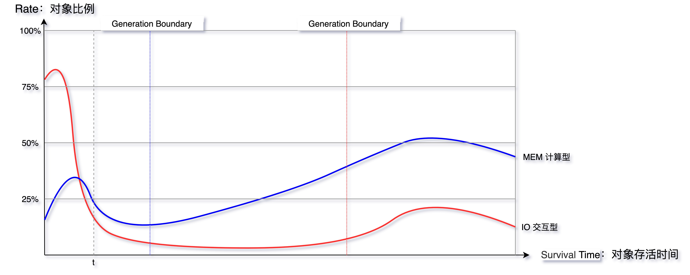

##### 3.3.2 GC问题分类

以下九种GC问题，涵盖了大部分场景。

* **Unexpected GC：**意外发生的GC，可以通过一定手段避免
  * **space shock：**空间震荡问题
  * **Explict GC：**显式执行GC问题
* **Partial GC**：部分收集操作的GC，只对某些分代或者分区进行回收
  * **Young GC**：也叫Minor GC
    * **ParNew**: Young GC频繁

  * **Old GC**：分代收集里面的Old区收集工作，也叫Major GC，有些也会叫做Full GC，但是这种叫法不规范，只有在CMS发生Foreground GC时才是Full GC，CMSScavengeBeforeRemark参数也只是在Remark之前处罚一次Young GC
    * **CMS**: Old GC 频繁
    * **CMS**: Old GC 不频繁，但是单次耗时大

* **Full GC**：全量收集的GC，对整个堆进行回收，STW时间会比较长，一旦发生，影响较大，有时也叫做Major GC
* **MetaSpace**：元空间回收引发问题
* **Direct Memory**：直接内存（也可以称为堆外内存）回收引发的问题。
* **JNI**：本地Native方法引发的问题。


#### 3.3.3 排查难度

以下9中情况排查难度一次递增。


## 4. 常见场景分析与解决

### 4.1 场景一：动态扩容引起的空间震荡

#### 4.1.1 现象

刚启动时，GC次数较多，最大空间剩余还很多，但是依然发生GC，GC Cause一般为Allocation Failure，而且每经过一次GC，堆内各个空间的大小会被调整。


#### 4.1.2 原因

-Xms和-Xmx设置的不一样，初始化时，只会初始化-Xms大小的存储，当空间不足的时候发生Allocation Failure，再向系统申请。

具体是通过ConcurrentMarkSweepGenereation::compute_new_size()方法计算型的空间大小

```c++
void ConcurrentMarkSweepGeneration::compute_new_size() {
  assert_locked_or_safepoint(Heap_lock);

  // If incremental collection failed, we just want to expand
  // to the limit.
  if (incremental_collection_failed()) {
    clear_incremental_collection_failed();
    grow_to_reserved();
    return;
  }

  // The heap has been compacted but not reset yet.
  // Any metric such as free() or used() will be incorrect.

  CardGeneration::compute_new_size();

  // Reset again after a possible resizing
  if (did_compact()) {
    cmsSpace()->reset_after_compaction();
  }
}
```

另外，如果空间剩余很多时，也会进行**缩容**操作，JVM通过-XX:MinHeapFreeRatio和-XX:MaxHeapFreeRatio来控制扩容和缩容的比例，调节这两个值也可以控制伸缩的时机。

扩容是通过GenCollectedHeap::expand_heap_and_allocate()来完成：

```c++
HeapWord* GenCollectedHeap::expand_heap_and_allocate(size_t size, bool   is_tlab) {
  HeapWord* result = NULL;
  if (_old_gen->should_allocate(size, is_tlab)) {
    result = _old_gen->expand_and_allocate(size, is_tlab);
  }
  if (result == NULL) {
    if (_young_gen->should_allocate(size, is_tlab)) {
      result = _young_gen->expand_and_allocate(size, is_tlab);
    }
  }
  assert(result == NULL || is_in_reserved(result), "result not in heap");
  return result;
}
```

伸缩模型如下，低水位和高水位对应了-XX:MaxHeapFreeRatio和-XX:MinHeapFreeRatio，当committed的空间大小低于低水位，就会缩容，超过了高水位就会扩容，capacity就会随之调整

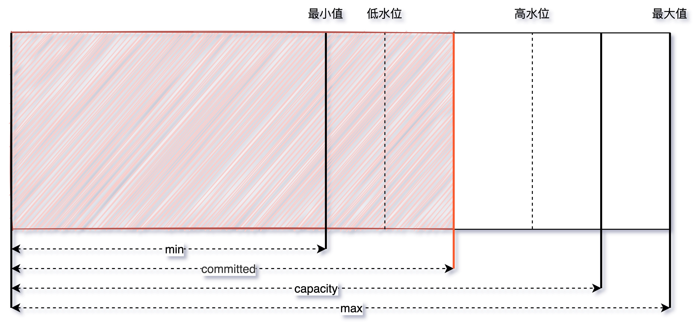

#### 4.1.3 策略

* 定位：观察CMS GC触发点各个区域的Committed占比是不是一个固定的值，或者观察中的内存使用率

* 解决：尽量将成对出现空间大小参数设置成一样的。

  一般来说，我们需要保证java虚拟机的堆是稳定的，不过不追求停顿时间的情况下，利用其伸缩特性可以节省空间，比如作为富客户端的Java应用（比如导入导出这种应用）

  * -Xms和-Xmx
  * -XX:MinNewSize和-XX:NewSize
  * -XX:MetaSpaceSize和-XX:MaxMetaSpaceSize


### 4.2 显式GC的去与留

#### 4.2.1 现象

CMS GC的触发被动条件主要有如下：

* 扩缩容
* Old区达到回收阈值
* MetaSpace空间不足
* Young区晋升失败
* 大对象担保失败

如果没有上述的条件，就可能是代码中手动调用了System.gc()方法，从GC Cause中可以确认。

#### 4.2.2 原因

System.gc()方法在Hotspot中的源码如下，该方法里面会先判断-XX:+DisableExplicitGC参数，如果启动了，就相当于空方法，不会显式执行GC，否则就会调用Universe::heap()::collect方法，继续跟进可以发现会引发一次STW的Full GC。

```c++
JVM_ENTRY_NO_ENV(void, JVM_GC(void))
  JVMWrapper("JVM_GC");
  if (!DisableExplicitGC) {
    Universe::heap()->collect(GCCause::_java_lang_system_gc);
  }
JVM_END
```

```c++
void GenCollectedHeap::collect(GCCause::Cause cause) {
  if (cause == GCCause::_wb_young_gc) {
    // Young collection for the WhiteBox API.
    collect(cause, YoungGen);
  } else {
#ifdef ASSERT
  if (cause == GCCause::_scavenge_alot) {
    // Young collection only.
    collect(cause, YoungGen);
  } else {
    // Stop-the-world full collection.
    collect(cause, OldGen);
  }
#else
    // Stop-the-world full collection.
    collect(cause, OldGen);
#endif
  }
}
```


#### 4.2.3 策略

那么我们是否应该保留System.gc()呢？

**CMS GC有两种模式**：Background和Foreground

* **Background**：常规意义的并发收集，可以不影响正常的业务线程运行

* **Foreground**：与Background具有很大的差异，会进行一次压缩式GC。此压缩式GC使用的是跟Serial Old GC一样的Lisp2算法，其使用Mark-Compack来做Full GC，一般称之为MSC（Mark-Sweep-Compact），

  它的收集范围时Java堆的Young区和Old区以及MetaSpace。由于Compact的代价是很高的，所以使用Foreground Collector时会带来非常惨的STW。

**保留System.gc()**

由上可以看出，在应用程序当中System.gc()被频繁调用，会非常危险。

**去掉System.gc()**

去掉的话，会带来另外一个内存泄漏的问题。

Java的Nio提供了DirectByteBuffer用于直接在堆外分配内存，它有着零拷贝的特点，被Netty等各种NIO框架使用。

堆内内由JVM自己管理，而堆外内存必须手动释放。

DirectByteBuffer没有Finalizer（线程），它的Native Memory是通过sun.misc.Cleaner自动完成的，是一种基于PhantomReference的清理工具，比不同的Finalizer要轻量些。

为DirectByteBuffer分配空间过程中会显式调用System.gc，希望通过Full GC来强迫已经无用的DirectByteBuffer对象释放掉他们关联的Native Memory。实现如下

```java
// These methods should be called whenever direct memory is allocated or
// freed.  They allow the user to control the amount of direct memory
// which a process may access.  All sizes are specified in bytes.
static void reserveMemory(long size) {

    synchronized (Bits.class) {
        if (!memoryLimitSet && VM.isBooted()) {
            maxMemory = VM.maxDirectMemory();
            memoryLimitSet = true;
        }
        if (size <= maxMemory - reservedMemory) {
            reservedMemory += size;
            return;
        }
    }

    System.gc();
    try {
        Thread.sleep(100);
    } catch (InterruptedException x) {
        // Restore interrupt status
        Thread.currentThread().interrupt();
    }
    synchronized (Bits.class) {
        if (reservedMemory + size > maxMemory)
            throw new OutOfMemoryError("Direct buffer memory");
        reservedMemory += size;
    }

}
```

Hotspot VM只会在Old GC时才会对Old中的对象做Reference Processing，而在YoungGC时，只会对Young里面的对象做Reference Processing。正常情况下，Young中的DirectByteBuffer对象会在Young GC时被清理，而Old中的DirectByteBuffer对象会在CMS GC时对Old做Reference Processing之后，触发Cleaner对已死的DirectByteBuffer对象进行清理。

但是如果很长时间没有做过GC或者只做了Young GC的话，这不会在Old 区触发Cleaner的工作，Old区中的DirectByteBuffer关联的Native Memory就得不到及时的释放。

因此需要依赖System.gc来保证DirectByteMemory的清理工作能及时完成。否则会出现Direct Memory的OOM。


#### 4.2.3 策略

由于目前互联网中的RPC通信会大量使用到NIO，建议保留，同时可以采用一些参数进行优化。

比如JVM提供了以下参数

* -XX:+ExplicitGCInvokesConcurrent  显式GC System.gc的触发类型从Foreground改为Background
* -XX:+ExplicitGCInvokesConcurrentAndUnloadsClasses 显式GC System.gc的触发类型从Foreground改为Background，同时可以卸载类

由于Background模式也会进行Reference Processing，所以STW的开销降低了。

> 不止CMS，在G1和ZGC中开启ExplicitGCInvokesConcurrent模式，都会采用高性能的并发收集方式进行收集。不过还是要在代码规范方面做好约束，规范好System.gc的使用
>
> 另外，由于许多GC算法都有自适应功能，根据先前收集的效率，决定下一次GC的相关参数，而System.gc是一种显式调用，一般情况下，不会统计System.gc的相关数据，避免用户强行GC对自适应功能的干扰。这个行为是通过-XX:+UseAdaptiveSizePolicyWithSystemGC来控制，默认是false的。


### 4.3 场景三：MetaSpace区OOM

#### 4.3.1 现象

JVM 在启动后或者某个时间点开始，**MetaSpace 的已使用大小在持续增长，同时每次 GC 也无法释放，调大 MetaSpace 空间也无法彻底解决**

#### 4.3.2 原因

回顾下这个区里面存放的数据：

Java 7之前字符串常量池被放到Perm区，所有被intern的String都会被存在这里，由于String.intern是不受控的，所以-XX:MaxPermSize不太好设置，经常会出现java.lang.OutOfMemory:PermGen space.

**所以Java7之后常量池等字面量（Literal）、类静态变量（Class Static）、符号引用（Symbols Reference）等几项被移到Heap中。而Java8之后PermGen被移除，取而代之的是MetaSpace**

**在最底层，JVM 通过 mmap 接口向操作系统申请内存映射，每次申请 2MB 空间，这里是虚拟内存映射，不是真的就消耗了主存的 2MB，只有之后在使用的时候才会真的消耗内存。申请的这些内存放到一个链表中 VirtualSpaceList，作为其中的一个 Node。**

在上层，MetaSpace 主要由 Klass Metaspace 和 NoKlass Metaspace 两大部分组成。

- **Klass MetaSpace：** 就是用来存 Klass 的，就是 Class 文件在 JVM 里的运行时数据结构，这部分默认放在 Compressed Class Pointer Space 中，是一块连续的内存区域，紧接着 Heap。Compressed Class Pointer Space 不是必须有的，如果设置了 `-XX:-UseCompressedClassPointers`，或者 `-Xmx` 设置大于 32 G，就不会有这块内存，这种情况下 Klass 都会存在 NoKlass Metaspace 里。
- **NoKlass MetaSpace：** 专门来存 Klass 相关的其他的内容，比如 Method，ConstantPool 等，可以由多块不连续的内存组成。虽然叫做 NoKlass Metaspace，但是也其实可以存 Klass 的内容，上面已经提到了对应场景。

具体的定义都可以在源码 shared/vm/memory/metaspace.hpp 中找到：

```c++
class Metaspace : public AllStatic {

  friend class MetaspaceShared;

 public:
  enum MetadataType {
    ClassType,
    NonClassType,
    MetadataTypeCount
  };
  enum MetaspaceType {
    ZeroMetaspaceType = 0,
    StandardMetaspaceType = ZeroMetaspaceType,
    BootMetaspaceType = StandardMetaspaceType + 1,
    AnonymousMetaspaceType = BootMetaspaceType + 1,
    ReflectionMetaspaceType = AnonymousMetaspaceType + 1,
    MetaspaceTypeCount
  };

 private:

  // Align up the word size to the allocation word size
  static size_t align_word_size_up(size_t);

  // Aligned size of the metaspace.
  static size_t _compressed_class_space_size;

  static size_t compressed_class_space_size() {
    return _compressed_class_space_size;
  }

  static void set_compressed_class_space_size(size_t size) {
    _compressed_class_space_size = size;
  }

  static size_t _first_chunk_word_size;
  static size_t _first_class_chunk_word_size;

  static size_t _commit_alignment;
  static size_t _reserve_alignment;
  DEBUG_ONLY(static bool   _frozen;)

  // Virtual Space lists for both classes and other metadata
  static metaspace::VirtualSpaceList* _space_list;
  static metaspace::VirtualSpaceList* _class_space_list;

  static metaspace::ChunkManager* _chunk_manager_metadata;
  static metaspace::ChunkManager* _chunk_manager_class;

  static const MetaspaceTracer* _tracer;
}
```

MetaSpace 的对象为什么无法释放，我们看下面两点：

- **MetaSpace 内存管理：** 类和其元数据的生命周期与其对应的类加载器相同，只要类的类加载器是存活的，在 Metaspace 中的类元数据也是存活的，不能被回收。每个加载器有单独的存储空间，通过 ClassLoaderMetaspace 来进行管理 SpaceManager* 的指针，相互隔离的。
- **MetaSpace 弹性伸缩：** 由于 MetaSpace 空间和 Heap 并不在一起，所以这块的空间可以不用设置或者单独设置，一般情况下避免 MetaSpace 耗尽 VM 内存都会设置一个 MaxMetaSpaceSize，在运行过程中，如果实际大小小于这个值，JVM 就会通过 `-XX:MinMetaspaceFreeRatio` 和 `-XX:MaxMetaspaceFreeRatio` 两个参数动态控制整个 MetaSpace 的大小，具体使用可以看 `MetaSpaceGC::compute_new_size()` 方法（下方代码），这个方法会在 **CMSCollector 和 G1CollectorHeap 等几个收集器执行 GC 时调用**。这个里面会根据 `used_after_gc`，`MinMetaspaceFreeRatio` 和 `MaxMetaspaceFreeRatio` 这三个值计算出来一个新的 `_capacity_until_GC` 值（水位线）。然后根据实际的 `_capacity_until_GC` 值使用 `MetaspaceGC::inc_capacity_until_GC()` 和 `MetaspaceGC::dec_capacity_until_GC()` 进行 expand 或 shrink，这个过程也可以参照场景一中的伸缩模型进行理解。

```c++
void MetaspaceGC::compute_new_size() {
  assert(_shrink_factor <= 100, "invalid shrink factor");
  uint current_shrink_factor = _shrink_factor;
  _shrink_factor = 0;
  const size_t used_after_gc = MetaspaceUtils::committed_bytes();
  const size_t capacity_until_GC = MetaspaceGC::capacity_until_GC();

  const double minimum_free_percentage = MinMetaspaceFreeRatio / 100.0;
  const double maximum_used_percentage = 1.0 - minimum_free_percentage;

  const double min_tmp = used_after_gc / maximum_used_percentage;
  size_t minimum_desired_capacity =
    (size_t)MIN2(min_tmp, double(max_uintx));
  // Don't shrink less than the initial generation size
  minimum_desired_capacity = MAX2(minimum_desired_capacity,
                                  MetaspaceSize);

  log_trace(gc, metaspace)("MetaspaceGC::compute_new_size: ");
  log_trace(gc, metaspace)("    minimum_free_percentage: %6.2f  maximum_used_percentage: %6.2f",
                           minimum_free_percentage, maximum_used_percentage);
  log_trace(gc, metaspace)("     used_after_gc       : %6.1fKB", used_after_gc / (double) K);


  size_t shrink_bytes = 0;
  if (capacity_until_GC < minimum_desired_capacity) {
    // If we have less capacity below the metaspace HWM, then
    // increment the HWM.
    size_t expand_bytes = minimum_desired_capacity - capacity_until_GC;
    expand_bytes = align_up(expand_bytes, Metaspace::commit_alignment());
    // Don't expand unless it's significant
    if (expand_bytes >= MinMetaspaceExpansion) {
      size_t new_capacity_until_GC = 0;
      bool succeeded = MetaspaceGC::inc_capacity_until_GC(expand_bytes, &new_capacity_until_GC);
      assert(succeeded, "Should always succesfully increment HWM when at safepoint");

      Metaspace::tracer()->report_gc_threshold(capacity_until_GC,
                                               new_capacity_until_GC,
                                               MetaspaceGCThresholdUpdater::ComputeNewSize);
      log_trace(gc, metaspace)("    expanding:  minimum_desired_capacity: %6.1fKB  expand_bytes: %6.1fKB  MinMetaspaceExpansion: %6.1fKB  new metaspace HWM:  %6.1fKB",
                               minimum_desired_capacity / (double) K,
                               expand_bytes / (double) K,
                               MinMetaspaceExpansion / (double) K,
                               new_capacity_until_GC / (double) K);
    }
    return;
  }

  // No expansion, now see if we want to shrink
  // We would never want to shrink more than this
  assert(capacity_until_GC >= minimum_desired_capacity,
         SIZE_FORMAT " >= " SIZE_FORMAT,
         capacity_until_GC, minimum_desired_capacity);
  size_t max_shrink_bytes = capacity_until_GC - minimum_desired_capacity;

  // Should shrinking be considered?
  if (MaxMetaspaceFreeRatio < 100) {
    const double maximum_free_percentage = MaxMetaspaceFreeRatio / 100.0;
    const double minimum_used_percentage = 1.0 - maximum_free_percentage;
    const double max_tmp = used_after_gc / minimum_used_percentage;
    size_t maximum_desired_capacity = (size_t)MIN2(max_tmp, double(max_uintx));
    maximum_desired_capacity = MAX2(maximum_desired_capacity,
                                    MetaspaceSize);
    log_trace(gc, metaspace)("    maximum_free_percentage: %6.2f  minimum_used_percentage: %6.2f",
                             maximum_free_percentage, minimum_used_percentage);
    log_trace(gc, metaspace)("    minimum_desired_capacity: %6.1fKB  maximum_desired_capacity: %6.1fKB",
                             minimum_desired_capacity / (double) K, maximum_desired_capacity / (double) K);

    assert(minimum_desired_capacity <= maximum_desired_capacity,
           "sanity check");

    if (capacity_until_GC > maximum_desired_capacity) {
      // Capacity too large, compute shrinking size
      shrink_bytes = capacity_until_GC - maximum_desired_capacity;
      shrink_bytes = shrink_bytes / 100 * current_shrink_factor;

      shrink_bytes = align_down(shrink_bytes, Metaspace::commit_alignment());

      assert(shrink_bytes <= max_shrink_bytes,
             "invalid shrink size " SIZE_FORMAT " not <= " SIZE_FORMAT,
             shrink_bytes, max_shrink_bytes);
      if (current_shrink_factor == 0) {
        _shrink_factor = 10;
      } else {
        _shrink_factor = MIN2(current_shrink_factor * 4, (uint) 100);
      }
      log_trace(gc, metaspace)("    shrinking:  initThreshold: %.1fK  maximum_desired_capacity: %.1fK",
                               MetaspaceSize / (double) K, maximum_desired_capacity / (double) K);
      log_trace(gc, metaspace)("    shrink_bytes: %.1fK  current_shrink_factor: %d  new shrink factor: %d  MinMetaspaceExpansion: %.1fK",
                               shrink_bytes / (double) K, current_shrink_factor, _shrink_factor, MinMetaspaceExpansion / (double) K);
    }
  }

  // Don't shrink unless it's significant
  if (shrink_bytes >= MinMetaspaceExpansion &&
      ((capacity_until_GC - shrink_bytes) >= MetaspaceSize)) {
    size_t new_capacity_until_GC = MetaspaceGC::dec_capacity_until_GC(shrink_bytes);
    Metaspace::tracer()->report_gc_threshold(capacity_until_GC,
                                             new_capacity_until_GC,
                                             MetaspaceGCThresholdUpdater::ComputeNewSize);
  }
}
```

由场景一可知，为了避免弹性伸缩带来的额外 GC 消耗，我们会将 `-XX:MetaSpaceSize` 和 `-XX:MaxMetaSpaceSize` 两个值设置为固定的，但是这样也会导致在空间不够的时候无法扩容，然后频繁地触发 GC，最终 OOM。所以关键原因就是 ClassLoader 不停地在内存中 load 了新的 Class ，**一般这种问题都发生在动态类加载等情况上**。

> -XX:MetaSpaceSize vs  -XX:MaxMetaSpaceSize
>
> * -XX:MetaSpaceSize:  超过该阈值就会触发GC，这个值不是固定不变的，会随着metaSpace的使用量而变化
>   * Sets the size of the allocated class metadata space that will trigger a garbage collection the first time it is exceeded. This threshold for a garbage collection is increased or decreased depending on the amount of metadata used. The default size depends on the platform.	
> * -XX:MaxMetaSpaceSize  设置最大值，不可分配超过该值，默认是没有限制的。
>   * Sets the maximum amount of native memory that can be allocated for class metadata. By default, the size is not limited. The amount of metadata for an application depends on the application itself, other running applications, and the amount of memory available on the system

#### 4.3.3 策略

先基于动态类的加载进行定位，dump快照之后通过Jprofiler或者MAT观察classes的histogram（直方图），或者直接通过命令行jcmd打几次Histogram图，观察具体时间那个包的class增加比较多。

```shell
jcmd <PID> GC.class_stats|awk '{print$13}'|sed  's/\(.*\)\.\(.*\)/\1/g'|sort |uniq -c|sort -nrk1
```


有时候需要结合InstBytes，KlassBytes，Bytecodes, MethodAll等几项综合指标来看。

如果无法从整体的角度定位，可以从监控上查看类的加载和卸载数量，也可以添加-XX:+TraceClassLoading和-XX:+TraceClassUnloading 观察类的加载和卸载情况。

原理理解比较复杂，但定位和解决问题会比较简单，经常会出问题的几个点有 Orika 的 classMap、JSON 的 ASMSerializer、Groovy 动态加载类等，基本都集中在发射，javasist/bytebuddy字节码增强，CGLib动态代理。OSGi自定义类加载器等技术点上。另外就是及时给 MetaSpace 区的使用率加一个监控，如果指标有波动提前发现并解决问题。

> Orika是java Bean映射框架**,**可以实现从一个对象递归拷贝数据至另一个对象，性能较高


### 4.4 场景四：过早晋升

#### 4.4.1 现象

术语为“Premature Promotion”，主要发生在分代的收集器上。90% 的对象朝生夕死，只有在 Young 区经历过几次 GC 的洗礼后才会晋升到 Old 区，每经历一次 GC 对象的 GC Age 就会增长 1，最大通过 `-XX:MaxTenuringThreshold` 来控制。

PreMature Promotion（过早晋升）一般不会直接影响GC，总会伴随着浮动垃圾，大对象担保失败等问题，但这些问题不是立刻发生。我们可以通过观察以下几种现象判断是否发生了过早晋升。

**过早晋升现象：**

* **分配速率接近于晋升速率**，对象晋升年龄较小

  通过添加-XX:+printTenuringDestribution之后，GC日志中会输出以下类似的日志，说明只进行一次GC就会放到Old区。

  ```shell
  [GC (Allocation Failure) [DefNew
  Desired survivor size 524288 bytes, new threshold 1 (max 15)
  - age   1:    1048576 bytes,    1048576 total
  : 6795K->1024K(9216K), 0.0081043 secs] 6795K->5262K(19456K), 0.6019284 secs] [Times: user=0.00 sys=0.02, real=0.60 secs] 
  ```

  > 需要注意的是-XX:MaxTenuringThreshold，只是初始设定的最大值，实际上进入老年代的阈值是会根据运行情况动态调整的。这就是**动态年龄判断机制**。上图的new threshold表示的本次GC设定的实际阈值(最大阈值)。
  >
  > 而具体的阈值与JVM提供的-XX:TargetSurvivorRatio（回收后希望suvivor区的使用率，默认是50%)有关。disired survivor size就是survivor的capacity与该ratio的乘积，默认就是capacity的一半。
  >
  > 当小于等于某个年龄的空间总和大于desiredSize，那么这个年龄就是新的阈值，大于等于该年龄的都会晋升老年代。

  ```c++
  uint ageTable::compute_tenuring_threshold(size_t survivor_capacity) {
    //TargetSurvivorRatio默认50，意思是：在回收之后希望survivor区的占用率达到这个比例
    size_t desired_survivor_size = (size_t)((((double) survivor_capacity)*TargetSurvivorRatio)/100);
    size_t total = 0;
    uint age = 1;
    assert(sizes[0] == 0, "no objects with age zero should be recorded");
    while (age < table_size) {//table_size=16
      total += sizes[age];
      //如果加上这个年龄的所有对象的大小之后，占用量>期望的大小，就设置age为新的晋升阈值
      if (total > desired_survivor_size) break;
      age++;
    }
  
    uint result = age < MaxTenuringThreshold ? age : MaxTenuringThreshold;
  ```

* **Full GC 比较频繁**，而且经历一次GC后，**Old区变化比例非常大**

  比如说 Old 区触发的回收阈值是 80%，经历过一次 GC 之后下降到了 10%，这就说明 Old 区的 70% 的对象存活时间其实很短，如下图所示，Old 区大小每次 GC 后从 2.1G 回收到 300M，也就是说回收掉了 1.8G 的垃圾，只有 **300M 的活跃对象**。整个 Heap 目前是 4G，活跃对象只占了不到十分之一

  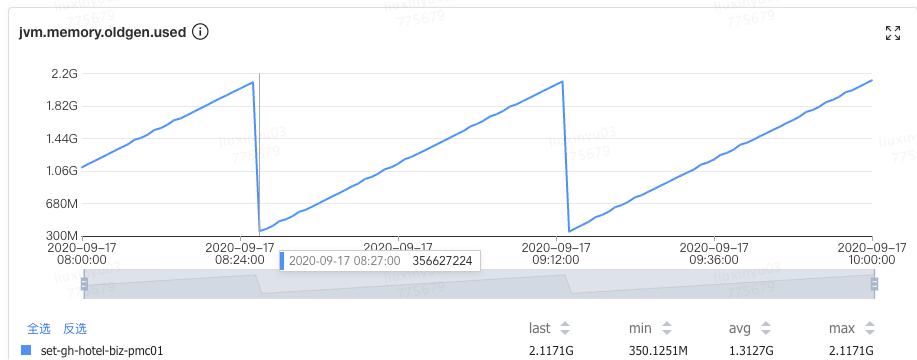


**过早晋升的危害**

* Young GC 频繁，吞吐量下降
* Full GC 频繁，可能会有较大停顿


#### 4.4.2 原因

主要的原因有以下两点：

- **Young/Eden 区过小：** 过小的直接后果就是 Eden 被装满的时间变短，本应该回收的对象参与了 GC 并晋升，Young GC 采用的是复制算法，由基础篇我们知道 copying 耗时远大于 mark，也就是 Young GC 耗时本质上就是 copy 的时间（CMS 扫描 Card Table 或 G1 扫描 Remember Set 出问题的情况另说），没来及回收的对象增大了回收的代价，所以 Young GC 时间增加，同时又无法快速释放空间，Young GC 次数也跟着增加。
- **分配速率过大：** 可以观察出问题前后 Mutator 的分配速率，如果有明显波动可以尝试观察网卡流量、存储类中间件慢查询日志等信息，看是否有大量数据被加载到内存中。

同时无法 GC 掉对象还会带来另外一个问题，引发动态年龄计算：JVM 通过 `-XX:MaxTenuringThreshold` 参数来控制晋升年龄，每经过一次 GC，年龄就会加一，达到最大年龄就可以进入 Old 区，最大值为 15（因为 JVM 中使用 4 个比特来表示对象的年龄）。设定固定的 MaxTenuringThreshold 值作为晋升条件：

- MaxTenuringThreshold 如果设置得过大，原本应该晋升的对象一直停留在 Survivor 区，直到 Survivor 区溢出，一旦溢出发生，Eden + Survivor 中对象将不再依据年龄全部提升到 Old 区，这样对象老化的机制就失效了。
- MaxTenuringThreshold 如果设置得过小，过早晋升即对象不能在 Young 区充分被回收，大量短期对象被晋升到 Old 区，Old 区空间迅速增长，引起频繁的 Major GC，分代回收失去了意义，严重影响 GC 性能。

相同应用在不同时间的表现不同，特殊任务的执行或者流量成分的变化，都会导致对象的生命周期分布发生波动，那么固定的阈值设定，因为无法动态适应变化，会造成和上面问题，所以 Hotspot 会使用动态计算的方式来调整晋升的阈值。

具体动态计算可以看一下 Hotspot 源码，具体在 /src/hotspot/share/gc/shared/ageTable.cpp 的 `compute_tenuring_threshold` 方法中：

```c++
uint ageTable::compute_tenuring_threshold(size_t survivor_capacity) {
  //TargetSurvivorRatio默认50，意思是：在回收之后希望survivor区的占用率达到这个比例
  size_t desired_survivor_size = (size_t)((((double) survivor_capacity)*TargetSurvivorRatio)/100);
  size_t total = 0;
  uint age = 1;
  assert(sizes[0] == 0, "no objects with age zero should be recorded");
  while (age < table_size) {//table_size=16
    total += sizes[age];
    //如果加上这个年龄的所有对象的大小之后，占用量>期望的大小，就设置age为新的晋升阈值
    if (total > desired_survivor_size) break;
    age++;
  }

  uint result = age < MaxTenuringThreshold ? age : MaxTenuringThreshold;
  if (PrintTenuringDistribution || UsePerfData) {

    //打印期望的survivor的大小以及新计算出来的阈值，和设置的最大阈值
    if (PrintTenuringDistribution) {
      gclog_or_tty->cr();
      gclog_or_tty->print_cr("Desired survivor size " SIZE_FORMAT " bytes, new threshold %u (max %u)",
        desired_survivor_size*oopSize, result, (int) MaxTenuringThreshold);
    }

    total = 0;
    age = 1;
    while (age < table_size) {
      total += sizes[age];
      if (sizes[age] > 0) {
        if (PrintTenuringDistribution) {
          gclog_or_tty->print_cr("- age %3u: " SIZE_FORMAT_W(10) " bytes, " SIZE_FORMAT_W(10) " total",
                                        age,    sizes[age]*oopSize,          total*oopSize);
        }
      }
      if (UsePerfData) {
        _perf_sizes[age]->set_value(sizes[age]*oopSize);
      }
      age++;
    }
    if (UsePerfData) {
      SharedHeap* sh = SharedHeap::heap();
      CollectorPolicy* policy = sh->collector_policy();
      GCPolicyCounters* gc_counters = policy->counters();
      gc_counters->tenuring_threshold()->set_value(result);
      gc_counters->desired_survivor_size()->set_value(
        desired_survivor_size*oopSize);
    }
  }

  return result;
}
```

可以看到 Hotspot 遍历所有对象时，从所有年龄为 0 的对象占用的空间开始累加，如果加上年龄等于 n 的所有对象的空间之后，使用 Survivor 区的条件值（TargetSurvivorRatio / 100，TargetSurvivorRatio 默认值为 50）进行判断，若大于这个值则结束循环，将 n 和 MaxTenuringThreshold 比较，若 n 小，则阈值为 n，若 n 大，则只能去设置最大阈值为 MaxTenuringThreshold。**动态年龄触发后导致更多的对象进入了 Old 区，造成资源浪费**。

#### 4.4.3 策略

知道问题原因后我们就有解决的方向，如果是 **Young/Eden 区过小**，我们可以在总的 Heap 内存不变的情况下适当增大 Young 区，具体怎么增加？

==**一般情况下 Old 的大小应当为活跃对象的 2~3 倍左右，考虑到浮动垃圾问题最好在 3 倍左右，剩下的都可以分给 Young 区。**==

拿笔者的一次典型过早晋升优化来看，原配置为 Young 1.2G + Old 2.8G，通过观察 CMS GC 的情况找到存活对象大概为 300~400M，于是调整 Old 1.5G 左右，剩下 2.5G 分给 Young 区。仅仅调了一个 Young 区大小参数（`-Xmn`），整个 JVM 一分钟 Young GC 从 26 次降低到了 11 次，单次时间也没有增加，总的 GC 时间从 1100ms 降低到了 500ms，CMS GC 次数也从 40 分钟左右一次降低到了 7 小时 30 分钟一次。


如果是分配速率过大：

- **偶发较大**：通过内存分析工具找到问题代码，从业务逻辑上做一些优化。
- **一直较大**：当前的 Collector 已经不满足 Mutator 的期望了，这种情况要么扩容 Mutator 的 VM，要么调整 GC 收集器类型或加大空间。


#### 4.4.4 总结

过早晋升问题一般不会特别明显，但日积月累之后可能会爆发一波收集器退化之类的问题，所以我们还是要提前避免掉的，可以看看自己系统里面是否有这些现象，如果比较匹配的话，可以尝试优化一下。一行代码优化的 ROI 还是很高的。

如果在观察 Old 区前后比例变化的过程中，发现可以回收的比例非常小，如从 80% 只回收到了 60%，说明我们大部分对象都是存活的，Old 区的空间可以适当调大些。

#### 4.4.5 加餐

关于在调整 Young 与 Old 的比例时，如何选取具体的 NewRatio 值，这里将问题抽象成为一个蓄水池模型，找到以下关键衡量指标，大家可以根据自己场景进行推算。

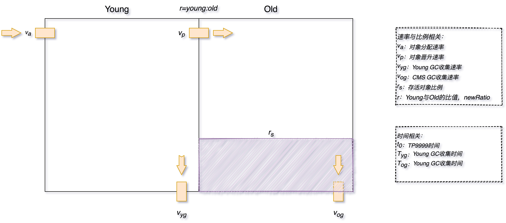

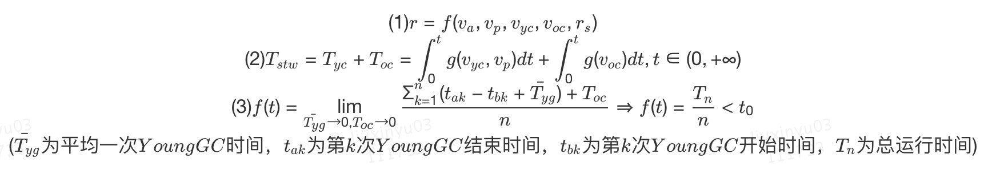

- NewRatio 的值 r 与 va、vp、vyc、voc、rs 等值存在一定函数相关性（rs 越小 r 越大、r 越小 vp 越小，…，之前尝试使用 NN 来辅助建模，但目前还没有完全算出具体的公式，有想法的同学可以在评论区给出你的答案）。
- 总停顿时间 T 为 Young GC 总时间 Tyc 和 Old GC 总时间 Toc 之和，其中 Tyc 与 vyc 和 vp 相关，Toc 与 voc相关。
- 忽略掉 GC 时间后，**两次 Young GC 的时间间隔要大于 TP9999 时间**，这样尽量让对象在 Eden 区就被回收，可以减少很多停顿。


### 4.5 场景五：CMS Old GC 频繁

#### 4.5.1 现象

Old 区频繁的做 CMS GC，但是每次耗时不是特别长，整体最大 STW 也在可接受范围内，但由于 GC 太频繁导致吞吐下降比较多。

#### 4.5.2 原因

这种情况比较常见，基本都是一次 Young GC 完成后，负责处理 CMS GC 的一个后台线程 concurrentMarkSweepThread 会不断地轮询，使用 `shouldConcurrentCollect()` 方法做一次检测，判断是否达到了回收条件。如果达到条件，使用 `collect_in_background()` 启动一次 Background 模式 GC。轮询的判断是使用 `sleepBeforeNextCycle()` 方法，间隔周期为 `-XX:CMSWaitDuration` 决定，默认为2s。

具体代码在： src/hotspot/share/gc/cms/concurrentMarkSweepThread.cpp。

```c++
void ConcurrentMarkSweepThread::run_service() {
  assert(this == cmst(), "just checking");

  if (BindCMSThreadToCPU && !os::bind_to_processor(CPUForCMSThread)) {
    log_warning(gc)("Couldn't bind CMS thread to processor " UINTX_FORMAT, CPUForCMSThread);
  }

  while (!should_terminate()) {
    sleepBeforeNextCycle();
    if (should_terminate()) break;
    GCIdMark gc_id_mark;
    GCCause::Cause cause = _collector->_full_gc_requested ?
      _collector->_full_gc_cause : GCCause::_cms_concurrent_mark;
    _collector->collect_in_background(cause);
  }
  verify_ok_to_terminate();
}
```

------

```c++
void ConcurrentMarkSweepThread::sleepBeforeNextCycle() {
  while (!should_terminate()) {
    if(CMSWaitDuration >= 0) {
      // Wait until the next synchronous GC, a concurrent full gc
      // request or a timeout, whichever is earlier.
      wait_on_cms_lock_for_scavenge(CMSWaitDuration);
    } else {
      // Wait until any cms_lock event or check interval not to call shouldConcurrentCollect permanently
      wait_on_cms_lock(CMSCheckInterval);
    }
    // Check if we should start a CMS collection cycle
    if (_collector->shouldConcurrentCollect()) {
      return;
    }
    // .. collection criterion not yet met, let's go back
    // and wait some more
  }
}
```

判断是否进行回收的代码在：/src/hotspot/share/gc/cms/concurrentMarkSweepGeneration.cpp。

```c++
bool CMSCollector::shouldConcurrentCollect() {
  LogTarget(Trace, gc) log;

  if (_full_gc_requested) {
    log.print("CMSCollector: collect because of explicit  gc request (or GCLocker)");
    return true;
  }

  FreelistLocker x(this);
  // ------------------------------------------------------------------
  // Print out lots of information which affects the initiation of
  // a collection.
  if (log.is_enabled() && stats().valid()) {
    log.print("CMSCollector shouldConcurrentCollect: ");

    LogStream out(log);
    stats().print_on(&out);

    log.print("time_until_cms_gen_full %3.7f", stats().time_until_cms_gen_full());
    log.print("free=" SIZE_FORMAT, _cmsGen->free());
    log.print("contiguous_available=" SIZE_FORMAT, _cmsGen->contiguous_available());
    log.print("promotion_rate=%g", stats().promotion_rate());
    log.print("cms_allocation_rate=%g", stats().cms_allocation_rate());
    log.print("occupancy=%3.7f", _cmsGen->occupancy());
    log.print("initiatingOccupancy=%3.7f", _cmsGen->initiating_occupancy());
    log.print("cms_time_since_begin=%3.7f", stats().cms_time_since_begin());
    log.print("cms_time_since_end=%3.7f", stats().cms_time_since_end());
    log.print("metadata initialized %d", MetaspaceGC::should_concurrent_collect());
  }
  // ------------------------------------------------------------------
  if (!UseCMSInitiatingOccupancyOnly) {
    if (stats().valid()) {
      if (stats().time_until_cms_start() == 0.0) {
        return true;
      }
    } else {
  
      if (_cmsGen->occupancy() >= _bootstrap_occupancy) {
        log.print(" CMSCollector: collect for bootstrapping statistics: occupancy = %f, boot occupancy = %f",
                  _cmsGen->occupancy(), _bootstrap_occupancy);
        return true;
      }
    }
  }

  if (_cmsGen->should_concurrent_collect()) {
    log.print("CMS old gen initiated");
    return true;
  }

  // We start a collection if we believe an incremental collection may fail;
  // this is not likely to be productive in practice because it's probably too
  // late anyway.
  CMSHeap* heap = CMSHeap::heap();
  if (heap->incremental_collection_will_fail(true /* consult_young */)) {
    log.print("CMSCollector: collect because incremental collection will fail ");
    return true;
  }

  if (MetaspaceGC::should_concurrent_collect()) {
    log.print("CMSCollector: collect for metadata allocation ");
    return true;
  }

  // CMSTriggerInterval starts a CMS cycle if enough time has passed.
  if (CMSTriggerInterval >= 0) {
    if (CMSTriggerInterval == 0) {
      // Trigger always
      return true;
    }

    // Check the CMS time since begin (we do not check the stats validity
    // as we want to be able to trigger the first CMS cycle as well)
    if (stats().cms_time_since_begin() >= (CMSTriggerInterval / ((double) MILLIUNITS))) {
      if (stats().valid()) {
        log.print("CMSCollector: collect because of trigger interval (time since last begin %3.7f secs)",
                  stats().cms_time_since_begin());
      } else {
        log.print("CMSCollector: collect because of trigger interval (first collection)");
      }
      return true;
    }
  }

  return false;
}
```

分析其中逻辑判断是否触发 GC，分为以下几种情况：

- **触发 CMS GC：** 通过调用 `_collector->collect_in_background()` 进行触发 Background GC 。
  - CMS 默认采用 JVM 运行时的统计数据判断是否需要触发 CMS GC，如果需要根据 `-XX:CMSInitiatingOccupancyFraction` 的值进行判断，需要设置参数 `-XX:+UseCMSInitiatingOccupancyOnly`。
  - 如果开启了 `-XX:UseCMSInitiatingOccupancyOnly` 参数，判断当前 Old 区使用率是否大于阈值，则触发 CMS GC，该阈值可以通过参数 `-XX:CMSInitiatingOccupancyFraction` 进行设置，如果没有设置，默认为 92%。
  - 如果之前的 Young GC 失败过，或者下次 Young 区执行 Young GC 可能失败，这两种情况下都需要触发 CMS GC。
  - CMS 默认不会对 MetaSpace 或 Perm 进行垃圾收集，如果希望对这些区域进行垃圾收集，需要设置参数 `-XX:+CMSClassUnloadingEnabled`。
- **触发 Full GC：** 直接进行 Full GC，这种情况到场景七中展开说明。
  - 如果 `_full_gc_requested` 为真，说明有明确的需求要进行 GC，比如调用 System.gc。
  - 在 Eden 区为对象或 TLAB 分配内存失败，导致一次 Young GC，在 `GenCollectorPolicy` 类的 `satisfy_failed_allocation()` 方法中进行判断。

大家可以看一下源码中的日志打印，通过日志我们就可以比较清楚地知道具体的原因，然后就可以着手分析了。

#### 4.5.3 策略

我们这里还是拿最常见的达到回收比例这个场景来说，与过早晋升不同的是这些对象确实存活了一段时间，Survival Time 超过了 TP9999 时间，但是又达不到长期存活，如各种数据库、网络链接，带有失效时间的缓存等。

处理这种常规内存泄漏问题基本是一个思路，主要步骤如下：


Dump Diff 和 Leak Suspects 比较直观就不介绍了，这里说下其它几个关键点：

- **内存 Dump：** 使用 jmap、arthas 等 dump 堆进行快照时记得摘掉流量，同时**分别在 CMS GC 的发生前后分别 dump 一次**。
- **分析 Top Component：** 要记得按照对象、类、类加载器、包等多个维度观察 Histogram，同时使用 outgoing 和 incoming 分析关联的对象，另外就是 Soft Reference 和 Weak Reference、Finalizer 等也要看一下。
- **分析 Unreachable：** 重点看一下这个，关注下 Shallow 和 Retained 的大小。如下图所示，笔者之前一次 GC 优化，就根据 Unreachable Objects 发现了 Hystrix 的滑动窗口问题。


#### 4.5.4 小结

经过整个流程下来基本就能定位问题了，不过在优化的过程中记得使用**控制变量**的方法来优化，防止一些会加剧问题的改动被掩盖。

### 4.6 场景六：单次 CMS Old GC 耗时长*

#### 4.6.1 现象

CMS GC 单次 STW 最大超过 1000ms，不会频繁发生，如下图所示最长达到了 8000ms。某些场景下会引起“雪崩效应”，这种场景非常危险，我们应该尽量避免出现。


#### 4.6.2 原因

CMS 在回收的过程中，STW 的阶段主要是 Init Mark 和 Final Remark 这两个阶段，也是导致 CMS Old GC 最多的原因，另外有些情况就是在 STW 前等待 Mutator 的线程到达 SafePoint 也会导致时间过长，但这种情况较少，我们在此处主要讨论前者。发生收集器退化或者碎片压缩的场景请看场景七。

想要知道这两个阶段为什么会耗时，我们需要先看一下这两个阶段都会干什么。

核心代码都在 /src/hotspot/share/gc/cms/concurrentMarkSweepGeneration.cpp 中，内部有个线程 ConcurrentMarkSweepThread 轮询来校验，Old 区的垃圾回收相关细节被完全封装在 `CMSCollector` 中，调用入口就是 ConcurrentMarkSweepThread 调用的 `CMSCollector::collect_in_background` 和 `ConcurrentMarkSweepGeneration` 调用的 `CMSCollector::collect` 方法，此处我们讨论大多数场景的 `collect_in_background`。整个过程中会 STW 的主要是 initial Mark 和 Final Remark，核心代码在 `VM_CMS_Initial_Mark` / `VM_CMS_Final_Remark` 中，执行时需要将执行权交由 VMThread 来执行。

- CMS Init Mark执行步骤，实现在 `CMSCollector::checkpointRootsInitialWork()` 和 `CMSParInitialMarkTask::work` 中，整体步骤和代码如下：

```c++
void CMSCollector::checkpointRootsInitialWork() {
  assert(SafepointSynchronize::is_at_safepoint(), "world should be stopped");
  assert(_collectorState == InitialMarking, "just checking");

  // Already have locks.
  assert_lock_strong(bitMapLock());
  assert(_markBitMap.isAllClear(), "was reset at end of previous cycle");

  // Setup the verification and class unloading state for this
  // CMS collection cycle.
  setup_cms_unloading_and_verification_state();

  GCTraceTime(Trace, gc, phases) ts("checkpointRootsInitialWork", _gc_timer_cm);

  // Reset all the PLAB chunk arrays if necessary.
  if (_survivor_plab_array != NULL && !CMSPLABRecordAlways) {
    reset_survivor_plab_arrays();
  }

  ResourceMark rm;
  HandleMark  hm;

  MarkRefsIntoClosure notOlder(_span, &_markBitMap);
  CMSHeap* heap = CMSHeap::heap();

  verify_work_stacks_empty();
  verify_overflow_empty();

  heap->ensure_parsability(false);  // fill TLABs, but no need to retire them
  // Update the saved marks which may affect the root scans.
  heap->save_marks();

  // weak reference processing has not started yet.
  ref_processor()->set_enqueuing_is_done(false);

  // Need to remember all newly created CLDs,
  // so that we can guarantee that the remark finds them.
  ClassLoaderDataGraph::remember_new_clds(true);

  // Whenever a CLD is found, it will be claimed before proceeding to mark
  // the klasses. The claimed marks need to be cleared before marking starts.
  ClassLoaderDataGraph::clear_claimed_marks();

  print_eden_and_survivor_chunk_arrays();

  {
    if (CMSParallelInitialMarkEnabled) {
      // The parallel version.
      WorkGang* workers = heap->workers();
      assert(workers != NULL, "Need parallel worker threads.");
      uint n_workers = workers->active_workers();

      StrongRootsScope srs(n_workers);

      CMSParInitialMarkTask tsk(this, &srs, n_workers);
      initialize_sequential_subtasks_for_young_gen_rescan(n_workers);
      // If the total workers is greater than 1, then multiple workers
      // may be used at some time and the initialization has been set
      // such that the single threaded path cannot be used.
      if (workers->total_workers() > 1) {
        workers->run_task(&tsk);
      } else {
        tsk.work(0);
      }
    } else {
      // The serial version.
      CLDToOopClosure cld_closure(&notOlder, true);
      heap->rem_set()->prepare_for_younger_refs_iterate(false); // Not parallel.

      StrongRootsScope srs(1);

      heap->cms_process_roots(&srs,
                             true,   // young gen as roots
                             GenCollectedHeap::ScanningOption(roots_scanning_options()),
                             should_unload_classes(),
                             &notOlder,
                             &cld_closure);
    }
  }

  // Clear mod-union table; it will be dirtied in the prologue of
  // CMS generation per each young generation collection.
  assert(_modUnionTable.isAllClear(),
       "Was cleared in most recent final checkpoint phase"
       " or no bits are set in the gc_prologue before the start of the next "
       "subsequent marking phase.");

  assert(_ct->cld_rem_set()->mod_union_is_clear(), "Must be");
  // Save the end of the used_region of the constituent generations
  // to be used to limit the extent of sweep in each generation.
  save_sweep_limits();
  verify_overflow_empty();
}
void CMSParInitialMarkTask::work(uint worker_id) {
  elapsedTimer _timer;
  ResourceMark rm;
  HandleMark   hm;

  // ---------- scan from roots --------------
  _timer.start();
  CMSHeap* heap = CMSHeap::heap();
  ParMarkRefsIntoClosure par_mri_cl(_collector->_span, &(_collector->_markBitMap));

  // ---------- young gen roots --------------
  {
    work_on_young_gen_roots(&par_mri_cl);
    _timer.stop();
    log_trace(gc, task)("Finished young gen initial mark scan work in %dth thread: %3.3f sec", worker_id, _timer.seconds());
  }

  // ---------- remaining roots --------------
  _timer.reset();
  _timer.start();

  CLDToOopClosure cld_closure(&par_mri_cl, true);

  heap->cms_process_roots(_strong_roots_scope,
                          false,     // yg was scanned above
                          GenCollectedHeap::ScanningOption(_collector->CMSCollector::roots_scanning_options()),
                          _collector->should_unload_classes(),
                          &par_mri_cl,
                          &cld_closure,
                          &_par_state_string);

  assert(_collector->should_unload_classes()
         || (_collector->CMSCollector::roots_scanning_options() & GenCollectedHeap::SO_AllCodeCache),
         "if we didn't scan the code cache, we have to be ready to drop nmethods with expired weak oops");
  _timer.stop();
  log_trace(gc, task)("Finished remaining root initial mark scan work in %dth thread: %3.3f sec", worker_id, _timer.seconds());
}
```


整个过程比较简单，从 GC Root 出发标记 Old 中的对象，处理完成后借助 BitMap 处理下 Young 区对 Old 区的引用，整个过程基本都比较快，很少会有较大的停顿。

- CMS Final Remark 执行步骤，实现在 `CMSCollector::checkpointRootsFinalWork()` 中，整体代码和步骤如下：

```c++
void CMSCollector::checkpointRootsFinalWork() {
  GCTraceTime(Trace, gc, phases) tm("checkpointRootsFinalWork", _gc_timer_cm);

  assert(haveFreelistLocks(), "must have free list locks");
  assert_lock_strong(bitMapLock());

  ResourceMark rm;
  HandleMark   hm;

  CMSHeap* heap = CMSHeap::heap();

  if (should_unload_classes()) {
    CodeCache::gc_prologue();
  }
  assert(haveFreelistLocks(), "must have free list locks");
  assert_lock_strong(bitMapLock());

  heap->ensure_parsability(false);  // fill TLAB's, but no need to retire them
  // Update the saved marks which may affect the root scans.
  heap->save_marks();

  print_eden_and_survivor_chunk_arrays();

  {
    if (CMSParallelRemarkEnabled) {
      GCTraceTime(Debug, gc, phases) t("Rescan (parallel)", _gc_timer_cm);
      do_remark_parallel();
    } else {
      GCTraceTime(Debug, gc, phases) t("Rescan (non-parallel)", _gc_timer_cm);
      do_remark_non_parallel();
    }
  }
  verify_work_stacks_empty();
  verify_overflow_empty();

  {
    GCTraceTime(Trace, gc, phases) ts("refProcessingWork", _gc_timer_cm);
    refProcessingWork();
  }
  verify_work_stacks_empty();
  verify_overflow_empty();

  if (should_unload_classes()) {
    CodeCache::gc_epilogue();
  }
  JvmtiExport::gc_epilogue();
  assert(_markStack.isEmpty(), "No grey objects");
  size_t ser_ovflw = _ser_pmc_remark_ovflw + _ser_pmc_preclean_ovflw +
                     _ser_kac_ovflw        + _ser_kac_preclean_ovflw;
  if (ser_ovflw > 0) {
    log_trace(gc)("Marking stack overflow (benign) (pmc_pc=" SIZE_FORMAT ", pmc_rm=" SIZE_FORMAT ", kac=" SIZE_FORMAT ", kac_preclean=" SIZE_FORMAT ")",
                         _ser_pmc_preclean_ovflw, _ser_pmc_remark_ovflw, _ser_kac_ovflw, _ser_kac_preclean_ovflw);
    _markStack.expand();
    _ser_pmc_remark_ovflw = 0;
    _ser_pmc_preclean_ovflw = 0;
    _ser_kac_preclean_ovflw = 0;
    _ser_kac_ovflw = 0;
  }
  if (_par_pmc_remark_ovflw > 0 || _par_kac_ovflw > 0) {
     log_trace(gc)("Work queue overflow (benign) (pmc_rm=" SIZE_FORMAT ", kac=" SIZE_FORMAT ")",
                          _par_pmc_remark_ovflw, _par_kac_ovflw);
     _par_pmc_remark_ovflw = 0;
    _par_kac_ovflw = 0;
  }
   if (_markStack._hit_limit > 0) {
     log_trace(gc)(" (benign) Hit max stack size limit (" SIZE_FORMAT ")",
                          _markStack._hit_limit);
   }
   if (_markStack._failed_double > 0) {
     log_trace(gc)(" (benign) Failed stack doubling (" SIZE_FORMAT "), current capacity " SIZE_FORMAT,
                          _markStack._failed_double, _markStack.capacity());
   }
  _markStack._hit_limit = 0;
  _markStack._failed_double = 0;

  if ((VerifyAfterGC || VerifyDuringGC) &&
      CMSHeap::heap()->total_collections() >= VerifyGCStartAt) {
    verify_after_remark();
  }

  _gc_tracer_cm->report_object_count_after_gc(&_is_alive_closure);

  // Change under the freelistLocks.
  _collectorState = Sweeping;
  // Call isAllClear() under bitMapLock
  assert(_modUnionTable.isAllClear(),
      "Should be clear by end of the final marking");
  assert(_ct->cld_rem_set()->mod_union_is_clear(),
      "Should be clear by end of the final marking");
}
```


Final Remark 是最终的第二次标记，这种情况只有在 Background GC 执行了 InitialMarking 步骤的情形下才会执行，如果是 Foreground GC 执行的 InitialMarking 步骤则不需要再次执行 FinalRemark。Final Remark 的开始阶段与 Init Mark 处理的流程相同，但是后续多了 Card Table 遍历、Reference 实例的清理并将其加入到 Reference 维护的 `pend_list` 中，如果要收集元数据信息，还要清理 SystemDictionary、CodeCache、SymbolTable、StringTable 等组件中不再使用的资源。

#### 4.6.3 策略

知道了两个 STW 过程执行流程，我们分析解决就比较简单了，由于大部分问题都出在 Final Remark 过程，这里我们也拿这个场景来举例，主要步骤：

- **【方向】** 观察详细 GC 日志，找到出问题时 Final Remark 日志，分析下 Reference 处理和元数据处理 real 耗时是否正常，详细信息需要通过 `-XX:+PrintReferenceGC` 参数开启。**基本在日志里面就能定位到大概是哪个方向出了问题，耗时超过 10% 的就需要关注**。

```
2019-02-27T19:55:37.920+0800: 516952.915: [GC (CMS Final Remark) 516952.915: [ParNew516952.939: [SoftReference, 0 refs, 0.0003857 secs]516952.939: [WeakReference, 1362 refs, 0.0002415 secs]516952.940: [FinalReference, 146 refs, 0.0001233 secs]516952.940: [PhantomReference, 0 refs, 57 refs, 0.0002369 secs]516952.940: [JNI Weak Reference, 0.0000662 secs]
[class unloading, 0.1770490 secs]516953.329: [scrub symbol table, 0.0442567 secs]516953.373: [scrub string table, 0.0036072 secs][1 CMS-remark: 1638504K(2048000K)] 1667558K(4352000K), 0.5269311 secs] [Times: user=1.20 sys=0.03, real=0.53 secs]
```

- **【根因】** 有了具体的方向我们就可以进行深入的分析，一般来说最容易出问题的地方就是 Reference 中的 FinalReference 和元数据信息处理中的 scrub symbol table 两个阶段，想要找到具体问题代码就需要内存分析工具 MAT 或 JProfiler 了，注意要 dump 即将开始 CMS GC 的堆。在用 MAT 等工具前也可以先用命令行看下对象 Histogram，有可能直接就能定位问题。
  - 对 FinalReference 的分析主要观察 `java.lang.ref.Finalizer` 对象的 dominator tree，找到泄漏的来源。经常会出现问题的几个点有 Socket 的 `SocksSocketImpl` 、Jersey 的 `ClientRuntime`、MySQL 的 `ConnectionImpl` 等等。
  - scrub symbol table 表示清理元数据符号引用耗时，符号引用是 Java 代码被编译成字节码时，方法在 JVM 中的表现形式，生命周期一般与 Class 一致，当 `_should_unload_classes` 被设置为 true 时在 `CMSCollector::refProcessingWork()` 中与 Class Unload、String Table 一起被处理。

```c++
if (should_unload_classes()) {
    {
      GCTraceTime(Debug, gc, phases) t("Class Unloading", _gc_timer_cm);

      // Unload classes and purge the SystemDictionary.
      bool purged_class = SystemDictionary::do_unloading(_gc_timer_cm);

      // Unload nmethods.
      CodeCache::do_unloading(&_is_alive_closure, purged_class);

      // Prune dead klasses from subklass/sibling/implementor lists.
      Klass::clean_weak_klass_links(purged_class);
    }

    {
      GCTraceTime(Debug, gc, phases) t("Scrub Symbol Table", _gc_timer_cm);
      // Clean up unreferenced symbols in symbol table.
      SymbolTable::unlink();
    }

    {
      GCTraceTime(Debug, gc, phases) t("Scrub String Table", _gc_timer_cm);
      // Delete entries for dead interned strings.
      StringTable::unlink(&_is_alive_closure);
    }
  }
```

- **【策略】** 知道 GC 耗时的根因就比较好处理了，这种问题不会大面积同时爆发，不过有很多时候单台 STW 的时间会比较长，如果业务影响比较大，及时摘掉流量，具体后续优化策略如下：
  - FinalReference：找到内存来源后通过优化代码的方式来解决，如果短时间无法定位可以增加 `-XX:+ParallelRefProcEnabled` 对 Reference 进行并行处理。
  - symbol table：观察 MetaSpace 区的历史使用峰值，以及每次 GC 前后的回收情况，一般没有使用动态类加载或者 DSL 处理等，MetaSpace 的使用率上不会有什么变化，这种情况可以通过 `-XX:-CMSClassUnloadingEnabled` 来避免 MetaSpace 的处理，JDK8 会默认开启 CMSClassUnloadingEnabled，这会使得 CMS 在 CMS-Remark 阶段尝试进行类的卸载。

#### 4.6.4 小结

正常情况进行的 Background CMS GC，出现问题基本都集中在 Reference 和 Class 等元数据处理上，在 Reference 类的问题处理方面，不管是 FinalReference，还是 SoftReference、WeakReference 核心的手段就是找准时机 dump 快照，然后用内存分析工具来分析。Class 处理方面目前除了关闭类卸载开关，没有太好的方法。

在 G1 中同样有 Reference 的问题，可以观察日志中的 Ref Proc，处理方法与 CMS 类似。

### 4.7 场景七：内存碎片&收集器退化

#### 4.7.1 现象

并发的 CMS GC 算法，退化为 Foreground 单线程串行 GC 模式，STW 时间超长，有时会长达十几秒。其中 CMS 收集器退化后单线程串行 GC 算法有两种：

- 带压缩动作的算法，称为 MSC，上面我们介绍过，使用标记-清理-压缩，单线程全暂停的方式，对整个堆进行垃圾收集，也就是真正意义上的 Full GC，暂停时间要长于普通 CMS。
- 不带压缩动作的算法，收集 Old 区，和普通的 CMS 算法比较相似，暂停时间相对 MSC 算法短一些。

#### 4.7.2 原因

CMS 发生收集器退化主要有以下几种情况：

**晋升失败（Promotion Failed）**

顾名思义，晋升失败就是指在进行 Young GC 时，Survivor 放不下，对象只能放入 Old，但此时 Old 也放不下。直觉上乍一看这种情况可能会经常发生，但其实因为有 concurrentMarkSweepThread 和担保机制的存在，发生的条件是很苛刻的，除非是短时间将 Old 区的剩余空间迅速填满，例如上文中说的动态年龄判断导致的过早晋升（见下文的增量收集担保失败）。另外还有一种情况就是内存碎片导致的 Promotion Failed，Young GC 以为 Old 有足够的空间，结果到分配时，晋级的大对象找不到连续的空间存放。

使用 CMS 作为 GC 收集器时，运行过一段时间的 Old 区如下图所示，清除算法导致内存出现多段的不连续，出现大量的内存碎片。


碎片带来了两个问题：

- **空间分配效率较低**：上文已经提到过，如果是连续的空间 JVM 可以通过使用 pointer bumping 的方式来分配，而对于这种有大量碎片的空闲链表则需要逐个访问 freelist 中的项来访问，查找可以存放新建对象的地址。
- **空间利用效率变低**：Young 区晋升的对象大小大于了连续空间的大小，那么将会触发 Promotion Failed ，即使整个 Old 区的容量是足够的，但由于其不连续，也无法存放新对象，也就是本文所说的问题。

**增量收集担保失败**

分配内存失败后，会判断统计得到的 Young GC 晋升到 Old 的平均大小，以及当前 Young 区已使用的大小也就是最大可能晋升的对象大小，是否大于 Old 区的剩余空间。只要 CMS 的剩余空间比前两者的任意一者大，CMS 就认为晋升还是安全的，反之，则代表不安全，不进行Young GC，直接触发Full GC。

**显式 GC**

这种情况参见场景二。

**并发模式失败（Concurrent Mode Failure）**

最后一种情况，也是发生概率较高的一种，在 GC 日志中经常能看到 Concurrent Mode Failure 关键字。这种是由于并发 Background CMS GC 正在执行，同时又有 Young GC 晋升的对象要放入到了 Old 区中，而此时 Old 区空间不足造成的。

为什么 CMS GC 正在执行还会导致收集器退化呢？主要是由于 CMS 无法处理浮动垃圾（Floating Garbage）引起的。CMS 的并发清理阶段，Mutator 还在运行，因此不断有新的垃圾产生，而这些垃圾不在这次清理标记的范畴里，无法在本次 GC 被清除掉，这些就是浮动垃圾，除此之外在 Remark 之前那些断开引用脱离了读写屏障控制的对象也算浮动垃圾。所以 Old 区回收的阈值不能太高，否则预留的内存空间很可能不够，从而导致 Concurrent Mode Failure 发生。

#### 4.7.3 策略

分析到具体原因后，我们就可以针对性解决了，具体思路还是从根因出发，具体解决策略：

- **内存碎片：** 通过配置 `-XX:UseCMSCompactAtFullCollection=true` 来控制 Full GC的过程中是否进行空间的整理（默认开启，注意是Full GC，不是普通CMS GC），以及 `-XX: CMSFullGCsBeforeCompaction=n` 来控制多少次 Full GC 后进行一次压缩。
- **增量收集：** 降低触发 CMS GC 的阈值，即参数 `-XX:CMSInitiatingOccupancyFraction` 的值，让 CMS GC 尽早执行，以保证有足够的连续空间，也减少 Old 区空间的使用大小，另外需要使用 `-XX:+UseCMSInitiatingOccupancyOnly` 来配合使用，不然 JVM 仅在第一次使用设定值，后续则自动调整。
- **浮动垃圾：** 视情况控制每次晋升对象的大小，或者缩短每次 CMS GC 的时间，必要时可调节 NewRatio 的值。另外就是使用 `-XX:+CMSScavengeBeforeRemark` 在过程中提前触发一次 Young GC，防止后续晋升过多对象。

#### 4.7.4 小结

正常情况下触发并发模式的 CMS GC，停顿非常短，对业务影响很小，但 CMS GC 退化后，影响会非常大，建议发现一次后就彻底根治。只要能定位到内存碎片、浮动垃圾、增量收集相关等具体产生原因，还是比较好解决的，关于内存碎片这块，如果 `-XX:CMSFullGCsBeforeCompaction` 的值不好选取的话，可以使用 `-XX:PrintFLSStatistics` 来观察内存碎片率情况，然后再设置具体的值。

最后就是在编码的时候也要避免需要连续地址空间的大对象的产生，如过长的字符串，用于存放附件、序列化或反序列化的 byte 数组等，还有就是过早晋升问题尽量在爆发问题前就避免掉。


### 4.8 场景八：堆外内存 OOM

#### 4.8.1 现象

内存使用率不断上升，甚至开始使用 SWAP 内存，同时可能出现 GC 时间飙升，线程被 Block 等现象，**通过 top 命令发现 Java 进程的 RES 甚至超过了 `-Xmx` 的大小**。出现这些现象时，基本可以确定是出现了堆外内存泄漏。

> RES ，实存 = CODE + DATA
>
> 1、进程当前使用的内存大小，包括使用中的malloc、new分配的堆空间和分配的栈空间，但不包括swap out量；
> 2、包含其他进程的共享；
> 3、如果申请10MB的内存，实际使用1MB，它只增长1MB，与VIRT相反；
> 4、关于库占用内存的情况，它只统计加载的库文件所占内存大小。
> 5、RES = CODE + DATA
>
> VIRT 虚存
>
> 1、进程“需要的”虚拟内存大小，包括进程使用的库、代码、数据，以及malloc、new分配的堆空间和分配的栈空间等；
>
>  2、假如进程新申请10MB的内存，但实际只使用了1MB，那么它会增长10MB，而不是实际的1MB使用量。 
>
> 3、VIRT = SWAP + RES

#### 4.8.2 原因

JVM 的堆外内存泄漏，主要有两种的原因：

- 通过 `UnSafe#allocateMemory`，`ByteBuffer#allocateDirect` 主动申请了堆外内存而没有释放，常见于 NIO、Netty 等相关组件。
- 代码中有通过 JNI 调用 Native Code 申请的内存没有释放。

#### 4.8.3 策略

哪种原因造成的堆外内存泄漏？

首先，我们需要确定是哪种原因导致的堆外内存泄漏。这里可以使用 NMT（[NativeMemoryTracking](https://docs.oracle.com/javase/8/docs/technotes/guides/troubleshoot/tooldescr007.html)） 进行分析。在项目中添加 `-XX:NativeMemoryTracking=detail` JVM参数后重启项目（需要注意的是，打开 NMT 会带来 5%~10% 的性能损耗）。使用命令 `jcmd pid VM.native_memory detail` 查看内存分布。重点观察 total 中的 committed，因为 jcmd 命令显示的内存包含堆内内存、Code 区域、通过 `Unsafe.allocateMemory` 和 `DirectByteBuffer` 申请的内存，但是不包含其他 Native Code（C 代码）申请的堆外内存。

如果 total 中的 committed 和 top 中的 RES 相差不大，则应为主动申请的堆外内存未释放造成的，如果相差较大，则基本可以确定是 JNI 调用造成的。

**原因一：主动申请未释放**

JVM 使用 `-XX:MaxDirectMemorySize=size` 参数来控制可申请的堆外内存的最大值。在 Java8 中，如果未配置该参数，默认和 `-Xmx` 相等。

NIO 和 Netty 都会取 `-XX:MaxDirectMemorySize` 配置的值，来限制申请的堆外内存的大小。NIO 和 Netty 中还有一个计数器字段，用来计算当前已申请的堆外内存大小，NIO 中是 `java.nio.Bits#totalCapacity`、Netty 中 `io.netty.util.internal.PlatformDependent#DIRECT_MEMORY_COUNTER`。

当申请堆外内存时，NIO 和 Netty 会比较计数器字段和最大值的大小，如果计数器的值超过了最大值的限制，会抛出 OOM 的异常。

NIO 中是：`OutOfMemoryError: Direct buffer memory`。

Netty 中是：`OutOfDirectMemoryError: failed to allocate capacity byte(s) of direct memory (used: usedMemory , max: DIRECT_MEMORY_LIMIT )`。

我们可以检查代码中是如何使用堆外内存的，NIO 或者是 Netty，通过反射，获取到对应组件中的计数器字段，并在项目中对该字段的数值进行打点，即可准确地监控到这部分堆外内存的使用情况。

此时，可以通过 Debug 的方式确定使用堆外内存的地方是否正确执行了释放内存的代码。另外，需要检查 JVM 的参数是否有 `-XX:+DisableExplicitGC` 选项，如果有就去掉，因为该参数会使 System.gc 失效。（场景二：显式 GC 的去与留）

**原因二：通过 JNI 调用的 Native Code 申请的内存未释放**

这种情况排查起来比较困难，我们可以通过 Google perftools + Btrace 等工具，帮助我们分析出问题的代码在哪里。

gperftools 是 Google 开发的一款非常实用的工具集，它的原理是在 Java 应用程序运行时，当调用 malloc 时换用它的 libtcmalloc.so，这样就能对内存分配情况做一些统计。我们使用 gperftools 来追踪分配内存的命令。如下图所示，通过 gperftools 发现 `Java_java_util_zip_Inflater_init` 比较可疑。

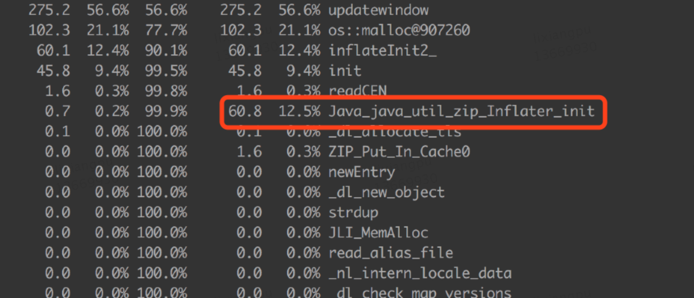

接下来可以使用 Btrace，尝试定位具体的调用栈。Btrace 是 Sun 推出的一款 Java 追踪、监控工具，可以在不停机的情况下对线上的 Java 程序进行监控。如下图所示，通过 Btrace 定位出项目中的 `ZipHelper` 在频繁调用 `GZIPInputStream` ，在堆外内存分配对象。

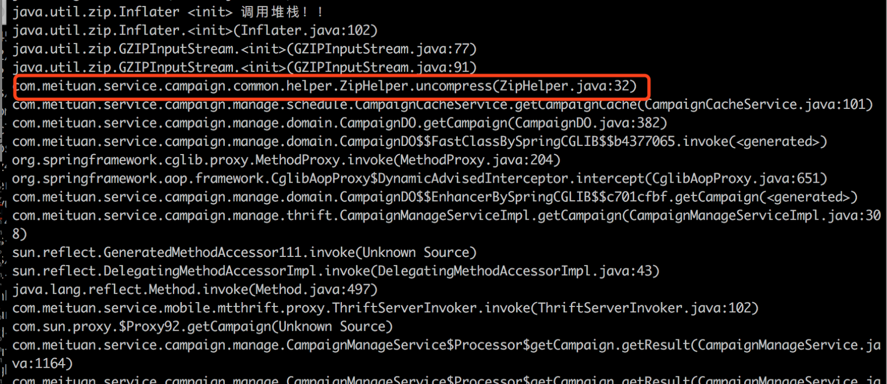

最终定位到是，项目中对 `GIPInputStream` 的使用错误，没有正确的 close()。


除了项目本身的原因，还可能有外部依赖导致的泄漏，如 Netty 和 Spring Boot，详细情况可以学习下这两篇文章，[Spring Boot引起的“堆外内存泄漏”排查及经验总结](https://tech.meituan.com/2019/01/03/spring-boot-native-memory-leak.html)、[Netty堆外内存泄露排查盛宴](https://tech.meituan.com/2018/10/18/netty-direct-memory-screening.html)。

#### 4.8.4 小结

首先可以使用 NMT + jcmd 分析泄漏的堆外内存是哪里申请，确定原因后，使用不同的手段，进行原因定位。


### 4.9 场景九：JNI 引发的 GC 问题

#### 4.9.1 现象

在 GC 日志中，出现 GC Cause 为 GCLocker Initiated GC。

```
2020-09-23T16:49:09.727+0800: 504426.742: [GC (GCLocker Initiated GC) 504426.742: [ParNew (promotion failed): 209716K->6042K(1887488K), 0.0843330 secs] 1449487K->1347626K(3984640K), 0.0848963 secs] [Times: user=0.19 sys=0.00, real=0.09 secs]
2020-09-23T16:49:09.812+0800: 504426.827: [Full GC (GCLocker Initiated GC) 504426.827: [CMS: 1341583K->419699K(2097152K), 1.8482275 secs] 1347626K->419699K(3984640K), [Metaspace: 297780K->297780K(1329152K)], 1.8490564 secs] [Times: user=1.62 sys=0.20, real=1.85 secs]
```

#### 4.9.2 原因

JNI（Java Native Interface）意为 Java 本地调用，它允许 Java 代码和其他语言写的 Native 代码进行交互。

JNI 如果需要获取 JVM 中的 String 或者数组，有两种方式：

- 拷贝传递。
- 共享引用（指针），性能更高。

由于 Native 代码直接使用了 JVM 堆区的指针，如果这时发生 GC，就会导致数据错误。因此，在发生此类 JNI 调用时，禁止 GC 的发生，同时阻止其他线程进入 JNI 临界区，直到最后一个线程退出临界区时触发一次 GC。

GC Locker 实验：

```java
public class GCLockerTest {

  static final int ITERS = 100;
  static final int ARR_SIZE =  10000;
  static final int WINDOW = 10000000;

  static native void acquire(int[] arr);
  static native void release(int[] arr);

  static final Object[] window = new Object[WINDOW];

  public static void main(String... args) throws Throwable {
    System.loadLibrary("GCLockerTest");
    int[] arr = new int[ARR_SIZE];

    for (int i = 0; i < ITERS; i++) {
      acquire(arr);
      System.out.println("Acquired");
      try {
        for (int c = 0; c < WINDOW; c++) {
          window[c] = new Object();
        }
      } catch (Throwable t) {
        // omit
      } finally {
        System.out.println("Releasing");
        release(arr);
      }
    }
  }
}
```

------

```c++
#include <jni.h>
#include "GCLockerTest.h"

static jbyte* sink;

JNIEXPORT void JNICALL Java_GCLockerTest_acquire(JNIEnv* env, jclass klass, jintArray arr) {
sink = (*env)->GetPrimitiveArrayCritical(env, arr, 0);
}

JNIEXPORT void JNICALL Java_GCLockerTest_release(JNIEnv* env, jclass klass, jintArray arr) {
(*env)->ReleasePrimitiveArrayCritical(env, arr, sink, 0);
}
```

运行该 JNI 程序，可以看到发生的 GC 都是 GCLocker Initiated GC，并且注意在 “Acquired” 和 “Released” 时不可能发生 GC。


GC Locker 可能导致的不良后果有：

- 如果此时是 Young 区不够 Allocation Failure 导致的 GC，由于无法进行 Young GC，会将对象直接分配至 Old 区。
- 如果 Old 区也没有空间了，则会等待锁释放，导致线程阻塞。
- 可能触发额外不必要的 Young GC，JDK 有一个 Bug，有一定的几率，本来只该触发一次 GCLocker Initiated GC 的 Young GC，实际发生了一次 Allocation Failure GC 又紧接着一次 GCLocker Initiated GC。是因为 GCLocker Initiated GC 的属性被设为 full，导致两次 GC 不能收敛。

#### 4.9.3 策略

- 添加 `-XX+PrintJNIGCStalls` 参数，可以打印出发生 JNI 调用时的线程，进一步分析，找到引发问题的 JNI 调用。
- JNI 调用需要谨慎，不一定可以提升性能，反而可能造成 GC 问题。
- 升级 JDK 版本到 14，避免 [JDK-8048556](https://bugs.openjdk.java.net/browse/JDK-8048556) 导致的重复 GC。

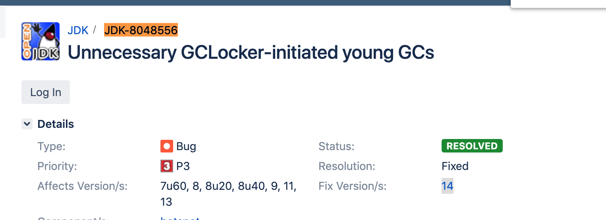

#### 4.9.4 小结

JNI 产生的 GC 问题较难排查，需要谨慎使用。

## 5. 总结

在这里，我们把整个文章内容总结一下，方便大家整体地理解回顾。

### 5.1 处理流程（SOP）

下图为整体 GC 问题普适的处理流程，重点的地方下面会单独标注，其他的基本都是标准处理流程，此处不再赘述，最后在整个问题都处理完之后有条件的话建议做一下复盘。

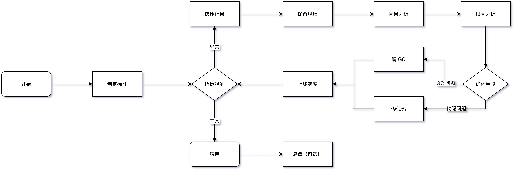

- **制定标准：** 这块内容其实非常重要，但大部分系统都是缺失的，笔者过往面试的同学中只有不到一成的同学能给出自己的系统 GC 标准到底什么样，其他的都是用的统一指标模板，缺少预见性，具体指标制定可以参考 3.1 中的内容，需要结合应用系统的 TP9999 时间和延迟、吞吐量等设定具体的指标，而不是被问题驱动。
- **保留现场：** 目前线上服务基本都是分布式服务，某个节点发生问题后，如果条件允许一定不要直接操作重启、回滚等动作恢复，优先通过摘掉流量的方式来恢复，这样我们可以将堆、栈、GC 日志等关键信息保留下来，不然错过了定位根因的时机，后续解决难度将大大增加。当然除了这些，应用日志、中间件日志、内核日志、各种 Metrics 指标等对问题分析也有很大帮助。
- **因果分析：** 判断 GC 异常与其他系统指标异常的因果关系，可以参考笔者在 3.2 中介绍的时序分析、概率分析、实验分析、反证分析等 4 种因果分析法，避免在排查过程中走入误区。
- **根因分析：** 确实是 GC 的问题后，可以借助上文提到的工具并通过 5 why 根因分析法以及跟第三节中的九种常见的场景进行逐一匹配，或者直接参考下文的根因鱼骨图，找出问题发生根因，最后再选择优化手段。

### 5.2 根因鱼骨图

送上一张问题根因鱼骨图，一般情况下我们在处理一个 GC 问题时，只要能定位到问题的“病灶”，有的放矢，其实就相当于解决了 80%，如果在某些场景下不太好定位，大家可以借助这种根因分析图通过**排除法**去定位。


### 5.3 调优建议

- **Trade Off：** 与 CAP 注定要缺一角一样，GC 优化要在延迟（Latency）、吞吐量（Throughput）、容量（Capacity）三者之间进行权衡。
- **最终手段：** GC 发生问题不是一定要对 JVM 的 GC 参数进行调优，大部分情况下是通过 GC 的情况找出一些业务问题，切记上来就对 GC 参数进行调整，当然有明确配置错误的场景除外。
- **控制变量：** 控制变量法是在蒙特卡洛（Monte Carlo）方法中用于减少方差的一种技术方法，我们调优的时候尽量也要使用，每次调优过程尽可能只调整一个变量。
- **善用搜索：** 理论上 99.99% 的 GC 问题基本都被遇到了，我们要学会使用搜索引擎的高级技巧，重点关注 StackOverFlow、Github 上的 Issue、以及各种论坛博客，先看看其他人是怎么解决的，会让解决问题事半功倍。能看到这篇文章，你的搜索能力基本过关了~
- **调优重点：** 总体上来讲，我们开发的过程中遇到的问题类型也基本都符合正态分布，太简单或太复杂的基本遇到的概率很低，笔者这里将中间最重要的三个场景添加了“*”标识，希望阅读完本文之后可以观察下自己负责的系统，是否存在上述问题。
- **GC 参数：** 如果堆、栈确实无法第一时间保留，一定要保留 GC 日志，这样我们最起码可以看到 GC Cause，有一个大概的排查方向。关于 GC 日志相关参数，最基本的 `-XX:+HeapDumpOnOutOfMemoryError` 等一些参数就不再提了，笔者建议添加以下参数，可以提高我们分析问题的效率。

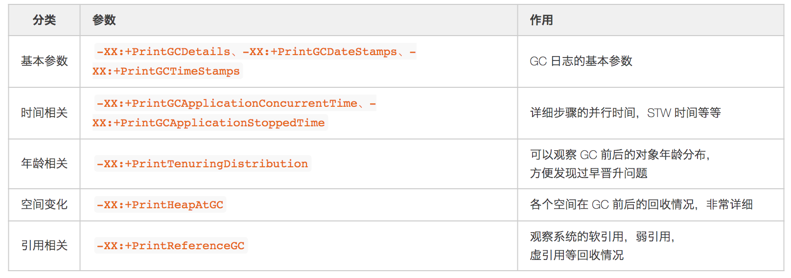

- **其他建议：** 上文场景中没有提到，但是对 GC 性能也有提升的一些建议。
  - **主动式 GC：** 也有另开生面的做法，通过监控手段监控观测 Old 区的使用情况，即将到达阈值时将应用服务摘掉流量，手动触发一次 Major GC，减少 CMS GC 带来的停顿，但随之系统的健壮性也会减少，如非必要不建议引入。
  - **禁用偏向锁：** 偏向锁在只有一个线程使用到该锁的时候效率很高，但是在竞争激烈情况会升级成轻量级锁，此时就需要先**消除偏向锁，这个过程是 STW** 的。如果每个同步资源都走这个升级过程，开销会非常大，所以在已知并发激烈的前提下，一般会禁用偏向锁 `-XX:-UseBiasedLocking` 来提高性能。
  - **虚拟内存：** 启动初期有些操作系统（例如 Linux）并没有真正分配物理内存给 JVM ，而是在虚拟内存中分配，使用的时候才会在物理内存中分配内存页，这样也会导致 GC 时间较长。这种情况可以添加 `-XX:+AlwaysPreTouch` 参数，让 VM 在 commit 内存时跑个循环来强制保证申请的内存真的 commit，避免运行时触发缺页异常。在一些大内存的场景下，有时候能将前几次的 GC 时间降一个数量级，但是添加这个参数后，启动的过程可能会变慢。

## 6. 写在最后

最后，再说笔者个人的一些小建议，遇到一些 GC 问题，如果有精力，一定要探本穷源，找出最深层次的原因。另外，在这个信息泛滥的时代，有一些被“奉为圭臬”的经验可能都是错误的，尽量养成看源码的习惯，有一句话说到“源码面前，了无秘密”，也就意味着遇到搞不懂的问题，我们可以从源码中一窥究竟，某些场景下确有奇效。但也不是只靠读源码来学习，如果硬啃源码但不理会其背后可能蕴含的理论基础，那很容易“捡芝麻丢西瓜”，“只见树木，不见森林”，让“了无秘密”变成了一句空话，我们还是要结合一些实际的业务场景去针对性地学习。

**你的时间在哪里，你的成就就会在哪里**。笔者也是在前两年才开始逐步地在 GC 方向上不断深入，查问题、看源码、做总结，每个 Case 形成一个小的闭环，目前初步摸到了 GC 问题处理的一些门道，同时将经验总结应用于生产环境实践，慢慢地形成一个良性循环。

本篇文章主要是介绍了 CMS GC 的一些常见场景分析，另外一些，如 CodeCache 问题导致 JIT 失效、SafePoint 就绪时间长、Card Table 扫描耗时等问题不太常见就没有花太多篇幅去讲解。Java GC 是在“分代”的思想下内卷了很多年才突破到了“分区”，目前在美团也已经开始使用 G1 来替换使用了多年的 CMS，虽然在小的堆方面 G1 还略逊色于 CMS，但这是一个趋势，短时间无法升级到 ZGC，所以未来遇到的 G1 的问题可能会逐渐增多。目前已经收集到 Remember Set 粗化、Humongous 分配、Ergonomics 异常、Mixed GC 中 Evacuation Failure 等问题，除此之外也会给出 CMS 升级到 G1 的一些建议，接下来笔者将继续完成这部分文章整理，敬请期待。

“防火”永远要胜于“救火”，**不放过任何一个异常的小指标**（一般来说，任何**不平滑的曲线**都是值得怀疑的） ，就有可能避免一次故障的发生。作为 Java 程序员基本都会遇到一些 GC 的问题，独立解决 GC 问题是我们必须迈过的一道坎。开篇中也提到过 GC 作为经典的技术，非常值得我们学习，一些 GC 的学习材料，如《The Garbage Collection Handbook》《深入理解Java虚拟机》等也是常读常新，赶紧动起来，苦练 GC 基本功吧。

最后的最后，再多啰嗦一句，目前所有 GC 调优相关的文章，第一句讲的就是“不要过早优化”，使得很多同学对 GC 优化望而却步。在这里笔者提出不一样的观点，熵增定律（在一个孤立系统里，如果没有外力做功，其总混乱度（即熵）会不断增大）在计算机系统同样适用，**如果不主动做功使熵减，系统终究会脱离你的掌控**，在我们对业务系统和 GC 原理掌握得足够深的时候，可以放心大胆地做优化，因为我们基本可以预测到每一个操作的结果，放手一搏吧，少年！

## 7. 参考资料

- [1].《[ガベージコレクションのアルゴリズムと実装](https://book.douban.com/subject/4881935/)》中村 成洋 / 相川 光
- [2].《[The Garbage Collection Handbook](https://book.douban.com/subject/6809987/)》 Richard Jones/ Antony Hosking / Eliot Moss
- [3].《[深入理解Java虚拟机（第3版）](https://book.douban.com/subject/34907497/)》 周志明
- [4].《[Java Platform, Standard Edition HotSpot Virtual Machine Garbage Collection Tuning Guide](https://docs.oracle.com/javase/9/gctuning/JSGCT.pdf)》
- [5].《[Shipilev One Page Blog](https://shipilev.net/)》 Shipilëv
- [6]. https://openjdk.java.net/projects/jdk/15/
- [7]. https://jcp.org/en/home/index
- [8].《[A Generational Mostly-concurrent Garbage Collector](http://citeseerx.ist.psu.edu/viewdoc/summary?doi=10.1.1.22.8915)》 Tony Printezis / David Detlefs
- [9].《[Java Memory Management White Paper](https://www.oracle.com/technetwork/java/javase/memorymanagement-whitepaper-150215.pdf)》
- [10].《[Stuff Happens：Understanding Causation in Policy and Strategy](https://go.gale.com/ps/anonymous?id=GALE|A563359212&sid=googleScholar&v=2.1&it=r&linkaccess=abs&issn=00311723&p=AONE&sw=w)》AA Hill


总结：

1. 如何设置参数
   1. 根据mutator的类型，以及survivor time分布图，
2. 如何判断问题
3. 如何分析问题
4. GC触发条件：
   1. 扩缩容
   2. Old 区达到回收阈值、
   3. MetaSpace 空间不足、
   4. Young 区晋升失败、
   5. 大对象担保失败
   6. 手动触发


# todo

但是后续多了 Card Table 遍历、Reference 实例的清理并将其加入到 Reference 维护的 `pend_list` 中，如果要收集元数据信息，还要清理 SystemDictionary、CodeCache、SymbolTable、StringTable 等组件中不再使用的资源。

> 这些是什么东西


有了具体的方向我们就可以进行深入的分析，一般来说最容易出问题的地方就是 Reference 中的 FinalReference 和元数据信息处理中的 scrub symbol table 两个阶段，想要找到具体问题代码就需要内存分析工具 MAT 或 JProfiler 了，注意要 dump 即将开始 CMS GC 的堆。在用 MAT 等工具前也可以先用命令行看下对象 Histogram，有可能直接就能定位问题。

> final reference 等等是什么  https://www.infoq.cn/article/jvm-source-code-analysis-finalreference


[你假笨](http://weibo.com/nijiaben)


todo 准备一个案例，通过标准，保留现场，因果分析，根因分析（5why）


对比CMS G1 ZGC 触发机制，什么阶段是STW的等等。

ZGC是单代垃圾收集器，CMS和G1都是分代垃圾收集器

