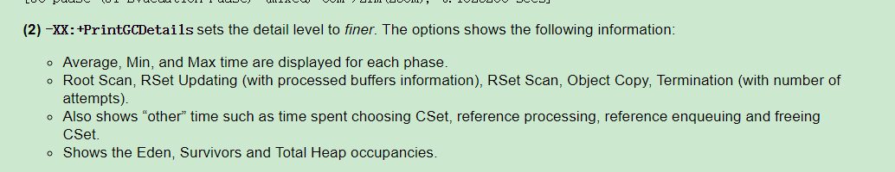

# JVM 总结

## 走进JVM

1. **HotSpot 是什么**

   Hotspot是一种JVM实现，由SUN公司开发。

   JVM还有BEA实现的JRockit，IBM的J9，后来BEA和SUN均被Oracle收购

2. **JDK 版本名称**

   从JDK 1.5开始，公开版本书写为JDK5，JDK6...，只有开发者版本才会使用1.5，1.6这种方式。

3. **JAVA的优点**

   * 结构严谨，面向对象
   * 相对安全的内存管理和访问机制
     * 相比于C语言，提供了内存动态分配，和垃圾收集技术。
   * 热点代码检测，运行时编译及优化

4. **JDK与JVM的关系**

   

   JDK主要包括包括以下三部分：

   * Java 程序设计语言
   * Java Virtual Machine
   * Java API 类库  包括Java SE API 和 Tools&Tools APIs。

   JRE主要包括以下部分：

   * Java SE API子集
   * Java Virtual Machine

5. Java SE 与 Java EE

   Java SE: 面向桌面级应用的平台，比如window程序，主要是Java 核心的API，即Java SE API。

   Java EE: 面向多层架构的企业应用(比如ERP，CRM)的平台，除了有Java SE API(包名为java开头，由于历史原因也有小部分以javax开头)，还有扩展API(通常包名以javax开头)。

6. JDK 主要版本历史

   1. 2004 年 JDK1.5发布，提供自动装箱，泛型，动态注解，枚举，可变长参数，foreach等特性，改进Java Memory Model (JMM)java 内存模型，提供concurrent并发包。

7. JVM 发展历史

   * Classic VM    JDK 1.3  前
   * Hotspot VM  JDK1.3
     * Hotspot VM 是Sun JDK和OpenJDK的默认虚拟机，使用范围最广。
     * 如其名，Hotspot指的就是其热点探测技术

8. 未来

   1. 模块化--[OSGi](https://www.ibm.com/docs/zh/radfws/9.6.1?topic=SSRTLW_9.6.1/com.ibm.aries.osgi.doc/topics/cosgi.htm)(面向Java的动态模块化规范，模块作为服务器的一部分来即插即用，而不是作为应用程序的一部分)

9. 64位虚拟机 指针膨胀

   64位虚拟机需要在内存上付出较大代价，原因在于指针膨胀以及数据类型对齐补白问题，比32位要额外增加10%到30%的内存消耗。

   解决方式：可以开启普通对象指针压缩功能，-XX:+ UseCompressedOops，但是不建议显式设置，建议由虚拟机的==Ergonomics==机制自动开启

10. OpenJDK vs Oracle JDK

    OpenJDK是sun的开源版本；Oracle是商业闭源版，包含比如从JRockit移植过来的Java Fligth Recorder等功能。


## 自动内存管理

### 虚拟机运行时数据区

1. 程序计数器 Program Counter Register

   * 内容：正在执行的字节码指令的地址
   * 线程私有
   * 唯一一个不会产生OOM的区域。

2. Java 虚拟机栈 Java Virtual Machine Stack 

   * 内容：Java方法栈帧

     * 栈帧里面存放局部变量表，操作数栈，动态链接，方法出口等信息。

       * 局部变量表：存放基本数据类型，对象引用，returnAddress类型(指向了一条字节码指令的地址)

         > 其中64bit的基本类型long和double占据两个局部变量空间（slot），其余均为1个。
         >
         > 局部变量表在编译之后就已经确定，方法运行时期不会改变局部变量表的大小。

   * 描述Java 方法执行的内存模型，每个方法在执行时都有一个栈帧，方法被调用和结束对应了入栈和出栈操作

   * 线程私有

   * 异常：

     * 如果线程请求的栈深度大于虚拟机允许的范围， 抛出StackOverflowError 异常
     * 大部分虚拟机都支持动态扩展虚拟机栈长度，如果拓展时无法申请到足够的内存，则抛出OutOfMemoryError

3. 本地方法栈 Native Method Stack

   * 内容：Native 方法栈帧
   * 有的虚拟机实现会把虚拟机栈与本地方法栈合而为一，比如SUN的Hotspot VM
   * 线程私有
   * 异常：StackOverflowError，OutOfMemoryError

4. 堆 Heap

   * 内容：对象实例和数组

     > 并不是所有的对象都在堆里面，由于JIT编译器的发展和逃逸技术的组件成熟，栈上分配，标量替换优化技术，已经不是绝对的了。

   * 线程共享

   * 细分：

     * 按分代：
       * 新生代
         * Eden
         * survivor1
         * survivor2
       * 老年代
     * 按内存分配
       * 线程共享的堆可能划分出多个线程==私有==的分配缓冲区 TLAB(Thread Local Allocation Buffer)

   * 异常：OutOfMemoryError

5. 方法区 Method Area

   * 内容：已被虚拟机加载的类信息(类名，修饰符，字段描述，方法描述)，常量，静态变量，即时编译器编译后的代码

   * 线程共享

   * 在JDK 8前被称为永久区(Permanent Generation)，其实不严谨。只是Hotsopt虚拟机将分代收集机制拓展到方法区而已，使得Hotspot的垃圾收集器可以像管理堆那样来管理方法区，省去了单独为方法区编写内存管理代码的工作。

     > 实际上的表现也证明这种设计不合理，
     >
     > * 其一，方法区很容易溢出，因为永久代有大小上限(-XX: MaxPermSize，而其他虚拟机实现比如JRockit没有限制(只要没有超过进程可用内存)，而且有极少数方法(比如]String.intern()](https://stackoverflow.com/questions/10578984/what-is-java-string-interning)方法会将内容相同的字符串引用指向到同一个对象)会导致不同虚拟机有不同的实现。
     >
     >   在Hotspot中，从Jdk 1.7开始，String.intern后的对象不再放在方法区，而将整个字符串常量池放在heap中
     >
     > * 其二，方法区的垃圾收集行为是比较少出现的，需要回收的主要是针对常量池的回收和对类型的卸载。而且回收条件是非常苛刻的，比如类型卸载。但是回收也是有必要的。
     >
     > 从JDK8开始，使用元空间MetaSpace代替。

   * 异常：OutOfMemoryError

   * 细分：

     * 运行时常量池 Runtime Constant Pool

       * class文件除了有类的版本，字段，方法，接口等描述信息，还有一项信息是常量池（constant Pool Table）。常量池里面存放编译期生成的各种字面量和符号引用，这部分内容将在类加载后进入方法区的运行时常量池中保存。

         > 不同虚拟机实现时，除了保存class文件中描述的符号引用，还会将翻译出来的直接引用也存储在运行时常量池中。

       * 运行时常量池具有动态性，即运行时也可能将新的常量放入，比如使用String.intern。

         > 不过从JDK1.7开始，字符串常量池不在堆中而不是方法区中。

6. 直接内存 Direct Memory

   并不是虚拟机运行时数据区的一部分，也不是虚拟机规范中定义的区域。但也会导致OutOfMemoryError的出现。

   JDK1.4引入了NIO(NEW Input/Output)，可以用一种基于通道Channel和缓冲区Buffer的IO方式，可以使用Native方法直接分配堆外内存，通过一个存储在堆中的DirectByteBuffer对象作为这块内存的引用来进行操作。这样做的好处是避免了Java堆和Native堆中的数据来回复制数据。

   直接内存不受Java堆的限制，但是既然是内存，肯定会受到本机总内存大小和处理器寻址空间的限制。

   如果忽略了这部分内存，那么在动态扩展时可能会出现OutOfMemoryError。


### Hotspot中对象的分配，布局与访问

#### 对象的创建

1. 虚拟机接收到new指令，虚拟机到运行时常量池查找对应类的符号引用，检查该符号引用代表的类是否被加载，解析，初始化，如果没有，先执行类加载过程。

2. 虚拟机为新对象分配内存。对于使用带有整理算法的收集器的区域，一般会使用指针碰撞的方式分配，对于标记-清除算法的收集器的区域，一般使用空闲列表的方式。

   > 对象所需的内存在类加载后便可完全确定。
   >
   > * 内存分配如何保证并发安全？
   >   * 方式1：虚拟机采用CAS+失败重试的机制保证操作的原子性。
   >   * 方式2：利用本地线程分配缓冲 (Thread Local Allocation Buffer) TLAB。哪个线程需要分配内存，就在该线程的TLAB上分配，当TLAB用完需要分配新的TLAB时，才需要同步锁定。这种方式可通过-XX: +/- UseTLAB参数来指定
   >
   
3. 内存分配完后，虚拟机将分配到的内存空间都初始化为零值(不包括对象头)。这个步骤使得对象的实例字段还未赋予初始值就可以直接使用，程序可以访问到这个对象这些字段的数据类型对应的零值。

   > 如果采用TLAB，可以提前到TLAB分配时进行。

4. 虚拟机对对象进行必要的设置，主要是对象头(Object Header)。比如该对象是哪个类的实例，如何才能找到类的元数据信息，对象的哈希吗，对象的GC分代年龄等信息。

   > 虚拟机当前的运行状态不同，对对象头的设置也会不同，比如是否启用偏向锁。

   > 从虚拟机的角度，上面的工作完成，一个新的对象已经产生了，但是从程序的角度，该对象才刚刚开始，<init>方法还没执行，所有字段都是零值。

5. 执行<init>方法，初始化对象。


#### 对象的内存布局

1. 对象头Header

   * 对象自身的运行时数据--Mark Word

     包括hashcode，GC分代年龄，锁状态标志，线程持有的锁，偏向线程ID，偏向时间戳等。

     32和64位虚拟机分别使用32位和64位固定长度的空间的bitmap结构记录。

     这些数据已经超过了32位或者64位，但是为了空间效率，对象处于不同的状态，Mark word中的数据是不同的。

     | 存储内容 29位                       | 标志位 2位(还有1位固定为0) | 状态             |
     | ----------------------------------- | -------------------------- | ---------------- |
     | 对象HashCode，对象分代年龄          | 01                         | 未锁定状态       |
     | 指向锁记录的指针                    | 00                         | 轻量级锁定       |
     | 指向重量级锁的指针                  | 10                         | 膨胀(重量级锁定) |
     | 空，不需要记录信息                  | 11                         | GC标记           |
     | 偏向线程ID,偏向时间戳，对象分代年龄 | 01                         | 可偏向           |

   * 类型指针

     指向该对象的类元数据的指针。虚拟机通过该指针判断是哪个类的实例。

     > 并不是所有的虚拟机实现都在对象数据上记录类型指针。也就是说查找对象的类元数据并不一定要经过对象本身。

   * 数组长度

     如果该对象是数组，对象头会记录数组长度。

2. 实例数据Instance Data

   对象各字段的内容。

   该部分的存储顺序遵循以下分配策略：

   1. 相同宽度的子弹分配到一起longs/doubles, ints, shorts/chars, byte/booleans, oops(Ordinary Object pointers)
   2. 父类的变量在子类之前
   3. 如果开启CompactField，子类中较窄的变量可能插入父类变量之中。

3. 对齐填充 Padding

​		起占位作用。Hotspot VM的自动内存管理系统要求对象的起始地址必须是8字节的整数倍。因此对象的大小也必须是8字节的整数倍。==**所以一个对象至少是8字节。**==


#### 对象的访问定位

java程序通过栈上的reference数据操作堆上的对象。

reference类型在虚拟机规范中只规定一个指向对象的引用，不一定是一个具体的地址，对象的寻址取决于虚拟机的实现。

有以下两种方式：

* 句柄

  java堆中划分出一块内存作为句柄池，reference中存储的是对象的句柄地址，句柄中存放了对象实例数据和类型数据的具体地址。

  > 好处是对象被移动时(GC时)，只需要修改句柄里面的具体地址，reference不需要修改。

* 直接指针

  reference中存储的是对象的实例数据的具体地址，对象的实例数据中存储了对象类型数据的指针。

  > 如果采用这种方式，对象头中就必须有类型指针。
  >
  > 好处是直接访问，速度更快。对象的访问时非常频繁的，可以节省非常可观的成本。
  >
  > Sun Hotspot采用这种方式。

​	


### OutOfMemoryError

#### 堆溢出 排查方法论

1. 重现：减少堆大小-Xms -Xmx，不断创建对象，并保证GC Roots到对象之间有可达的路径，避免垃圾回收机制清除对象。java.lang.OutOfMemoryError: Java heap space
2. 获取堆转储快照：可添加参数-XX:+HeapDumpOnOutOfMemoryError
3. 通过内存映像工具，比如Eclipse Memory Analyzer
   * 判断是内存泄漏还是内存溢出：如果大量对象是不需要的，很可能是对内存泄漏了。
   * 如果是内存泄漏，可查看泄漏对象到GC Roots的引用链，了解泄漏对象是通过什么路径与GC Roots相关联导致无法回收的。
   * 如果是内存溢出，在配置上调大堆内存，在代码上检查对象的生命周期是否过长，持有状态时间过长。


#### 虚拟机栈与本地方法栈溢出

在Hotspot中不区分这两个，栈容量由-Xss来指定。

* StackOverflowError：当栈深度大于虚拟机所允许的最大深度

  1. 重现：减少栈帧容量-Xss，构建死循环或者死递归；或者定义大量的局部变量。
  2. 异常：java.lang.StackOverflowError
  2. 加大栈帧或者检查代码

* OutOfMemoryError:   当虚拟机在拓展栈时无法申请到足够的内的空间

  1. 重现：增大栈帧容量-Xss，不断创建线程。
  2. 异常：java.lang.OutOfMemoryError: unable to create new native thread
  2. 减小栈帧或者减少堆内存，使得栈空间足够。


#### 方法区与运行时常量池

由于JDK1.7开始，字符串常量池在堆中，所以使用string.intern试图增大字符串常量池是不能导致方法区或者运行时常量池OOM的。方法区容量指定 -XX: PermSize=10M -XX: MaxPermSize=10M

1. 重现：运行时产生大量类去填满方法区，可通过jdk proxy或者cglib产生动态类。

   > 像spring，hibernate对类进行增强时都会使用到CGlib操作字节码生成动态类，另外基于JVM的动态语言，比如Groovy通常会持续地创建类来实现语言的动态性，还有大量JSP或者动态产生JSP的引用。（JSP会在运行时编译为Servlet），以及基于OSGI的应用，同一个类文件，被不同的加载器加载也视为不同的类。
   >
   > 一个类要被垃圾收集器回收掉，判定条件比较苛刻，在经常动态生成大量Class的引用，需要特别注意类的回收状况。
   
2. 异常：java.lang.OutOfMemoryError: PermGen space

2. 检查类加载情况，类加载数量等。


#### 直接内存溢出

直接内存容量由-XX: MaxDirectMemorySize指定，如果没有指定，则默认与堆最大值(-Xmx)一致.

1. 重现：通过DirectByteBuffer分配内存或者通过Unsafe单例对象的allocateMemory()来分配。

   > 通过DirectByteBuffer分配虽然也可以触发OOM，但是实际上的分配动作没有执行，只是通过计算得到内存无法分配，如果通过Unsafe来分配，就是真正在分配内存。
   >
   > Unsafe的getUnsafe()方法限制了只有引导类加载器加载的类才会返回，否则抛出SecurityException

   ```java
       @CallerSensitive
       public static Unsafe getUnsafe() {
           Class var0 = Reflection.getCallerClass();
           if (!VM.isSystemDomainLoader(var0.getClassLoader())) {
               throw new SecurityException("Unsafe");
           } else {
               return theUnsafe;
           }
       }
   ```

2. 异常：java.lang.OutOfMemory

   > 直接内存的溢出的有以下特点：
   >
   > 1. OOM后面没有说明什么区域发生了OOM
   > 2. HeapDump文件没有明显的异常
   > 3. HeapDump文件可能比较小

3. 加大直接内存配置或者检查NIO代码使用是否发生了泄漏


## 垃圾收集器与内存分配策略

自动内存管理包括两部分内容：内存分配策略与垃圾收集器。

垃圾收集GC需要考虑以下3个问题：

* what：哪些需要回收
* when：什么时候回收
* how：如何回收

#### 哪些需要回收

程序计数器，虚拟机栈，本地方法栈均是线程私有的，生命周期随线程

> 也就是说1个线程对应了一块区域作为虚拟机栈来使用，该区域存放该线程执行的方法的栈帧，方法的进入和退出对应着栈帧的压栈和出栈操作。
>
> 每一个栈帧分配多少内存是在类确定之后就可以得知的，因此可以认为是编译器可知的(尽管运行时期JIT编译器会进行一些优化，这里不考虑)。
>
> 也就是说这些内存区域的分配和回收都具备确定性，方法结束或者线程结束，自然就会回收。

堆和方法区是线程共享的，哪些类需要加载，哪些对象需要创建，都是运行时才可以确定的。一个接口的多个实现类需要的内存，一个方法的多个分支需要的内存也不一定相同。所以这两个区域是需要动态分配和回收内存。


### 什么时候回收--对象已死

对象已死的意思是以后再也不会用到这个对象了。

**如何判断对象已死？**

* 引用计数算法 Reference Counting：对象被引用，计数器+1；引用失效，计数器-1.

  致命缺点：无法回收相互循环引用的对象

* **可达性分析算法** Reachability Analysis

  大部分语言采用的是这种。

  通过以一系列**GC Roots** 对象对象为起始点开始，沿着引用链Reference Chain进行搜索。如果GC Roots到这个对象不可达，则说明这个对象不可用，判定为可以回收的对象。

**4种GC Roots**

包括：分别是方法区中静态的引用和栈中的动态引用

1. 虚拟机栈(栈帧中本地变量表，也是局部变量表)中引用的对象
2. 本地方法栈JNI(即Native方法)中引用的对象
3. 方法区静态属性引用的字段
4. 方法区常量引用的字段

**4种引用类型：**


> 构造器中可以注册引用队列，如果指定了，在回收前会先加入这个引用队列

引用强度依次递减

* 强引用 Strong Reference

  类似Object obj = new Object()这种属于强引用，不会被垃圾收集器所回收。

* 软引用 Soft Reference

  描述非必需对象被引用，即将发生OOM时被回收，使用SoftReference实现(objA -> softReference -> objB)

* 弱引用 Weak Reference

  描述非必需对象被引用，下一次GC时被回收，使用WeakReference实现

  缓存一般使用的弱引用 Weak Reference

  ```java
  /**
   * CacheKey containing a weakly referenced {@code key}. It registers
   * itself with the {@code refQueue} so that it can be used to expunge
   * the entry when the {@link WeakReference} is cleared.
   */
  private static final class CacheKey<K> extends WeakReference<K> {
   	// a replacement for null keys
  	private static final Object NULL_KEY = new Object();
  }
  ```

* 虚引用 Phantom Reference

  描述幽灵对象被引用，不能通过引用来获取该对象，该对象是否有其他对象对其持有虚引用，与该对象的生存时间没有影响。

  虚引用的唯一目的是能在即将被回收时获取到该通知。

  > 当这个对象只剩下虚引用的时候会入队(不会马上被回收，还需要清除剩下的虚引用或者本身已经不可达了)。通过判断是否已经入队，就可以知道是否即将会被回收。

  使用PhantomReference实现。

**真正宣告死亡**--**两次标记过程**

* 第一次标记：GC Roots 到该对象不可达

  标记完后会进行筛选，如果对象未覆盖finalize()方法或者已经执行过finalize()方法，则不会加入F-Queue中。

  > finalize()方法虚拟机只保证触发，但是不保证执行完，所以是不可靠的，只是一次死马当活马医的抢救措施。
  >
  > 不建议使用该方法，该方法运行代价高，不确定性大。

* 第二次标记：在F-Queue中，再次进行可达性分析     

  ​                                                                                                                                                                                                                                                                                                                                                                                        


### 方法区的回收

永久代的垃圾收集主要回收两部分内容：无用的常量和无用的类

* 无用的常量：没有任何地方引用到这个常量

  包括字符串常量(JDK7开始已经在堆上面)，常量池中其他类(接口)、方法，字段的==符号引用==也与此类似。

* 无用的类：需要满足3个条件

  * 该类所有的实例已经被回收
  * 加载该类的classLoader已经被回收
  * 代码上没有任何地方可以引用该类的java.lang.Class对象(比如没有地方使用反射获取该类的Class对象)

  > 满足以上条件的无用类仅仅是可以回收，不一定就会回收。
  >
  > Hotspot提供了-Xnoclassgc进行控制，还可以使用-verbose:class，-XX:+TraceClassLoading, -XX:+TraceClassUnloading查看类的加载和卸载信息。
  >
  > 在大量使用反射，动态代理，CGlib等字节码框架、动态生成JSP(java server page)及OSGi这类频繁自定义ClassLoader的场景都需要虚拟机具备类卸载的功能，保证永久代不会溢出。


### 4种垃圾收集算法

#### 1. 标记-清除算法 Mark-Sweep

最基础的收集算法。

* 思想：先标记，然后清除可回收对象

* 缺点：

  * 时间效率低。标记和清除过程效率不高

  * 内存碎片问题。直接清除会产生大量的内存碎片，如果需要分配一个占用较大内存的对象，可能会触发多次的gc。

#### 2. 复制算法 Copying

* 思想：两块内存区域，每次仅使用一块，当该块用完之后，会将活着的对象复制到另外一块，然后该块的内存空间就相当于空闲了。

* 解决问题：内存碎片。可以直接按序分配内存。

* 代价：可用内存空间缩小。

* 应用：由于新生代对象的特点(“朝生夕死”)，应用于回收新生代的内存空间。

  * 新生代中98%对象都是“朝生夕死”的，完全不需要按照1:1的方式分配这两块内存，可以将新生代分为一个较大的Eden和两个较小的Survivor。回收的时候，将Eden和survivor中还存活的对象复制到另外一块survivor空间上，然后清理掉Eden和刚才的survivor(不会显式的清理)。

    > Hotspot中比例为8:1:1。这样“浪费”的空间就仅仅只有新生代的10%。
    >
    > 如果较小的survivor不够存放存活的对象，就需要分配担保机制Handle Promotion提供另外的区域进行存放，所以要缩小50%的损耗，需要额外的分配担保机制。

  

#### 3. 标记-整理算法 Mark-Compact

* 思想：先标记，然后将存活的对象都向一段移动，避免内存碎片的出现

* 解决问题：内存碎片问题，以及使用复制算法的空间使用率问题
* 代价：时间成本高
* 应用：由于老年代的特点(生存时间长，占用空间大)，可以应用于回收老年代的内存空间(不一定就是简单的使用这种算法)。

#### 4.分代收集算法

目前普遍采用这种方式，根据不同的分代采用不同的收集算法。

* 思想：根据对象存活周期的不同划分内存空间，然后对不同的内存空间采用最适当的收集算法。
  * 新生代：GC时一般会有大量的无用对象，只有少量存活，适合使用复制算法。
  * 老年代：对象的存活率高，没有额外的内存进行分配担保，适合使用标记-清除或者标记-整理算法。


### Hotspot的实现

Hotspot对于的**对象存活判定**和**垃圾收集**的算法实现如下：

#### 1. 枚举根节点---OopMap

在可达性分析中提到需要从GC Roots开始沿着引用链进行搜索。那么第一步就先要找到所有的GC Roots。

GC Roots在全局性的引用（常量或者静态变量）和执行上下文（栈帧中的本地变量表中），如果要对方法区和栈帧进行逐个检查，效率太低。

而且为了保证准确性，在枚举GC Roots的时候必须暂停所有的Java 执行线程(Stop The World)。

* 解决办法：采用准确式GC，通过一组OopMap维护所有的对象引用。
  * 类加载时，Hotspot将对象内什么偏移量是类型的数据计算出来
  * 编译时，会在特定的位置下记录栈和寄存器中那些位置是引用

这些OopMap中记录了那些地址上有普通对象指针的引用，GC时只需要枚举这些OopMap就可以准确快速找出GC Roots。

#### 2. 线程运行时进入GC----安全点 Safe Point

每一个指令都可能生成对应的OopMap，这个将需要大量的额外空间，增加GC成本。

Hotspot只在程序达到安全点(Safe Point)的时候才会生成OopMap。一般来说在方法调用、循环跳转，异常跳转等功能的指令才会产生Safe Point。

> 因为具有这些功能的指令可以让程序长时间执行，因为不能因为程序指令流过长就一直让它运行下去。

这同时也意味着程序不是什么地方都可以停顿下来进行GC，也是只有到达安全点才可以暂停。

那么GC时，如何让所有的线程（不包括执行JNI调用的线程）运行到安全点再停顿下来。有两种方式：

* 抢先式中断：需要GC时，中断所有的线程，如果不在安全点，放行到安全点。一般不采用。
* 主动式中断：需要GC时，设置一个标志，所有线程达到安全点时或者创建对象时轮询该标志，发现中断标志就挂起

总的来说，安全点保证了程序执行时，在不太长的时间内就会遇到可以进入GC的safe point。

#### 3.线程sleep/blocked时进入GC---安全区域 Safe Region

安全区域是指一段代码片段中，引用关系不会发生变化。所以在执行这段代码时，任何时候开始GC都是安全的。

线程执行到安全区域的代码时，会标识自己进入safe region，JVM要gc时，不用管这些线程。

线程要离开safe region时，需要等待可以安全离开的信号，因为可能正在枚举根节点或者正在进行GC需要停顿时。

#### 4. 7种垃圾收集器

垃圾收集器是垃圾收集算法的具体实现。不同厂商对垃圾收集器的实现有所不同。这里是Hotspot的实现。

Client模式下虚拟机的默认选项----Serial + Serial Old。

Server模式下虚拟机的默认选项---Parallel Scavenge+ParallelOld  也就是吞吐量优先收集器。

对于注重交互的，需求使用短停顿时间的收集器：包括常用的ParNew + CMS，以及后来的G1

> 通过-XX:+UseConcMarkSweepGC指定使用CMS时，默认已经通过-XX:+UseParNewGC指定使用ParNew作为新生代的收集器。


##### 4.1 Serial 收集器---复制算法

Client模式下虚拟机的默认选项----Serial + Serial Old。

单线程，全程停顿。


##### 4.2 ParNew收集器--复制算法

多线程并行，全程停顿。

> 这里是并行，而不是并发，因此只有在多核CPU的情况下才可能比Serial有优势。

Serial收集器的多线程版本。以下行为均与Serial相同。

* 控制参数：-XX:SurvivorRatio、-XX:PretenureSizeThreshold、-XX:HandlePromotionFailure
* 收集算法
* Stop the world
* 对象分配规则
* 回收策略


 **只有Serial和ParNew可以和CMS配合使用**。

> 当使用参数-XX:+UseConcMarkSweepGC开启老年代的CMS收集器时，默认新生代使用的是ParNew。
>
> 也可以使用-XX:+UseParNewGC强制指定。

ParNew收集器默认开始的线程数量与CPU的数量相同，在现在的机器中CPU核数很多，特别是云原生时代，这样一个容器中开启的GC线程就会很多，需要进行限制一下。通过指定-XX:ParallelGCThreads参数限制垃圾回收的线程数。

> 通常说的并行收集器是指多条垃圾收集线程并行工作，用户线程处于等待状态
>
> 并发收集器是指用户线程和垃圾收集线程同时工作，不一定是并行，用户线程也在继续运行。


##### 4.3 Parallel Scavenge 收集器--复制算法

JDK1.4 引入。不能与CMS(Concurrent Mark Sweep)收集器配合工作。

多线程并行，全程停顿。

目的是达到可控制的吞吐量（Throughput=CPU运行用户代码时间 / CPU中运行时间）。

> 停顿时间段意味着响应速度快，用户体验好。--适合用于交互的程序
>
> 但是如果停顿次数增多，那么用于垃圾收集的时间也会增多，吞吐量会下降。
>
> 而吞吐量高意味着CPU利用效率高，能更多的完成程序的工作。---适合用户后台运算，没有过多交互的工作。

参数：

* 如何控制吞吐量：-XX:MaxGCPauseMillis和 -XX:GCTimeRatio

  * -XX:MaxGCPauseMillis 收集器尽可能保证回收花费时间不超过该值。

    > 该值设置得小，需要牺牲吞吐量和新生代内存空间来换取。
    >
    > 比如新生代3000M，为了尽量保证停顿时间，每次只回收500M区域，时间是短了，但是次数增多了，吞吐量就降下来了（每次都需要存活判断，总时间肯定要更多）

  * -XX:GCTimeRatio 用户程序运行时间与GC时间的比例。

    > 设置为19意味着吞吐量为19/（1+19） = 95%。
    >
    > 默认值是99，意味着只有1/(1+99)=1%的时间用于垃圾回收。

* 使用**GC的自适应调整策略**(GC Ergonomics)：-XX:+UseAdaptiveSizePolicy

  打开该开关，不需要手工指定以下内容：

  * -Xmn 新生代大小
  * -XX:SurvivorRatio  Eden与Survivor的比例
  * -XX:PretenureSizeThreshold 晋升老年代的大小

  利用自适应调整策略只需要设置-Xmx 堆大小，-XX:MaxGCPauseMillis， -XX:GCTimeRatio，具体参数细节可以交给Parallel Scavenge收集器动态调整。


##### 4.4 Serial Old 收集器--标记整理算法

Serial的老年代版本。

Client模式下的默认收集器。

Server模式下，作为CMS收集器的后备预案(在并发收集发生Concurrent Mode Failure时)，或者搭配Parallel Scavenge收集器。

单线程，全程停顿。


##### 4.5 Parallel Old收集器---标记整理算法

JDK1.6引入。Parallel Scavenge的老年代版本。

多线程并行，全程停顿。


> 此前只能Parallel Scavenge只能搭配Serial Old，受Serial Old的拖累，整体吞吐量未必比ParNew+CMS组合。
>
> 在注重吞吐量和CPU资源敏感的场合，可以优先考虑Parallel Scavenge+Parallel Old组合。
>
> 因为是全程停顿，不会在用户线程执行的时候占用CPU，即时在CPU资源紧缺比如只有两核的情况下，不会对导致用户线程变慢，所以说Parallel Scavenge对CPU资源是不敏感的。


##### 4.6 CMS(Concurrent Mark Sweep) 收集器--标记清除算法

JDK 1.5引入，第一个真正意义的并发收集器，用户线程和gc线程同时工作。

多线程并发，部分停顿。

目的是获取最短停顿时间，提高用户体验。

手段是通过细分标记过程，将不需要STW的部分采用并发处理。

**4个运行步骤**：

* 初始标记（initial mark）---**stop the world**  单线程

  标记GC Roots直接关联的对象

* 并发标记（concurrent mark）

  进行GC Roots Tracing

* 重新标记（remark）-**-stop the world**   可并行执行

  修正由于并发标记过程中用户程序继续运作导致标记产生变动的部分。

* 并发清除（concurrent sweep）

并发标记和并发清除耗时最长，所以总体来看CMS收集器的内存回收过程是和用户线程一起并发执行的。


**3个主要缺点**

* CPU资源敏感

  CMS默认的并发线程数是(CPU数量 + 3) / 4。在并发标记和并发清除过程中，会占用CPU资源，CPU核数越小，占用的比例就越大，当CPU只有两核时，高达50%。导致用户程序变慢，总的吞吐量会下降。

* 无法处理浮动垃圾(Floating Garbage)，可能出现“Concurrent Mode Failure”而导致**另**一次FullGC的产生。

  浮动垃圾是在CMS在用户线程和GC线程并发执行过程产生的新垃圾。这些垃圾只能在下一次GC才会清理。

  由于垃圾收集阶段用户线程还在运行，就需要预留足够的空间给用户线程，所以CMS必须在老年代还没满的时候就要开始，JDK6以后，CMS收集启动的阈值是92%。

  > 通过-XX:CMSInitiatingOccupancyFraction  设置阈值。

  如果CMS运行期间预留的内存无法满足程序需要，就会出现一次“Concurrent Mode Failure”，表示并发模式失败，然后启用备用方案--Serial Old收集器重新进行老年代的收集（这是另外一次FullGC，停顿时间比较长）

* 内存碎片。这时标记-清除算法的缺点。当无法为大对象分配内存空间时，会提前触发一次FullGC。

  为了解决这个问题，CMS默认开启了-XX:+UseCMSCompactAtFullCollection开关，用于在CMS即将触发FullGC时开启内存碎片的合并整理过程。这个合并整理过程是无法并发的，所以会STW，时间换取空间。

  另外还提供了一个-XX:+CMSFullGCBeforeCompact，用于设置执行多少次不压缩的FullGC(这时狭义上的Full GC 只会收集old区)之后，之后进行一次带压缩的(真正意义的FullGC, 针对全堆）。默认值是0，表示每次进入FullGC时都会进行碎片整理（真正意义的FullGC）。


##### 4.7 G1(Garbage First)收集器----整体上标记-整理算法，局部上复制算法

JDK7开始可以商用。

目的是实现一个可预测停顿时间，同时保持一致的吞吐量。

一个通用的规则是允许的停顿时间越长，吞吐量越大，延迟也会越大。

与其他收集器相比，特点如下：

* 进一步增强并发能力：部分原本需要STW的场景，依然可以并发实现。
* 逻辑上的分代收集：G1可以整理管理整个堆，逻辑上保留分代收集，不需要其他其他收集器配合。
* 内存整合：从整体上是基于标记-整理，从局部(region之间)看是基于复制算法。不会因为碎片问题提前触发FullGC。
* **可预测的停顿**：G1与CMS同样追求短停顿时间，G1还可以对停顿时间进行预测。在一个长度为M毫秒的时间片内，消耗在垃圾收集的时间不得超过N毫秒。

实现：

1. 内存布局：化整为零，整个堆划分为大小相等的Region，逻辑上保留新生代，老年代的概念，它们只是一部分Region的集合（不一定连续）。

2. 为什么可预测：

   * 一方面，整个堆进行管理，按照Region划分，可以有计划地避免整个堆进行收集
   * 另一方面，跟踪每一个Region中的垃圾的回收价值（能够回收的空间大小和所需的时间经验值），维护一个**优先级列表**，优先回收价值最大的Region（这就是Garbage First的由来）

3. 难题1：Region是独立划分的，但是一个Region的对象被其他Region的对象引用，当GC时，进行可达性判断时如何避免整堆扫描。(之前的收集器也有这个难题，这个更加突出，因为划分更细)

   解决：使用**Remembered Set**来避免全堆扫描。每一个Region都有一个对应的Remembered Set，当虚拟机发生程序在对Reference类型数据进行写操作时，会产生一个**写屏障（Write Barrier）**暂时中断写操作，检查Reference引用的对象是否处于不同的region之间（在物理分代的收集器中，这时检查老年代是否引用了新生代的对象），如果是，则通过**CardTable**将相关引用信息记录到被引用对象所在的Region的Remembered Set中。这样，在GC根节点的枚举范围**OopMap**中加入**Remember Set**即可保证部队全堆扫描。

4. 运作过程的4个步骤：(不计算维护Remember Set)

   * 初始标记（Intial Marking）-- **stop the world，单线程**

     标记GC Roots可以直接关联到的对象

   * 并发标记（Concurrent Marking）

     从GC Roots开始进行可达性分析

   * 最终标记（Final Marking）--**stop the world，可并行执行**

     修正并发标记阶段用户线程导致标记变动的部分，这些变化先记录在Remembered Set log中，然后合并到Remembered Set中。

   * 筛选回收（Live Data Counting And Evacuation）--**stop the world**，**可并行执行**

     对各个Region按照回收价值和成本进行排序，根据用户期望的GC停顿时间来指定回收计划。

     虽然可以和用户线程并发执行，但是由于停顿时间可控制，进行停顿可以大幅提高收集效率。


官方的测试表明G1的停顿时间由于CMS，与CMS在吞吐上差不多。

相关参数：

| 参数                               | 含义                                                         | 默认值                    |
| ---------------------------------- | ------------------------------------------------------------ | ------------------------- |
| -XX:MaxGCPauseMillis               | 期望最大停顿时间                                             | null                      |
| -XX:MaxTenuringThreshold           | 新生代提升到老年代的年龄阈值                                 | 15                        |
| -XX:G1HeapRegionSize               | region 大小                                                  | Ergonomics 自适应，最小1M |
| -XX:G1ReservePercent               | 预留的一部分内存，减少evacuation或者promotion失败的概率      | 10                        |
| -XX:InitiatingHeapOccupancyPercent | 堆使用达到这个阈值，针对全堆，开始Concurrent GC 周期         | 45%                       |
| -XX:G1HeapWastPercent              | 超过这个阈值，会触发Mixed Collection                         | 5%                        |
| -XXG1MixedGCLiveThresholdPercent   | region中存活对象比例超过这个阈值，会被加到有序列表中，等待被选中进行回收 | 85%                       |
| -XXG1MixedGCCountTarget            |                                                              | 8                         |


##### **总结自[redhat博客part1](https://www.redhat.com/en/blog/part-1-introduction-g1-garbage-collector)**

G1收集器的目标在于实现可预测的软停顿时间，同时保持一致的吞吐量。特别是对于现在需求多核心，大内存的应用。

为了实现这些目标，G1收集器需要有针对性性的回收

1. G1优先收集回收价值最高的region(空间收益和时间成本，这也是Garbage First的由来(优先收集那些垃圾多的Region)；然后使用复制算法evacuate存活的对象到新的region。
2. G1使用了一系列增量的，并行和多阶段周期来实现软停顿时间。

###### Region

region是G1对堆区域进行划分的单位。一个region可以是新生代，也可以是老年代。

region的大小是JVM启动时进行计算的，基于以下3个原则：

* region最小是1M，最大时64M
* region只能是2的幂次方

* 尽可能接近2048个region


region的大小也可以通过参数-XX:G1HeapRegionSize进行设置。需要注意的是region越大，每个region所需要扫描，标记和回收需要的时间就越多。

空闲的region通过一个无序的链表链接起来，称为**Free List**

###### Generational Collector

G1虽然仍是基于分代回收的收集器，但是新生代和老年代的空间不一定是连续的，而且两者的比例也不是固定的，可以动态调整的。

Eden 的region 可以占用5% 到 60%，每次young gc之后，会基于前面的young gc的表现动态调整。

###### G1 内存分配过程

当一个对象开始创建时，JVM通过CAS的方式将一个region被从Free List中分配出来作为Thread-Local Allocation Buffer(TLAB)本地线程分配缓存，对象可以在这个线程私有的分配缓存中进行分配而不需要额外的同步措施了。

当region被消耗完了，一个新的region就被选择，分配和填充。

这个过程持续到被填充的Eden的region达到累计的值，这时触发一个evacuation pause(也称为young gc/young pause或者mixed gc/mixed pause)。这个累计的值代表了我们觉得可以在软停顿时间目标内完成收集的region个数。

在这个young gc中，Eden和survior的存活对象被拷贝到新的survivor中。可以通过-XX:G1ReservePercent预留一部分内存，以免没有足够的空间用于evacuation。

young gc后，被疏散/清空的region归还到Free List中。

```shell
# 可以看出Eden使用内存达到了最大值612M，基于收集花费的时间，决定调整到532M，缩小了20个region，共80M
GC pause (young); #1
          [Eden: 612.0M(612.0M)->0.0B(532.0M) Survivors: 0.0B->80.0M Heap: 612.0M(12.0G)->611.7M(12.0G)]
# Eden保持了532M的内存大小。
GC pause (young); #2
          [Eden: 532.0M(532.0M)->0.0B(532.0M) Survivors: 80.0M->80.0M Heap: 1143.7M(12.0G)->1143.8M(12.0G)]
```

延续这种模式，新的对象会被分配到新申请的Eden Region中，当Eden空间不足，新的young collection发生，基于对象的年龄，survivor中可能会有对象被提升promotion到Old Region。

以上模式持续进行，直到遇到以下3件事情。

1. 达到-XX:InitiatingHeapOccupancyPercent(IHOP)，会触发concurrent gc recycle。

   首要触发因素，在young gc时，当old region中的对象占用超过堆总大小的45%(默认值)，就会触发concurrent marking cycle。

   这个比例在每次young gc时，都会触发计算。

   ```shell
   8801.974: [G1Ergonomics (Concurrent Cycles) request concurrent cycle initiation, reason: occupancy higher than threshold, occupancy: 12582912000 bytes, allocation request: 0 bytes, threshold: 12562779330 bytes (45.00 %), source: end of GC]
   8804.670: [G1Ergonomics (Concurrent Cycles) initiate concurrent cycle, reason: concurrent cycle initiation requested]
   8805.612: [GC concurrent-mark-start]
   8820.483: [GC concurrent-mark-end, 14.8711620 secs]
   ```

   

2. 达到-XX:G1ReservePercent

3. 遇到巨大对象的分配

###### Concurrent Marking

在G1中，concurrent marking 是基于snapshot-at-the-beginning(SATB)。为了效率考虑，并发标记在快照中进行。在concurrent marking 期间新分配的对象即时已经无用，也不会被标记。这就可能导致如果期间新分配的对象比最终回收的空间还大，最终可能耗尽堆内存。

在concurrent marking 期间，young collection依然在继续，因为concurrent marking不是一个STW事件。

当concurrent marking 周期结束，一个young collection被触发，接着是第二种evacuation，也被称为Mixed Collection。

###### Mixed Collection

Mixed Collection 与young collection很像，除了以下两点不同

1. mixed collection 也会收集，疏散和压缩选中的old region集合。
2. mixed collection 不是基于与young collection相同的evacuation trigger，mixed collection的收集行为很快，很频繁，目的是为了在软停顿时间目标内，减少Eden和Survivor的region数以便于增加Old region的数量。

```shell
8821.975: [G1Ergonomics (Mixed GCs) start mixed GCs, reason: candidate old regions available, candidate old regions: 553 regions, reclaimable: 6072062616 bytes (21.75 %), threshold: 5.00 %]
```

上面例子描述了mixed gc是由于候选的old region集合中有总共21.75%的可回收空间，这个值超过了可配置的-XXG1HeapWastePercent（JDK8u40+默认是5%）。G1依然保持Garbage Frist原则，如果old region中存活对象的比例小于85%(-XXG1MixedGCLiveThresholdPercent)，就会将该region加入有序列表中，如果这些列表中有超过5%的回收空间，就会触发Mixed gc。

```shell
8822.178: [GC pause (mixed) 8822.178: [G1Ergonomics (CSet Construction) start choosing CSet, _pending_cards: 74448, predicted base time: 170.03 ms, remaining time: 829.97 ms, target pause time: 1000.00 ms]
```

相比于young collection，mixed collection会寻求在相同的停顿时间内收集所有年代的垃圾。为此，它维护了一个old region的增量集合(incremental collection)，这个集合的大小是基于G1MixedGCCountTarget(默认为8)。

每个cycle试图收集这么多个region，一个cycle结束后，剩余的old region将重新被评估，如果可回收比例依然大于G1HeapWastePercent，那么mixed Collection将会继续。

```
8822.704: [G1Ergonomics (Mixed GCs) continue mixed GCs, reason: candidate old regions available, candidate old regions: 444 regions, reclaimable: 4482864320 bytes (16.06 %), threshold: 10.00 %]
```

下图展示了mixed collection。

1. 所有的Eden Region被收集和evacuate到Survivor region；

2. Survivor中生存足够长时间的对象被提升到新的Old region。

3. 同时，一部分被选中的Old region被收集，它们中的存活对象被复制压缩到一个新的Old region。


当mixed collection 结束后，

1. Eden中的存活对象都在新的survivor region中。
2. Survivor存活足够长的对象被提升到Old region中。
3. 一部分被回收的Old region被返回到Free List中，其存活对象被压缩到一个新的Old region。


Mixed collection 继续执行直到集合中8个region全部被处理完，或者可回收比例不满足G1HeapWastePercent。

```shell
8830.249: [G1Ergonomics (Mixed GCs) do not continue mixed GCs, reason: reclaimable percentage not over threshold, candidate old regions: 58 regions, reclaimable: 2789505896 bytes (9.98 %), threshold: 10.00 %]
```


###### Humongous Allocation

以上就是标准的用例，以下是异常情况。

当一个对象大小大于一个region的50%，这个对象被认为是Humongous巨大对象，将会进行特殊的大对象分配。

假设region 大小4M，对象A大小12.5M，这个对象将被分配横跨4个region


1. Humongus allocation 表示一个对象必须被分配到连续的内存空间，这可能会导致明显的内存碎片
2. Humongous 对象被分配到一个特殊的homongous region中，这个region隶属于老年代。因为新生代GC频繁，拷贝这种大对象成本过高。
3. 虽然对象A只有12.5M，但是必须消耗4个region共16M的空间使用。第四个region不会再放入其他对象。
4. 巨大对象分配Humongous Allocation总是会触发Concurrent Marking cycle，不管IHOP是否满足。

少量的humongous 对象也许不是问题，但是连续分配它们可能导致明显的内存碎片和可察觉的性能影响。

> 在JDK8u40之前，humongous对象只能通过Full GC回收，则是一个比较大的潜在影响。
>
> 所以理解G1分配Region大小的方式以及应用中对象的大小至关重要。
>
> 即时在新版本的JDK8，如果进行过多的humongous分配，建议进行评估和调优。

```shell
4948.653: [G1Ergonomics (Concurrent Cycles) request concurrent cycle initiation, reason: requested by GC cause, GC cause: G1 Humongous Allocation]
7677.280: [G1Ergonomics (Concurrent Cycles) do not request concurrent cycle initiation, reason: still doing mixed collections, occupancy: 14050918400 bytes, allocation request: 16777232 bytes, threshold: 12562779330 32234.274: [G1Ergonomics (Concurrent Cycles) request concurrent cycle initiation, reason: occupancy higher than threshold, occupancy: 12566134784 bytes, allocation request: 9968136 bytes, threshold: 12562779330 bytes (45.00 %), source: concurrent humongous allocation]
```

最后不幸的是，G1还必须处理可怕的Full GC。尽管G1极力尝试避免Full GC，Full GC依然存在特别是在不适当调优的环境中。由于G1旨在处理堆空间较大的情况，Full GC的影响可以说是灾难级别的。这主要是因为在G1中Full GC依然是单线程的操作。

在导致Full GC的causes中，首先和最容易避免的是Metaspace的Full GC

```shell
[Full GC (Metadata GC Threshold) 2065630K->2053217K(31574016K), 3.5927870 secs]
```

在JDK8u40+的新版本中，类的卸载不再依靠Full GC，但是依然可能遇到Full GC，这和使用UseCompressedOops 和 UseCompressedClassesPointers或者concurrent marking花费的时间有关。

另外两个causes比较常见而且常常无法避免。我们工程师需要做的是通过分析代码和调优延迟或者避免这种情形的出现。

1. 第一个主要问题是to-space exhausted事件，Full GC接踵而来。当堆无法扩张以及没有可用的region足够疏散(注意不会说放到老年代，因为老年代的region也是现取现用，所以也不会有空间)，设置的G1ReservePercent也不够用。

```
6229.578: [GC pause (young) (to-space exhausted), 0.0406140 secs]
6229.691: [Full GC 10G->5813M(12G), 15.7221680 secs]
```

​	如果经常上面日志的情况，说明可调优的空间还很大。

2. 第二个是在concurrent marking期间发生的Full GC。这不是因为疏散失败（evacuation failure）导致的，我们只是在concurrent marking结束并触发mixed Collection之前将堆内存使用完了。

这两种情况要么是发生了内存泄漏，要么是对象的创建和提升速度大于他们可以被回收的速度。

如果Full GC可以回收很大一部分堆空间，说明可能是后者的原因，否则可能是内存泄漏了。

```shell
57929.136: [GC concurrent-mark-start]
57955.723: [Full GC 10G->5109M(12G), 15.1175910 secs]
57977.841: [GC concurrent-mark-abort]
```


### GC日志查看


[参考1](https://sematext.com/blog/java-garbage-collection-logs/) [参考2](https://dzone.com/articles/understanding-garbage-collection-log)

#### 1. Parallel GC和CMS GC

[参考1](https://www.baeldung.com/java-verbose-gc)


示例：

```shell
# 使用jdk8 默认的Parallel GC=Parallel Scavenge + Parallel Old
2022-02-13T10:06:45.177+0800: [GC (System.gc()) [PSYoungGen: 1710K->504K(2560K)] 5806K->4744K(9728K), 0.0100716 secs] [Times: user=0.00 sys=0.00, real=0.01 secs] 

2022-02-13T10:06:45.187+0800: [Full GC (System.gc()) [PSYoungGen: 504K->0K(2560K)] [ParOldGen: 4240K->630K(7168K)] 4744K->630K(9728K), [Metaspace: 3231K->3231K(1056768K)], 0.0266371 secs] [Times: user=0.08 sys=0.00, real=0.03 secs]

# 使用jdk8 ParNew + CMS
2022-02-13T10:26:33.882+0800: [GC (Allocation Failure) 2022-02-13T10:26:33.882+0800: [ParNew: 1703K->320K(3072K), 0.0023359 secs] 1703K->623K(9920K), 0.0024356 secs] [Times: user=0.00 sys=0.00, real=0.00 secs] 

2022-02-13T10:26:33.885+0800: [GC (Allocation Failure) 2022-02-13T10:26:33.885+0800: [ParNew: 2398K->171K(3072K), 0.0031470 secs] 2702K->2840K(9920K), 0.0032032 secs] [Times: user=0.00 sys=0.00, real=0.00 secs] 

2022-02-13T10:26:33.889+0800: [Full GC (System.gc()) 2022-02-13T10:26:33.889+0800: [CMS: 2669K->609K(6848K), 0.0037136 secs] 4958K->609K(9920K), [Metaspace: 3201K->3201K(1056768K)], 0.0037928 secs] [Times: user=0.00 sys=0.02, real=0.00 secs]
```

* 1.时间：默认是相对时间(相对于jvm启动之后的秒数），使用-XX:+PrintGCDateStamps则会输出如上的绝对时间

* 2.GC类型：

  * GC
    * Minor GC：针对新生代的GC
    * Major GC：针对老年代的GC
  * Full GC：全堆范围GC

* 3.触发GC的原因：常见的如下

  * System.gc()：手工触发，比如在代码中显式调用System.gc()或者Runtime.getRuntime().gc().
  * Allocation Failure: 分配失败，通常是Eden区内存不足以分配新的对象所触发。也有可能是CMS Remark阶段触发。

* 4.GC前后内存区域的使用情况：

  使用不同的垃圾收集器，对应的内存区域的名称是不一样的

  * 使用Serial GC时，新生代为DefNew(Def代表Default)，老年代为Tenured

  * 使用Parallel GC时，新生代为PSYoungGen(PS代表Parallel Scavenge)，老年代为ParOldGen(ParOld代表Parallel Old)
  * 使用ParNew + CMS时，新生代为ParNewGen，老年代为CMS

  2669K->609K(6848K) 0.0023359 secs表示GC前该区域已使用量->GC后该区域使用量（该内存区域重量）回收该内存区域的时间。

  方括号内的为特定内存区域的情况，方括号外部的为全堆的情况。

* 5.GC操作占用CPU的情况：

  * User表示用户态的cpu时间
  * Sys表示内核态的cpu时间
  * real表示GC从开始到结束经过的墙钟时间

  > 墙钟事件包括各种非运算的等待耗时，比如等待磁盘IO，等待线程堵塞；
  >
  > CPU时间不包括这些时间。User和Sys会累加在不同cpu核并行运行中的时间，所以两者之和可能大于real时间。


#### 2.G1 

[官方教程](https://www.oracle.com/webfolder/technetwork/tutorials/obe/java/G1GettingStarted/index.html) [redhat博客参考](https://www.redhat.com/en/blog/collecting-and-reading-g1-garbage-collector-logs-part-2)

日志包括以下内容：

* GC 概要：

  * GC类型：

    * GC Pause

    * Full GC

      > G1 试图尽量避免Full GC，但是做到绝对不发生Full GC。

  * GC cause：

    * G1 Evacuation Pause

      在**Collection Set**中的Region需要疏散，将存活的对象复制到其他region上。

    * Humongous Allocation

  * GC 内存区域：
    * young
    * mixed
  * GC 前后内存使用情况
  * GC 花费时间

* 并行任务的概要
  * GC Workers:  
    * 当cpu核数<8，默认是cpu核数，最大时8
    * 当cpu大于等于8，默认是5/8 * cpu核数
* 串行任务概要
* 内存变化情况和执行时间。

简洁版

```shell
2022-02-13T13:17:48.219+0800: [GC pause (G1 Humongous Allocation) (young) (initial-mark) 3873K->2828K(12M), 0.0052160 secs]
2022-02-13T13:17:48.225+0800: [GC concurrent-root-region-scan-start]
2022-02-13T13:17:48.227+0800: [GC concurrent-root-region-scan-end, 0.0020132 secs]
2022-02-13T13:17:48.227+0800: [GC concurrent-mark-start]
2022-02-13T13:17:48.227+0800: [GC concurrent-mark-end, 0.0001120 secs]
2022-02-13T13:17:48.227+0800: [GC remark, 0.0042059 secs]
2022-02-13T13:17:48.232+0800: [GC cleanup 2828K->2828K(12M), 0.0007236 secs]
2022-02-13T13:17:48.234+0800: [Full GC (System.gc())  4876K->624K(8192K), 0.0097304 secs]
```

detail版

```shell

-XX:G1HeapRegionSize=4194304 -XX:InitialHeapSize=10485760 -XX:MaxHeapSize=10485760 -XX:+PrintCommandLineFlags -XX:+PrintGCDateStamps -XX:+PrintGCDetails -XX:+UnlockDiagnosticVMOptions -XX:+UseCompressedClassPointers -XX:+UseCompressedOops -XX:+UseG1GC -XX:-UseLargePagesIndividualAllocation 
# gc 事件1
2022-02-13T13:51:50.476+0800: [GC pause (G1 Evacuation Pause) (young), 0.0064646 secs]
# 并行任务执行情况
   [Parallel Time: 5.6 ms, GC Workers: 6]
      [GC Worker Start (ms): Min: 854.6, Avg: 855.1, Max: 855.6, Diff: 1.0]
      [Ext Root Scanning (ms): Min: 1.4, Avg: 2.8, Max: 5.1, Diff: 3.7, Sum: 16.6]
      [Update RS (ms): Min: 0.0, Avg: 0.0, Max: 0.0, Diff: 0.0, Sum: 0.0]
         [Processed Buffers: Min: 0, Avg: 0.0, Max: 0, Diff: 0, Sum: 0]
      [Scan RS (ms): Min: 0.0, Avg: 0.0, Max: 0.0, Diff: 0.0, Sum: 0.0]
      [Code Root Scanning (ms): Min: 0.0, Avg: 0.0, Max: 0.0, Diff: 0.0, Sum: 0.0]
      [Object Copy (ms): Min: 0.0, Avg: 1.6, Max: 2.4, Diff: 2.4, Sum: 9.4]
      [Termination (ms): Min: 0.0, Avg: 0.5, Max: 0.7, Diff: 0.7, Sum: 2.9]
         [Termination Attempts: Min: 1, Avg: 14.3, Max: 27, Diff: 26, Sum: 86]
      [GC Worker Other (ms): Min: 0.1, Avg: 0.1, Max: 0.2, Diff: 0.1, Sum: 0.8]
      [GC Worker Total (ms): Min: 4.5, Avg: 5.0, Max: 5.4, Diff: 1.0, Sum: 29.8]
      [GC Worker End (ms): Min: 860.0, Avg: 860.0, Max: 860.1, Diff: 0.0]
# 串行任务执行情况
   [Code Root Fixup: 0.0 ms]
   [Code Root Purge: 0.0 ms]
   [Clear CT: 0.2 ms]
   [Other: 0.7 ms]
      [Choose CSet: 0.0 ms]
      [Ref Proc: 0.3 ms]
      [Ref Enq: 0.0 ms]
      [Redirty Cards: 0.2 ms]
      [Humongous Register: 0.0 ms]
      [Humongous Reclaim: 0.0 ms]
      [Free CSet: 0.0 ms]
# 内存区域变化情况和执行时间   
# 可以看到虽然对象被回收了，但是survivor还是分配了一个region出来了，但是实际上只使用了used那么多。
   [Eden: 4096.0K(4096.0K)->0.0B(4096.0K) Survivors: 0.0B->4096.0K Heap: 4096.0K(12.0M)->776.1K(12.0M)]
 [Times: user=0.00 sys=0.00, real=0.01 secs] 
# 退出前打印的对信息
Heap
 garbage-first heap   total 12288K, used 776K [0x00000000ff400000, 0x00000000ff800018, 0x0000000100000000)
  region size 4096K, 2 young (8192K), 1 survivors (4096K)
 Metaspace       used 3784K, capacity 4540K, committed 4864K, reserved 1056768K
  class space    used 417K, capacity 428K, committed 512K, reserved 1048576K

```

```
# command flags
-XX:G1HeapRegionSize=4194304 -XX:InitialHeapSize=10485760 -XX:MaxHeapSize=10485760 -XX:+PrintCommandLineFlags -XX:+PrintGCDateStamps -XX:+PrintGCDetails -XX:+UnlockDiagnosticVMOptions -XX:+UseCompressedClassPointers -XX:+UseCompressedOops -XX:+UseG1GC -XX:-UseLargePagesIndividualAllocation 
# GC 事件1 发生在young区域
2022-02-13T14:03:14.721+0800: [GC pause (G1 Evacuation Pause) (young), 0.0025109 secs]
   # 并行任务
   [Parallel Time: 2.0 ms, GC Workers: 6]
      [GC Worker Start (ms): Min: 252.7, Avg: 252.9, Max: 253.5, Diff: 0.8]
      [Ext Root Scanning (ms): Min: 0.0, Avg: 0.3, Max: 0.8, Diff: 0.7, Sum: 1.9]
      [Update RS (ms): Min: 0.0, Avg: 0.0, Max: 0.0, Diff: 0.0, Sum: 0.0]
         [Processed Buffers: Min: 0, Avg: 0.0, Max: 0, Diff: 0, Sum: 0]
      [Scan RS (ms): Min: 0.0, Avg: 0.0, Max: 0.0, Diff: 0.0, Sum: 0.0]
      [Code Root Scanning (ms): Min: 0.0, Avg: 0.0, Max: 0.0, Diff: 0.0, Sum: 0.0]
      [Object Copy (ms): Min: 0.0, Avg: 0.9, Max: 1.1, Diff: 1.1, Sum: 5.4]
      [Termination (ms): Min: 0.0, Avg: 0.2, Max: 0.3, Diff: 0.3, Sum: 1.2]
         [Termination Attempts: Min: 1, Avg: 4.5, Max: 12, Diff: 11, Sum: 27]
      [GC Worker Other (ms): Min: 0.0, Avg: 0.3, Max: 1.7, Diff: 1.7, Sum: 2.1]
      [GC Worker Total (ms): Min: 1.2, Avg: 1.8, Max: 1.9, Diff: 0.8, Sum: 10.7]
      [GC Worker End (ms): Min: 254.7, Avg: 254.7, Max: 254.7, Diff: 0.0]
   # 串行任务
   [Code Root Fixup: 0.0 ms]
   [Code Root Purge: 0.0 ms]
   [Clear CT: 0.1 ms]
   [Other: 0.4 ms]
      [Choose CSet: 0.0 ms]
      [Ref Proc: 0.2 ms]
      [Ref Enq: 0.0 ms]
      [Redirty Cards: 0.1 ms]
      [Humongous Register: 0.0 ms]
      [Humongous Reclaim: 0.0 ms]
      [Free CSet: 0.0 ms]
   # 内存变化情况
   [Eden: 4096.0K(4096.0K)->0.0B(4096.0K) Survivors: 0.0B->4096.0K Heap: 4096.0K(12.0M)->2752.1K(12.0M)]
   # 执行时间
 [Times: user=0.00 sys=0.05, real=0.00 secs]
 # gc 事件2 young区域的to-survivor没有可用空间了
2022-02-13T14:03:14.725+0800: [GC pause (G1 Evacuation Pause) (young) (to-space exhausted), 0.0043433 secs]
   [Parallel Time: 3.2 ms, GC Workers: 6]
      [GC Worker Start (ms): Min: 256.2, Avg: 256.2, Max: 256.3, Diff: 0.0]
      [Ext Root Scanning (ms): Min: 0.6, Avg: 0.6, Max: 0.6, Diff: 0.0, Sum: 3.7]
      [Update RS (ms): Min: 0.0, Avg: 0.0, Max: 0.0, Diff: 0.0, Sum: 0.0]
         [Processed Buffers: Min: 0, Avg: 0.0, Max: 0, Diff: 0, Sum: 0]
      [Scan RS (ms): Min: 0.0, Avg: 0.0, Max: 0.0, Diff: 0.0, Sum: 0.0]
      [Code Root Scanning (ms): Min: 0.0, Avg: 0.0, Max: 0.0, Diff: 0.0, Sum: 0.0]
      [Object Copy (ms): Min: 2.4, Avg: 2.4, Max: 2.4, Diff: 0.1, Sum: 14.2]
      [Termination (ms): Min: 0.0, Avg: 0.1, Max: 0.1, Diff: 0.1, Sum: 0.3]
         [Termination Attempts: Min: 1, Avg: 1.3, Max: 2, Diff: 1, Sum: 8]
      [GC Worker Other (ms): Min: 0.0, Avg: 0.0, Max: 0.0, Diff: 0.0, Sum: 0.2]
      [GC Worker Total (ms): Min: 3.1, Avg: 3.1, Max: 3.1, Diff: 0.1, Sum: 18.5]
      [GC Worker End (ms): Min: 259.3, Avg: 259.3, Max: 259.4, Diff: 0.0]
   [Code Root Fixup: 0.0 ms]
   [Code Root Purge: 0.0 ms]
   [Clear CT: 0.1 ms]
   [Other: 1.1 ms]
      [Evacuation Failure: 0.7 ms]
      [Choose CSet: 0.0 ms]
      [Ref Proc: 0.2 ms]
      [Ref Enq: 0.0 ms]
      [Redirty Cards: 0.1 ms]
      [Humongous Register: 0.0 ms]
      [Humongous Reclaim: 0.0 ms]
      [Free CSet: 0.0 ms]
      # 对象转移到年老带了
   [Eden: 4096.0K(4096.0K)->0.0B(4096.0K) Survivors: 4096.0K->0.0B Heap: 6848.1K(12.0M)->10.7M(12.0M)]
 [Times: user=0.00 sys=0.00, real=0.00 secs] 
 # gc 事件3 触发了Full GC
2022-02-13T14:03:14.730+0800: [Full GC (Allocation Failure)  10M->5718K(12M), 0.0066484 secs]
   [Eden: 0.0B(4096.0K)->0.0B(4096.0K) Survivors: 0.0B->0.0B Heap: 10.7M(12.0M)->5718.2K(12.0M)], [Metaspace: 3201K->3201K(1056768K)]
 [Times: user=0.00 sys=0.00, real=0.01 secs] 
Heap
 garbage-first heap   total 12288K, used 5718K [0x00000000ff400000, 0x00000000ff800018, 0x0000000100000000)
  region size 4096K, 1 young (4096K), 0 survivors (0K)
 Metaspace       used 3785K, capacity 4540K, committed 4864K, reserved 1056768K
  class space    used 417K, capacity 428K, committed 512K, reserved 1048576K
```


```
Weak reference objects, which do not prevent their referents from being
* made finalizable, finalized, and then reclaimed
```

3个步骤 made finalizable， finalized ， reclaimed


## TODO

HANDBOOK[**WORTHY**]https://plumbr.io/handbook/garbage-collection-in-java


官方 https://docs.oracle.com/javase/8/docs/technotes/tools/unix/java.html  

https://docs.oracle.com/javase/8/docs/technotes/tools/


hotspot 如何收集方法区


官方hostpot G1 调优

https://docs.oracle.com/javase/8/docs/technotes/guides/vm/gctuning/g1_gc.html

 https://docs.oracle.com/javase/9/gctuning/garbage-first-garbage-collector-tuning.htm#JSGCT-GUID-70E3F150-B68E-4787-BBF1-F91315AC9AB9

https://www.oracle.com/technical-resources/articles/java/g1gc.html

host spot G1教程 https://www.oracle.com/webfolder/technetwork/tutorials/obe/java/G1GettingStarted/index.html


【**worthy**】oracle jvm 教程ppt https://www.oracle.com/webfolder/technetwork/tutorials/mooc/JVM_Troubleshooting/week1/lesson1.pdf


什么时候用-XX -X 什么时候有冒号

查看垃圾收集器 指令

查看默认垃圾收集器 server模式是什么

Ergonomics自适应策略 https://docs.oracle.com/javase/8/docs/technotes/guides/vm/gctuning/ergonomics.html#ergonomics

https://stackoverflow.com/questions/33206313/default-garbage-collector-for-java-8

https://stackoverflow.com/questions/5024959/find-which-type-of-garbage-collector-is-running

jmap -heap <pid> 

或者添加参数-XX:+PrintCommandLineFlags(因为自适应策略Ergonomics会根据cpu核数和平台选择使用什么垃圾收集器)

查看JVM参数

https://www.cnblogs.com/kingsonfu/p/13039782.html


CMS

【==圣经==】https://tech.meituan.com/2020/11/12/java-9-cms-gc.html

G1 

g1日志 https://dzone.com/articles/understanding-g1-gc-log-format

【圣经】https://tech.meituan.com/2016/09/23/g1.html

https://www.oracle.com/technetwork/articles/java/g1gc-1984535.html

https://docs.oracle.com/javase/9/gctuning/garbage-first-garbage-collector-tuning.htm#JSGCT-GUID-70E3F150-B68E-4787-BBF1-F91315AC9AB9

https://www.redhat.com/en/blog/part-1-introduction-g1-garbage-collector

https://www.redhat.com/en/blog/collecting-and-reading-g1-garbage-collector-logs-part-2

* 查看GC相关

  一般只需要-XX:+PrintGCDetails -Xloggc:<PATH_TO_GC_LOG_FILE>两个参数就够用
  
  | 参数                                  | 作用                                           |      |
  | ------------------------------------- | ---------------------------------------------- | ---- |
  | -XX:-PrintCommandLineFlags            | 打印命令行flag                                 |      |
  | -XX:+PrintGCDetails                   | 详细打印GC信息，默认开启-XX:+PrintGCTimeStamps |      |
  | -XX:+PrintGCDateStamps                | 输出gc时间戳，绝对时间                         |      |
  | -Xloggc:/path/to/gc.log               | 指定gc日志文件路径                             |      |
  | -XX:+UseGCLogFileRotation             | 开启日志rotation                               |      |
  | -XX:NumberOfGCLogFiles=<value>        | 保存多少log文件                                |      |
  | -XX:GCLogFileSize=<size>              | 每个日志文件大小                               |      |
  | -XX:+PrintHeapAtGC                    | gc时打印堆信息                                 |      |
  | -XX:+PrintGCApplicationConcurrentTime | 打印应用运行时间                               |      |
  | -XX:+PrintGCApplicationStoppedTime    | 打印停顿时间                                   |      |
  | -XX:+PrintGCTimeStamps                | 输出gc时间戳(从进程启动开始)                   |      |
  | -XX:+PrintGC                          | 简单打印GC信息，等同于-verbosegc               |      |
  
  

其他参考：

https://javapapers.com/java/types-of-java-garbage-collectors/

别忘了 baeldung相关jvm 资料

https://www.baeldung.com/jvm-garbage-collectors

https://www.baeldung.com/java-verbose-gc


## JDK 8

https://www.baeldung.com/jvm-parameters


## todo

1. gc log 查看

1. g1中的Cset是什么

1. 

   0.729: Application time: 0.0296765 seconds
   {Heap before GC invocations=1 (full 0):
    PSYoungGen      total 29696K, used 6672K [0x00000000fdf00000, 0x0000000100000000, 0x0000000100000000)
     eden space 25600K, 26% used [0x00000000fdf00000,0x00000000fe584088,0x00000000ff800000)
     from space 4096K, 0% used [0x00000000ffc00000,0x00000000ffc00000,0x0000000100000000)
     to   space 4096K, 0% used [0x00000000ff800000,0x00000000ff800000,0x00000000ffc00000)
    ParOldGen       total 68608K, used 0K [0x00000000f9c00000, 0x00000000fdf00000, 0x00000000fdf00000)
     object space 68608K, 0% used [0x00000000f9c00000,0x00000000f9c00000,0x00000000fdf00000)
    Metaspace       used 3144K, capacity 4500K, committed 4864K, reserved 1056768K
     class space    used 343K, capacity 388K, committed 512K, reserved 1048576K
   0.730: [GC (System.gc()) [PSYoungGen: 6672K->696K(29696K)] 6672K->704K(98304K), 0.0076853 secs] [Times: user=0.00 sys=0.00, real=0.01 secs] 
   Heap after GC invocations=1 (full 0):
    PSYoungGen      total 29696K, used 696K [0x00000000fdf00000, 0x0000000100000000, 0x0000000100000000)
     eden space 25600K, 0% used [0x00000000fdf00000,0x00000000fdf00000,0x00000000ff800000)
     from space 4096K, 16% used [0x00000000ff800000,0x00000000ff8ae030,0x00000000ffc00000)
     to   space 4096K, 0% used [0x00000000ffc00000,0x00000000ffc00000,0x0000000100000000)
    ParOldGen       total 68608K, used 8K [0x00000000f9c00000, 0x00000000fdf00000, 0x00000000fdf00000)
     object space 68608K, 0% used [0x00000000f9c00000,0x00000000f9c02000,0x00000000fdf00000)
    Metaspace       used 3144K, capacity 4500K, committed 4864K, reserved 1056768K
     class space    used 343K, capacity 388K, committed 512K, reserved 1048576K
   }
   {Heap before GC invocations=2 (full 1):
    PSYoungGen      total 29696K, used 696K [0x00000000fdf00000, 0x0000000100000000, 0x0000000100000000)
     eden space 25600K, 0% used [0x00000000fdf00000,0x00000000fdf00000,0x00000000ff800000)
     from space 4096K, 16% used [0x00000000ff800000,0x00000000ff8ae030,0x00000000ffc00000)
     to   space 4096K, 0% used [0x00000000ffc00000,0x00000000ffc00000,0x0000000100000000)
    ParOldGen       total 68608K, used 8K [0x00000000f9c00000, 0x00000000fdf00000, 0x00000000fdf00000)
     object space 68608K, 0% used [0x00000000f9c00000,0x00000000f9c02000,0x00000000fdf00000)
    Metaspace       used 3144K, capacity 4500K, committed 4864K, reserved 1056768K
     class space    used 343K, capacity 388K, committed 512K, reserved 1048576K
   0.738: [Full GC (System.gc()) [PSYoungGen: 696K->0K(29696K)] [ParOldGen: 8K->601K(68608K)] 704K->601K(98304K), [Metaspace: 3144K->3144K(1056768K)], 0.0249900 secs] [Times: user=0.03 sys=0.00, real=0.03 secs] 
   Heap after GC invocations=2 (full 1):
    PSYoungGen      total 29696K, used 0K [0x00000000fdf00000, 0x0000000100000000, 0x0000000100000000)
     eden space 25600K, 0% used [0x00000000fdf00000,0x00000000fdf00000,0x00000000ff800000)
     from space 4096K, 0% used [0x00000000ff800000,0x00000000ff800000,0x00000000ffc00000)
     to   space 4096K, 0% used [0x00000000ffc00000,0x00000000ffc00000,0x0000000100000000)
    ParOldGen       total 68608K, used 601K [0x00000000f9c00000, 0x00000000fdf00000, 0x00000000fdf00000)
     object space 68608K, 0% used [0x00000000f9c00000,0x00000000f9c96580,0x00000000fdf00000)
    Metaspace       used 3144K, capacity 4500K, committed 4864K, reserved 1056768K
     class space    used 343K, capacity 388K, committed 512K, reserved 1048576K
   }
   0.764: Total time for which application threads were stopped: 0.0347057 seconds, Stopping threads took: 0.0004180 seconds
   1.764: Application time: 0.9997280 seconds
   1.764: Total time for which application threads were stopped: 0.0001726 seconds, Stopping threads took: 0.0000636 seconds
   4.803: Application time: 3.0392002 seconds
   4.803: Total time for which application threads were stopped: 0.0001887 seconds, Stopping threads took: 0.0000719 seconds


2. 线程

   https://yangchong.vip/article/1617327174
