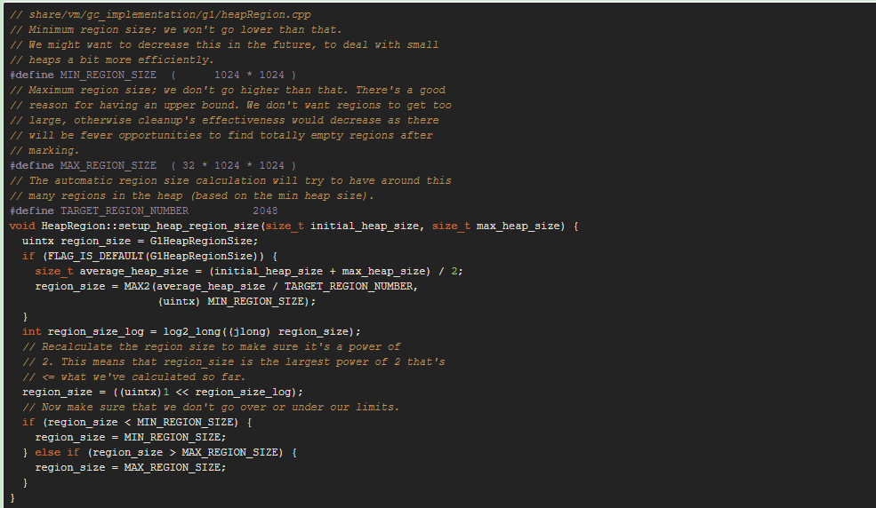
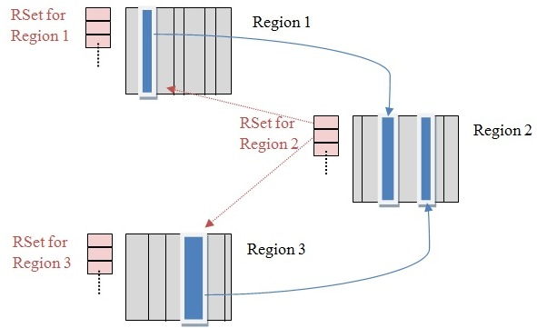
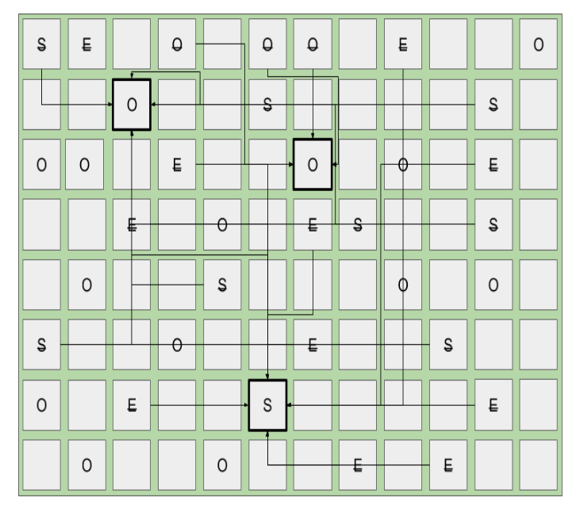
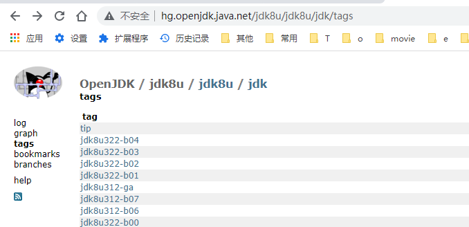
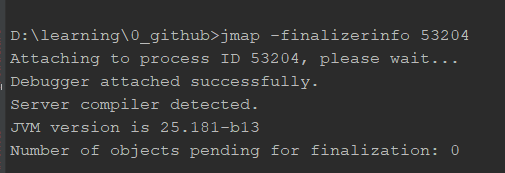

# JVM 总结


[TOC]


## 走进JVM

1. **HotSpot 是什么**

   Hotspot是一种JVM实现，由SUN公司开发。

   JVM还有BEA实现的JRockit，IBM的J9，后来BEA和SUN均被Oracle收购

2. **JDK 版本名称**

   从JDK 1.5开始，公开版本书写为JDK5，JDK6...，只有开发者版本才会使用1.5，1.6这种方式。

3. **JAVA的优点**

   * 结构严谨，面向对象
   * 相对安全的内存管理和访问机制
     * 相比于C语言，提供了内存动态分配，和垃圾收集技术。
   * 热点代码检测，运行时编译及优化

4. **JDK与JVM的关系**

   

   JDK主要包括包括以下三部分：

   * Java 程序设计语言
   * Java Virtual Machine
   * Java API 类库  包括Java SE API 和 Tools&Tools APIs。

   JRE主要包括以下部分：

   * Java SE API子集
   * Java Virtual Machine

5. Java SE 与 Java EE

   Java SE: 面向桌面级应用的平台，比如window程序，主要是Java 核心的API，即Java SE API。

   Java EE: 面向多层架构的企业应用(比如ERP，CRM)的平台，除了有Java SE API(包名为java开头，由于历史原因也有小部分以javax开头)，还有扩展API(通常包名以javax开头)。

6. JDK 主要版本历史

   1. 2004 年 JDK1.5发布，提供自动装箱，泛型，动态注解，枚举，可变长参数，foreach等特性，改进Java Memory Model (JMM)java 内存模型，提供concurrent并发包。

7. JVM 发展历史

   * Classic VM    JDK 1.3  前
   * Hotspot VM  JDK1.3
     * Hotspot VM 是Sun JDK和OpenJDK的默认虚拟机，使用范围最广。
     * 如其名，Hotspot指的就是其热点探测技术

8. 未来

   1. 模块化--[OSGi](https://www.ibm.com/docs/zh/radfws/9.6.1?topic=SSRTLW_9.6.1/com.ibm.aries.osgi.doc/topics/cosgi.htm)(面向Java的动态模块化规范，模块作为服务器的一部分来即插即用，而不是作为应用程序的一部分)

9. 64位虚拟机 指针膨胀

   64位虚拟机需要在内存上付出较大代价，原因在于指针膨胀以及数据类型对齐补白问题，比32位要额外增加10%到30%的内存消耗。

   解决方式：可以开启普通对象指针压缩功能，-XX:+ UseCompressedOops，但是不建议显式设置，建议由虚拟机的==Ergonomics==机制自动开启

10. OpenJDK vs Oracle JDK

    OpenJDK是sun的开源版本；Oracle是商业闭源版，包含比如从JRockit移植过来的Java Fligth Recorder等功能。


## 自动内存管理

### 虚拟机运行时数据区

1. 程序计数器 Program Counter Register

   * 内容：正在执行的字节码指令的地址
   * 线程私有
   * 唯一一个不会产生OOM的区域。

2. Java 虚拟机栈 Java Virtual Machine Stack 

   * 内容：Java方法栈帧

     * 栈帧里面存放**局部变量表**，**操作数栈**，**动态链接**，**方法出口**等信息。

       * 局部变量表：存放基本数据类型，对象引用，returnAddress类型(指向了一条字节码指令的地址)

         > 其中64bit的基本类型long和double占据两个局部变量空间（slot），其余均为1个。
         >
         > 局部变量表在编译之后就已经确定，方法运行时期不会改变局部变量表的大小。

   * 描述Java 方法执行的内存模型，每个方法在执行时都有一个栈帧，方法被调用和结束对应了入栈和出栈操作

   * 线程私有

   * 异常：

     * 如果线程请求的栈深度大于虚拟机允许的范围， 抛出StackOverflowError 异常
     * 大部分虚拟机都支持动态扩展虚拟机栈长度，如果拓展时无法申请到足够的内存，则抛出OutOfMemoryError

3. 本地方法栈 Native Method Stack

   * 内容：Native 方法栈帧
   * 有的虚拟机实现会把虚拟机栈与本地方法栈合而为一，比如SUN的Hotspot VM
   * 线程私有
   * 异常：StackOverflowError，OutOfMemoryError

4. 堆 Heap

   * 内容：对象实例和数组

     > 并不是所有的对象都在堆里面，由于JIT编译器的发展和逃逸技术的组件成熟，栈上分配，标量替换优化技术，已经不是绝对的了。

   * 线程共享

   * 细分：

     * 按分代：
       * 新生代
         * Eden
         * survivor1
         * survivor2
       * 老年代
     * 按内存分配
       * 线程共享的堆可能划分出多个线程==私有==的**分配缓冲区** TLAB(Thread Local Allocation Buffer)

   * 异常：OutOfMemoryError

5. 方法区 Method Area

   * 内容：已被虚拟机加载的类信息(类名，修饰符，字段描述，方法描述)，常量，静态变量，即时编译器编译后的代码

   * 线程共享

   * 在JDK 8前被称为永久区(Permanent Generation)，其实不严谨。只是Hotsopt虚拟机将分代收集机制拓展到方法区而已，使得Hotspot的垃圾收集器可以像管理堆那样来管理方法区，省去了单独为方法区编写内存管理代码的工作。

     > 实际上的表现也证明这种设计不合理，
     >
     > * 其一，方法区很容易溢出，因为永久代有大小上限(-XX: MaxPermSize，而其他虚拟机实现比如JRockit没有限制(只要没有超过进程可用内存)，而且有极少数方法(比如]String.intern()](https://stackoverflow.com/questions/10578984/what-is-java-string-interning)方法会将内容相同的字符串引用指向到同一个对象)会导致不同虚拟机有不同的实现。
     >
     >   在Hotspot中，从Jdk 1.7开始，String.intern后的对象不再放在方法区，而将整个字符串常量池放在heap中
     >
     > * 其二，方法区的垃圾收集行为是比较少出现的，需要回收的主要是针对常量池的回收和对类型的卸载。而且回收条件是非常苛刻的，比如类型卸载。但是回收也是有必要的。
     >
     > 从JDK8开始，使用元空间MetaSpace代替。

   * 异常：OutOfMemoryError

   * 细分：

     * 运行时常量池 Runtime Constant Pool

       * class文件除了有类的版本，字段，方法，接口等描述信息，还有一项信息是常量池（constant Pool Table）。常量池里面存放编译期生成的各种字面量和符号引用，这部分内容将在类加载后进入方法区的运行时常量池中保存。

         > 不同虚拟机实现时，除了保存class文件中描述的符号引用，还会将翻译出来的直接引用也存储在运行时常量池中。

       * 运行时常量池具有动态性，即运行时也可能将新的常量放入，比如使用String.intern。

         > 不过从JDK1.7开始，字符串常量池不在堆中而不是方法区中。

6. 直接内存 Direct Memory

   并不是虚拟机运行时数据区的一部分，也不是虚拟机规范中定义的区域。但也会导致OutOfMemoryError的出现。

   JDK1.4引入了NIO(NEW Input/Output)，可以用一种基于通道Channel和缓冲区Buffer的IO方式，可以使用Native方法直接分配堆外内存，通过一个存储在堆中的DirectByteBuffer对象作为这块内存的引用来进行操作。这样做的好处是避免了Java堆和Native堆中的数据来回复制数据。

   直接内存不受Java堆的限制，但是既然是内存，肯定会受到本机总内存大小和处理器寻址空间的限制。

   如果忽略了这部分内存，那么在动态扩展时可能会出现OutOfMemoryError。


### Hotspot中对象的分配，布局与访问

#### 对象的创建

1. 虚拟机接收到new指令，虚拟机到运行时常量池查找对应类的符号引用，检查该符号引用代表的类是否被加载，解析，初始化，如果没有，先执行类加载过程。

2. 虚拟机为新对象分配内存。对于使用带有整理算法的收集器的区域，一般会使用指针碰撞的方式分配，对于标记-清除算法的收集器的区域，一般使用空闲列表的方式。

   > 对象所需的内存在类加载后便可完全确定。
   >
   > * 内存分配如何保证并发安全？
   >   * 方式1：虚拟机采用CAS+失败重试的机制保证操作的原子性。
   >   * 方式2：利用本地线程分配缓冲 (Thread Local Allocation Buffer) TLAB。哪个线程需要分配内存，就在该线程的TLAB上分配，当TLAB用完需要分配新的TLAB时，才需要同步锁定。这种方式可通过-XX: +/- UseTLAB参数来指定
   >
   
3. 内存分配完后，虚拟机将分配到的内存空间都初始化为零值(不包括对象头)。这个步骤使得对象的实例字段还未赋予初始值就可以直接使用，程序可以访问到这个对象这些字段的数据类型对应的零值。

   > 如果采用TLAB，可以提前到TLAB分配时进行。

4. 虚拟机对对象进行必要的设置，主要是对象头(Object Header)。比如该对象是哪个类的实例，如何才能找到类的元数据信息，对象的哈希吗，对象的GC分代年龄等信息。

   > 虚拟机当前的运行状态不同，对对象头的设置也会不同，比如是否启用偏向锁。

   > 从虚拟机的角度，上面的工作完成，一个新的对象已经产生了，但是从程序的角度，该对象才刚刚开始，<init>方法还没执行，所有字段都是零值。

5. 执行<init>方法，初始化对象。


#### 对象的内存布局

1. 对象头Header

   * 对象自身的运行时数据--Mark Word

     包括hashcode，GC分代年龄，锁状态标志，线程持有的锁，偏向线程ID，偏向时间戳等。

     32和64位虚拟机分别使用32位和64位固定长度的空间的bitmap结构记录。

     这些数据已经超过了32位或者64位，但是为了空间效率，对象处于不同的状态，Mark word中的数据是不同的。

     | 存储内容 29位                       | 标志位 2位(还有1位固定为0) | 状态             |
     | ----------------------------------- | -------------------------- | ---------------- |
     | 对象HashCode，对象分代年龄          | 01                         | 未锁定状态       |
     | 指向锁记录的指针                    | 00                         | 轻量级锁定       |
     | 指向重量级锁的指针                  | 10                         | 膨胀(重量级锁定) |
     | 空，不需要记录信息                  | 11                         | GC标记           |
     | 偏向线程ID,偏向时间戳，对象分代年龄 | 01                         | 可偏向           |

   * 类型指针

     指向该对象的类元数据的指针。虚拟机通过该指针判断是哪个类的实例。

     > 并不是所有的虚拟机实现都在对象数据上记录类型指针。也就是说查找对象的类元数据并不一定要经过对象本身。

   * 数组长度

     如果该对象是数组，对象头会记录数组长度。

2. 实例数据Instance Data

   对象各字段的内容。

   该部分的存储顺序遵循以下分配策略：

   1. 相同宽度的子弹分配到一起longs/doubles, ints, shorts/chars, byte/booleans, oops(Ordinary Object pointers)
   2. 父类的变量在子类之前
   3. 如果开启CompactField，子类中较窄的变量可能插入父类变量之中。

3. 对齐填充 Padding

​		起占位作用。Hotspot VM的自动内存管理系统要求对象的起始地址必须是8字节的整数倍。因此对象的大小也必须是8字节的整数倍。==**所以一个对象至少是8字节。**==


#### 对象的访问定位

java程序通过栈上的reference数据操作堆上的对象。

reference类型在虚拟机规范中只规定一个指向对象的引用，不一定是一个具体的地址，对象的寻址取决于虚拟机的实现。

有以下两种方式：

* 句柄

  java堆中划分出一块内存作为句柄池，reference中存储的是对象的句柄地址，句柄中存放了对象实例数据和类型数据的具体地址。

  > 好处是对象被移动时(GC时)，只需要修改句柄里面的具体地址，reference不需要修改。

* 直接指针

  reference中存储的是对象的实例数据的具体地址，对象的实例数据中存储了对象类型数据的指针。

  > 如果采用这种方式，对象头中就必须有类型指针。
  >
  > 好处是直接访问，速度更快。对象的访问时非常频繁的，可以节省非常可观的成本。
  >
  > Sun Hotspot采用这种方式。

​	


### OutOfMemoryError

#### 堆溢出 排查方法论

1. 重现：减少堆大小-Xms -Xmx，不断创建对象，并保证GC Roots到对象之间有可达的路径，避免垃圾回收机制清除对象。java.lang.OutOfMemoryError: Java heap space
2. 获取堆转储快照：可添加参数-XX:+HeapDumpOnOutOfMemoryError
3. 通过内存映像工具，比如Eclipse Memory Analyzer
   * 判断是内存泄漏还是内存溢出：如果大量对象是不需要的，很可能是对内存泄漏了。
   * 如果是内存泄漏，可查看泄漏对象到GC Roots的引用链，了解泄漏对象是通过什么路径与GC Roots相关联导致无法回收的。
   * 如果是内存溢出，在配置上调大堆内存，在代码上检查对象的生命周期是否过长，持有状态时间过长。


#### 虚拟机栈与本地方法栈溢出

在Hotspot中不区分这两个，栈容量由-Xss来指定。

* StackOverflowError：当栈深度大于虚拟机所允许的最大深度

  1. 重现：减少栈帧容量-Xss，构建死循环或者死递归；或者定义大量的局部变量。
  2. 异常：java.lang.StackOverflowError
  2. 加大栈帧或者检查代码

* OutOfMemoryError:   当虚拟机在拓展栈时无法申请到足够的内的空间

  1. 重现：增大栈帧容量-Xss，不断创建线程。
  2. 异常：java.lang.OutOfMemoryError: unable to create new native thread
  2. 减小栈帧或者减少堆内存，使得栈空间足够。


#### 方法区与运行时常量池

由于JDK1.7开始，字符串常量池在堆中，所以使用string.intern试图增大字符串常量池是不能导致方法区或者运行时常量池OOM的。方法区容量指定 -XX: PermSize=10M -XX: MaxPermSize=10M

1. 重现：运行时产生大量类去填满方法区，可通过jdk proxy或者cglib产生动态类。

   > 像spring，hibernate对类进行增强时都会使用到CGlib操作字节码生成动态类，另外基于JVM的动态语言，比如Groovy通常会持续地创建类来实现语言的动态性，还有大量JSP或者动态产生JSP的引用。（JSP会在运行时编译为Servlet），以及基于OSGI的应用，同一个类文件，被不同的加载器加载也视为不同的类。
   >
   > 一个类要被垃圾收集器回收掉，判定条件比较苛刻，在经常动态生成大量Class的引用，需要特别注意类的回收状况。
   
2. 异常：java.lang.OutOfMemoryError: PermGen space

2. 检查类加载情况，类加载数量等。


#### 直接内存溢出

直接内存容量由-XX: MaxDirectMemorySize指定，如果没有指定，则默认与堆最大值(-Xmx)一致.

1. 重现：通过DirectByteBuffer分配内存或者通过Unsafe单例对象的allocateMemory()来分配。

   > 通过DirectByteBuffer分配虽然也可以触发OOM，但是实际上的分配动作没有执行，只是通过计算得到内存无法分配，如果通过Unsafe来分配，就是真正在分配内存。
   >
   > Unsafe的getUnsafe()方法限制了只有引导类加载器加载的类才会返回，否则抛出SecurityException

   ```java
       @CallerSensitive
       public static Unsafe getUnsafe() {
           Class var0 = Reflection.getCallerClass();
           if (!VM.isSystemDomainLoader(var0.getClassLoader())) {
               throw new SecurityException("Unsafe");
           } else {
               return theUnsafe;
           }
       }
   ```

2. 异常：java.lang.OutOfMemory

   > 直接内存的溢出的有以下特点：
   >
   > 1. OOM后面没有说明什么区域发生了OOM
   > 2. HeapDump文件没有明显的异常
   > 3. HeapDump文件可能比较小

3. 加大直接内存配置或者检查NIO代码使用是否发生了泄漏


## 垃圾收集器与内存分配策略

自动内存管理包括两部分内容：内存分配策略与垃圾收集器。

垃圾收集GC需要考虑以下3个问题：

* what：哪些需要回收
* when：什么时候回收
* how：如何回收

#### 哪些需要回收

程序计数器，虚拟机栈，本地方法栈均是线程私有的，生命周期随线程

> 也就是说1个线程对应了一块区域作为虚拟机栈来使用，该区域存放该线程执行的方法的栈帧，方法的进入和退出对应着栈帧的压栈和出栈操作。
>
> 每一个栈帧分配多少内存是在类确定之后就可以得知的，因此可以认为是编译器可知的(尽管运行时期JIT编译器会进行一些优化，这里不考虑)。
>
> 也就是说这些内存区域的分配和回收都具备确定性，方法结束或者线程结束，自然就会回收。

堆和方法区是线程共享的，哪些类需要加载，哪些对象需要创建，都是运行时才可以确定的。一个接口的多个实现类需要的内存，一个方法的多个分支需要的内存也不一定相同。所以这两个区域是需要动态分配和回收内存。


### 什么时候回收--对象已死

对象已死的意思是以后再也不会用到这个对象了。

**如何判断对象已死？**

* 引用计数算法 Reference Counting：对象被引用，计数器+1；引用失效，计数器-1.

  致命缺点：无法回收相互循环引用的对象

* **可达性分析算法** Reachability Analysis

  大部分语言采用的是这种。

  通过以一系列**GC Roots** 对象对象为起始点开始，沿着引用链Reference Chain进行搜索。如果GC Roots到这个对象不可达，则说明这个对象不可用，判定为可以回收的对象。

**5种GC Roots**

包括：分别是方法区中静态的引用和栈中的动态引用

1. 虚拟机栈(栈帧中本地变量表，也是局部变量表)中引用的对象
2. 本地方法栈JNI(即Native方法)中引用的对象
3. 方法区静态属性引用的字段
4. 方法区常量引用的字段
4. classLoader也是一种GC Roots
4. Code Cache中的也是GC Roots，叫做Code Root

**4种引用类型：**


> 构造器中可以注册引用队列，如果指定了，在回收前会先加入这个引用队列

引用强度依次递减

* 强引用 Strong Reference/Final Reference

  类似Object obj = new Object()这种属于强引用，不会被垃圾收集器所回收。

* 软引用 Soft Reference

  描述非必需对象被引用，即将发生OOM时被回收，使用SoftReference实现(objA -> softReference -> objB)

* 弱引用 Weak Reference

  描述非必需对象被引用，下一次GC时被回收，使用WeakReference实现

  缓存一般使用的弱引用 Weak Reference

  ```java
  /**
   * CacheKey containing a weakly referenced {@code key}. It registers
   * itself with the {@code refQueue} so that it can be used to expunge
   * the entry when the {@link WeakReference} is cleared.
   */
  private static final class CacheKey<K> extends WeakReference<K> {
   	// a replacement for null keys
  	private static final Object NULL_KEY = new Object();
  }
  ```

* 虚引用 Phantom Reference

  描述幽灵对象被引用，不能通过引用来获取该对象，该对象是否有其他对象对其持有虚引用，与该对象的生存时间没有影响。

  虚引用的唯一目的是能在即将被回收时获取到该通知。

  > 当这个对象只剩下虚引用的时候会入队(不会马上被回收，还需要清除剩下的虚引用或者本身已经不可达了)。通过判断是否已经入队，就可以知道是否即将会被回收。

  使用PhantomReference实现。

**真正宣告死亡**--**两次标记过程**

* 第一次标记：GC Roots 到该对象不可达

  标记完后会进行筛选，如果对象未覆盖finalize()方法或者已经执行过finalize()方法，则不会加入F-Queue中。

  > finalize()方法虚拟机只保证触发，但是不保证执行完，所以是不可靠的，只是一次死马当活马医的抢救措施。
  >
  > 不建议使用该方法，该方法运行代价高，不确定性大。
  >
  > GC 发生时，如果可回收对象重写了 `finalize()` 方法，则不会立即回收，而是放到 FinalizerQueue 中，反之则直接回收。
  >
  > 专门的 FinalizerThread 会从 FinalizerQueue 取出 finalizer，并执行 `finalize()` 方法。
  >
  > 下一次 GC 发生时，如果该对象与 GCRoots 存在引用链，则不会回收，否则不会再执行 `finalize()` 方法，而是直接回收。

* 第二次标记：在F-Queue中，再次进行可达性分析     

  ​                                                                                                                                                                                                                                                                                                                                                                                        


### 方法区的回收

永久代的垃圾收集主要回收两部分内容：无用的常量和无用的类

* 无用的常量：没有任何地方引用到这个常量

  包括字符串常量(JDK7开始已经在堆上面)，常量池中其他类(接口)、方法，字段的==符号引用==也与此类似。

* 无用的类：需要满足3个条件

  * 该类所有的实例已经被回收
  * 加载该类的classLoader已经被回收
  * 代码上没有任何地方可以引用该类的java.lang.Class对象(比如没有地方使用反射获取该类的Class对象)

  > 满足以上条件的无用类仅仅是可以回收，不一定就会回收。
  >
  > Hotspot提供了-Xnoclassgc进行控制，还可以使用-verbose:class，-XX:+TraceClassLoading, -XX:+TraceClassUnloading查看类的加载和卸载信息。
  >
  > 在大量使用反射，动态代理，CGlib等字节码框架、动态生成JSP(java server page)及OSGi这类频繁自定义ClassLoader的场景都需要虚拟机具备类卸载的功能，保证永久代不会溢出。


### 4种垃圾收集算法

#### 1. 标记-清除算法 Mark-Sweep

最基础的收集算法。

* 思想：先标记，然后清除可回收对象

* 缺点：

  * 时间效率低。标记和清除过程效率不高

  * 内存碎片问题。直接清除会产生大量的内存碎片，如果需要分配一个占用较大内存的对象，可能会触发多次的gc。

#### 2. 复制算法 Copying

* 思想：两块内存区域，每次仅使用一块，当该块用完之后，会将活着的对象复制到另外一块，然后该块的内存空间就相当于空闲了。

* 解决问题：内存碎片。可以直接按序分配内存。

* 代价：可用内存空间缩小。

* 应用：由于新生代对象的特点(“朝生夕死”)，应用于回收新生代的内存空间。

  * 新生代中98%对象都是“朝生夕死”的，完全不需要按照1:1的方式分配这两块内存，可以将新生代分为一个较大的Eden和两个较小的Survivor。回收的时候，将Eden和survivor中还存活的对象复制到另外一块survivor空间上，然后清理掉Eden和刚才的survivor(不会显式的清理)。

    > Hotspot中比例为8:1:1。这样“浪费”的空间就仅仅只有新生代的10%。
    >
    > 如果较小的survivor不够存放存活的对象，就需要分配担保机制Handle Promotion提供另外的区域进行存放，所以要缩小50%的损耗，需要额外的分配担保机制。

  

#### 3. 标记-整理算法 Mark-Compact

* 思想：先标记，然后将存活的对象都向一段移动，避免内存碎片的出现

* 解决问题：内存碎片问题，以及使用复制算法的空间使用率问题
* 代价：时间成本高
* 应用：由于老年代的特点(生存时间长，占用空间大)，可以应用于回收老年代的内存空间(不一定就是简单的使用这种算法)。

#### 4.分代收集算法

目前普遍采用这种方式，根据不同的分代采用不同的收集算法。

* 思想：根据对象存活周期的不同划分内存空间，然后对不同的内存空间采用最适当的收集算法。
  * 新生代：GC时一般会有大量的无用对象，只有少量存活，适合使用复制算法。
  * 老年代：对象的存活率高，没有额外的内存进行分配担保，适合使用标记-清除或者标记-整理算法。


### Hotspot的实现

Hotspot对于的**对象存活判定**和**垃圾收集**的算法实现如下：

#### 1. 枚举根节点---OopMap

在可达性分析中提到需要从GC Roots开始沿着引用链进行搜索。那么第一步就先要找到所有的GC Roots。

GC Roots在全局性的引用（常量或者静态变量）和执行上下文（栈帧中的本地变量表中），如果要对方法区和栈帧进行逐个检查，效率太低。

而且为了保证准确性，在枚举GC Roots的时候必须暂停所有的Java 执行线程(Stop The World)。

* 解决办法：采用准确式GC，通过一组OopMap维护所有的对象引用。
  * 类加载时，Hotspot将对象内什么偏移量是类型的数据计算出来
  * 编译时，会在特定的位置下记录栈和寄存器中那些位置是引用

这些OopMap中记录了那些地址上有普通对象指针的引用，GC时只需要枚举这些OopMap就可以准确快速找出GC Roots。

#### 2. 线程运行时进入GC----安全点 Safe Point

每一个指令都可能生成对应的OopMap，这个将需要大量的额外空间，增加GC成本。

Hotspot只在程序达到安全点(Safe Point)的时候才会生成OopMap。一般来说在方法调用、循环跳转，异常跳转等功能的指令才会产生Safe Point。

> 因为具有这些功能的指令可以让程序长时间执行，因为不能因为程序指令流过长就一直让它运行下去。

这同时也意味着程序不是什么地方都可以停顿下来进行GC，也是只有到达安全点才可以暂停。

那么GC时，如何让所有的线程（不包括执行JNI调用的线程）运行到安全点再停顿下来。有两种方式：

* 抢先式中断：需要GC时，中断所有的线程，如果不在安全点，放行到安全点。一般不采用。
* 主动式中断：需要GC时，设置一个标志，所有线程达到安全点时或者创建对象时轮询该标志，发现中断标志就挂起

总的来说，安全点保证了程序执行时，在不太长的时间内就会遇到可以进入GC的safe point。

#### 3.线程sleep/blocked时进入GC---安全区域 Safe Region

安全区域是指一段代码片段中，引用关系不会发生变化。所以在执行这段代码时，任何时候开始GC都是安全的。

线程执行到安全区域的代码时，会标识自己进入safe region，JVM要gc时，不用管这些线程。

线程要离开safe region时，需要等待可以安全离开的信号，因为可能正在枚举根节点或者正在进行GC需要停顿时。

#### 4. 7种垃圾收集器

垃圾收集器是垃圾收集算法的具体实现。不同厂商对垃圾收集器的实现有所不同。这里是Hotspot的实现。

Client模式下虚拟机的默认选项----Serial + Serial Old。

Server模式下虚拟机的默认选项---Parallel Scavenge+ParallelOld  也就是吞吐量优先收集器。

对于注重交互的，需求使用短停顿时间的收集器：包括常用的ParNew + CMS，以及后来的G1

> 通过-XX:+UseConcMarkSweepGC指定使用CMS时，默认已经通过-XX:+UseParNewGC指定使用ParNew作为新生代的收集器。


##### 4.1 Serial 收集器---复制算法

Client模式下虚拟机的默认选项----Serial + Serial Old。

单线程，全程停顿。


##### 4.2 ParNew收集器--复制算法

多线程并行，全程停顿。

> 这里是并行，而不是并发，因此只有在多核CPU的情况下才可能比Serial有优势。

Serial收集器的多线程版本。以下行为均与Serial相同。

* 控制参数：-XX:SurvivorRatio、-XX:PretenureSizeThreshold、-XX:HandlePromotionFailure
* 收集算法
* Stop the world
* 对象分配规则
* 回收策略


 **只有Serial和ParNew可以和CMS配合使用**。

> 当使用参数-XX:+UseConcMarkSweepGC开启老年代的CMS收集器时，默认新生代使用的是ParNew。
>
> 也可以使用-XX:+UseParNewGC强制指定。

ParNew收集器默认开始的线程数量与CPU的数量相同，在现在的机器中CPU核数很多，特别是云原生时代，这样一个容器中开启的GC线程就会很多，需要进行限制一下。通过指定-XX:ParallelGCThreads参数限制垃圾回收的线程数。

> 通常说的并行收集器是指多条垃圾收集线程并行工作，用户线程处于等待状态
>
> 并发收集器是指用户线程和垃圾收集线程同时工作，不一定是并行，用户线程也在继续运行。


##### 4.3 Parallel Scavenge 收集器--复制算法

JDK1.4 引入。不能与CMS(Concurrent Mark Sweep)收集器配合工作。

多线程并行，全程停顿。

目的是达到可控制的吞吐量（Throughput=CPU运行用户代码时间 / CPU总运行时间）。

> 停顿时间段意味着响应速度快，用户体验好。--适合用于交互的程序
>
> 但是如果停顿次数增多，那么用于垃圾收集的时间也会增多，吞吐量会下降。
>
> 而吞吐量高意味着CPU利用效率高，能更多的完成程序的工作。---适合用户后台运算，没有过多交互的工作。

相关参数：

* 如何控制吞吐量：-**XX:MaxGCPauseMillis和 -XX:GCTimeRatio**

  * -XX:MaxGCPauseMillis 收集器尽可能保证回收花费时间不超过该值。

    > 该值设置得小，需要牺牲吞吐量和新生代内存空间来换取。
    >
    > 比如新生代3000M，为了尽量保证停顿时间，每次只回收500M区域，时间是短了，但是次数增多了，吞吐量就降下来了（每次都需要存活判断，总时间肯定要更多）

  * -XX:GCTimeRatio 用户程序运行时间与GC时间的比例。

    > 设置为19意味着吞吐量为19/（1+19） = 95%。
    >
    > 默认值是99，意味着只有1/(1+99)=1%的时间用于垃圾回收。

* 使用**GC的自适应调整策略**(GC Ergonomics)：-XX:+UseAdaptiveSizePolicy

  打开该开关，不需要手工指定以下内容：

  * -Xmn 新生代大小
  * -XX:SurvivorRatio  Eden与Survivor的比例
  * -XX:PretenureSizeThreshold 晋升老年代的大小

  利用自适应调整策略只需要设置-Xmx 堆大小，-XX:MaxGCPauseMillis， -XX:GCTimeRatio其他具体参数细节可以交给Parallel Scavenge收集器动态调整。
  
  其中可以对以下参数进行设置：
  
  * InitialSurvivorRatio  【针对吞吐量优先收集器】吞吐量优先收集器会默认开启自适应大小策略，survivor的大小是动态变化的，最小值是该值
  
    
  
  


##### 4.4 Serial Old 收集器--标记整理算法

Serial的老年代版本。

Client模式下的默认收集器。

Server模式下，作为CMS收集器的后备预案(在并发收集发生Concurrent Mode Failure时)，或者搭配Parallel Scavenge收集器。

单线程，全程停顿。


##### 4.5 Parallel Old收集器---标记整理算法

JDK1.6引入。Parallel Scavenge的老年代版本。

多线程并行，全程停顿。


> 此前只能Parallel Scavenge只能搭配Serial Old，受Serial Old的拖累，整体吞吐量未必比ParNew+CMS组合。
>
> 在注重吞吐量和CPU资源敏感的场合，可以优先考虑Parallel Scavenge+Parallel Old组合。
>
> 因为是全程停顿，不会在用户线程执行的时候占用CPU，即时在CPU资源紧缺比如只有两核的情况下，不会对导致用户线程变慢，所以说Parallel Scavenge对CPU资源是不敏感的。


##### 4.6 CMS(Concurrent Mark Sweep) 收集器--标记清除算法

JDK 1.5引入，第一个真正意义的并发收集器，用户线程和gc线程同时工作。

多线程并发，部分停顿。

目的是获取最短停顿时间，提高用户体验。

手段是通过细分标记过程，将不需要STW的部分采用并发处理。

**4个运行步骤**：

* 初始标记（initial mark）---**stop the world**  单线程

  标记GC Roots直接关联的对象

* 并发标记（concurrent mark）

  进行GC Roots Tracing

* 重新标记（remark）-**-stop the world**   可并行执行

  修正由于并发标记过程中用户程序继续运作导致标记产生变动的部分。

* 并发清除（concurrent sweep）

并发标记和并发清除耗时最长，所以总体来看CMS收集器的内存回收过程是和用户线程一起并发执行的。


**3个主要缺点**

* CPU资源敏感

  CMS默认的并发线程数是(CPU数量 + 3) / 4。在并发标记和并发清除过程中，会占用CPU资源，CPU核数越小，占用的比例就越大，当CPU只有两核时，高达50%。导致用户程序变慢，总的吞吐量会下降。

* 无法处理浮动垃圾(Floating Garbage)，可能出现“**Concurrent Mode Failure”**而导致**另**一次FullGC的产生。

  浮动垃圾是在CMS在用户线程和GC线程并发执行过程产生的新垃圾。这些垃圾只能在下一次GC才会清理。

  由于垃圾收集阶段用户线程还在运行，就需要预留足够的空间给用户线程，所以CMS必须在老年代还没满的时候就要开始，JDK6以后，CMS收集启动的阈值是92%。

  > 通过-XX:CMSInitiatingOccupancyFraction  设置阈值。

  如果CMS运行期间预留的内存无法满足程序需要，就会出现一次“Concurrent Mode Failure”，表示并发模式失败，然后启用备用方案--Serial Old收集器重新进行老年代的收集（这是另外一次FullGC，停顿时间比较长）

* 内存碎片。这时标记-清除算法的缺点。当无法为大对象分配内存空间时，会提前触发一次FullGC。

  为了解决这个问题，CMS默认开启了-XX:+UseCMSCompactAtFullCollection开关，用于在CMS即将触发FullGC时开启内存碎片的合并整理过程。这个合并整理过程是无法并发的，所以会STW，时间换取空间。

  另外还提供了一个-XX:+CMSFullGCBeforeCompact，用于设置执行多少次不压缩的FullGC(这时狭义上的Full GC 只会收集old区)之后，之后进行一次带压缩的(真正意义的FullGC, 针对全堆）。默认值是0，表示每次进入FullGC时都会进行碎片整理（真正意义的FullGC）。

**相关参数**


##### 4.7 G1(Garbage First)收集器----整体上标记-整理算法，局部上复制算法

JDK7开始可以商用。

目的是在不牺牲吞吐量的基础上，实现一个可预测停顿时间，。

> 一个通用的规则是允许的停顿时间越长，吞吐量越大，延迟也会越大。

与其他收集器，比如CMS相比，特点如下：

* 内存整合：从整体上是基于标记-整理，从局部(region之间)看是基于复制算法。不会因为碎片问题提前触发FullGC。
* **可预测的停顿**：G1与CMS同样追求短停顿时间，G1还可以对停顿时间进行预测。在一个长度为M毫秒的时间片内，消耗在垃圾收集的时间不得超过N毫秒。

**关键概念**

1. ###### 内存布局：化整为零

   整个堆划分为大小相等的Region，逻辑上保留新生代，老年代的概念，它们只是一部分Region的集合（不一定连续）。

   

   > H表示Humongous。大于等于region一半的对象的处理如下：
   >
   > * 直接发配到Old region，避免反复拷贝移动
   > * 在global concurrent marking阶段或者Full GC阶段进行清理
   > * 分配之前先检查是否超过IHOP(Initiating Heap Occupancy Percent)和the marking threshold，如果超过就会启动global concurrent marking，目的是提早回收，避免evacuation failure和Full GC。==在[redhat的博客](https://www.redhat.com/en/blog/part-1-introduction-g1-garbage-collector)中, 只要有Humongous Allocation就会有一次concurrent marking==，应该是不对的。经过验证，在8u261版中，不是每次巨大对象分配都会触发global concurrent marking，还是要超过IHOP。
   >
   > 因此如果发生了过多的Humongous Allocation，需要考虑增大region

   

   

2. ###### SATB 

   Snapshot-At-The-Begining   是GC开始时，活着的对象的快照，**通过Root Tracing得到，维持并发GC的正确性**。

   根据三色标记算法，对象存在3种状态，

   * 白色：对象没有被标记，会被当做垃圾处理
   * 灰色：对象被标记了，但是它的字段field还没有被标记完
   * 黑色：对象被标记了，其field也被标记了

   当Mutator线程(泛指除了垃圾收集器外的部分，可以理解为应用程序)和Collector线程同时对对象进行修改，就可能出现白色对象遗漏标记或者错误回收的情况，具体位：

   * Mutator赋予一个黑色对象该白色对象的引用
   * Mutator删除了所有灰色到该白色对象的直接或者间接引用

   对于第一种情况，通过TAMS（Top-At-Mark-Start）来解决。Region中有两个TAMS指针，Previous-TAMS和Next-TAMS。在TAMS之上的对象是新分配的，这时一种隐式的标记。

   > 具体过程是这样的：https://www.jianshu.com/p/9e70097807ba

   对于第二种情况，SATB会进行更新，一个对象的引用被替换时，通过write barrier将旧引用记录下来。

   但这也会导致一个副作用--浮动垃圾Float garbage，因为如果Mutator替换的那个白色对象就是要被收集的垃圾，这次的标记就会让它躲过GC。


3. ###### Remember Set 

    是一种空间换时间的辅助GC过程的数据结构，类似与Card Table，用于解决跨region应用的问题。在GC时，对于跨region引用的情况，只需要扫描CSet中region对应的RSet即可，避免扫描其他Region。

   RSet记录了**其他region中的对象引用本region中对象的关系**，属于points-into结构(谁引用了我的对象)。

   而CardTable则是points-out（我引用了谁的对象）的结构。每一个card 覆盖一定范围的Heap（一般为512Bytes）。G1的RSet是在CardTable的基础上实现的，RSet实际上是一个Hash Table，key是别的region的起始地址，value是一个集合（元素是Card Table的Index）。

   

   Region被分为多个Card，在不同region中的card会相互引用，图中蓝色的表示的是points-out的关系，即region1中的card引用了region2中的card。红色表示points-to关系，即在region2的RSet中，记录了region1中的card。

   Region的RSet中的关系是通过Post-Write barrier （后置的写屏障）和 concurrent  refinement thread来维护。Post-Write barrier 将被引用到的card标记为dirty，将变化记录到log buffer或者dirty card queue中，一旦缓冲满了，写屏障停止服务，由concurrent refinement threads处理缓冲日志（Update RSet）。伪代码如下：

   

   RSet在GC中是如何辅助的？在YGC时，只需要选定Young region的RSet作为根集，这些RSet记录了old->young的跨代引用，避免扫描整个old generation。在Mixed GC时，old generation中记录了Old->Old的RSet，young->old的引用由扫描全部young region得到 (wufc:young gc时可以根据young中的对象进行追踪)，也不用扫描全部的old region。

   

4. ###### Collection Set

    记录了GC要收集的Region集合，里面可以是任意年代的。

   

5. ###### 停顿预测模型 Pause Prediction Model

   G1使用停顿预测模型来满足用户自定义的停顿时间，根据这个目标去选择合适数量的region去收集。

   G1是一个停顿事件优先的GC算法，与CMS最大的不同在于用户可以设定整个GC的期望停顿时间(**-XX:MaxGCPauseMillis**，默认200ms，但这只是一个期望值，是一种软目标)

   为了达到用户定义的软目标，G1使用了停顿预测模型，这个停顿模型是以**衰减标准偏差**为理论基础实现的。

   ```c++
   //  share/vm/gc_implementation/g1/g1CollectorPolicy.hpp
   double get_new_prediction(TruncatedSeq* seq) {
       return MAX2(seq->davg() + sigma() * seq->dsd(),
                   seq->davg() * confidence_factor(seq->num()));
   }
   ```

   G1对每一个可测量的步骤花费的时间都会计算衰减值，衰减变量，衰减标准偏差，的到这个步骤的预测花费时间，然后根据这次需要处理的操作次数，对整体的时间进行估算。最终的耗时对下一次的预测有影响。
   
   G1根据这个模型计算出来的历史数据来预测本次收集需要选择的region数量，尽量满足用户设定的目标停顿时间。


**GC过程**    

> **young gc**  
>
> **concurrent marking    <==  1.超过了IHOP  默认45%  老年代和巨大对象空间占比达到这个阈值；2. 预留空间（给evacuation或者promotion）不足了**
>
> **mixed GC <===   concurrent marking时，将存活对象比例小于85%的old region收集起来，如果这些region集合中的可回收比例 达到 G1Heap waste percent 默认5%**
>
> ​				**mixed gc 会根据可预测停顿模型，每次选取最具回收空间的8个来疏散空间（采用复制算法），之后继续评估是否可回收比例仍然满足，如果满足，继续cycle**
>
> **Full GC   --退化为类似serial old收集器的单线程回收操作。**
>
> ​		**比如触发到了to space exhausted事件，对无法分配region来执行疏散**
>
> ​		**或者是在concurrent marking阶段发生了full gc，类似CMS的concurrent mode failure**

G1提供了两种GC模式，两种都是Stop The World。

* Young GC：

  选定所有Young Regions，通过控制Young Regions的数量，即新生代的内存比例，来控制GC的开销

* Mixed GC

  选定所有的Young Regions，加上根据Concurrent Marking统计得到的若干Old Regions，在用户指定的开销范围内选择收益（GC efficiency）高的进行回收。

  Mixed GC不是Full GC ，因为只回收部分Old Regions。如果Mixed GC实在跟不上程序分配的速度，导致老年代填满无法继续进行Mixed GC（也就是说Mixed GC进行不下去了），就会使用Serial Old收集器进行串行Full GC，目标是整个堆。

  * 触发条件：G1HeapWastePercent

    在gloabl concurrent marking结束之后，G1会计算所有Old Region中可回收的空间的比例，如果达到阈值，就会触发Mixed GC

  * 选择哪些Old Region进入CSet：G1MixedGCLiveThresholdPercent

    一个Old Region只有在存活对象比例低于该阈值，才有可能被加入到CSet

  * 选择多少个进入CSet：G1OldCSetRegionThresholdPercent

    一次Mixed GC能被选入CSet的最多Old Generation region数量

  

**Concurrent Marking**

其执行过程类似与CMS，但不同的是，在G1 GC中，concurrent marking主要是为了Mixed GC提供标记服务的，并不是一次GC过程的一个必须环节。global concurrent marking 分为四个步骤：

* 初始标记 initail mark  STW    

  标记了从GC Roots开始直接可达的对象

  * 共用了Young GC的暂停，因为可以复用root scan。

    > 因此可以说gloabl concurrent marking是伴随着Young GC进行的。

* 并发标记 concurrent marking   

  从GC Root开始进行对堆中的对象标记，与应用程序线程并行执行，并且收集各个region的存活对象的信息

  > 这一阶段是针对全堆的存活对象进行标记。

* 最终标记 remark  STW   

  标记那些在并发阶段发生变化的对象

* 清除垃圾（Clean up） 

  清除空Region

  >  注意是没有存活对象的region，并不会进行evacuation
  >
  >  这个过程也是STW的
  >
  >  Evacuation是后面如果满足条件时Mixed GC做的事情

Current Marking是基于SATB的。


**GC日志**

Young GC

```
{Heap before GC invocations=12 (full 1):
 garbage-first heap   total 3145728K, used 336645K [0x0000000700000000, 0x00000007c0000000, 0x00000007c0000000)
  region size 1024K, 172 young (176128K), 13 survivors (13312K)
 Metaspace       used 29944K, capacity 30196K, committed 30464K, reserved 1077248K
  class space    used 3391K, capacity 3480K, committed 3584K, reserved 1048576K
2014-11-14T17:57:23.654+0800: 27.884: [GC pause (G1 Evacuation Pause) (young)
Desired survivor size 11534336 bytes, new threshold 15 (max 15)
- age   1:    5011600 bytes,    5011600 total
 27.884: [G1Ergonomics (CSet Construction) start choosing CSet, _pending_cards: 1461, predicted base time: 35.25 ms, remaining time: 64.75 ms, target pause time: 100.00 ms]
 27.884: [G1Ergonomics (CSet Construction) add young regions to CSet, eden: 159 regions, survivors: 13 regions, predicted young region time: 44.09 ms]
 27.884: [G1Ergonomics (CSet Construction) finish choosing CSet, eden: 159 regions, survivors: 13 regions, old: 0 regions, predicted pause time: 79.34 ms, target pause time: 100.00 ms]
, 0.0158389 secs]
   [Parallel Time: 8.1 ms, GC Workers: 4]
      [GC Worker Start (ms): Min: 27884.5, Avg: 27884.5, Max: 27884.5, Diff: 0.1]
      [Ext Root Scanning (ms): Min: 0.4, Avg: 0.8, Max: 1.2, Diff: 0.8, Sum: 3.1]
      [Update RS (ms): Min: 0.0, Avg: 0.3, Max: 0.6, Diff: 0.6, Sum: 1.4]
         [Processed Buffers: Min: 0, Avg: 2.8, Max: 5, Diff: 5, Sum: 11]
      [Scan RS (ms): Min: 0.0, Avg: 0.1, Max: 0.1, Diff: 0.1, Sum: 0.3]
      [Code Root Scanning (ms): Min: 0.0, Avg: 0.1, Max: 0.2, Diff: 0.2, Sum: 0.6]
      [Object Copy (ms): Min: 4.9, Avg: 5.1, Max: 5.2, Diff: 0.3, Sum: 20.4]
      [Termination (ms): Min: 0.0, Avg: 0.0, Max: 0.0, Diff: 0.0, Sum: 0.0]
      [GC Worker Other (ms): Min: 0.0, Avg: 0.4, Max: 1.3, Diff: 1.3, Sum: 1.4]
      [GC Worker Total (ms): Min: 6.4, Avg: 6.8, Max: 7.8, Diff: 1.4, Sum: 27.2]
      [GC Worker End (ms): Min: 27891.0, Avg: 27891.3, Max: 27892.3, Diff: 1.3]
   [Code Root Fixup: 0.5 ms]
   [Code Root Migration: 1.3 ms]
   [Code Root Purge: 0.0 ms]
   [Clear CT: 0.2 ms]
   [Other: 5.8 ms]
      [Choose CSet: 0.0 ms]
      [Ref Proc: 5.0 ms]
      [Ref Enq: 0.1 ms]
      [Redirty Cards: 0.0 ms]
      [Free CSet: 0.2 ms]
   [Eden: 159.0M(159.0M)->0.0B(301.0M) Survivors: 13.0M->11.0M Heap: 328.8M(3072.0M)->167.3M(3072.0M)]
Heap after GC invocations=13 (full 1):
 garbage-first heap   total 3145728K, used 171269K [0x0000000700000000, 0x00000007c0000000, 0x00000007c0000000)
  region size 1024K, 11 young (11264K), 11 survivors (11264K)
 Metaspace       used 29944K, capacity 30196K, committed 30464K, reserved 1077248K
  class space    used 3391K, capacity 3480K, committed 3584K, reserved 1048576K
}
 [Times: user=0.05 sys=0.01, real=0.02 secs]
```

要点：

* MetaSpace 之所以有commited和reserved，是因为没有设置MetaspaceSize和MaxMetaspaceSize相等。


Global Concurrent Marking 

```shell
# 由humongous allocation导致old region中已使用 + 请求的占比超过阈值，所以触发了Concurrent marking
66955.252: [G1Ergonomics (Concurrent Cycles) request concurrent cycle initiation, reason: occupancy higher than threshold, occupancy: 1449132032 bytes, allocation request: 579608 bytes, threshold: 1449
551430 bytes (45.00 %), source: concurrent humongous allocation]
2014-12-10T11:13:09.532+0800: 66955.252: Application time: 2.5750418 seconds
 66955.259: [G1Ergonomics (Concurrent Cycles) request concurrent cycle initiation, reason: requested by GC cause, GC cause: G1 Humongous Allocation]
{Heap before GC invocations=1874 (full 4):
 garbage-first heap   total 3145728K, used 1281786K [0x0000000700000000, 0x00000007c0000000, 0x00000007c0000000)
  region size 1024K, 171 young (175104K), 27 survivors (27648K)
 Metaspace       used 116681K, capacity 137645K, committed 137984K, reserved 1171456K
  class space    used 13082K, capacity 16290K, committed 16384K, reserved 1048576K
  # intial-mark伴随一次young gc进行
 66955.259: [G1Ergonomics (Concurrent Cycles) initiate concurrent cycle, reason: concurrent cycle initiation requested]
2014-12-10T11:13:09.539+0800: 66955.259: [GC pause (G1 Humongous Allocation) (young) (initial-mark)
…….
2014-12-10T11:13:09.597+0800: 66955.317: [GC concurrent-root-region-scan-start]
2014-12-10T11:13:09.597+0800: 66955.318: Total time for which application threads were stopped: 0.0655753 seconds
2014-12-10T11:13:09.610+0800: 66955.330: Application time: 0.0127071 seconds
2014-12-10T11:13:09.614+0800: 66955.335: Total time for which application threads were stopped: 0.0043882 seconds
2014-12-10T11:13:09.625+0800: 66955.346: [GC concurrent-root-region-scan-end, 0.0281351 secs]
2014-12-10T11:13:09.625+0800: 66955.346: [GC concurrent-mark-start]
2014-12-10T11:13:09.645+0800: 66955.365: Application time: 0.0306801 seconds
2014-12-10T11:13:09.651+0800: 66955.371: Total time for which application threads were stopped: 0.0061326 seconds
2014-12-10T11:13:10.212+0800: 66955.933: [GC concurrent-mark-end, 0.5871129 secs]
2014-12-10T11:13:10.212+0800: 66955.933: Application time: 0.5613792 seconds
2014-12-10T11:13:10.215+0800: 66955.935: [GC remark 66955.936: [GC ref-proc, 0.0235275 secs], 0.0320865 secs]
 [Times: user=0.05 sys=0.00, real=0.03 secs]
2014-12-10T11:13:10.247+0800: 66955.968: Total time for which application threads were stopped: 0.0350098 seconds
2014-12-10T11:13:10.248+0800: 66955.968: Application time: 0.0001691 seconds
2014-12-10T11:13:10.250+0800: 66955.970: [GC cleanup 1178M->632M(3072M), 0.0060632 secs]
 [Times: user=0.02 sys=0.00, real=0.01 secs]
2014-12-10T11:13:10.256+0800: 66955.977: Total time for which application threads were stopped: 0.0088462 seconds
2014-12-10T11:13:10.257+0800: 66955.977: [GC concurrent-cleanup-start]
2014-12-10T11:13:10.259+0800: 66955.979: [GC concurrent-cleanup-end, 0.0024743 secs
```

要点：本次发生global concurrent marking的原因是Humongous Allocation。

在巨大对象分配之前，G1会检测Old region中已使用+本次请求的总和占总堆大小的比例，如果超过了IHOP(Initiating Heap Occupancy Percent, 默认45%)，触发Global Concurrent marking。


1. 为什么可预测：

   * 一方面，整个堆进行管理，按照Region划分，可以有计划地避免整个堆进行收集
   * 另一方面，跟踪每一个Region中的垃圾的回收价值（能够回收的空间大小和所需的时间经验值），维护一个**优先级列表**，优先回收价值最大的Region（这就是Garbage First的由来）

2. 难题1：Region是独立划分的，但是一个Region的对象被其他Region的对象引用，当GC时，进行可达性判断时如何避免整堆扫描。(之前的收集器也有这个难题，这个更加突出，因为划分更细)

   解决：使用**Remembered Set**来避免全堆扫描。每一个Region都有一个对应的Remembered Set，当虚拟机发生程序在对Reference类型数据进行写操作时，会产生一个**写屏障（Write Barrier）**暂时中断写操作，检查Reference引用的对象是否处于不同的region之间（在物理分代的收集器中，这时检查老年代是否引用了新生代的对象），如果是，则通过**CardTable**将相关引用信息记录到被引用对象所在的Region的Remembered Set中。这样，在GC根节点的枚举范围**OopMap**中加入**Remember Set**即可保证部队全堆扫描。

3. 运作过程的4个步骤：(不计算维护Remember Set)

   * 初始标记（Intial Marking）-- **stop the world，单线程**

     标记GC Roots可以直接关联到的对象

   * 并发标记（Concurrent Marking）

     从GC Roots开始进行可达性分析

   * 最终标记（Final Marking）--**stop the world，可并行执行**

     修正并发标记阶段用户线程导致标记变动的部分，这些变化先记录在Remembered Set log中，然后合并到Remembered Set中。

   * 筛选回收（Live Data Counting And Evacuation）--**stop the world**，**可并行执行**

     对各个Region按照回收价值和成本进行排序，根据用户期望的GC停顿时间来指定回收计划。

     虽然可以和用户线程并发执行，但是由于停顿时间可控制，进行停顿可以大幅提高收集效率。


官方的测试表明G1的停顿时间由于CMS，与CMS在吞吐上差不多。


相关参数：

| 参数                                       | 含义                                                         | 默认值                             |
| ------------------------------------------ | ------------------------------------------------------------ | ---------------------------------- |
| -XX:MaxGCPauseMillis                       | 期望最大停顿时间                                             | 200ms                              |
| -XX:MaxTenuringThreshold                   | 新生代提升到老年代的年龄阈值                                 | 15                                 |
| -XX:G1HeapRegionSize                       | region 大小，并非最终值                                      | Ergonomics 自适应，最小1M，最大32M |
| -XX:G1NewSizePercent                       | 新生代最小空间比例                                           | 5%                                 |
| -XX:G1MaxNewSizePercent                    | 新生代最大空间比例                                           | 60%                                |
| -XX:**G1ReservePercent**                   | 预留的一部分内存，减少evacuation或者promotion失败的概率      | 10                                 |
| -XX**:InitiatingHeapOccupancyPercent**     | 老年代和巨大对象空间占比达到这个阈值，针对全堆，开始Concurrent GC 周期 | 45%                                |
| -XX**:G1HeapWastPercent**                  | 超过这个阈值，会触发Mixed Collection                         | 5%                                 |
| -XX:G1MixedGCLiveThresholdPercent          | region中存活对象比例超过这个阈值，会被加到有序列表中，等待被选中进行回收 | 85%                                |
| -XX:G1MixedGCCountTarget                   | 每次收集多少个region                                         | 8                                  |
| -XX:G1OldCSetRegionThresholdPercent        | Mixed Collection中只能添加这么多old region到CSet             | old regions总数的10%               |
| -XX:G1ReclaimDeadHumongousObjectsAtYoungGC | JDK 8u60才添加的新特性。<br />G1会在young gc中尝试积极的收集Humongous region | true                               |
| -XX:ConGCThreads                           | G1并发标记阶段的线程数                                       | 并行线程数的25%                    |
| -XX:ParallelGCThreads                      | STW期间，并行GC线程数<br />也适用于G1                        |                                    |
| XX:TargetSurvivorRatio                     | 每次GC需求的survivor大小                                     | 50%                                |


##### **总结自[redhat博客part1](https://www.redhat.com/en/blog/part-1-introduction-g1-garbage-collector)**

G1收集器的目标在于实现可预测的软停顿时间，同时保持一致的吞吐量。特别是对于现在需求多核心，大内存的应用。

为了实现这些目标，G1收集器需要有针对性性的回收

1. G1优先收集回收价值最高的region(空间收益和时间成本，这也是Garbage First的由来(优先收集那些垃圾多的Region)；然后使用复制算法evacuate存活的对象到新的region。
2. G1使用了一系列增量的，并行和多阶段周期来实现软停顿时间。

###### Region

region是G1对堆区域进行划分的单位。一个region可以是新生代，也可以是老年代。

region的大小是JVM启动时进行计算的，基于以下3个原则：

* region最小是1M，最大是32M
* region只能是2的幂次方

* 尽可能接近2048个region


region的大小也可以通过参数-XX:G1HeapRegionSize进行设置。需要注意的是region越大，每个region所需要扫描，标记和回收需要的时间就越多。

空闲的region通过一个无序的链表链接起来，称为**Free List**

###### Generational Collector

G1虽然仍是基于分代回收的收集器，但是新生代和老年代的空间不一定是连续的，而且两者的比例也不是固定的，可以动态调整的。

Eden 的region 可以占用5% 到 60%，每次young gc之后，会基于前面的young gc的表现动态调整。

###### G1 内存分配过程

当一个对象开始创建时，JVM通过CAS的方式将一个region被从Free List中分配出来作为Thread-Local Allocation Buffer(TLAB)本地线程分配缓存，对象可以在这个线程私有的分配缓存中进行分配而不需要额外的同步措施了。

当region被消耗完了，一个新的region就被选择，分配和填充。

这个过程持续到被填充的Eden的region达到累计的值，这时触发一个evacuation pause(也称为young gc/young pause或者mixed gc/mixed pause)。这个累计的值代表了我们觉得可以在软停顿时间目标内完成收集的region个数。

在这个young gc中，Eden和survior的存活对象被拷贝到新的survivor中。可以通过-XX:G1ReservePercent预留一部分内存，以免没有足够的空间用于evacuation。

young gc后，被疏散/清空的region归还到Free List中。

```shell
# 可以看出Eden使用内存达到了最大值612M，基于收集花费的时间，决定调整到532M，缩小了20个region，共80M
GC pause (young); #1
          [Eden: 612.0M(612.0M)->0.0B(532.0M) Survivors: 0.0B->80.0M Heap: 612.0M(12.0G)->611.7M(12.0G)]
# Eden保持了532M的内存大小。
GC pause (young); #2
          [Eden: 532.0M(532.0M)->0.0B(532.0M) Survivors: 80.0M->80.0M Heap: 1143.7M(12.0G)->1143.8M(12.0G)]
```

延续这种模式，新的对象会被分配到新申请的Eden Region中，当Eden空间不足，新的young collection发生，基于对象的年龄，survivor中可能会有对象被提升promotion到Old Region。

以上模式持续进行，直到遇到以下3件事情。

1. 达到-XX:InitiatingHeapOccupancyPercent(IHOP)，会触发concurrent gc recycle。

   首要触发因素，在young gc时，当**old region中的对象占用超过堆总大小的45%(默认值)**，就会触发concurrent marking cycle。

   这个比例在每次young gc时，都会触发计算。

   ```shell
   8801.974: [G1Ergonomics (Concurrent Cycles) request concurrent cycle initiation, reason: occupancy higher than threshold, occupancy: 12582912000 bytes, allocation request: 0 bytes, threshold: 12562779330 bytes (45.00 %), source: end of GC]
   8804.670: [G1Ergonomics (Concurrent Cycles) initiate concurrent cycle, reason: concurrent cycle initiation requested]
   8805.612: [GC concurrent-mark-start]
   8820.483: [GC concurrent-mark-end, 14.8711620 secs]
   ```

   

2. 达到-XX:G1ReservePercent

3. 遇到巨大对象的分配

   > 在8u261中，不是每次Humongo Allocation都会触发concurernt Marking，也要达到IHOP(**Old对象的占用比例**)

###### Concurrent Marking

在G1中，concurrent marking 是基于snapshot-at-the-beginning(SATB)。为了效率考虑，并发标记在快照中进行。在concurrent marking 期间新分配的对象即时已经无用，也不会被标记。这就可能导致如果期间新分配的对象比最终回收的空间还大，最终可能耗尽堆内存。

在concurrent marking 期间，young collection依然在继续，因为concurrent marking不是一个STW事件。

当concurrent marking 周期结束，一个young collection被触发，接着是第二种evacuation，也被称为Mixed Collection。

###### Mixed Collection

Mixed Collection 与young collection很像，除了以下两点不同

1. mixed collection 也会收集，疏散和压缩选中的old region集合。
2. mixed collection 不是基于与young collection相同的evacuation trigger，mixed collection的收集行为很快，很频繁，目的是为了在软停顿时间目标内，减少Eden和Survivor的region数以便于增加Old region的数量。

```shell
8821.975: [G1Ergonomics (Mixed GCs) start mixed GCs, reason: candidate old regions available, candidate old regions: 553 regions, reclaimable: 6072062616 bytes (21.75 %), threshold: 5.00 %]
```

上面例子描述了mixed gc是由于候选的old region集合中有总共21.75%的可回收空间，这个值超过了可配置的-XXG1HeapWastePercent（JDK8u40+默认是5%）。G1依然保持Garbage Frist原则，如果old region中存活对象的比例小于85%(-XXG1MixedGCLiveThresholdPercent)，就会将该region加入有序列表中，如果这些列表中有超过5%的回收空间，就会触发Mixed gc。

```shell
8822.178: [GC pause (mixed) 8822.178: [G1Ergonomics (CSet Construction) start choosing CSet, _pending_cards: 74448, predicted base time: 170.03 ms, remaining time: 829.97 ms, target pause time: 1000.00 ms]
```

相比于young collection，mixed collection会寻求在相同的停顿时间内收集所有年代的垃圾。为此，它维护了一个old region的增量集合(incremental collection)，这个集合的大小是基于G1MixedGCCountTarget(默认为8)。

每个cycle试图收集这么多个region，一个cycle结束后，剩余的old region将重新被评估，如果可回收比例依然大于G1HeapWastePercent，那么mixed Collection将会继续。

```
8822.704: [G1Ergonomics (Mixed GCs) continue mixed GCs, reason: candidate old regions available, candidate old regions: 444 regions, reclaimable: 4482864320 bytes (16.06 %), threshold: 10.00 %]
```

下图展示了mixed collection。

1. 所有的Eden Region被收集和evacuate到Survivor region；

2. Survivor中生存足够长时间的对象被提升到新的Old region。

3. 同时，一部分被选中的Old region被收集，它们中的存活对象被复制压缩到一个新的Old region。



当mixed collection 结束后，

1. Eden中的存活对象都在新的survivor region中。
2. Survivor存活足够长的对象被提升到Old region中。
3. 一部分被回收的Old region被返回到Free List中，其存活对象被压缩到一个新的Old region。


Mixed collection 继续执行直到集合中8个region全部被处理完，或者可回收比例不满足G1HeapWastePercent。

```shell
8830.249: [G1Ergonomics (Mixed GCs) do not continue mixed GCs, reason: reclaimable percentage not over threshold, candidate old regions: 58 regions, reclaimable: 2789505896 bytes (9.98 %), threshold: 10.00 %]
```


###### Humongous Allocation

以上就是标准的用例，以下是异常情况。

当一个对象大小大于一个region的50%，这个对象被认为是Humongous巨大对象，将会进行特殊的大对象分配。

假设region 大小4M，对象A大小12.5M，这个对象将被分配横跨4个region


1. Humongus allocation 表示一个对象必须被分配到连续的内存空间，这可能会导致明显的内存碎片
2. Humongous 对象被分配到一个特殊的homongous region中，这个region隶属于老年代。因为新生代GC频繁，拷贝这种大对象成本过高。
3. 虽然对象A只有12.5M，但是必须消耗4个region共16M的空间使用。第四个region不会再放入其他对象。
4. 巨大对象分配Humongous Allocation总是会触发Concurrent Marking cycle，不管IHOP是否满足。

少量的humongous 对象也许不是问题，但是连续分配它们可能导致明显的内存碎片和可察觉的性能影响。

> 在JDK8u40之前，humongous对象只能通过Full GC回收，则是一个比较大的潜在影响。
>
> 所以理解G1分配Region大小的方式以及应用中对象的大小至关重要。
>
> 即时在新版本的JDK8，如果进行过多的humongous分配，建议进行评估和调优。

```shell
4948.653: [G1Ergonomics (Concurrent Cycles) request concurrent cycle initiation, reason: requested by GC cause, GC cause: G1 Humongous Allocation]
7677.280: [G1Ergonomics (Concurrent Cycles) do not request concurrent cycle initiation, reason: still doing mixed collections, occupancy: 14050918400 bytes, allocation request: 16777232 bytes, threshold: 12562779330 32234.274: [G1Ergonomics (Concurrent Cycles) request concurrent cycle initiation, reason: occupancy higher than threshold, occupancy: 12566134784 bytes, allocation request: 9968136 bytes, threshold: 12562779330 bytes (45.00 %), source: concurrent humongous allocation]
```

最后不幸的是，G1还必须处理可怕的Full GC。尽管G1极力尝试避免Full GC，Full GC依然存在特别是在不适当调优的环境中。由于G1旨在处理堆空间较大的情况，Full GC的影响可以说是灾难级别的。这主要是因为在G1中Full GC依然是单线程的操作。

在导致Full GC的causes中，首先和最容易避免的是Metaspace的Full GC

```shell
[Full GC (Metadata GC Threshold) 2065630K->2053217K(31574016K), 3.5927870 secs]
```

在JDK8u40+的新版本中，类的卸载不再依靠Full GC，但是依然可能遇到Full GC，这和使用UseCompressedOops 和 UseCompressedClassesPointers或者concurrent marking花费的时间有关。

另外两个causes比较常见而且常常无法避免。我们工程师需要做的是通过分析代码和调优延迟或者避免这种情形的出现。

1. 第一个主要问题是to-space exhausted事件，Full GC接踵而来。当堆无法扩张以及没有可用的region足够疏散(注意不会说放到老年代，因为老年代的region也是现取现用，所以也不会有空间)，设置的G1ReservePercent也不够用。

```
6229.578: [GC pause (young) (to-space exhausted), 0.0406140 secs]
6229.691: [Full GC 10G->5813M(12G), 15.7221680 secs]
```

​	如果经常上面日志的情况，说明可调优的空间还很大。

2. 第二个是在concurrent marking期间发生的Full GC。这不是因为疏散失败（evacuation failure）导致的，我们只是在concurrent marking结束并触发mixed Collection之前将堆内存使用完了。

这两种情况要么是发生了内存泄漏，要么是对象的创建和提升速度大于他们可以被回收的速度。

如果Full GC可以回收很大一部分堆空间，说明可能是后者的原因，否则可能是内存泄漏了。

```shell
57929.136: [GC concurrent-mark-start]
57955.723: [Full GC 10G->5109M(12G), 15.1175910 secs]
57977.841: [GC concurrent-mark-abort]
```


**总结自[redhat博客part2](https://www.redhat.com/en/blog/collecting-and-reading-g1-garbage-collector-logs-part-2)**

###### 调优参数

对于调优参数，可以分为以下几种

* Mandatory  必须的，特别是在需要定位gc问题的时候

  | 参数                                 | 含义                           |
  | ------------------------------------ | ------------------------------ |
  | -Xloggc:/path/to/gc.log              | gc日志文件存放路径             |
  | -XX:+UseGCLogFileRotation            | 开启gc日志文件滚动             |
  | -XX:NumberOfGCLogFiles=<value>       | gc日志文件的个数               |
  | -XX:GCLogFileSize=<size>             | gc日志文件大小                 |
  | -XX:PrintGCDetails                   | 详细的gc日志                   |
  | -XX:PrintGCDateStamps                | 输出绝对时间                   |
  | -XX:PrintGCApplicationStoppedTime    | 输出应用gc停顿的时间           |
  | -XX:PrintGCApplicationConcurrentTime | 输出应用运行在两次gc之间运行的 |
  | -XX:PrintCommandLineFlags            | 输出命令行参数到gc日志         |

  

* Advanced  先进的

  | 参数                           | 含义                                                         |
  | ------------------------------ | ------------------------------------------------------------ |
  | -XX:+PrintAdaptiveSizePolicy   | 收集器自适应机制关于上述各种事件的详情<br />可以观察Collection Set的选择和停顿时间预估。 |
  | -XX:+PrintTenuringDistribution | Survivor空间使用和分配                                       |
  | -XX:+PrintReferenceGC          | 花费在引用处理的时间                                         |

  

* Debug


###### 通过Mandatory配置输出的GC 日志

详细日志可以分为以下6个部分


1. 关键信息：

   1. 绝对时间
   2. 相对时间，相对JVM启动的时间(秒)
   3. gc 类型
      * G1 Evacuation Pause(young)  针对新生代的evacuationn
      * G1 Humongous Allocation 巨大对象的分配
   4. gc花费的时间

2. 并行任务的概要：

   1. Parallel Time: 并行任务期间STW停顿的时间，是墙钟时间。

   2. GC Worker：GC 工作线程个数。默认是CPU个数，最大是8，当CPU个数大于>=8，为5/8 * CPU数。

   3. GC Worker Start:  GC 动作线程启动的最早和最迟时间，Max-Min相当于启动所有的GC Worker所花费的时间。

   4. Ext Root Scanning：扫描外部根([External Roots](https://stackoverflow.com/questions/43615989/docs-code-detailed-explanation-for-ext-root-scanning-on-g1-gc)，即off-heap堆外)花费的时间。找到那些进入当前Collection Set的根。

      > external Roots包括Thread stack roots，JNI thread handles，global variables，VM data structure, system dictionary等等

   5. Update RS(Remembered Set)：更新RSet。

      > 每个region都有自己的RSet，Hotspot中的实现称为Card Table。
      >
      > [卡表(Card Table)](https://juejin.cn/post/6844903760024567816)用于标记卡页(Card或者Card Page)的状态，每个卡表项对应一个卡页。
      >
      > Hotspot中，卡表是一个字节数组(byte[]，经通过1字节来记录卡页状态)，一个卡页的大小为512字节。
      >
      > 当Region A的对象a在引用Region B的对象b时，会通过一个后置的写屏障将被对象b对应的卡页标记为dirty。
      >
      > 具体地，计算对象b所在的卡表索引号(地址右移9位，相当于除以512)，通过索引号将该卡页置为dirty。
      >
      > 同时也会将引用变化(主要是要记录对象a的引用)写到日志缓冲（log buffer）或者脏卡页队列（dirty card queue）中。
      >
      > 一旦log buffer或者dirty card queue满了，concurent refinement threads 并发的(不会STW)处理。
      >
      > 这样如果Region B在Collection Set中，就不会去扫描Region A，通过卡页的信息就可以找到对象a，然后继续沿引用链进行可达性分析。
      >
      > 如果log buffer或者脏卡页还未处理完，GC时触发的Update RS操作就可以进行处理，保证RSet是最新的。
      >
      > 
      >
      > **Processed Buffer**：表示有多少buffer被处理了。

   6. Scan RS：扫描RSet的耗时。找到那些指向到该region的引用。

   7. Code Root Scanning：扫描编译后的源码（roots of compiled source code）中的GC Roots，查找有没有引用指向Collection Set中的Region

      > [Code Root](https://tech.meituan.com/2016/09/23/g1.html) 是指JIT编译后，引用了heap中对象的代码，引用关系保存在RSet中。这也是一种GC Roots。

   8. Object Copy：在疏散暂停（Evacuation pause）中，Collecion Set中所有的Region都会被清空，所以这个是指复制所有存活对象到新region的耗时。

   9. Termination：一个GC worker线程完成后，进入关闭例程，这时会与其他线程同步信息，帮助完成未完成的工作。这个时间段指的是一个worker尝试关闭到最终关闭的耗时。

      * Termination Attempts: 如果一个worker线程抢到了任务并执行完，它会再次进入关闭例程并继续抢夺任务。这个描述了尝试几次进入关闭/终结例程。

   10. GC Worker Other:  代表前面没有计算在内的耗时。

   11. GC Worker Total：每个并行Worker总的花费时间。

   12. GC Worker End：类似GC Worker Start, GC工作线程结束的最早和最迟时间。

3. 串行任务的概要：

   1. Code Root Fixup：顺着那些被标记有指向CSet的方法，修复GC阶段可能发生移动的指针。

      > 用于将code root修正到正确的evacuate之后的对象位置所花费的时间。

   2. Code Root Migration：更新code root引用的耗时，code root中的引用因为对象的evacuation而需要更新

   3. Code Root Purge: 清除Code Root 表中的entries，即code root中的引用已经失效，不再指向region中的对象，所以需要清除。

   3. Clear CT:  Card Table中的脏卡页Card被清理

4. 剩余的串行任务：

   1. Choose CSet：选中的Region加入Collection Set中。

   2. Ref Proc: 处理STW Reference Processor发现的soft/weak/final/phantom/JNI引用。

   3. Ref Enq: 遍历这些Reference并入队到pending list中。在创建soft/weak/phantom可以指定ReferenceQueue，这里表示引用入ReferenceQueue。

   4. Redirty Cards: 收集过程中修改过的卡页标记为dirty

   5. Humongous Register: 当开启G1ReclaimHumongousObjectsAtYoungGC，G1会尝试在young gc阶段回收Humongous对象。Humongous Register是指花费在评估Humongous region是否可以作为候选者和记录候选者的耗时。

      > Humongous Region候选者不能有strong code roots，并且其RSet中只有少数卡表项。
      >
      > Each candidate will have its Remembered Set flushed to the dirty card queue and, if emptied, the region will be added to the current Collection Set
      >
      > (by wufc)每个候选者将会把它的dirty Card queue刷新到Remembered Set，如果RSet为空，则可以将该region加入到CSet中。

   6. Humongous Reclaim：花费在确定humongous对象确实死亡并且清理掉，释放region，重设region类型，并且归还region到free list以及计算回收的空间 这几件事上的时间。
   7. Free CSet：已经被疏散Evacuated的region加入到free list花费的时间。

5. 各个年代的变化情况

   1. Eden: 1097.0M(1097.0M)->0.0B(967.0M)  括号内为当前的上限。
   2. Survivors: 13.0M->139.0M
   3. Heap: 1694.4M(2048.0M)->736.3M(2048.0M)

6. 本次垃圾收集的时间

   1. user = 0.08 : 花费在用户态的CPU时间，是多个并行线程总和。
   2. sys =0.00 : 花费在内核态的cpu时间。
   3. real = 0.03：本地垃圾收集的墙钟时间，包括等待时间。 


###### Concurrent Marking


1. 表示marking开始
   1. GC Pause(G1 Evacuation Pause) (young) (initial-Marking)

      1. 为了充分利用STW和追踪可达的对象，initial-mark是作为young gc的一部分来完成的。为了区分已存在的对象和在concurrent marking并发标记过程中分配的对象，initial-mark设置了两个==TAMS==(Top-At-Mark-Start)变量，任何在这两个TAMS之上的对象被认为是在该周期内存活的对象。

         > https://tech.meituan.com/2016/09/23/g1.html

2. 第一次并发事件concurrent event

   1. GC concurrent-root-region-scan-start
      1. 即Region Root Scan，对initial-mark阶段得到的新的Survivor regions进行扫描，任何指向到这些region的引用随后会被标记。

   2. GC concurrent-root-region-scan-end

3. 真正的current marking（并发标记）

   1. GC concurrent-mark-start

      1. 并发标记与应用线程并发执行

         > 默认的并发线程数为并行线程数的25%（避免占用应用线程资源），可通过-XX:ConGCThreads设置

      2. 追踪整个堆并将存活对象标记在一个bitmap（位图）中。由于在TAMS之上的对象都被认为是存活的，因此我们只需要标记在TAMS之下的那些对象。
      3. 统计在并发标记阶段的变化。为了让SATB（Start-At-The-Begining）机制有效工作，在初始快照生成之后，必须可以通过指针追踪对象。为了实现这点，通过前置的写屏障（pre-write barrier）将the original value记录到SATB buffer中，当buffer满了之后，会被加入一个全局的列表中，周期性的被并发标记线程处理。
      4. 统计存活数据，与标记过程是并发执行的。每个region中的存活对象比例将被制表。

   2. GC concurrent-mark-end

4. STW阶段

   1. GC remark/Finalize Marking/GC ref-proc/Unloading
      1. 重新标记阶段。这个阶段是STW的，以便得到最终的图像。用于处理剩余的SATB buffer以及标记遗留的存活对象。

5. STW阶段

   1. GC clean up
      1. 完成最终的存活对象统计。使用并行线程对每一个region进行统计。具体统计过程如下
         1. 通过card bitmap标记自从intial-mark之后的对象，这些对象是在TAMS之上的，被隐喻为存活的
         2. 通过region bitmap标记至少1个对象存活的region

      2. 为了下一次标记准备，之前的bitmaps和当前的bitmaps进行交换
      3. 死亡的Old regions和没有存活字节的Humongous regions被释放和清理
      4. 擦除那些没有存活对象的RSet
      5. 为了下一个周期准备，old regions按照存活率进行排序
      6. 并发卸载meta中无用的class对象

6. 并发阶段

   1. GC concurrent-cleanup-start
      1. 最终清理第5步中处理过的空region
         1. 清理RSet，包括 sparse and coarse entries, the from card cache and the code root tables
         2. regions被加到一个临时列表，当clean up结束后，临时列表被合并到从free region list，等待被加入到主free region list

   2. GC concurrent-cleanup-end


当并发标记结束之后，如果满足part1提到的G1HeapWastePercent，Mixed GC就会紧接进行。Mixed GC与Young GC基本相同，主要不同在于：

 	1. GC 类型：Mixed GC 标识为 GC Pause（G1 Evacuation Puase）（mixed）
 	2. Collection Set 包括Old region，由Concurrent Marking阶段决定的


第三种类型的收集可能遇到的是G1极力想要避免的Full GC。在G1中，Full GC是一个单线程STW的过程，对所有的region进行疏散和压缩。从Full GC日志总可以获取到3条重要的信息。


1. GC 原因，常见的有
   1. Allocation Failure：堆内没有空间可以分配对象。
   2. ==Metadata GC Threshold==：MetaData 空间使用达到阈值时会触发。
2. GC 频率：一般来说几天一次Full GC不会是太大的问题，但是几个小时一次就可能是问题。
3. GC 时间：是否可以接受决定于你的要求。


最后的日志时通过-XX:PrintGCApplicationStoppedTime和-XX:PrintGCApplicationConcurrentTime


###### 通过Advanced配置输出的日志


**-XX:PrintAdaptiveSizePolicy**


* _pending_cards：表明有多少card在dirty card queue中尚未被处理，并预测了所需要的时间（包括Update RS和Scan RS）
* 有多少region会被加入CS，预估object copy的时间
* 最终有多少region加入了CS，预测收集所需的时间。
* 发生了堆扩展，G1会扩展堆，如果GC时间相对于用户程序执行时间的比例超过比例。如果你的min/max一样，则不会发生。
* concurrent cycles只有concurrent marking被请求才会记录。触发的3个条件为超过IHOP,超过reserve和humongous allocation。


当concurernt cycle被请求后，开始初始化concurrent cycle，然后一个Young GC接踵而来。后面的日志与Young GC一样。


一旦标记结束，可以看到一个==Young GC(又来一个？)==以及mixed GC被启动(图中满足了可回收空间比例G1HeapWastePercent，默认5%的条件)


然后是Mixed GC的开始


1. choose CSet，添加young regions
2. 添加old regions
3. 结束choose CSet，给出最终的CSet，并预测时间。
4. 记录mixed GC的状态，由于分批处理CSet时，上一批处理完后，依然可回收空间比例大于阈值，会继续。


MIxed GC 结束（条件不再满足）


再看下Full GC的自适应调节策略（ergonomics）


1. 当没有空闲region可用（不管是主空闲列表primary free list还是从空闲列表），会请求堆扩展heap expanssion
2. 记录堆扩展的大小，还未开始扩展
3. 无法扩展，导致了下面的Full GC
4. 如果堆的最小值小于堆的最大值，在Full GC之后，G1会尝试将堆缩小到70%。
5. 缩小成功。


**-XX:+PrintTenuringDistribution**

该选项提供了每次GC时Survivor的布局和容量，还可以看到年龄分布


1. 可以从3方面观察survivor 空间
   1. desired survivor size每次GC需求的survivor大小，可通过-XX:TargetSurvivorRatio设置，默认50%
   2. target threshold，由小到大将不同年龄占用的空间加起来，直到大小大于desired size的那个年龄。
   3. 不同年龄对象的空间占用分布。


**-XX:+PrintReferenceGC**

查看各种引用处理的时间


###### 通过Debug配置输出的日志

| 参数                                                         | 含义                                                         |
| ------------------------------------------------------------ | ------------------------------------------------------------ |
| -XX:+UnlockDiagnosticVMOptions                               | 必须开启才能使用下面的选项                                   |
| -XX:+G1SummarizeConcMark                                     | Summarizes Concurrent Mark at JVM exit                       |
| -XX:+G1PrintHeapRegions                                      | Print the heap regions selected for allocation, cleanup, reuse, compact, cset, commit, failure, etc... |
| -XX:+G1PrintRegionLivenessInfo                               | Prints previous and next liveness data per Old region before and after every concurrent mark cycle |
| -XX:+G1SummarizeRSetStats -XX:G1SummarizeRSetStatsPeriod=1   | Print RSet processing information every X, where X is measured in GC cycles |
| -XX:+PrintSafepointStatistics -XX:PrintSafepointStatisticsCount=1-XX:+LogVMOutput-XX:LogFile=/path/to/gc.log | Prints the reason and some details about safepoint synchronization. Can control how many events to collect before printing. By default, logs to STDOut - LogVMOutput can push it to a file |
| -XX:+UnlockExperimentalVMOptions                             | 必须开启才能使用下面的选项                                   |
| -XX:G1LogLevel=fine, finer, finest                           | Increases logging verbosity on collections                   |
| -XX:+G1TraceEagerReclaimHumongousObjects                     | Prints details about live and dead Humongous objects during each collection |
| -XX:+G1ConcRegionFreeingVerbose                              | Debug JVM                                                    |

**-XX:+G1PrintHeapRegions**


当有以下场景时，可以考虑进行打印：

* 需要调试evacuation failure和failure的region数量
* 需要确定巨大对象的大小和出现频次
* 最终和估算CSet中eden，survivor和old region 被分配和收集个数

主要展示了一系列可能发生的事件，以及所作用的region，有些是在Young GC，有些在Full GC。

* COMMIT：堆在被初始化或者扩展
* ALLOC(Eden): 一个空间被分配位Eden Region
* CSET: 被选中加入CSet的region
* CLEANUP: region被清理
* UNCOMMIT：在Full GC之后，如果堆被缩小了，就会发生Uncommit
* ALLOC(Old): region被分配为Old Region
* RETIRE: 一个GC结束时，最后分配的Old Region被标记为Retired
* REUSE:  下一个GC开始前，之前标识为Retired的Old Region作为起始点
* ALLOC(Survivor)：region被分配位Survivor
* EVAC-FAILURE: 在GC过程中出现evacuation failure，会列出每一个失败的region
* POST-COMPACTION(Old): 在Full GC之后，该事件触发为有存活对象的Old和Humongous region进行压缩。
* ALLOC(SingleH): H代表Humongous，为一个刚好可以塞进一个region的对象分配的region为Single Humongous。
* ALLOC(StartH): 一个Humongous 对象大于一个region的大小，该时间表示分配第一个region
* ALLOC(ContinuesH): 继续分配Humongous region


**-XX:+G1PrintRegionLivenessInfo**

可以用来分析在Concurrent Marking之后以及进行优先级排序(以便进行CSet选择)之后的Old Regions的情况。


1. Post-Marking：描述了region 关于两个TAMS(Top-At-Mark-Start)，prev-live和next-live等信息
   1. Region Type:  Old, Eden, Survivor, Humongous Start, Humongous Continues, Free
   2. Address Range:  region的起始和结束地址
   3. used: 已经使用的空间
   4. prev-live:  一个region中有两个[TAMS指针](https://www.jianshu.com/p/9e70097807ba)，一个是prev TAMS，一个是next TAMS，pre-live是指top到prev TAMS之间的存活的数据
   5. next-live:top 到 next TAMS之间存活的数据
   6. GC-Eff: 通过可回收空间大小除以估计的回收时间得到的值，越大，最具有回收价值
   7. Remset: remembe Set的大小。measured by adding the size of the region table to the size of the bitmap multiplied by the heap word size
   8. Code-Root: The amount of memory, in bytes, the region is consuming for strong code roots.


**-XX:+G1SummarizeRSetStats** + **-XX:G1SummarizeRSetStatsPeriod=XX**

在定义RSet相关问题时比较有用，比如为什么Scan Rset或者Update Rset花费时间较多。


主要包含3部分数据：

1. concurrent refinement statistics：在该例中，94个buffer中的506个card被处理。然后进行粗化（coarsened）。当很多region引用某个region中的一个对象时，可能没有足够的空间用于一个新的region bitmap。在这里the referencing regions bitmap is marked as coarsened. This is expensive because the entire referencing region must be scanned for incoming references
2. 不同类型region的RSet数据
3. 不同类型region的code root set 数据


**-XX:G1LogLevel=finest**

最详细的日志，分解每一个具体的操作，如果某一项的耗时过长，可以尝试查看每个操作的耗时。


**-XX:+G1TraceEagerReclaimHumongousObjects**

如果有很多Humongous Allocation发生，可以开启这个，查看收集器在积极回收（eager reclamation，在JDK8U60后引入）阶段认为哪个humongous 对象是存活还会死亡


https://www.cnblogs.com/heyonggang/p/11427994.html

https://www.jianshu.com/p/9e70097807ba


region Type：EDEN, FREE, SURV, Old, HUMS(humongous start）, HUMC(humongous continues)


### GC日志查看


[参考1](https://sematext.com/blog/java-garbage-collection-logs/) [参考2](https://dzone.com/articles/understanding-garbage-collection-log)

#### 1. Parallel GC和CMS GC

[参考1](https://www.baeldung.com/java-verbose-gc)


示例：

```shell
# 使用jdk8 默认的Parallel GC=Parallel Scavenge + Parallel Old
2022-02-13T10:06:45.177+0800: [GC (System.gc()) [PSYoungGen: 1710K->504K(2560K)] 5806K->4744K(9728K), 0.0100716 secs] [Times: user=0.00 sys=0.00, real=0.01 secs] 

2022-02-13T10:06:45.187+0800: [Full GC (System.gc()) [PSYoungGen: 504K->0K(2560K)] [ParOldGen: 4240K->630K(7168K)] 4744K->630K(9728K), [Metaspace: 3231K->3231K(1056768K)], 0.0266371 secs] [Times: user=0.08 sys=0.00, real=0.03 secs]

# 使用jdk8 ParNew + CMS
2022-02-13T10:26:33.882+0800: [GC (Allocation Failure) 2022-02-13T10:26:33.882+0800: [ParNew: 1703K->320K(3072K), 0.0023359 secs] 1703K->623K(9920K), 0.0024356 secs] [Times: user=0.00 sys=0.00, real=0.00 secs] 

2022-02-13T10:26:33.885+0800: [GC (Allocation Failure) 2022-02-13T10:26:33.885+0800: [ParNew: 2398K->171K(3072K), 0.0031470 secs] 2702K->2840K(9920K), 0.0032032 secs] [Times: user=0.00 sys=0.00, real=0.00 secs] 

2022-02-13T10:26:33.889+0800: [Full GC (System.gc()) 2022-02-13T10:26:33.889+0800: [CMS: 2669K->609K(6848K), 0.0037136 secs] 4958K->609K(9920K), [Metaspace: 3201K->3201K(1056768K)], 0.0037928 secs] [Times: user=0.00 sys=0.02, real=0.00 secs]
```

* 1.时间：默认是相对时间(相对于jvm启动之后的秒数），使用-XX:+PrintGCDateStamps则会输出如上的绝对时间

* 2.GC类型：

  * GC
    * Minor GC：针对新生代的GC
    * Major GC：针对老年代的GC
  * Full GC：全堆范围GC

* 3.触发GC的原因：常见的如下

  * System.gc()：手工触发，比如在代码中显式调用System.gc()或者Runtime.getRuntime().gc().
  * Allocation Failure: 分配失败，通常是Eden区内存不足以分配新的对象所触发。也有可能是CMS Remark阶段触发。

* 4.GC前后内存区域的使用情况：

  使用不同的垃圾收集器，对应的内存区域的名称是不一样的

  * 使用Serial GC时，新生代为DefNew(Def代表Default)，老年代为Tenured

  * 使用Parallel GC时，新生代为PSYoungGen(PS代表Parallel Scavenge)，老年代为ParOldGen(ParOld代表Parallel Old)
  * 使用ParNew + CMS时，新生代为ParNewGen，老年代为CMS

  2669K->609K(6848K) 0.0023359 secs表示GC前该区域已使用量->GC后该区域使用量（该内存区域重量）回收该内存区域的时间。

  方括号内的为特定内存区域的情况，方括号外部的为全堆的情况。

* 5.GC操作占用CPU的情况：

  * User表示用户态的cpu时间
  * Sys表示内核态的cpu时间
  * real表示GC从开始到结束经过的墙钟时间

  > 墙钟事件包括各种非运算的等待耗时，比如等待磁盘IO，等待线程堵塞；
  >
  > CPU时间不包括这些时间。User和Sys会累加在不同cpu核并行运行中的时间，所以两者之和可能大于real时间。


#### 2.G1 

[官方教程](https://www.oracle.com/webfolder/technetwork/tutorials/obe/java/G1GettingStarted/index.html) [redhat博客参考](https://www.redhat.com/en/blog/collecting-and-reading-g1-garbage-collector-logs-part-2)

日志包括以下内容：

* GC 概要：

  * GC类型：

    * GC Pause

    * Full GC

      > G1 试图尽量避免Full GC，但是做到绝对不发生Full GC。

  * GC cause：

    * G1 Evacuation Pause

      在**Collection Set**中的Region需要疏散，将存活的对象复制到其他region上。

    * Humongous Allocation

  * GC 内存区域：
    * young
    * mixed
  * GC 前后内存使用情况
  * GC 花费时间

* 并行任务的概要
  * GC Workers:  
    * 当cpu核数<8，默认是cpu核数，最大时8
    * 当cpu大于等于8，默认是5/8 * cpu核数
* 串行任务概要
* 内存变化情况和执行时间。

简洁版

```shell
2022-02-13T13:17:48.219+0800: [GC pause (G1 Humongous Allocation) (young) (initial-mark) 3873K->2828K(12M), 0.0052160 secs]
2022-02-13T13:17:48.225+0800: [GC concurrent-root-region-scan-start]
2022-02-13T13:17:48.227+0800: [GC concurrent-root-region-scan-end, 0.0020132 secs]
2022-02-13T13:17:48.227+0800: [GC concurrent-mark-start]
2022-02-13T13:17:48.227+0800: [GC concurrent-mark-end, 0.0001120 secs]
2022-02-13T13:17:48.227+0800: [GC remark, 0.0042059 secs]
2022-02-13T13:17:48.232+0800: [GC cleanup 2828K->2828K(12M), 0.0007236 secs]
2022-02-13T13:17:48.234+0800: [Full GC (System.gc())  4876K->624K(8192K), 0.0097304 secs]
```

detail版

```shell

-XX:G1HeapRegionSize=4194304 -XX:InitialHeapSize=10485760 -XX:MaxHeapSize=10485760 -XX:+PrintCommandLineFlags -XX:+PrintGCDateStamps -XX:+PrintGCDetails -XX:+UnlockDiagnosticVMOptions -XX:+UseCompressedClassPointers -XX:+UseCompressedOops -XX:+UseG1GC -XX:-UseLargePagesIndividualAllocation 
# gc 事件1
2022-02-13T13:51:50.476+0800: [GC pause (G1 Evacuation Pause) (young), 0.0064646 secs]
# 并行任务执行情况
   [Parallel Time: 5.6 ms, GC Workers: 6]
      [GC Worker Start (ms): Min: 854.6, Avg: 855.1, Max: 855.6, Diff: 1.0]
      [Ext Root Scanning (ms): Min: 1.4, Avg: 2.8, Max: 5.1, Diff: 3.7, Sum: 16.6]
      [Update RS (ms): Min: 0.0, Avg: 0.0, Max: 0.0, Diff: 0.0, Sum: 0.0]
         [Processed Buffers: Min: 0, Avg: 0.0, Max: 0, Diff: 0, Sum: 0]
      [Scan RS (ms): Min: 0.0, Avg: 0.0, Max: 0.0, Diff: 0.0, Sum: 0.0]
      [Code Root Scanning (ms): Min: 0.0, Avg: 0.0, Max: 0.0, Diff: 0.0, Sum: 0.0]
      [Object Copy (ms): Min: 0.0, Avg: 1.6, Max: 2.4, Diff: 2.4, Sum: 9.4]
      [Termination (ms): Min: 0.0, Avg: 0.5, Max: 0.7, Diff: 0.7, Sum: 2.9]
         [Termination Attempts: Min: 1, Avg: 14.3, Max: 27, Diff: 26, Sum: 86]
      [GC Worker Other (ms): Min: 0.1, Avg: 0.1, Max: 0.2, Diff: 0.1, Sum: 0.8]
      [GC Worker Total (ms): Min: 4.5, Avg: 5.0, Max: 5.4, Diff: 1.0, Sum: 29.8]
      [GC Worker End (ms): Min: 860.0, Avg: 860.0, Max: 860.1, Diff: 0.0]
# 串行任务执行情况
   [Code Root Fixup: 0.0 ms]
   [Code Root Purge: 0.0 ms]
   [Clear CT: 0.2 ms]
   [Other: 0.7 ms]
      [Choose CSet: 0.0 ms]
      [Ref Proc: 0.3 ms]
      [Ref Enq: 0.0 ms]
      [Redirty Cards: 0.2 ms]
      [Humongous Register: 0.0 ms]
      [Humongous Reclaim: 0.0 ms]
      [Free CSet: 0.0 ms]
# 内存区域变化情况和执行时间   
# 可以看到虽然对象被回收了，但是survivor还是分配了一个region出来了，但是实际上只使用了used那么多。
   [Eden: 4096.0K(4096.0K)->0.0B(4096.0K) Survivors: 0.0B->4096.0K Heap: 4096.0K(12.0M)->776.1K(12.0M)]
 [Times: user=0.00 sys=0.00, real=0.01 secs] 
# 退出前打印的对信息
Heap
 garbage-first heap   total 12288K, used 776K [0x00000000ff400000, 0x00000000ff800018, 0x0000000100000000)
  region size 4096K, 2 young (8192K), 1 survivors (4096K)
 Metaspace       used 3784K, capacity 4540K, committed 4864K, reserved 1056768K
  class space    used 417K, capacity 428K, committed 512K, reserved 1048576K

```

```shell
# command flags
-XX:G1HeapRegionSize=4194304 -XX:InitialHeapSize=10485760 -XX:MaxHeapSize=10485760 -XX:+PrintCommandLineFlags -XX:+PrintGCDateStamps -XX:+PrintGCDetails -XX:+UnlockDiagnosticVMOptions -XX:+UseCompressedClassPointers -XX:+UseCompressedOops -XX:+UseG1GC -XX:-UseLargePagesIndividualAllocation 
# GC 事件1 发生在young区域
2022-02-13T14:03:14.721+0800: [GC pause (G1 Evacuation Pause) (young), 0.0025109 secs]
   # 并行任务
   [Parallel Time: 2.0 ms, GC Workers: 6]
      [GC Worker Start (ms): Min: 252.7, Avg: 252.9, Max: 253.5, Diff: 0.8]
      [Ext Root Scanning (ms): Min: 0.0, Avg: 0.3, Max: 0.8, Diff: 0.7, Sum: 1.9]
      [Update RS (ms): Min: 0.0, Avg: 0.0, Max: 0.0, Diff: 0.0, Sum: 0.0]
         [Processed Buffers: Min: 0, Avg: 0.0, Max: 0, Diff: 0, Sum: 0]
      [Scan RS (ms): Min: 0.0, Avg: 0.0, Max: 0.0, Diff: 0.0, Sum: 0.0]
      [Code Root Scanning (ms): Min: 0.0, Avg: 0.0, Max: 0.0, Diff: 0.0, Sum: 0.0]
      [Object Copy (ms): Min: 0.0, Avg: 0.9, Max: 1.1, Diff: 1.1, Sum: 5.4]
      [Termination (ms): Min: 0.0, Avg: 0.2, Max: 0.3, Diff: 0.3, Sum: 1.2]
         [Termination Attempts: Min: 1, Avg: 4.5, Max: 12, Diff: 11, Sum: 27]
      [GC Worker Other (ms): Min: 0.0, Avg: 0.3, Max: 1.7, Diff: 1.7, Sum: 2.1]
      [GC Worker Total (ms): Min: 1.2, Avg: 1.8, Max: 1.9, Diff: 0.8, Sum: 10.7]
      [GC Worker End (ms): Min: 254.7, Avg: 254.7, Max: 254.7, Diff: 0.0]
   # 串行任务
   [Code Root Fixup: 0.0 ms]
   [Code Root Purge: 0.0 ms]
   [Clear CT: 0.1 ms]
   [Other: 0.4 ms]
      [Choose CSet: 0.0 ms]
      [Ref Proc: 0.2 ms]
      [Ref Enq: 0.0 ms]
      [Redirty Cards: 0.1 ms]
      [Humongous Register: 0.0 ms]
      [Humongous Reclaim: 0.0 ms]
      [Free CSet: 0.0 ms]
   # 内存变化情况
   [Eden: 4096.0K(4096.0K)->0.0B(4096.0K) Survivors: 0.0B->4096.0K Heap: 4096.0K(12.0M)->2752.1K(12.0M)]
   # 执行时间
 [Times: user=0.00 sys=0.05, real=0.00 secs]
 # gc 事件2 young区域的to-survivor没有可用空间了
2022-02-13T14:03:14.725+0800: [GC pause (G1 Evacuation Pause) (young) (to-space exhausted), 0.0043433 secs]
   [Parallel Time: 3.2 ms, GC Workers: 6]
      [GC Worker Start (ms): Min: 256.2, Avg: 256.2, Max: 256.3, Diff: 0.0]
      [Ext Root Scanning (ms): Min: 0.6, Avg: 0.6, Max: 0.6, Diff: 0.0, Sum: 3.7]
      [Update RS (ms): Min: 0.0, Avg: 0.0, Max: 0.0, Diff: 0.0, Sum: 0.0]
         [Processed Buffers: Min: 0, Avg: 0.0, Max: 0, Diff: 0, Sum: 0]
      [Scan RS (ms): Min: 0.0, Avg: 0.0, Max: 0.0, Diff: 0.0, Sum: 0.0]
      [Code Root Scanning (ms): Min: 0.0, Avg: 0.0, Max: 0.0, Diff: 0.0, Sum: 0.0]
      [Object Copy (ms): Min: 2.4, Avg: 2.4, Max: 2.4, Diff: 0.1, Sum: 14.2]
      [Termination (ms): Min: 0.0, Avg: 0.1, Max: 0.1, Diff: 0.1, Sum: 0.3]
         [Termination Attempts: Min: 1, Avg: 1.3, Max: 2, Diff: 1, Sum: 8]
      [GC Worker Other (ms): Min: 0.0, Avg: 0.0, Max: 0.0, Diff: 0.0, Sum: 0.2]
      [GC Worker Total (ms): Min: 3.1, Avg: 3.1, Max: 3.1, Diff: 0.1, Sum: 18.5]
      [GC Worker End (ms): Min: 259.3, Avg: 259.3, Max: 259.4, Diff: 0.0]
   [Code Root Fixup: 0.0 ms]
   [Code Root Purge: 0.0 ms]
   [Clear CT: 0.1 ms]
   [Other: 1.1 ms]
      [Evacuation Failure: 0.7 ms]
      [Choose CSet: 0.0 ms]
      [Ref Proc: 0.2 ms]
      [Ref Enq: 0.0 ms]
      [Redirty Cards: 0.1 ms]
      [Humongous Register: 0.0 ms]
      [Humongous Reclaim: 0.0 ms]
      [Free CSet: 0.0 ms]
      # 对象转移到年老带了
   [Eden: 4096.0K(4096.0K)->0.0B(4096.0K) Survivors: 4096.0K->0.0B Heap: 6848.1K(12.0M)->10.7M(12.0M)]
 [Times: user=0.00 sys=0.00, real=0.00 secs] 
 # gc 事件3 触发了Full GC
2022-02-13T14:03:14.730+0800: [Full GC (Allocation Failure)  10M->5718K(12M), 0.0066484 secs]
   [Eden: 0.0B(4096.0K)->0.0B(4096.0K) Survivors: 0.0B->0.0B Heap: 10.7M(12.0M)->5718.2K(12.0M)], [Metaspace: 3201K->3201K(1056768K)]
 [Times: user=0.00 sys=0.00, real=0.01 secs] 
Heap
 garbage-first heap   total 12288K, used 5718K [0x00000000ff400000, 0x00000000ff800018, 0x0000000100000000)
  region size 4096K, 1 young (4096K), 0 survivors (0K)
 Metaspace       used 3785K, capacity 4540K, committed 4864K, reserved 1056768K
  class space    used 417K, capacity 428K, committed 512K, reserved 1048576K
```


### 垃圾收集相关参数

[官方JDK7参考](https://www.oracle.com/java/technologies/javase/vmoptions-jsp.html)

[官方JDK8参考](https://docs.oracle.com/javase/8/docs/technotes/tools/unix/java.html)

| 参数                           | 含义                                                         | 默认值              |
| ------------------------------ | ------------------------------------------------------------ | ------------------- |
| UseSerialGC                    | Clien模式下的默认值，开启Serial+Serial Old组合               |                     |
| UseParNewGC                    | 开启ParNew+Serial组合                                        |                     |
| UseConcMarkSweepGC             | 开启ParNew+CMS+Serial Old组合                                |                     |
| UseParallelGC                  | 开启Parallel Scavenge + Parallel Old组合                     |                     |
| UseParallelOldGC               | 同样开启Parallel Scavenge + Parallel Old组合                 |                     |
| MaxTenuringThreslod            | 晋升到老年代的年龄                                           | 15                  |
| UseAdaptiveSizePolicy          | 【仅适用于PS组合收集器】动态调整堆中各个区域的大小，以及进入老年代的年龄 |                     |
| ParallelGCThreads              | 并行阶段，在young和old进行并行GC的线程数<br />同样适用于G1   | 当前cpu核数         |
| GCTimeRatio                    | 【仅适用于PS组合收集器】GC时间占比                           | 1%                  |
| MaxGCPauseMillis               | 【仅适用于PS组合收集器】最大停顿时间                         | 没有默认值或者是200 |
| HandlePromotionFailure         | 【设置已过时，默认都会担保】是否允许担保失败，老年代的空间不足以接收新生代晋升的对象就会出现担保失败 | true                |
| CMSInitiatingOccupancyFraction | 【仅适用于CMS】老年代空间使用率达到多少时触发垃圾收集。jdk8默认是-1，使用CMSTriggerRatio这个值 | -1                  |
| CMSTriggerRatio                | 触发CMS的当前堆使用率                                        | 80%                 |
| useCMSCompactAtFullCollection  | 【仅适用于CMS】cms在Full GC时完成垃圾垃圾互是否进行内存整理  | true                |
| CMSFullGCsBeforeCompaction     | 【仅适用于CMS】经过若干次收集后，启动一次内存碎片整理        | 0                   |
| PretenureSizeThreshold         | 【仅使用serial，ParNew和CMS】直接晋升到老年代的对象的大小，避免反复拷贝 | 0                   |
| SurvivorRatio                  | 【不适用G1】Eden与Survivor的比例                             | 8:1                 |


### 内存分配策略

#### 两种分配区域

* 堆：
  * Eden：主要在Eden上分配，
  * TLAB：如果启用了TLAB（JDK8默认开启，jvm自动设置大小），将会按照线程优先在TLAB上分配
  * Old:  大对象可能直接在Old上进行分配。
* 栈：经过JIT编译之后拆散为标量类型，间接在栈上分

#### 晋升老年代：

##### 1. 长期存活的对象：

年龄达到-XX:MaxTenuringThreshold阈值的对象

##### 2. 动态年龄判断

一般地，对象的年龄需要达到-XX:MaxTenuringThreshold（默认15，第一次回收才计1）。

特殊地，如果Survivor空间中相同年龄所有对象大小总和大于Survivor空间的一半，大于等于该年龄的对象可以直接进入老年代，无需到达MaxTeturingThreshold阈值。

> 这里书上[可能有误](https://www.cnblogs.com/wangshen31/p/10427802.html)，应该是小于等于某个年龄的对象总和大于survivor空间的一半（可通过-XX:TargetSuvivorRatio设置，默认50%），那么大于等于该年龄的对象都会晋升老年代。

##### 3. 空间分配担保

由于新生代使用复制算法，有可能出现survivor的空间不足以放下存活的对象，需要将无法容纳的对象放入老年代，这就需要老年代进行分配担保。但是由于还未进行GC，尚不知道有多少对象会到老年代，所以使用平均值作为经验值，决定是否进行Full GC以腾出更多空间。

Minor GC前，虚拟机会检查老年代最大可用的**连续空间**是否大于新生代的所有对象的总空间。

* 如果成立，则Minor GC是安全的。
* 如果不成立，则虚拟机根据HandlePromotionFailure设置的是否允许担保失败
  * 如果允许，则检查老年代连续空间是否大于历次晋升到老年代的平均值
    * 如果大于，则尝试进行一次Minor GC，尽管是有风险的
    * 如果小于，进行一次Full GC
  * 如果不允许，进行一次Full GC

> JDK6u24之后，该设置已经不再生效，直接根据老年代连续空间大于新生代总对象大小或者历次晋升对象大小平均值判断，小于进行Minor GC，大于进行Full GC

##### 大对象直接进入老年代

在Serial和ParNew收集器中，对象大小超过-XX:PretenureSizeThreshold。**注意：**对Parallel Scavenge不生效。

在G1收集器中，对象大小超过region的一半。


## 性能监控与故障处理

知识是基础

数据是依据，包括运行日志，GC日志，线程快照（threadDump/javacore文件），堆转储快照（headDump/hprof文件）

工具是运用知识处理数据的手段。 

这些工具都是基于jdk/lib/tools.jar类库而做的浅封装。


> 如何将tools.jar加入classpath
>
> * 在idea上加：
>
>   
>
> * 在pom上加：由于不同版本
>
>   ```xml
>   <dependency>
>      <groupId>com.sun</groupId>
>      <artifactId>tools</artifactId>
>      <version>1.6</version>
>      <scope>system</scope>
>      <systemPath>C:\Program Files\Java\jdk1.6.0_29\lib\tools.jar</systemPath>
>    </dependency>
>                   
>   ```
>
>   
>
> 如何添加未开源的源码：
>
> * 下载对应版本的openjdk源码
>
>   
>
>   然后添加到sourcepath中，可以将share和windows外的排除掉。
>
>   


#### 监控与故障处理工具

[官方文档](https://docs.oracle.com/javase/8/docs/technotes/tools/)

| 工具   | 全称                      | 作用                                                   |
| ------ | ------------------------- | ------------------------------------------------------ |
| jps    | JVM Process Status        | 【监控】显示所有虚拟机进程                             |
| jstat  | JVM Staticstic Monitoring | 【监控】显示运行数据                                   |
| jinfo  | JVM Configuration Info    | 【问题定位】显示虚拟机配置信息                         |
| jmap   | JVM Memory Map            | 【问题定位】生成内存转储快照                           |
| jstack | JVM Stack Trace           | 【问题定位】生成线程快照                               |
| jhat   | JVM Heap Analysis Tool    | 【问题定位】建议http服务器，允许通过浏览器查看分析结果 |


##### 1. jps  进程信息

* jps -q 只显示进程

* jps -mlv  显示main方法参数，main类全名/jar包，启动jvm参数

  ```
  6 /home/app.jar -Xmx1000m -Duser.timezone=Asia/Shanghai
  ```

##### 2. [jstat](https://docs.oracle.com/javase/8/docs/technotes/tools/unix/java.html)  统计信息

显示类装载，内存，垃圾收集，JIT编译等运行数据。

是无GUI的情况下，定位虚拟机性能的首选工具。

格式：jstat -<option> <pid> <interval> <count>

option主要包括以下

* 类加载，卸载相关信息  

  * jstat -class  

    

* 垃圾收集相关信息

  * jstat -gc 
  * jstat -gcutil  gc的概要信息
  * jstat -gccause gc的原因
  * jstat -gccapacity  内存空间各区域的分配情况

  

* 运行时编译状况

  * jstat -compiler
  * jstat -printcompilation

  

常用：字段含义参考[stat option](https://docs.oracle.com/javase/8/docs/technotes/tools/unix/jstat.html#BEHFAGBI)

* jstat -class 37844 2s 10

* jstat -gc 37844 2s 10

* jstat -gcutil 37844 2s 10

* jstat -compiler 37844 2s 10  编译的耗时和编译失败的方法

* jstat -printcompilation 37844 2s 10 被编译的方法

  


#### 3. jinfo 配置信息

【查看启动参数3种方式】：

* jps -v 查看的是显式指定的参数列表
* jinfo -flag <flag> <pid>可以查看查看系统未被显式指定的默认值。
* java -XX:+PrintFlagsFinal 在启动时或者gc日志上打印相关的参数

【查看虚拟机进程设置的系统属性】（即通过System.getProperties()的内容）

* jinfo -sysprops <pid>

通过jinfo还可以设置，禁用，开启flag

* jinfo -flag +name  <pid>
* jinfo -flag -name  <pid>
* jinfo -flag name=value <pid>


#### 4. jmap 内存映像信息

【生成堆转储快照的4种方式】：

* java -XX:+HeapDumpOnOutOfMemoryError  虚拟机出现OOM异常时自动生成dump文件

* java -XX:+HeapDumpOnCtrlBreak  通过[Ctrl] + [Break]键让虚拟机生成dump文件

* linux系统下，通过Kill -3 命令发送退出信号“吓唬”进程，得到dump文件

  > kill & kill -3 & kill -9
  >
  > 可以通过kill -l 命令查看不同的sigal对应的含义
  >
  > kill默认传递的是15，SIGTERM，表示terminate，进程自行关闭，进程可以选择拒绝
  >
  > kill -3 传递的是SIGQUIT，表示quit，来自键盘的离开信号，可以打印堆栈信息。

jmap的功能

| 命令                                               | 作用                                                         |
| -------------------------------------------------- | ------------------------------------------------------------ |
| jmap <pid>                                         | 输出共享对象的映射                                           |
| jmap -dump:[live,] format=b, file=<filename> <pid> | 生成堆转储文件，指定是否转储存活的对象，文件格式，文件名     |
| jmap -F                                            | 与-dump活着-histo一起使用，强制生成heapdump或者histogram，这种模式下live不可用 |
| jmap -finalizerinfo <pid>                          | 等待finalize的对象的信息<br /> |
| jmap -heap <pid>                                   | 显示堆详情，使用的收集器等 |
| jmap -histo[:live] <pid>                           | 输出堆的直方图，每对象及其占用的空间，使用-histo:live则只输出活着的那些对象 |
| jmap -clstats <pid>                                | 输出classloader的信息，包括父parent，加载了多少类<br /> |


* 查看finalize执行队列
* java 堆和永久代的详细信息，比如空间使用率等，使用的收集器等。


#### 5. jhat 堆转储分析工具

jhat，即JVM Heap Analysis Tool。jhat内置一个微型的HTTP/HTML服务器，可以在浏览器中查看分析结果。但是一般不会使用，因为不会直接在服务器进行分析，而且分析结果比较简陋，相比于VisualVM，Eclipse Memory Analyzer，IBM Heap Analyzer。


#### 6. jstack 生成线程快照

[官方参考1](https://docs.oracle.com/javase/8/docs/technotes/guides/troubleshoot/tooldescr016.html) [官方参考2](https://docs.oracle.com/javase/8/docs/technotes/tools/unix/jstack.html)

[baeldung analyze java thread dump](https://www.baeldung.com/java-analyze-thread-dumps)

[baeldung java thread dump](https://www.baeldung.com/java-thread-dump)

jstack，即JVM stack trace，用于生成线程快照，threadDump或者javacore文件。线程快照就是每条线程正在执行的方法堆栈的集合。

生成线程快照的目的主要是定位线程长时间停顿的原因，比如：

* 死锁
* 死循环
* 请求外部资源导致长时间等待

通过jstack获取到的线程调用栈，就可以知道没有相应的线程到底在后台做了什么。

jstack的功能

| 命令             | 作用                                                         |
| ---------------- | ------------------------------------------------------------ |
| jstack <pid>     | 输出线程的方法堆栈<br /><br /> |
| jstack -l <pid>  | l表示long listint。额外输出持有的synchronizers，即锁的附加信息<br />   Locked ownable synchronizers:<br/>        - None |
| jstack -m <pid>  | m表示mixed，同时输出java方法和本地方法（c/c++）的堆栈<br />Deadlock Detection:<br/>No deadlocks found.<br/>----------------- 0 -----------------<br/>0x00007ffd50800154      ntdll!NtWaitForSingleObject + 0x14 |
| jstack -F  <pid> | F表示Force，强制模式，如果没有响应，强制输出。               |

> java.lang.Thread提供了一个getAllStackTrace()方法，可以获取虚拟机中所有线程的stackTraceElement对象。使用这个方法通过简单的代码就可以实现jstack的功能。比如实现一个实时查看线程堆栈的管理页面。

线程快照中内容解释：

[参考1-DZone read thread dump](https://dzone.com/articles/how-to-read-a-thread-dump)  [参考2-baeldung anaylize thread dump ](https://www.baeldung.com/java-analyze-thread-dumps)

[参考3-DZone analyze thread dump](https://dzone.com/articles/how-analyze-java-thread-dumps)

```shell
#  名称，序号，[线程类型,] 快照中的编号（自上到下，从大到小）， java中的优先级，os中的优先级，cpu使用时间，线程存在的时间，jvm的线程id， 系统线程id， 线程状态，线程回调callback
"Monitor Ctrl-Break" #12 daemon prio=5 os_prio=31 cpu=17.42ms elapsed=11.42s tid=0x00007fd7a6896200 nid=0x6603 runnable  [0x000070000dcc5000]
# 线程状态和栈
   java.lang.Thread.State: RUNNABLE
	at sun.nio.ch.SocketDispatcher.read0(java.base@15.0.1/Native Method)
	at sun.nio.ch.SocketDispatcher.read(java.base@15.0.1/SocketDispatcher.java:47)
	at sun.nio.ch.NioSocketImpl.tryRead(java.base@15.0.1/NioSocketImpl.java:261)
	at sun.nio.ch.NioSocketImpl.implRead(java.base@15.0.1/NioSocketImpl.java:312)
	at sun.nio.ch.NioSocketImpl.read(java.base@15.0.1/NioSocketImpl.java:350)
	at sun.nio.ch.NioSocketImpl$1.read(java.base@15.0.1/NioSocketImpl.java:803)
	at java.net.Socket$SocketInputStream.read(java.base@15.0.1/Socket.java:981)
	at sun.nio.cs.StreamDecoder.readBytes(java.base@15.0.1/StreamDecoder.java:297)
	at sun.nio.cs.StreamDecoder.implRead(java.base@15.0.1/StreamDecoder.java:339)
	at sun.nio.cs.StreamDecoder.read(java.base@15.0.1/StreamDecoder.java:188)
	- locked <0x000000070fc949b0> (a java.io.InputStreamReader)
	at java.io.InputStreamReader.read(java.base@15.0.1/InputStreamReader.java:181)
	at java.io.BufferedReader.fill(java.base@15.0.1/BufferedReader.java:161)
	at java.io.BufferedReader.readLine(java.base@15.0.1/BufferedReader.java:326)
	- locked <0x000000070fc949b0> (a java.io.InputStreamReader)
	at java.io.BufferedReader.readLine(java.base@15.0.1/BufferedReader.java:392)
	at com.intellij.rt.execution.application.AppMainV2$1.run(AppMainV2.java:61)

   Locked ownable synchronizers:
	- <0x000000070fc8a668> (a java.util.concurrent.locks.ReentrantLock$NonfairSync)
```


#### 7 HSDIS : JIT 生成代码反汇编

HSDIS，即HotSpot disassembler。

随着技术的发展，高性能虚拟机的实现细节与虚拟机规范所描述的内容有比较大的偏差，如果要分析程序具体的执行过程，需要通过其他方式。

比如分析程序运行，可以使用软件调试工具（GDB, Wingbg等）来断点调试。

但是这种方式不太适合java 虚拟机，因为大量执行代码时通过JIT编译器动态生成到CodeBuffer中，需要使用到一些特殊的工具，比如HSDIS插件。

HSDIS 是Hotspot虚拟机JIT编译代码的反汇编插件，其源码在Hotspot源码上，没有编译后的程序，作用是让-XX:+PringAssembly生效。

使用步骤：

1. 增加jvm参数
   * -XX:+PrintAssembly  使用hsdis插件
   * -XX:+UnlockDiagnositcVMOptions  开启诊断式vm参数，使printAssembly生效
   * -Xcomp    让虚拟机以编译模式执行代码，不需要执行足够次数进行预热就可以出发JIT编译

2.  下载对应的hsdis-xxx.dll 也就是编译好的插件

   http://vorboss.dl.sourceforge.net/project/fcml/fcml-1.1.1/hsdis-1.1.1-win32-amd64.zip

   http://vorboss.dl.sourceforge.net/project/fcml/fcml-1.1.1/hsdis-1.1.1-win32-i386.zip

   注意：如果是32位的jdk，需要下载32位的dll

3. 将hsdis-amd64.dll放在 $JAVA_HOME/jre/bin/server 目录下，如果是client模式，则放到 $JAVA_HOME/jre/bin/client目录下

4. 如果使用的不是jre，需要在工具上指定使用jre

   

5. 指定将编译指令和指令作用的范围 -XX:CompileCommand=<command>,method[,option]

   [更多指令相关内容](https://blog.csdn.net/m0_45406092/article/details/113186856)

   command有exclude，print，log，compileonly，dontinline，inline等

   比如-XX:CompileCommand=dontinline,*Simple.sum  表示不内联（don't inline）Simple结尾的sum方法；

   比如-XX:CompileCommand=compileonly,*Simple.sum 表示只编译Simple结尾的类（全限定名）的sum方法。


### 可视化工具

#### 1. jconsole 基于JMX的可视化工具

jconsole的管理部分功能是针对JMX Bean进行管理，MBean是可以通过代码，或者符合JMX规范的途径进行访问和控制的。                                                                                                         


#### visualvm：多合一的故障处理工具

监视和故障处理更加全面，提供了各种插件可以安装以增强功能。

集成了jps，jinfo，jstat，jmap，jstack，jhat等功能。

还提供了profile性能分析功能（即方法级别的程序运行性能分析，找出被调用最多，运行时间最长的方法），比起Jprofile，Yourkit不会逊色多少，而且对实际性能影响很小，可用于生产环境，而Jprofile，YourKit不一定能用于生产环境。


* Profile功能，提供了程序运行期间方法级的执行次数，cpu执行时间分析和内存分析（该方法关联的对象数以及这些对象所占的空间。），对程序运行性能有一定的影响，一般不在生产环境使用这项功能。

> 可能会出现以下错误，可以添加jvm参数  [-Xverify:none](https://stackoverflow.com/questions/26834651/redefinition-failed-with-error-62-while-trying-to-profile-an-application) 来禁止掉字节码验证过程，认为编译代码是可靠的。


* BTrace功能，通过Hotspot的Hotswap技术动态记录不存在的调试代码。

  可用于查看方法参数，返回值，增加日志等等。

  


### 其他分析工具

* IBM的Heap Analyzer，Javacore Analyzer，Garbage Collector Analyzer， Support Assistant等  ，适用于IBM J9 VM

  > Heap Analyzer是基于Eclipse的MAT，针对IBM的虚拟机做的一些改进，IBM的Heap Analyzer已经没有[新的开发了](https://www.ibm.com/support/pages/ibm-heapanalyzer)，建议使用MAT

* HP的HPjmeter，HPjtune

* Eclipse的Memory Analyzer Tool（简称MAT），适用于Hotspot VM

* BEA的JRockit Mission Controller  适用于JRockit VM


######

```
Weak reference objects, which do not prevent their referents from being
* made finalizable, finalized, and then reclaimed
```

3个步骤 made finalizable， finalized ， reclaimed


## TODO

* 【来自深入理解java虚拟机】Major GC/Full GC都是老年代的GC，出现了major gc一般会伴随一次Minor GC，但并非绝对，在parallel scavenge中就有直接进行major gc的策略选择，major gc的速度要比Minor gc慢10倍以上


gc日志分析工具 vs 堆转储分析工具


JIT编译

https://tech.meituan.com/2020/10/22/java-jit-practice-in-meituan.html


崩溃日志  有没有系统日志，以及gc日志

hs_err_pidxxxx.log


ODL -- 对象查询语言   《深入jvm》书籍的目录


pstack jstack


java 线程状态与linux 线程状态对应关系    jstack中的线程状态以及后面括号中的含义

[baeldung thread lifecycle](https://www.baeldung.com/java-thread-lifecycle)


线程快照分析    以及工具   java mission control   jvisualvm

[baeldung analyse thread dumps](https://www.baeldung.com/java-analyze-thread-dumps)

[参考3-DZone analyze thread dump](https://dzone.com/articles/how-analyze-java-thread-dumps)

[参考1-DZone read thread dump](https://dzone.com/articles/how-to-read-a-thread-dump) 

https://blog.fastthread.io/2018/12/13/how-to-troubleshoot-cpu-problems/


HANDBOOK[**WORTHY**]https://plumbr.io/handbook/garbage-collection-in-java


官方 https://docs.oracle.com/javase/8/docs/technotes/tools/unix/java.html  

https://docs.oracle.com/javase/8/docs/technotes/tools/


hotspot 如何收集方法区


官方hostpot G1 调优

https://docs.oracle.com/javase/8/docs/technotes/guides/vm/gctuning/g1_gc.html

 https://docs.oracle.com/javase/9/gctuning/garbage-first-garbage-collector-tuning.htm#JSGCT-GUID-70E3F150-B68E-4787-BBF1-F91315AC9AB9

https://www.oracle.com/technical-resources/articles/java/g1gc.html

host spot G1教程 https://www.oracle.com/webfolder/technetwork/tutorials/obe/java/G1GettingStarted/index.html


【**worthy**】oracle jvm 教程ppt https://www.oracle.com/webfolder/technetwork/tutorials/mooc/JVM_Troubleshooting/week1/lesson1.pdf


什么时候用-XX -X 什么时候有冒号

查看垃圾收集器 指令

查看默认垃圾收集器 server模式是什么

Ergonomics自适应策略 https://docs.oracle.com/javase/8/docs/technotes/guides/vm/gctuning/ergonomics.html#ergonomics

https://stackoverflow.com/questions/33206313/default-garbage-collector-for-java-8

https://stackoverflow.com/questions/5024959/find-which-type-of-garbage-collector-is-running

jmap -heap <pid> 

或者添加参数-XX:+PrintCommandLineFlags(因为自适应策略Ergonomics会根据cpu核数和平台选择使用什么垃圾收集器)

查看JVM参数

https://www.cnblogs.com/kingsonfu/p/13039782.html


CMS叫Card Table

G1对应RSet


CMS

【==圣经==】https://tech.meituan.com/2020/11/12/java-9-cms-gc.html

G1 

g1日志 https://dzone.com/articles/understanding-g1-gc-log-format

【圣经】https://tech.meituan.com/2016/09/23/g1.html

https://www.oracle.com/technetwork/articles/java/g1gc-1984535.html

https://docs.oracle.com/javase/9/gctuning/garbage-first-garbage-collector-tuning.htm#JSGCT-GUID-70E3F150-B68E-4787-BBF1-F91315AC9AB9

https://www.redhat.com/en/blog/part-1-introduction-g1-garbage-collector

https://www.redhat.com/en/blog/collecting-and-reading-g1-garbage-collector-logs-part-2

* 查看GC相关

  一般只需要-XX:+PrintGCDetails -Xloggc:<PATH_TO_GC_LOG_FILE>两个参数就够用
  
  | 参数                                  | 作用                                           |      |
  | ------------------------------------- | ---------------------------------------------- | ---- |
  | -XX:-PrintCommandLineFlags            | 打印命令行flag                                 |      |
  | -XX:+PrintGCDetails                   | 详细打印GC信息，默认开启-XX:+PrintGCTimeStamps |      |
  | -XX:+PrintGCDateStamps                | 输出gc时间戳，绝对时间                         |      |
  | -Xloggc:/path/to/gc.log               | 指定gc日志文件路径                             |      |
  | -XX:+UseGCLogFileRotation             | 开启日志rotation                               |      |
  | -XX:NumberOfGCLogFiles=<value>        | 保存多少log文件                                |      |
  | -XX:GCLogFileSize=<size>              | 每个日志文件大小                               |      |
  | -XX:+PrintHeapAtGC                    | gc时打印堆信息                                 |      |
  | -XX:+PrintGCApplicationConcurrentTime | 打印应用运行时间                               |      |
  | -XX:+PrintGCApplicationStoppedTime    | 打印停顿时间                                   |      |
  | -XX:+PrintGCTimeStamps                | 输出gc时间戳(从进程启动开始)                   |      |
  | -XX:+PrintGC                          | 简单打印GC信息，等同于-verbosegc               |      |
  
  

其他参考：

https://javapapers.com/java/types-of-java-garbage-collectors/

别忘了 baeldung相关jvm 资料

https://www.baeldung.com/jvm-garbage-collectors

https://www.baeldung.com/java-verbose-gc


## JDK 8

https://www.baeldung.com/jvm-parameters


## todo

2. 线程

   https://yangchong.vip/article/1617327174


### 
