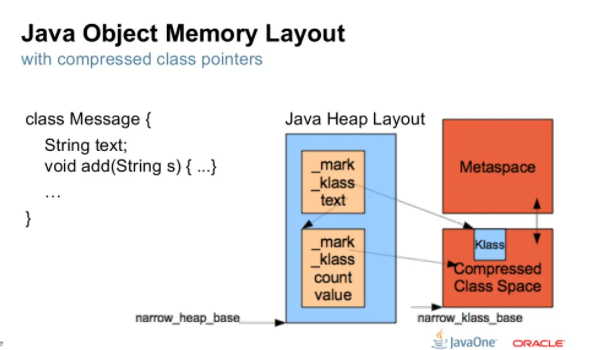
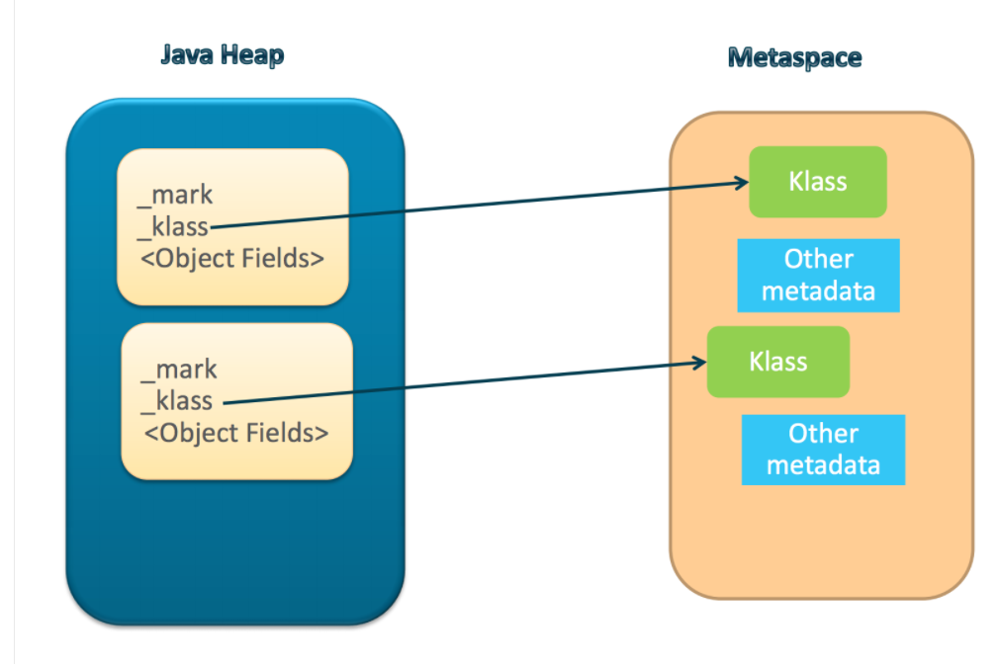
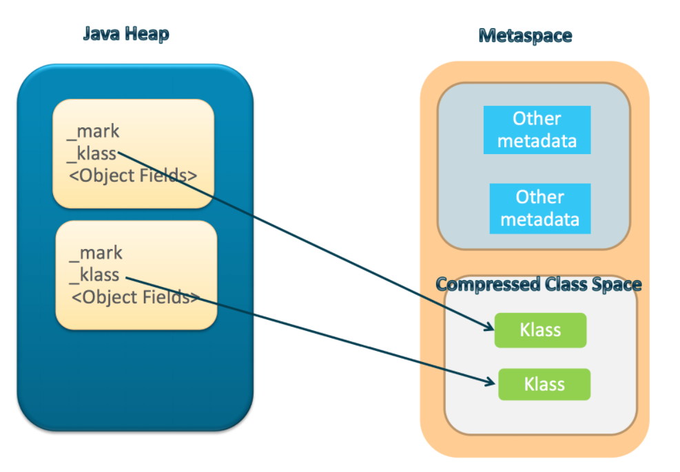

https://www.slideshare.net/iwanowww/whats-new-in-33765217

【!!!jvm相关微博】https://stuefe.de/posts/metaspace/what-is-compressed-class-space/

On 64bit platforms, hotspot uses optimization techniques called **Compressed Object Pointers** (*“CompressedOops”*) and **Compressed Class Pointers**. Both are variants of the same thing.

Compressed pointers are a way to reference data - objects in Java heap or class metadata in Metaspace - using 32bit references even on a 64 bit platform.

没有compressed Class pointers的情况下

开启了compressed Class pointers

### MetaSpace

https://stuefe.de/posts/metaspace/what-is-metaspace/

Metaspace is memory the VM uses to store *class metadata*.

Class metadata are the runtime representation of java classes within a JVM process - basically any information the JVM needs to work with a Java class. That includes, but is not limited to, runtime representation of data from the [JVM class file format](https://docs.oracle.com/javase/specs/jvms/se8/html/jvms-4.html).

Examples:

- the “Klass” structure - the VM-internal representation of runtime state of a java class. This includes both vtable and itable.
- Method metadata - runtime equivalent of the [method_info](https://docs.oracle.com/javase/specs/jvms/se8/html/jvms-4.html#jvms-4.6) in the class file, containing things like the [bytecode](https://docs.oracle.com/javase/specs/jvms/se8/html/jvms-4.html#jvms-4.7.3), [exception table](https://docs.oracle.com/javase/specs/jvms/se8/html/jvms-4.html#jvms-4.7.5), [constants](https://docs.oracle.com/javase/specs/jvms/se8/html/jvms-4.html#jvms-4.7.2), etc.
- The [constant pool](https://docs.oracle.com/javase/specs/jvms/se8/html/jvms-4.html#jvms-4.4)
- Annotations
- method counters collected at runtime as a base for JIT decisions
- etc.

在上层，MetaSpace 主要由 Klass Metaspace 和 NoKlass Metaspace 两大部分组成。

- **Klass MetaSpace：** 就是用来存 Klass 的，就是 Class 文件在 JVM 里的运行时数据结构，这部分默认放在 Compressed Class Pointer Space 中，是一块连续的内存区域，紧接着 Heap。Compressed Class Pointer Space 不是必须有的，如果设置了 `-XX:-UseCompressedClassPointers`，或者 `-Xmx` 设置大于 32 G，就不会有这块内存，这种情况下 Klass 都会存在 NoKlass Metaspace 里。
- **NoKlass MetaSpace：** 专门来存 Klass 相关的其他的内容，比如 Method，ConstantPool 等，可以由多块不连续的内存组成。虽然叫做 NoKlass Metaspace，但是也其实可以存 Klass 的内容，上面已经提到了对应场景。

https://developer.aliyun.com/article/73601

注意：类加在后java.lang.Class对象，也就是类元信息访问的入口对象是在堆中的

Klass Metaspace就是用来存klass的，klass是我们熟知的class文件在jvm里的运行时数据结构，不过有点要提的是我们看到的类似A.class其实是存在heap里的，是java.lang.Class的一个对象实例

#### string pool

 https://www.baeldung.com/java-string-pool

Until Java 8, *Strings* were internally represented as an array of characters – *char[]*, encoded in *UTF-16*, so that every character uses two bytes of memory.

https://www.zhihu.com/question/23374078  unicode 与 UTF-8

“**字节**”是一个8位的物理存贮单元，而“**字符**”则是一个文化相关的符号

在unicode中，一个字符就是两个字节。一个汉字算两个英文字符的时代已经快过去了。

UTF-8就是在互联网上使用最广的一种unicode的实现方式，这是为传输而设计的编码，并使编码无国界，这样就可以显示全世界上所有文化的字符了

unicode在很长一段时间内无法推广，直到互联网的出现，为解决unicode如何在网络上传输的问题，于是面向传输的众多 **UTF**（UCS Transfer Format）标准出现了，顾名思义，**UTF-8**就是每次8个位传输数据，而**[UTF-16](https://www.zhihu.com/search?q=UTF-16&search_source=Entity&hybrid_search_source=Entity&hybrid_search_extra={"sourceType"%3A"answer"%2C"sourceId"%3A69732605})**就是每次16个位。UTF-8就是在互联网上使用最广的一种unicode的实现方式，这是为传输而设计的编码，并使编码无国界，这样就可以显示全世界上所有文化的字符了。UTF-8最大的一个特点，就是它是一种变长的编码方式。它可以使用1~4个字节表示一个符号，根据不同的符号而变化[字节长度](https://www.zhihu.com/search?q=字节长度&search_source=Entity&hybrid_search_source=Entity&hybrid_search_extra={"sourceType"%3A"answer"%2C"sourceId"%3A69732605})，当字符在ASCII码的范围时，就用一个字节表示，保留了[ASCII字符](https://www.zhihu.com/search?q=ASCII字符&search_source=Entity&hybrid_search_source=Entity&hybrid_search_extra={"sourceType"%3A"answer"%2C"sourceId"%3A69732605})一个字节的编码做为它的一部分，注意的是unicode一个[中文字符](https://www.zhihu.com/search?q=中文字符&search_source=Entity&hybrid_search_source=Entity&hybrid_search_extra={"sourceType"%3A"answer"%2C"sourceId"%3A69732605})占2个字节，而UTF-8一个中文字符占3个字节）。从unicode到utf-8并不是直接的对应，而是要过一些算法和规则来转换。

With Java 9 a new representation is provided, called *Compact Strings.* This new format will choose the appropriate encoding between *char[]* and *byte[]* depending on the stored content.

Since the new *String* representation will use the *UTF-16* encoding only when necessary, the amount of *heap* memory will be significantly lower, which in turn causes less *Garbage Collector* overhead on the *JVM.*

