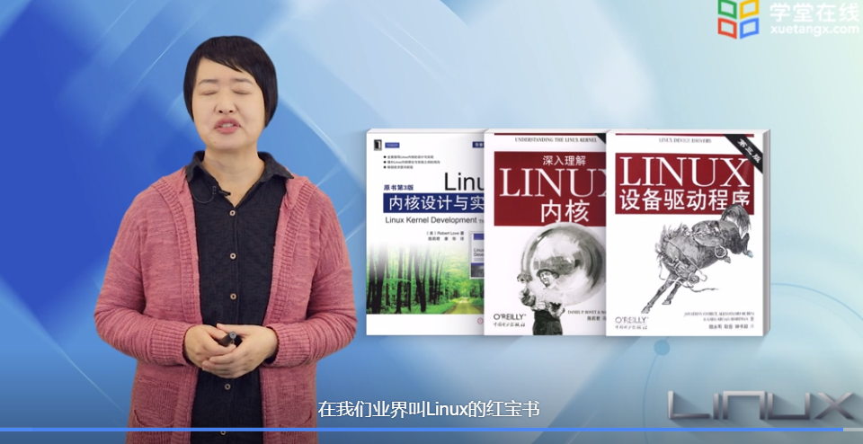
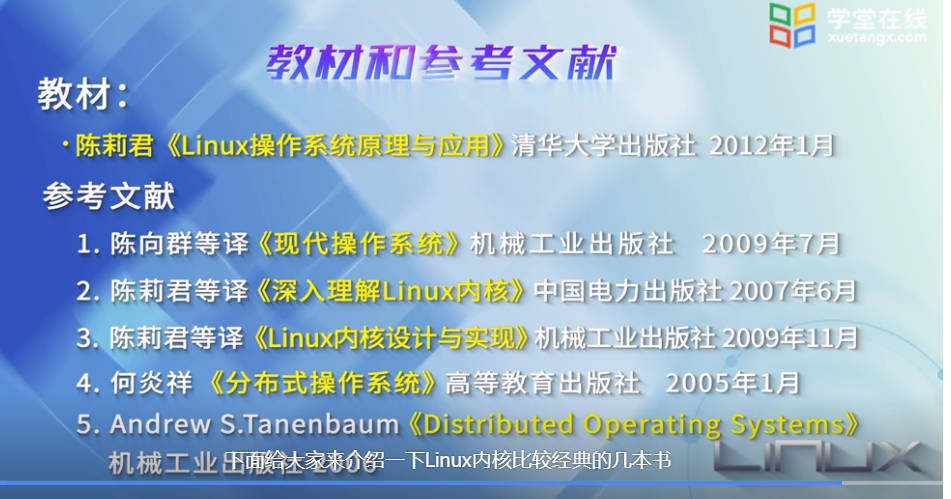
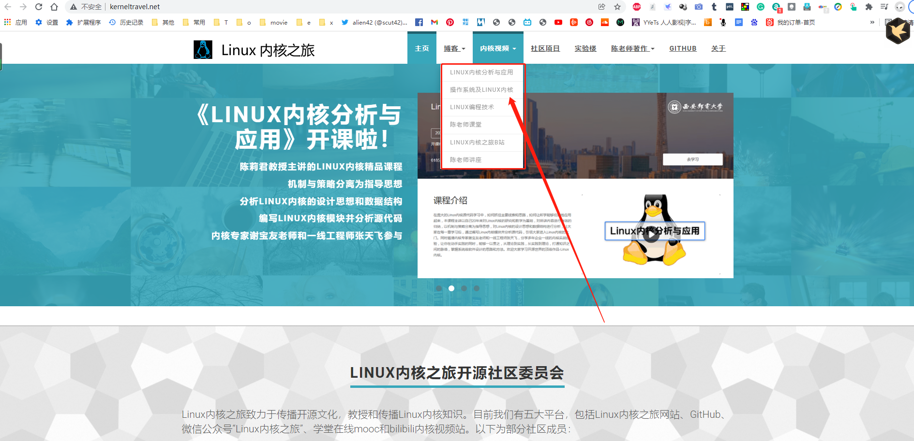
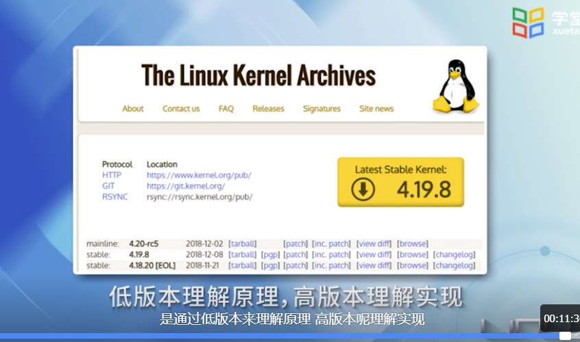
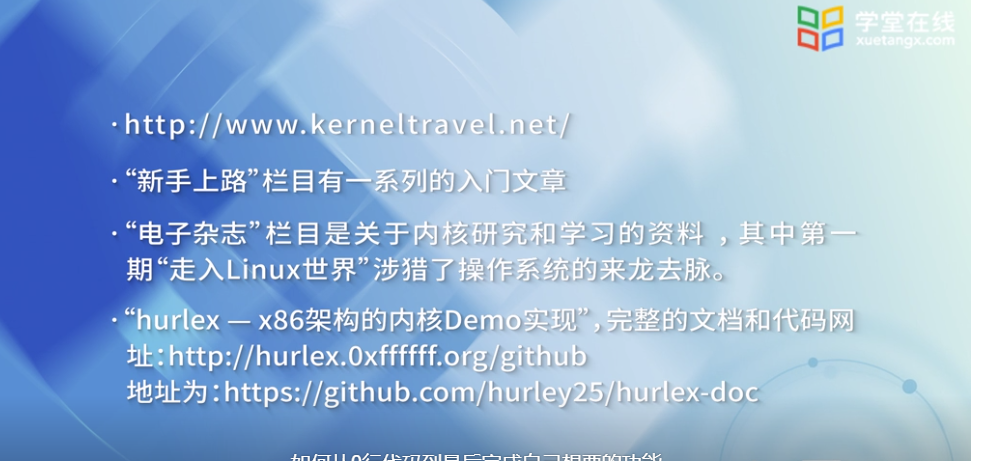
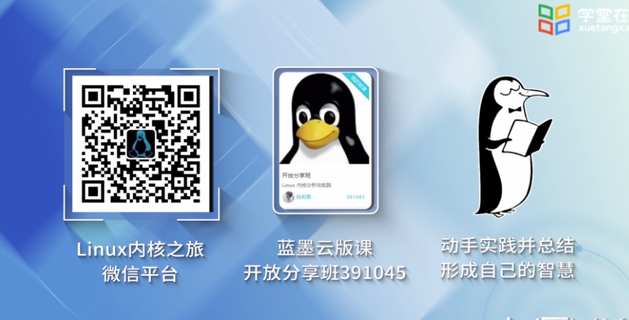
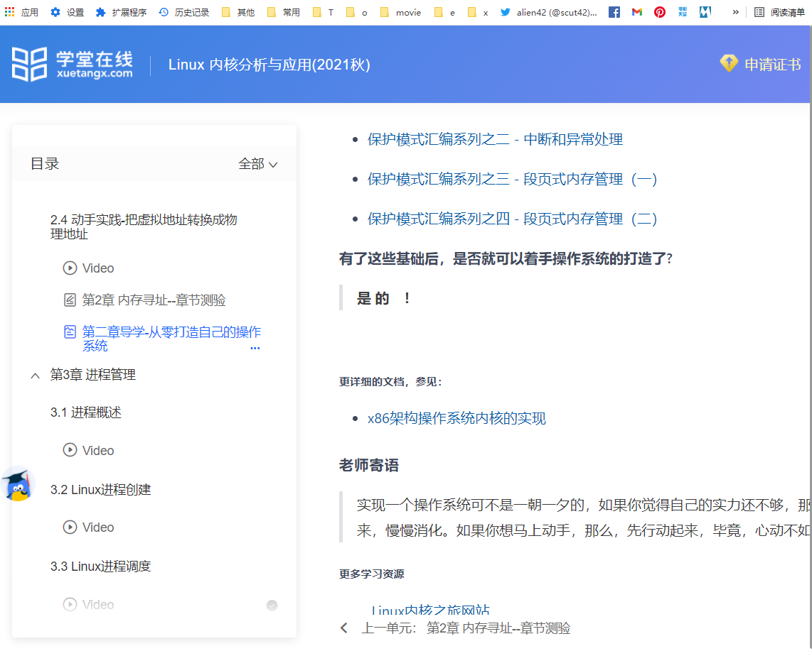
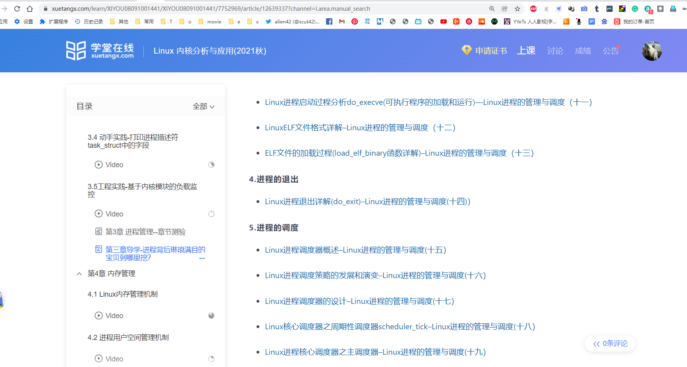

## 官方

[官方网站](https://www.kernel.org/)

[官方文档]()

## 文档

[linux-kernel-labs](https://linux-kernel-labs.github.io/refs/heads/master/labs/memory_mapping.html#struct-page): 非官方

## 课程

1. [Linux 内核分析与应用](https://www.xuetangx.com/course/XIYOU08091001441/7752969?channel=i.area.learn_title)  西安邮电大学  学堂在线
2. [互联网体系结构](https://www.xuetangx.com/course/XIYOU08091001441/7752969?channel=i.area.learn_title)  中国科学技术大学  学堂在线  已读
3. [Linux操作系统](https://www.bilibili.com/video/BV1zL411T7YY?p=49)  主要是使用方面的，包括命令使用，脚本使用等
4. [趣谈 Linux 操作系统](https://time.geekbang.org/column/article/92382) 极客付费课程
5. [Linux 内核分析](https://www.xuetangx.com/course/USTC08091000586/7754291?channel=i.area.learn_title)
   * [实验](https://www.lanqiao.cn/courses/195)
   * [资料](https://github.com/linmufeng/LinuxKernel)

​	

> [中国大学mooc 相关linux 课程](https://www.icourse163.org/search.htm?search=linux#type=30&orderBy=0&pageIndex=1&courseTagType=null)

## 书籍

1. Linux内核设计与实现 Edition 2 
2. Linux设备驱动 Edition 3 
3. Linux内核源代码情景分析 
4. 深入理解Linux内核（第三版)
4. 深入Linux内核架构
4. [Linux内核深度解析](http://product.dangdang.com/27865598.html)：4.0内核

https://github.com/7-sevens/Developer-Books/tree/master/Linux

https://github.com/lancetw/ebook-1/tree/master/03_operating_system

## 博客

[linux 内核怎么学习](https://www.zhihu.com/question/58121772) 知乎

[Linux 内核源码分析：基于最新的 Linux 4.0 内核（学习路线总结）](https://xie.infoq.cn/article/20645f8f6a16b56aa267d34bd)

https://www.baeldung.com/linux/

https://www.baeldung.com/cs/cpu-io-bound

https://www.baeldung.com/cs/category/core-concepts/os-core-concepts

## 社区

[Linux内核之旅](http://kerneltravel.net/video/)

​			[入门讲座](https://www.bilibili.com/video/BV1MC4y1Y78J) : 

​			[蓝桥云课](https://www.lanqiao.cn/courses/2610) : 使用实验楼进行实操，也可以了解清华的实验楼

[Linux 中国 开源社区](https://linux.cn/)

## 拓展

https://www.baeldung.com/about

## 其他

红宝书：分别是入门，源码，实践

linux操作系统原理与应用  [配套视频](http://www.kerneltravel.net/movie/)

linux内核分析与应用  [配套视频](https://www.xuetangx.com/course/XIYOU08091001441/7752969)

[操作系统及Linux内核](https://www.icourse163.org/course/XIYOU-1461809182)  [配套视频](https://www.icourse163.org/learn/XIYOU-1461809182?tid=1465855483#/learn/content?type=detail&id=1245916056&cid=1271208144&replay=true)   结合linux来讲解

[Linux编程技术](https://www.icourse163.org/course/XIYOU-1461794181)   比较新的一个课程

低版本的源码比较简单，也比较适合初学者

导学的内容也可参考学习

