### 整体结构

分为应用软件和操作系统内核，两者之间的接口就是系统调用。

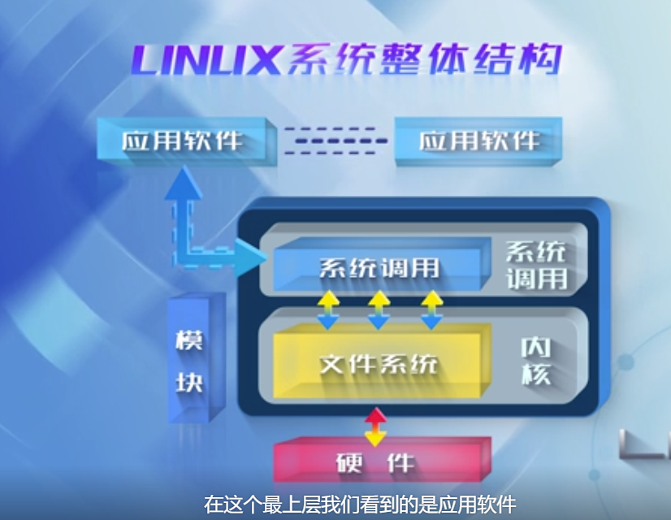

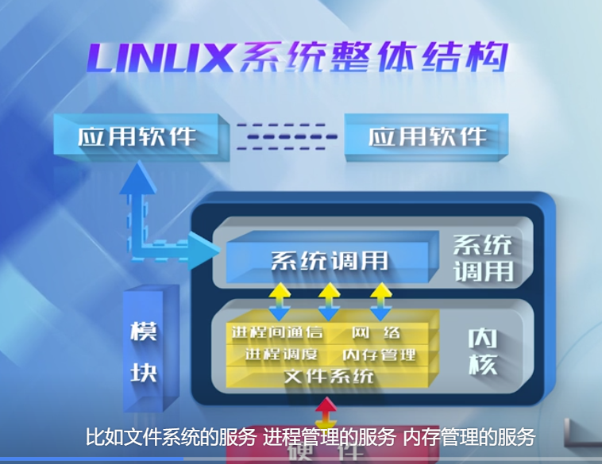

系统调用就是一种机制，作为应用程序与操作系统内核的接口，起着隔离变化的作用，使得内核中如何实现该机制对应用程序透明

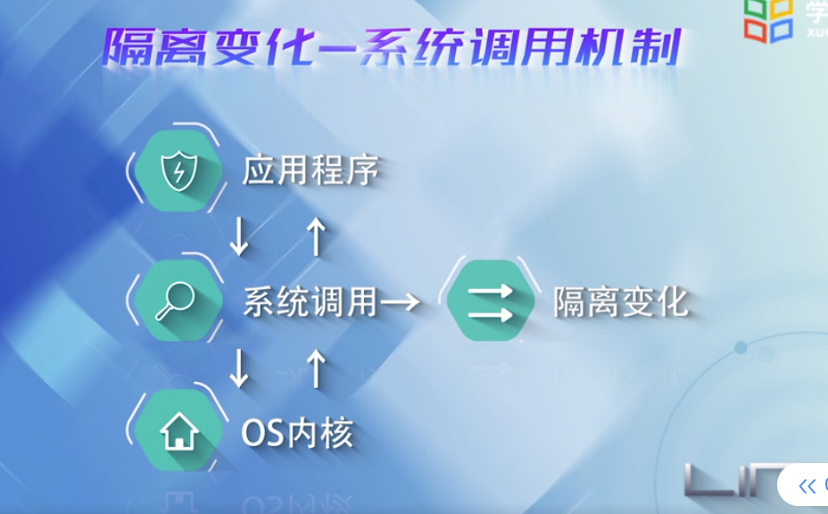

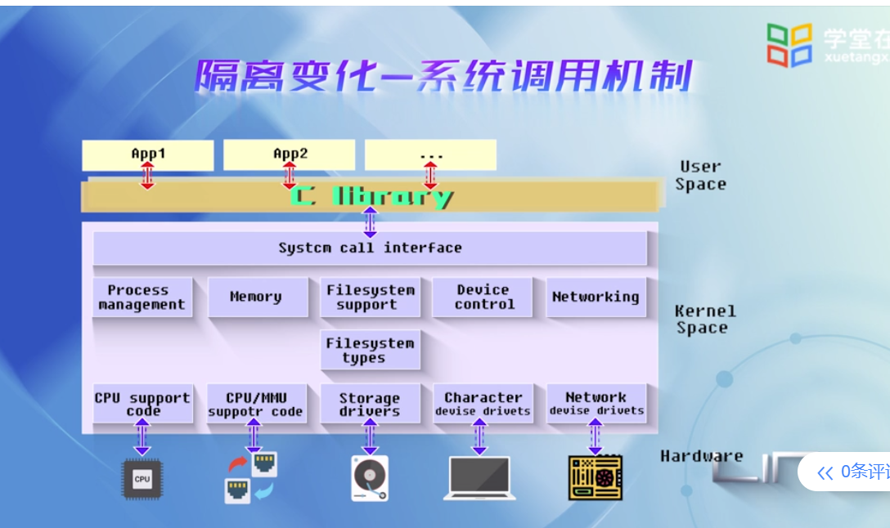

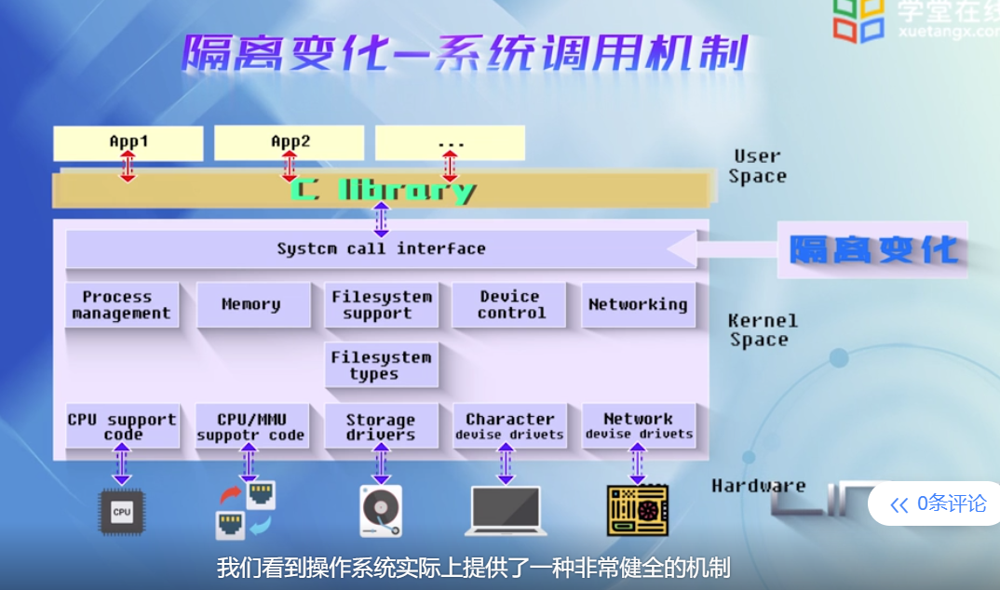

## 第二节

单内核结构

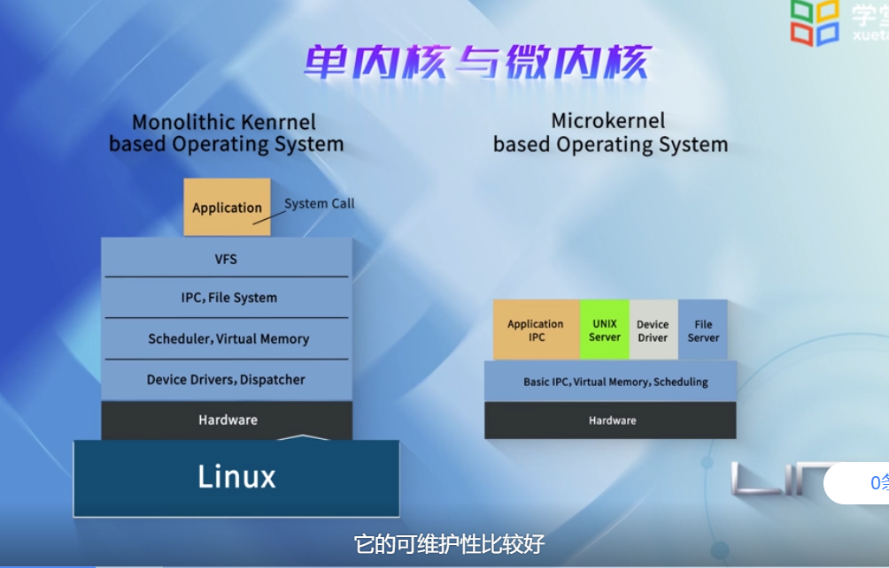

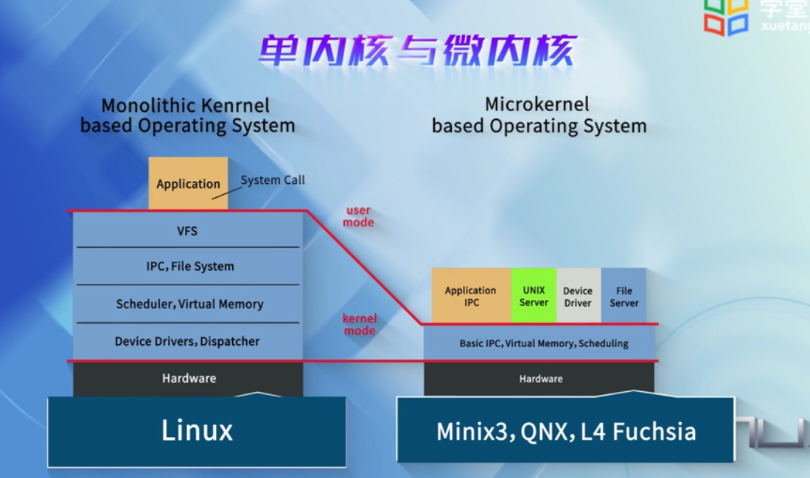

## 源码

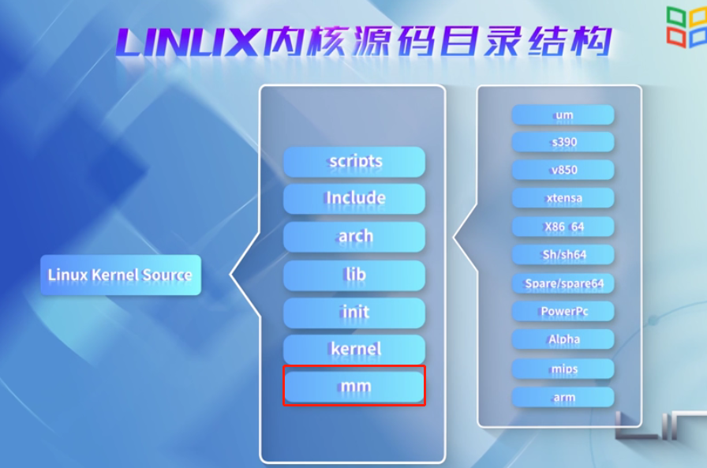

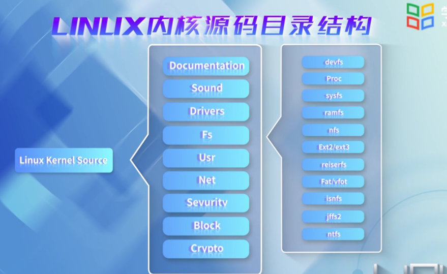

针对可维护性差，要编译一次内核要很长时间的问题，提供了一种机制：可加载的内核模块

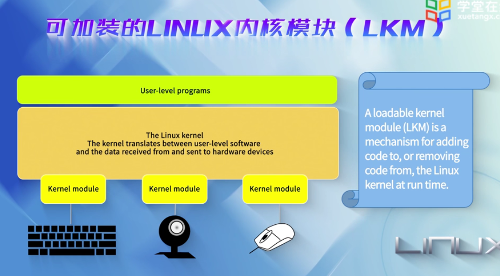

编译内核模块，必须写一个Makefile文件，告诉编译程序，那些头文件在哪些地方

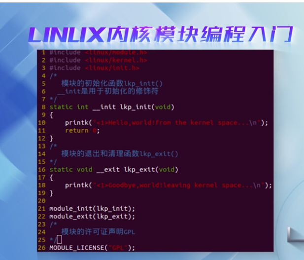

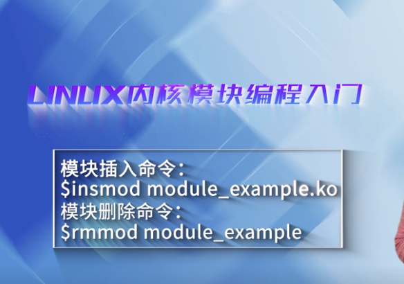

内核编程与用户编程的区别

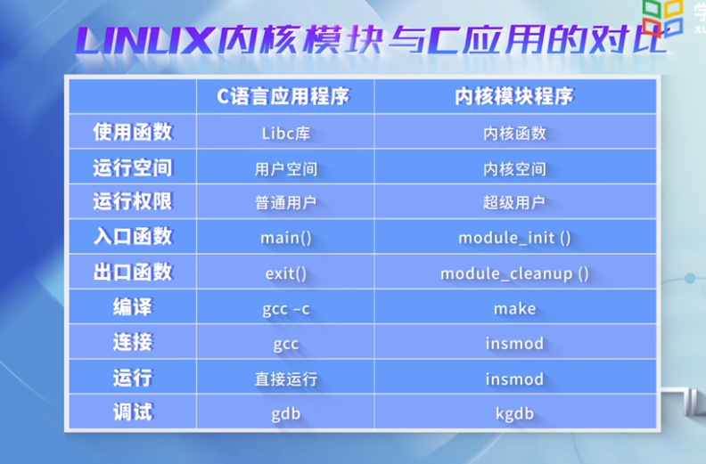

## 双链表

双链表，在linux中就像整型一样使用：

​	减少一个指针域，退化为一个单链表

​	只能从链表首部删除，尾部插入，退化为队列

​	只能对链表首部进行插入和删除，退化成栈

​	将前驱和后继表示为左右孩子的话，就是一颗二叉树

​	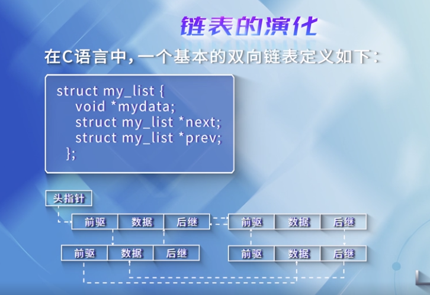

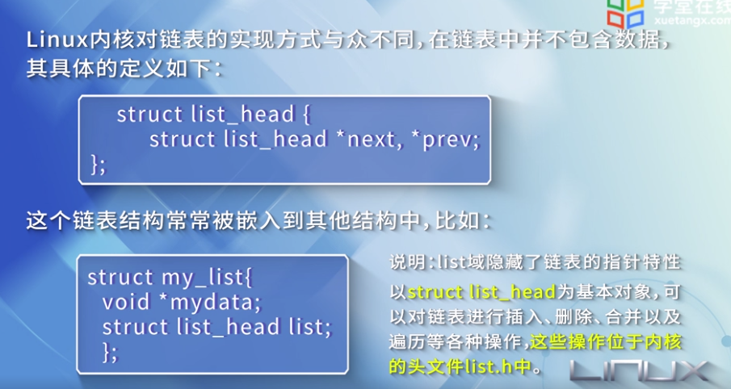

哈希表：通过哈希函数将关键字与其存放的位置建立起对应关系