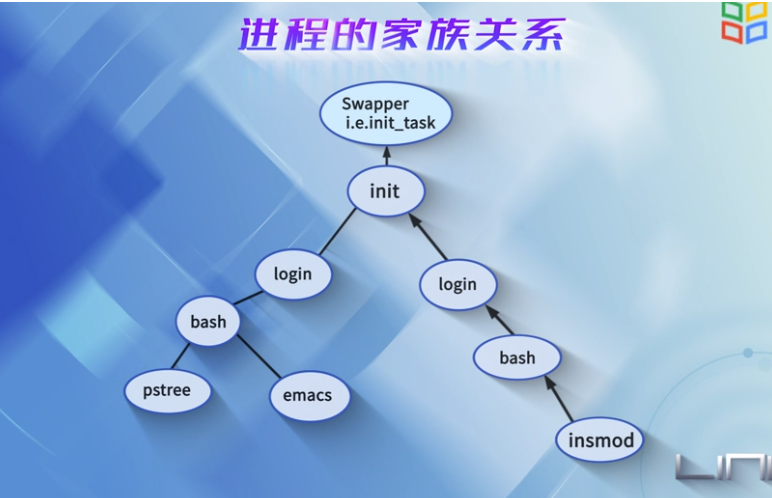
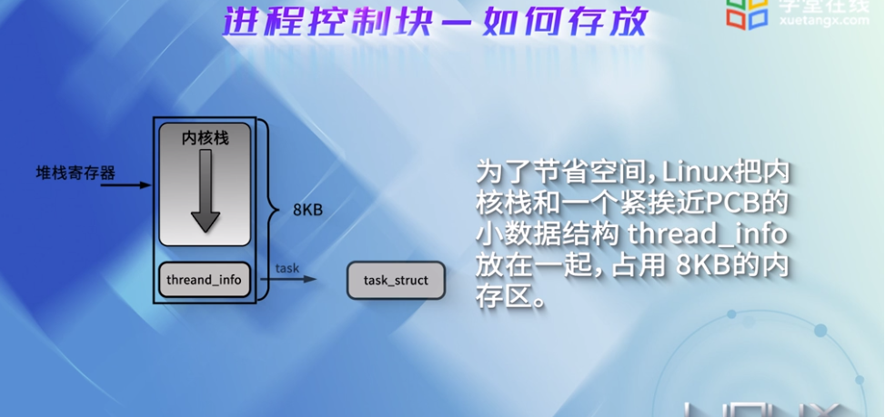
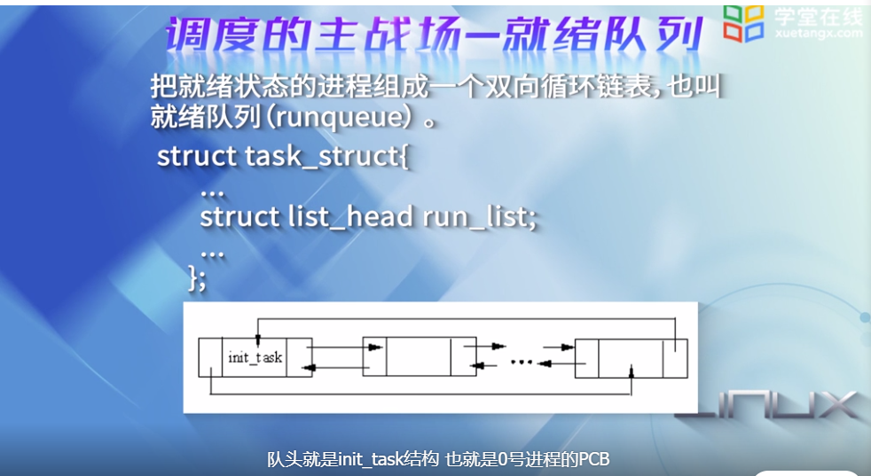
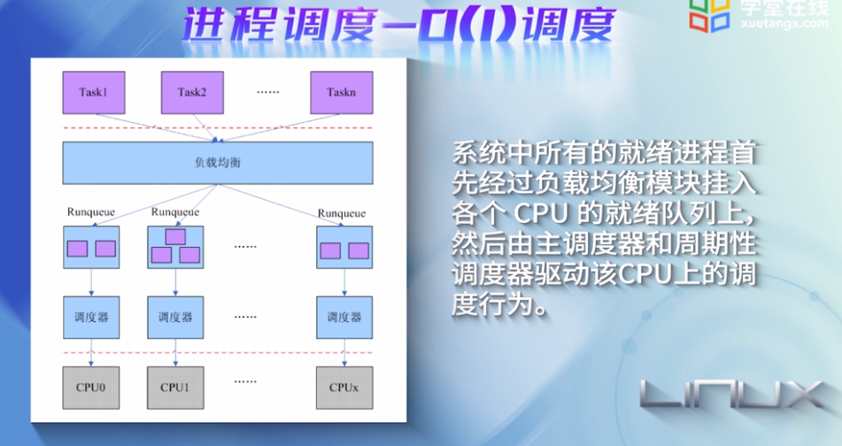
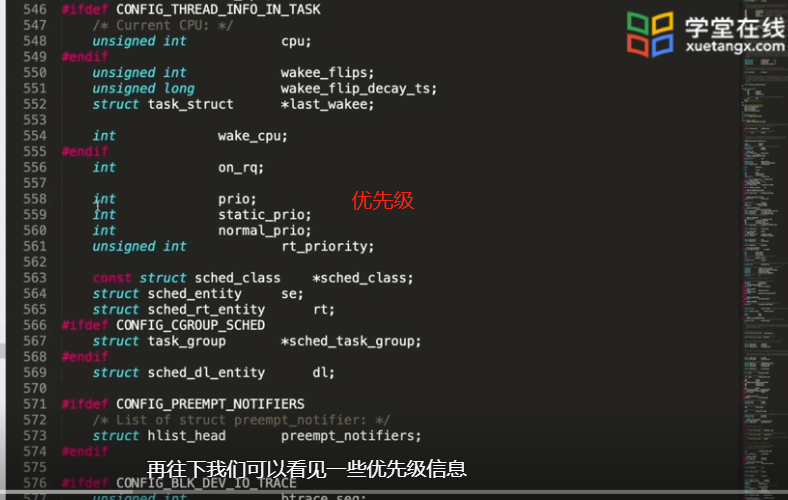
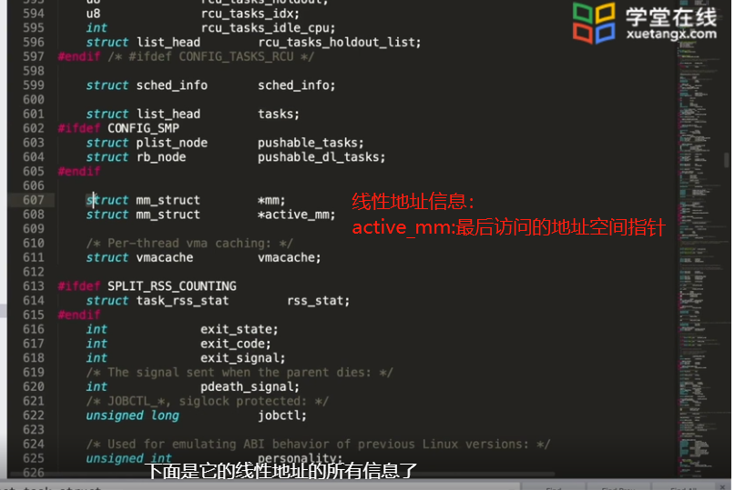

# 第三章

进程的家族关系：进程树

动态表现----数据和状态的总和

linux内核坚持平等的原则，对进程，线程，内核线程一视同仁，使用惟一的数据结构task_struct，并使用相同的调度算法对这三者进行调度

如何做到的呢

创建进程的sys_fork，子进程不像共享父进程的资源，但是父进程只是将一个指针指过去而已，等真正要写一个页面的时候，才会采用写时复制copyOnWrite技术，此时不管是父进程想写还是子进程想写，这个页面才会被赋值一份

创建线程：使用clone系统调用，所以线程就是轻量级进程

将一对参数传递给父进程，告诉老爸，你这个我也要共享，那个我也要共享

比如地址空间，文件系统，打开的文件，信号处理函数

如果是一个内核线程，其出生更有优势，因为用户空间对内核线程没有意义

早期内核线程是通过kernel_thread() 创建的

现在是通过kthread_create() 创建的

本质上也是调用do_fork函数，传递特定的标志来创建的

进程，线程，内核线程都是调用了相同的do_fork函数生成task_struct对象，带来了统一性。

do_fork 流程

copy_process中会调用各种copy_xyz函数来完成资源的复制或者共享，取决于clone_flag的取值

进程的生命周期

fork: 新进程只是父进程的一个克隆

exec: 新进程脱胎换骨，开始了独立工作

exit:  退场

wait: 进程死掉之后会留下空壳，wait系统调用会进行回收

进程调度：

调度的主战场：就绪队列

核心：调度算法

实质性动作：进程切换

对于以时间片调度为主的调度，时钟中断就是驱动力

用户可以通过系统调用nice来调整优先级

数值越小，优先级越高

用户空间的优先级：

1.普通优先级：可以改变进程获取cpu资源的比例

2.调度优先级：实时进程的大于0；普通j进程是0

> 和其他操作系统类似，Linux也支持两种进程：普通进程和实时进程。实时进程具有一定程度上的紧迫性，要求对外部事件做出非常快的响应；而普通进程则没有这种限制。所以，调度程序要区分对待这两种进程，通常，实时进程要比普通进程优先运行。这两种进程的区分也反映在task_struct数据结构中了。

归一化优先级：根据静态优先级，调度优先级和调度策略计算而得到的。

由于链表组成的就绪队列是O(n)复杂度的，所以引入O(1)调度

将单链表变成多链表，将不通过优先级的进程挂到不同的链表

O（1）调度支持140个优先级

其中0到99是实时进程的优先级，100到139是普通进程的优先级。这样，实时进程和普通进程就区分对待了，普通进程不会影响到实时进程。

下图，可以考到有两个优先级队列，分别管理活跃进程和时间片耗尽的进程

当活跃队列的任务耗尽时间片之后，挂到时间片耗尽的队列；

当活跃队列为空的时候，两个队列互换，开始新一轮的调度

主调度器，先在当前活跃队列中查找

O(1)调度器使用非常复杂的算法来判断进程是否是交互式进程，交互了多少次，即时这样，依然会出现卡顿现象，如果解决？

----通过机制与策略分离：将不同类型的任务调度的公共逻辑抽取出来，允许用户根据特定类型的调度器和自己的场景，定义自己的调度实现，加入到系统中。

CFS:完全公平调度

没有时间片的概念，分配cpu使用时间的比例。

理想下，每个进程可以获得相同的时间片，而且同时运行在cpu上(宏观上)。

为了实现公平，会惩罚当前运行的进程。

通过每个进程的虚拟运行时间来衡量哪个进程最值得被调度。

CFS调度策略的就绪队列是一个以虚拟运行时间为键值的红黑树。虚拟时间越小，越靠近红黑树的最左端。

调度器每次选择虚拟运行时间最小的进程。

虚拟运行时间是通过进程的运行时间和进程的权重计算出来的。

在CFS中，进程的优先级被弱化，强调的是进程的权重，权重越大，说明进程越需要运行，虚拟运行时间越小。

总结：

不同的任务有不同的需求，需要对任务进程分类

* 实时进程：快速响应式最主要的。
* 普通级进程：需要兼顾其他3点的需求。

### 动手：观察task_struct

