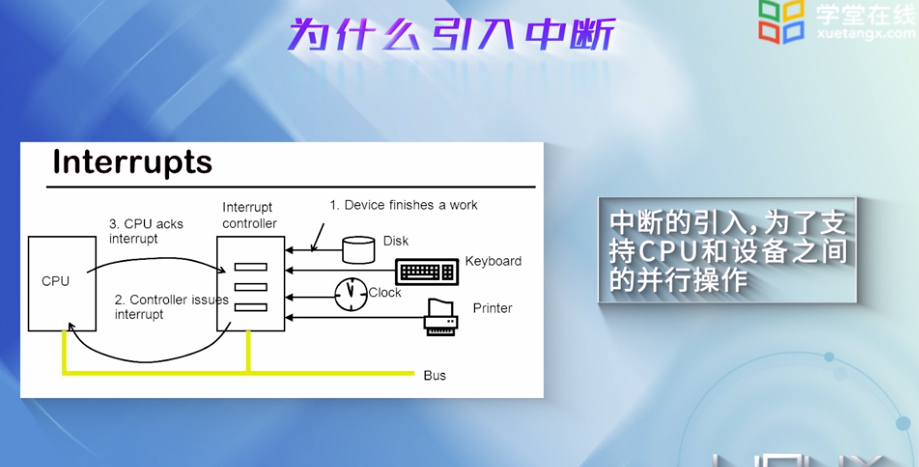
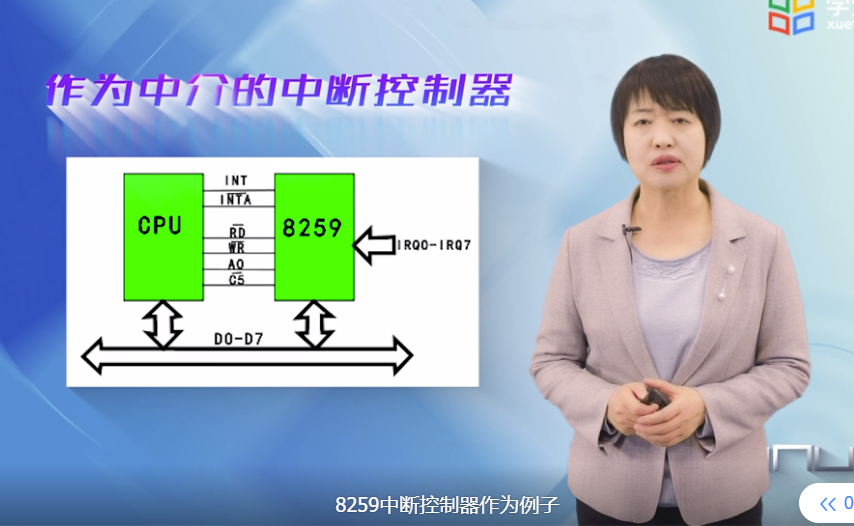
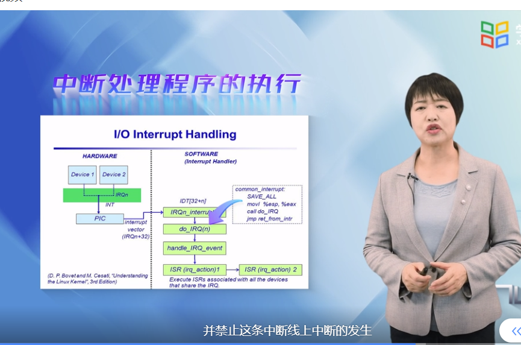
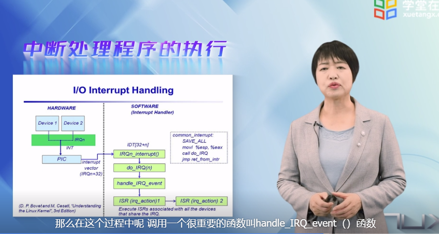
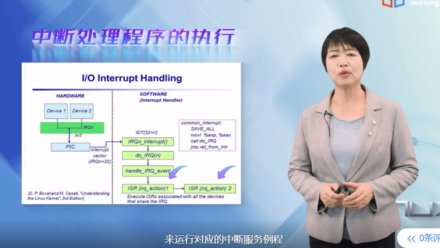
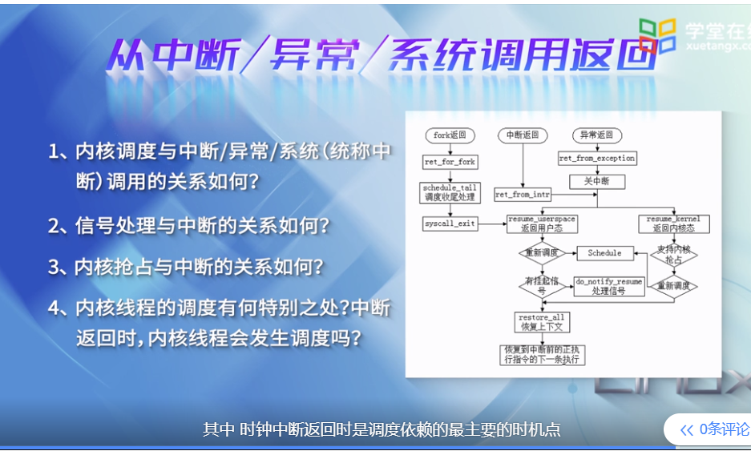
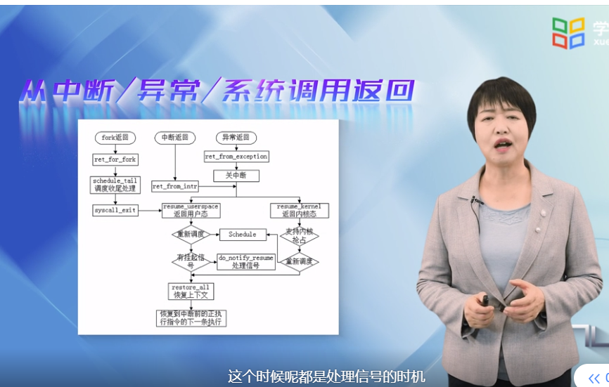
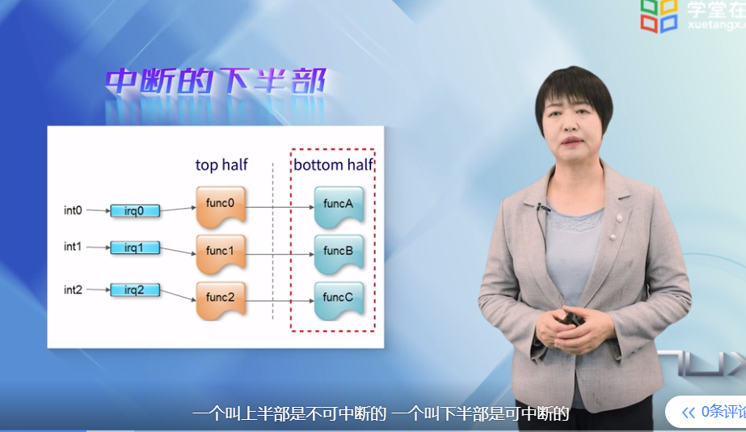

# 中断机制

中断是操作系统的脉搏，是并发处理的基础。

目前x86采用APIC 高级可编程控制器

每一个x86的核都有本地的APIC

IO APIC 收集外设的中断，放一场总线上的信息，传递给某个cpu上的APIC

irq---中断请求号

所有的中断程序都有中断门来激活，并且全部限制在内核态

与中断门类似，其控制权通过陷阱门进入处理程序时，维持中断标识位不变，也就是不关中断，而中断门是关中断的。

系统们，用于让用户态的进程访问intel的陷阱门

系统调用就是通过系统门进入内核的。

## 中断描述表

中断描述符表，放在内核空间的数据段中，起始地址放在中断描述表寄存器

相关源代码

并且开始初始化各个表项

上图左边是特权级发生了变化，右边是特权级发生了变化

### 执行流程

### 中断，异常，系统调用

### 基本机制

### 中断下半部

中断分为两部分

### linux时间系统

时间中断是特别重要的中断。

系统利用时钟中断维持系统时间，促进进程切换，以保证所有进程共享cpu。

系统利用时钟中断进行记账，监督系统工作以及确定未来的调度优先级等工作。

可以说时钟是操作系统的脉搏。

