# 内存管理

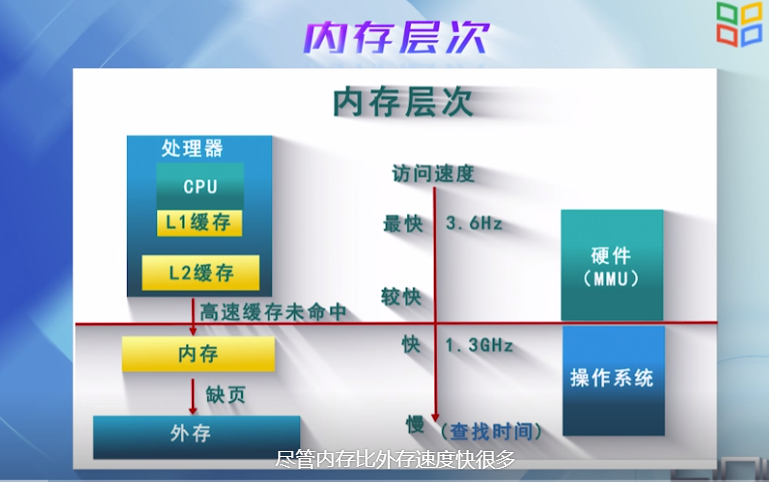

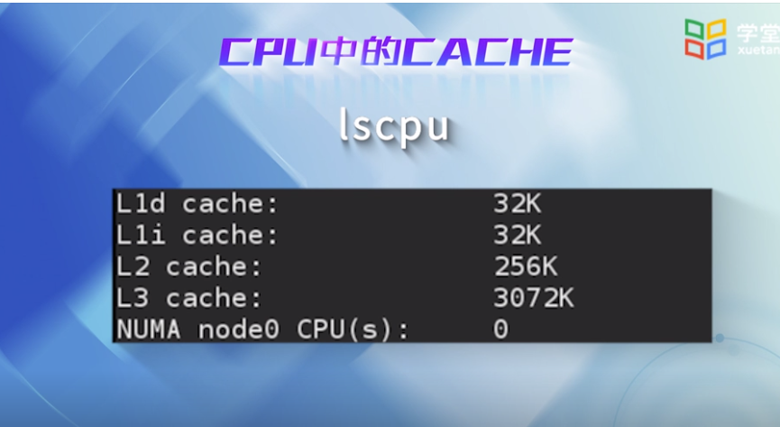

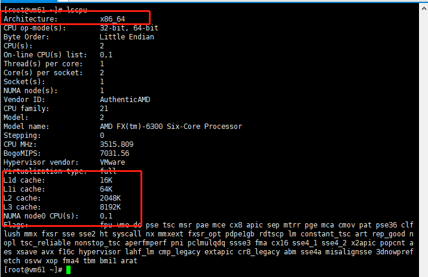

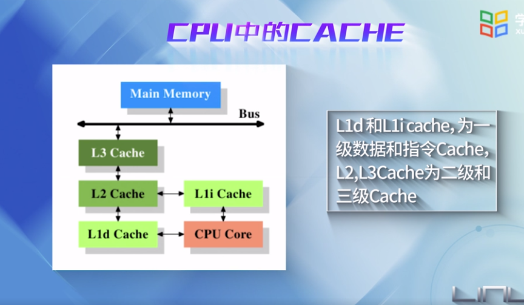

linux如何对虚拟内存进行管理：5大机制

* 

* 内核通过映射机制，将进程从磁盘映射到虚拟地址空间---地址映射机制
* 如果要访问的页没有在内存中，发出页请求【1】----请页机制
* 如果有空闲的内存可以供分配的话，就请求分配内存【2】----分配机制
* 将正在使用的页记录到页缓存中【3】----- 缓存与刷新机制
* 如果没有内存可分配，需要使用交换机制，腾出内存【4】【5】-----交换机制
* 为了加快地址的查询和转换，需要TLB 快表高速缓存【8】
* 交换机制中也要使用到交换缓存【6】
* 使用交换机制之后，需要修改也页表项【7】

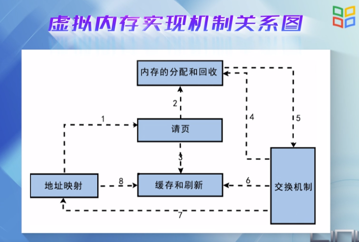

程序被执行之后就成为一个进程，内核为每个进程提供一个大小相同的虚拟地址空间，使得多个进程可以同时运行又不互相干扰。

下面是x86 32位地址空间示意图。

每个进程通过系统调用进入内核，内核空间有系统内所有进程共享。

从进程角度，每个进程有4GB的虚拟地址空间，也叫做虚拟内存。

每个进程有自己的私有用户空间0-3G，对其他进程是不可见的。

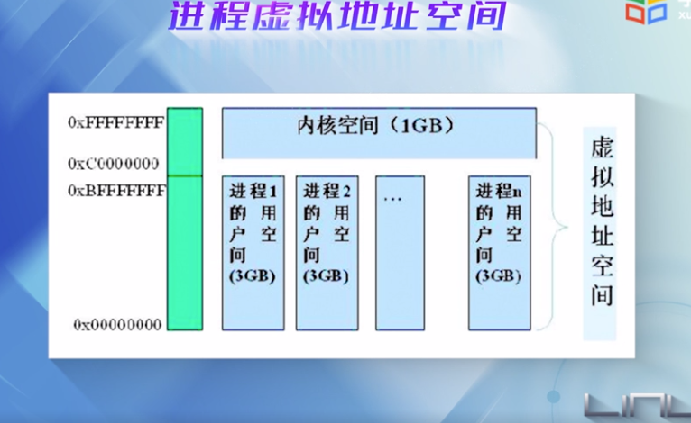

进程的地址空间如何布局

每个程序编译链接后形成的二进制映像文件，都有一个代码段(Text segment)和数据段（BSS segment和Data segment）

链接器和函数库也有自己的代码段和数据段

进程运行时，必须有独占的Heap堆和Stack栈

进程要映射的文件，被映射到内存映射区 MMR区(Memory Mapping Region)

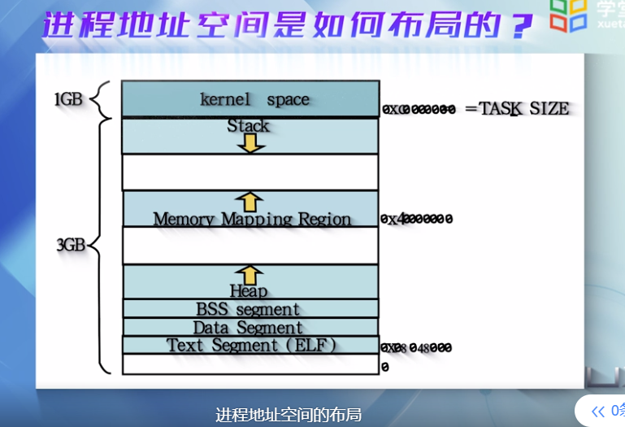

如何用数据结构描述进程的用户空间

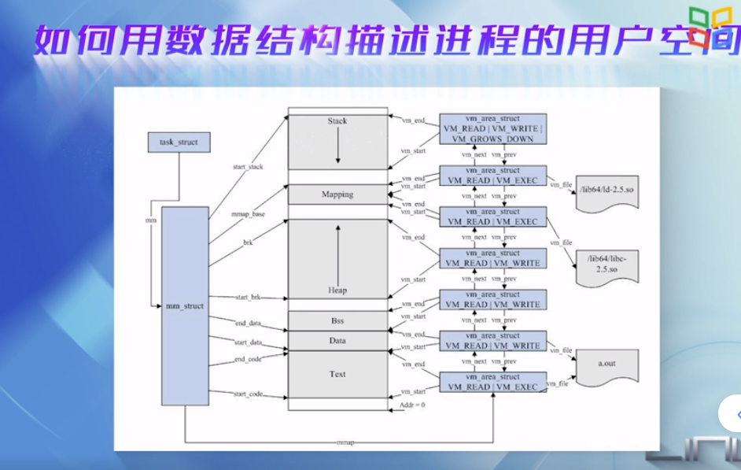

linux将进程的用户区间划分为一个个区间，这些区间成为虚拟内存区，简称VMA。

这样进程的用户地址空间就可以用两个数据结构来描述：

* mm_struct结构 ：对进程的整个用户空间进行描述

  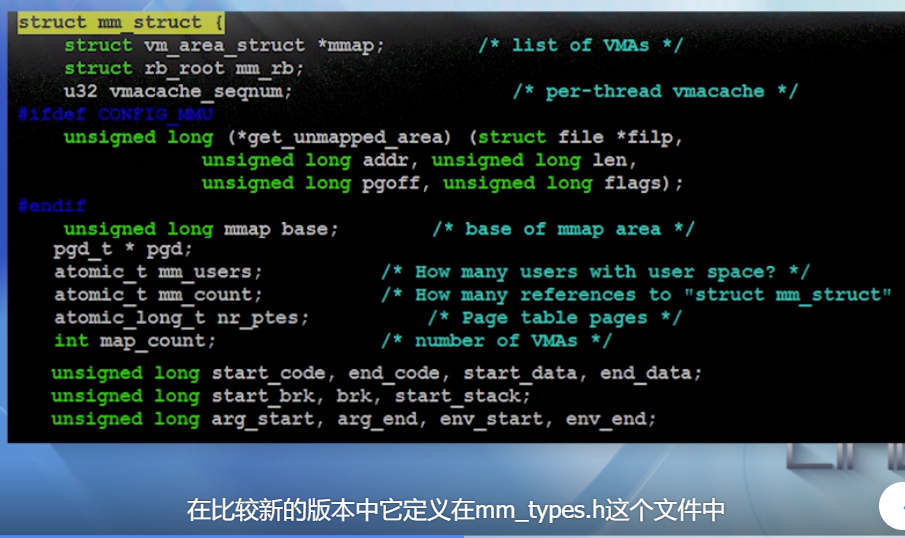

  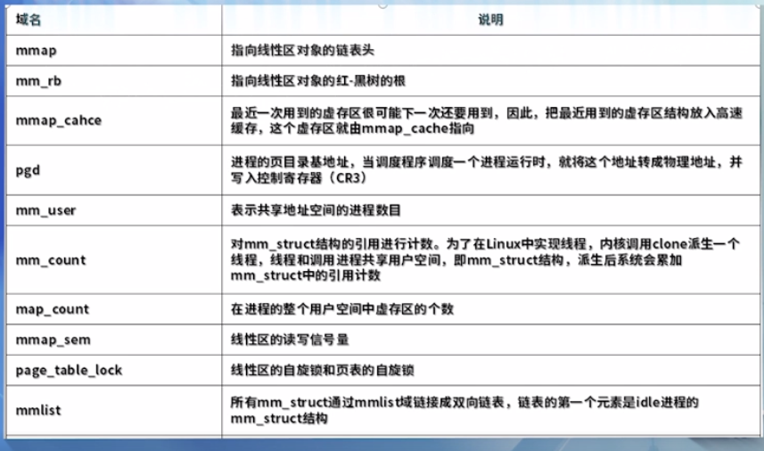

  

mm_struct中的一些字段指向了各个虚存区的起始地址或者结束地址

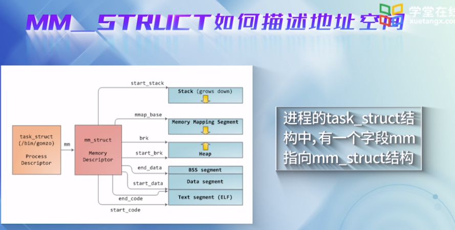

* vm_area_struct结构：对用户空间的各个内存区进行描述

  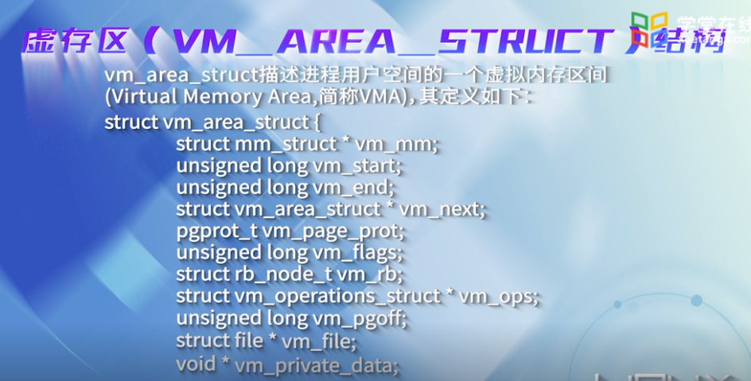

为什么需要划分一个个的虚存区间呢？

这是因为每个虚存区的来源不同，有的可能来源于可执行文件的映像，有的可能来源于共享库，或者动态分配的内存区，对于不同的区间有不同的访问权限和操作类型，因此使用分开管理。

nopage---缺页处理函数

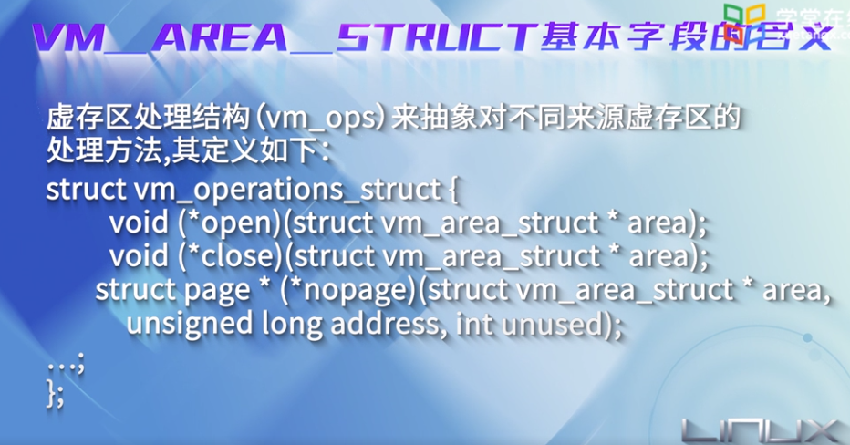

mm_struct是由一个个的vma组成

进程的代码段和数据段---> Text段和data段

共享库(.so)----->内存映射区(memory mapping)

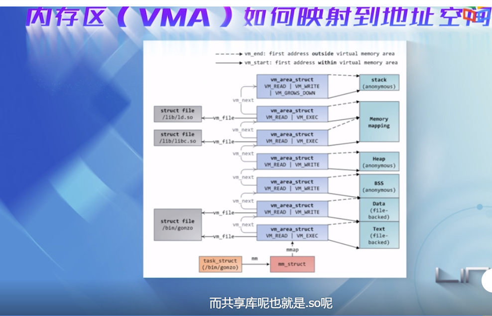

下图可以看出进程控制块是内核中的核心数据结构，并可以将进程和内存关联起来。

task_struct 包含mm域，指向mm_struct。

mm_struct 包含进程的可执行映像信息，页目录指针，指向虚存区结构vm_area_struct的几个指针

每个VMA代表进程的一个虚拟地址空间。

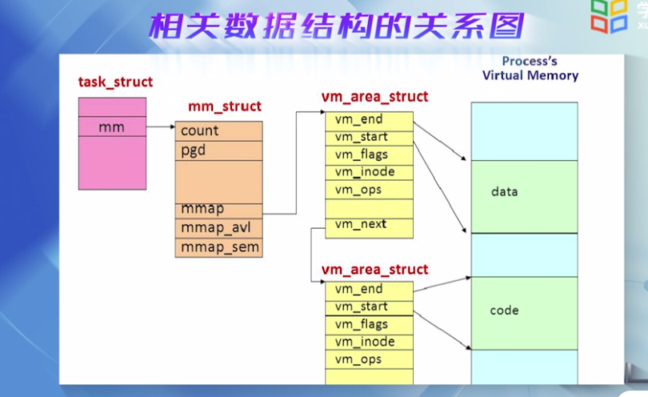