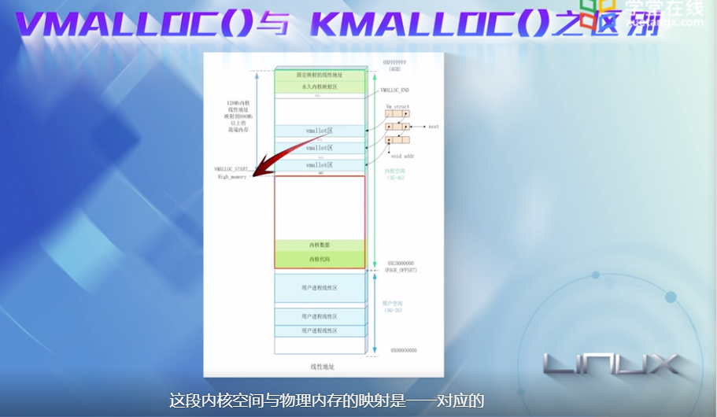

# 内存管理

linux如何对虚拟内存进行管理：5大机制

* 

* 内核通过映射机制，将进程从磁盘映射到虚拟地址空间---地址映射机制
* 如果要访问的页没有在内存中，发出页请求【1】----请页机制
* 如果有空闲的内存可以供分配的话，就请求分配内存【2】----分配机制
* 将正在使用的页记录到页缓存中【3】----- 缓存与刷新机制
* 如果没有内存可分配，需要使用交换机制，腾出内存【4】【5】-----交换机制
* 为了加快地址的查询和转换，需要TLB 快表高速缓存【8】
* 交换机制中也要使用到交换缓存【6】
* 使用交换机制之后，需要修改也页表项【7】

程序被执行之后就成为一个进程，内核为每个进程提供一个大小相同的虚拟地址空间，使得多个进程可以同时运行又不互相干扰。

下面是x86 32位地址空间示意图。

每个进程通过系统调用进入内核，内核空间有系统内所有进程共享。

从进程角度，每个进程有4GB的虚拟地址空间，也叫做虚拟内存。

每个进程有自己的私有用户空间0-3G，对其他进程是不可见的。

进程的地址空间如何布局

每个程序编译链接后形成的二进制映像文件，都有一个代码段(Text segment)和数据段（BSS segment和Data segment）

链接器和函数库也有自己的代码段和数据段

进程运行时，必须有独占的Heap堆和Stack栈

进程要映射的文件，被映射到内存映射区 MMR区(Memory Mapping Region)

如何用数据结构描述进程的用户空间

linux将进程的用户区间划分为一个个区间，这些区间成为虚拟内存区，简称VMA。

这样进程的用户地址空间就可以用两个数据结构来描述：

* mm_struct结构 ：对进程的整个用户空间进行描述

  

  

  

mm_struct中的一些字段指向了各个虚存区的起始地址或者结束地址

* vm_area_struct结构：对用户空间的各个内存区进行描述

  

为什么需要划分一个个的虚存区间呢？

这是因为每个虚存区的来源不同，有的可能来源于可执行文件的映像，有的可能来源于共享库，或者动态分配的内存区，对于不同的区间有不同的访问权限和操作类型，因此使用分开管理。

nopage---缺页处理函数

mm_struct是由一个个的vma组成

进程的代码段和数据段---> Text段和data段

共享库(.so)----->内存映射区(memory mapping)

下图可以看出进程控制块是内核中的核心数据结构，并可以将进程和内存关联起来。

task_struct 包含mm域，指向mm_struct。

mm_struct 包含进程的可执行映像信息，页目录指针，指向虚存区结构vm_area_struct的几个指针

每个VMA代表进程的一个虚拟地址空间。

## 进程用户空间的创建

每个进程都有自己独立的地址空间

当fork系统调用被调用，就为进程创建了完整的进程空间

通过拷贝或者共享父进程的用户空间来实现的，即调用copy_mm()函数来实现

这样就位新进程建立所有的也表和mm_struct结构。

通常每个进程都有自己的用户空间，但是调用clone函数的话，创建的内核线程是共享父进程的地址空间。

Linux利用写时复制技术来快速创建进程。

当子进程共享父进程的地址空间时，只要其中任何一个进程要进行写入，该页面就复制一份

为什么fork能快速创建进程----进程用户空间的创建主要依赖于父进程，而且所做的工作仅仅是以下结构的创建

* mm_struct
* vm_area_struct
* 页目录和页表

并没有真正的复制一个物理页面。

### 虚存映射

但我们调用exec系统调用执行一个进程。

进程的可执行映像，包括代码段，数据段，堆，栈等必须装入到进程的用户地址空间中。

如果该进程使用到共享库，共享库也要装入用户空间。

可以看出linux并不将映像装到物理内存，只是将可执行文件只是被映射到进程的用户空间中。

内存如何新建一个个的虚存区VMA

在用户空间，我们可以通过mmap()系统调用

在内核空间，可以直接调用do_map()函数

虚存区有哪些？

* 共享：需要写操作，且变化提现到文件
* 私有：只是读操作, 可以修改，但是不会反映到物理文件上，起着一种保护作用
* 匿名：映射与文件无关

当可执行文件映射到进程的用户空间，就产生了一组vm_area_struct结构，来描述各个虚存区的起始地址和终止地址

具体如何映射：

假设程序执行后对应的pid是9413，对应的虚存区如图所示，在/proc/9413目录中可以查看，

与用户空间相关的系统调用

### 请页机制

请页机制是实现虚存管理的重要手段

当进程运行时，cpu访问的是用户空间的虚地址，linux只需要将当前要使用的少量页面装入内存，需要的时候，通过请页机制调入内存，当访问的页不在内存，就产生页故障，并报告故障原因。

### 用户进程访问内存分析

用户态进程独占虚拟地址空间，两个进程的虚拟地址空间是可能相同的。

假设访问用户态虚拟地址空间时，没有映射到物理地址，要沟通过请页机制发起缺页异常的请求，缺页异常陷入内核，分配物理地址空间，就与用户态虚拟地址空间就建立起映射关系了

### 内存的分配与回收机制

一个进程最关键的特征，是由独立的虚拟地址空间。

创建并执行一个进程，通常有以下步骤：

* 建立可自行文件与虚拟地址空间的映射：
  * 当执行一个程序时，加载器读取的是可执行文件的头部，建立虚拟空间与可执行文件的映射---- do_mmap()函数
  * 填充mm_struct和vm_area_struct相关字段

* 将指令寄存器设置为可执行文件的入口，并启动运行
  * 当一个程序加载时，执行文件的指令和数据记载进内存，但是并没有装入物理内存，只是通过可执行文件的头部信息，建立起可执行文件与虚拟地址空间的映射关系而已，而真正的加载将在发生缺页异常处理时才进行
  * 装载过程步骤：
    * 内核根据上面建立的映射关系，找到所需内容在可执行文件中位置
    * 分配一个物理内面，并将可执行文件内容装载到该内存页中
    * 建立该物理页面和虚拟地址空间的映射关系，也就是填充页表，最后将控制权交还给进程

但我们调用malloc()时，内核做了什么：

是极限闪，为进程动态申请一段内存，操作系统从堆中分配一块内存，并把首地址返回给用户。

申请的大小不一样，最终调用的系统调用也不一样。如图。

内核也不是立即分配物理内存，依然需要通过请页机制。

### 物理内存的管理

物理内存的逻辑模型：

在x86架构 32位体系架构上，内核空间的地址范围时3G到4G。

内核空间的第一部分试图将系统中所有物理内存线性的映射到虚拟地址空间中，除了HIGH_MEMORY(默认值为896M大小的物理内存）

当大于896M的时候，物理内存将映射到内核空间的后部分。

内核采用了3中机制将高端内存(HIGH_MEMORY)映射到内核空间 kernel_space

* 持久映射
* 固定映射
* vmalloc机制

### 内核虚拟地址与物理地址的转换

内核为线性映射的内存区，提供了转换函数

### 物理内存管理机制

伙伴算法负责大块连续物理内存的分配和释放，以页框为基本单位。

slab 为了解决物理内存碎片而引入，针对小块内存的分配。将**内核中常用的数据结构**看成对象，为每一种对象建立高速缓存，内核对该对象的分配和释放均是在高速缓存中操作的。

可以看出，每种对象的高速缓存，由若干个slab组成，每个slab由若干个页框组成。

虽然slab分配器可以分配比单个页框更小的内存块，但是他所需要的所有内存还是通过伙伴算法来分配的。

slab分配机制分为两种

### 内核空间非连续内存区的分配

非连续内存处于内核空间(3G到4G)的高端内存区

使用vmalloc()最好的实例是为内核模块分配内存，因为模块可能在任何时候加载。

### 总结--申请内存是，内核做了什么

我们从用户进程发起内存分配的请求时，到内核最终分配，内核要做大量的工作。

vmalloc()和kmalloc() 他们最终都要调用伙伴算法

通过get_free_page()就可以获得物理内存。

## 内存分配(二)

两种计算机及其内存管理

64位操作系统

* 不再有高端内存的概念，可以支持大于4GB的内存寻址

* zone_normal的空间扩展到64GB或者128GB
* 而且64位系统上的映射变得更加简单了

### 伙伴算法

linux内核主要采用了伙伴算法，大小相同，物理地址连续的两个页框，称为伙伴

### 物理内存分配器

每cpu高速缓存和slab分配器形成了两种内存分配器。

管理区分配器：负责搜索讷讷够满足请求页框大小的管理区

每个管理区中具体的页框分配管理工作由伙伴系统负责

单个页框的申请工作，直接通过每cpu页框高速缓存来完成

### 从用户态到内核态的内存分配

过程：

* 用户程序通过系统调用申请内存首先陷入内核，建立虚拟内存空间的映射，获得一块虚拟内存区VMA
* 进程对虚拟内存区进行访问，如果物理内存尚未分配，此时发生缺页异常，通过get_free_page分配一个或者多个物理页面，并将物理内存和虚拟内存的映射关系写入页表。

### mmap 文件映射

mmap是一种内存映射文件的方法。即将一个文件映射到进程的地址空间，建立文件磁盘地址和进程虚拟地址的一种对应关系。

这样，进程尽可以通过读取虚拟地址，而直接读取相应文件的内容了。

这样的好处是进程可以直接访问内存，避免了频繁的read，write等文件系统的系统调用。

需要注意的是，mmap并不分配物理内存，所做的是为进程映射区的虚拟地址建立页表项

进程的虚拟地址空间，是由多个虚拟内存区域构成的，比如text数据段，初始数据段，bss数据段，堆，栈，都是独立的虚拟内存区域。

而为内存映射服务的地址空间处于堆和栈之间的空余部分。

每个vm_area_struct都对应虚拟地址空间上一段连续的地址，他们之间使用链表或者树形结构连接，方便查找。

vm_area_struct的字段中，包括

* 虚拟内存区的起始和结束地址
* vm_flags 是虚拟内存的标志位
* vm_inode  如果虚拟内存区域映射的是一个磁盘文件或者设备文件，该字段指向该文件的inode索引节点。
* vm_ops字段 

一个进程的全部虚拟地址空间有mm_struct结构来管理，里面包括了进程虚拟空间的管理信息，比如pgd页目录指针，**指向虚拟内存区链表的指针mmap**

所有的设备在linux中都是以设备文件的形式存在，也可以进行mmap映射。

file_operation结构体：linux的VFS虚拟文件系统，可以将不同的文件系统统一管理，并且为用户提供一个统一的接口，通过file_operation来实现,file_operation中包含很多钩子函数。

## 问题

操作系统3大抽象：

* 进程地址空间是对内存的一层抽象

* 进程对cpu的抽象

* 文件对存储地址空间的抽象

使用分页机制的处理器中，cpu寻址的是虚拟地址，这个地址不是直接发送给内存控制器，而是发送到MMU(memory management unit) 内存管理单元，将虚拟地址转换成物理地址。

多级页表是动态映射，按需映射的，映射了之后再填充页表项。

对于64位处理器，是全部映射到内核空间

对于32位，由于范围不够，所以按照内核和用户1：3的比例划分，无法将全部物理内存映射到内核空间，因此就有高端内存。

具体线性映射怎么实现是软件做的。 哪些虚拟地址映射到哪些物理地址是软件定义的。

本质上就是软件填充页表，mmu根据页表内存解析。

多级页表的按需映射是页表的基本功能。与线性映射是不同的概念。

内核空间是所有进程共享的。内核空间的虚拟地址是不做缺页异常处理的，因为内核需要稳定和安全，假如内核无法修复缺页异常，内核就可能挂掉了。

比如在内核中有空指针异常，内核就崩溃了。

所以我们需要将物理内存预先映射到内核空间里面。

用户空间的则是按需分配。

ARM64 linux，48位寻址，最大寻址256T 物理地址，目前已经够了，所以不需要64位的寻址

在单个页表情况下：

一个物理地址可以对应多个虚拟地址

一个虚拟地址只能对应一个物理地址

对个页表情况下，不同页表的相同数值的虚拟地址，可以对应不同的物理地址。但仅仅是数字相同，进程空间的含义是不一样的。

由于属于不同进程的地址空间，对应两套页表，所以不会打架

