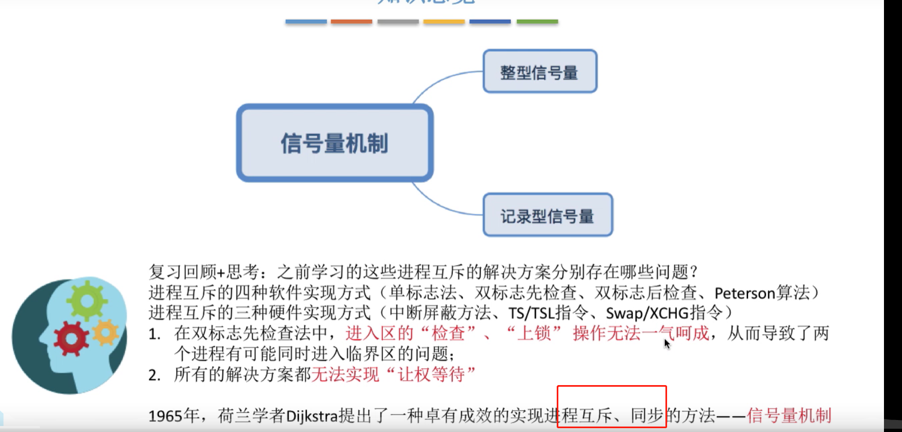
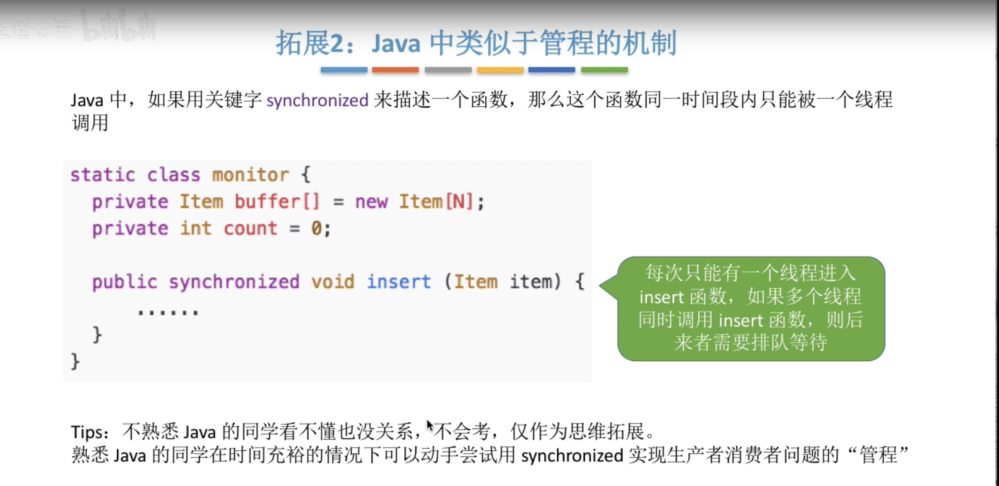

进程是程序的一次执行

线程是轻量级进程，所以后续的进程切换也可以是轻量级进程的切换 

计算密集，io密集

java 同步机制对比操作系统同步机制

包括TSL指令，swap指令，对应的comparetAndSet机制（CAS机制）

信号量机制对应的semaphore机制

·

进程同步：解决异步的问题，为了合作而协调出来的直接制约关系

互斥：由于临界资源访问限制而被迫追寻的制约关系

java 实现生产者消费者问题

https://blog.csdn.net/u013394527/article/details/80560153

https://blog.csdn.net/brycegao321/article/details/78783512

https://blog.csdn.net/yc______/article/details/84143866

