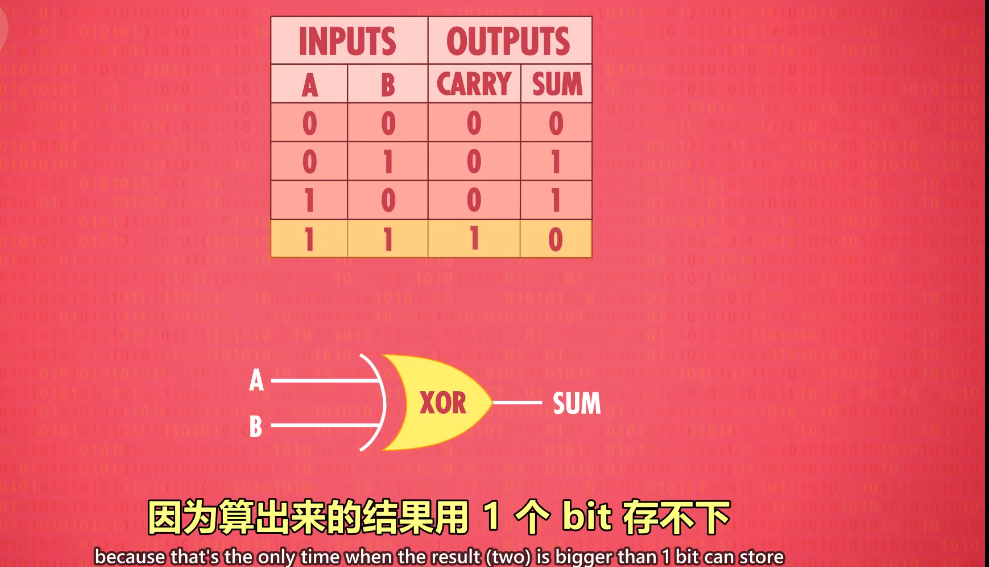

# 入门学习

[入门](https://www.bilibili.com/video/BV1EW411u7th?p=2&spm_id_from=pageDriver)

继电器 -> 真空管 -> 晶体管

异或的实现

32位浮点数字

ALU -ARITHMETIC LOGIC UNIT  算术逻辑单元

锁存器

多路复用器，将地址转换成行和列

win 32位和64的区别也包含这个，内存地址的表示范围，32位只能使用2G内存 20亿，int32表示范围，因为地址只能表示到2G

* 处理器，一块数据一块数据进行处理，一次只能处理32位，即4个字节的数据，而64位，一次可以处理64位

RAM就是更大规模的寄存器

cpu=ALU + MEMORY

控制单元也有自己的寄存器

32位或者64位指令长度

或者变长指令长度

算法的输入大小与运行步骤之间的关系----算法复杂度