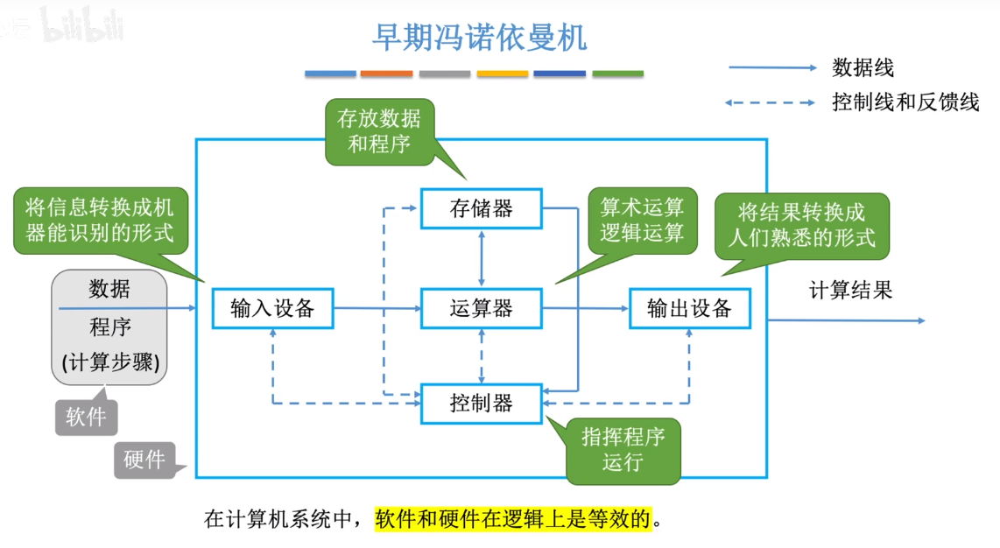
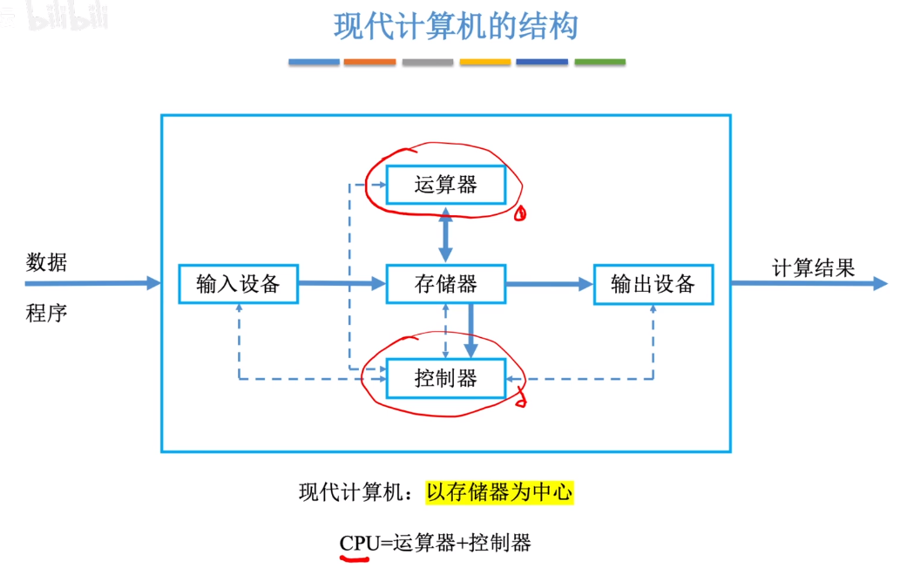
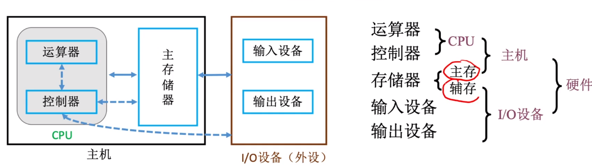
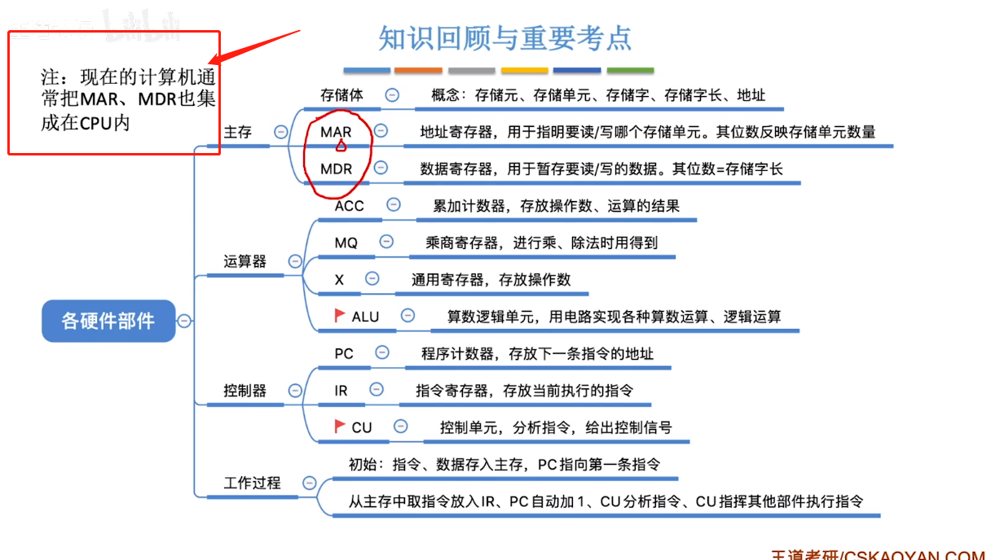

# 第一章 计算机概述

# 硬件的发展

逻辑元件

​	继电器

​	电子管

​	晶体管

​	集成电路：晶体管，电容等集成

机器字长：一次整数运算所能处理的二进制位数

机器语言

汇编语言：与机器语言一一对应，但是对人是较为友好，采用助记符。

高级语言：接近自然语言

## 计算机结构

冯诺依曼结构

​	存储程序：程序运行之前，指令和数据都会存到主存中。

以运算器为中心

现代计算机结构

## 主存储器

存储字长：存储单元中二进制数据的位数

存储二进制的电子元件就是电容的原理，存放1bit

ACC 累加器，X通用的操作数寄存器，MQ乘商寄存器都是是寄存器

