# 第二章

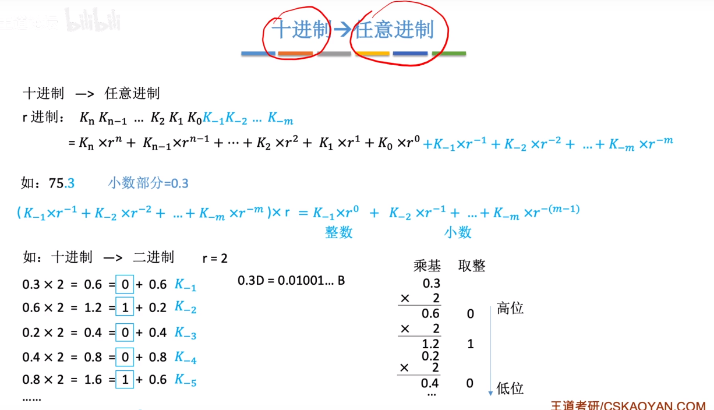

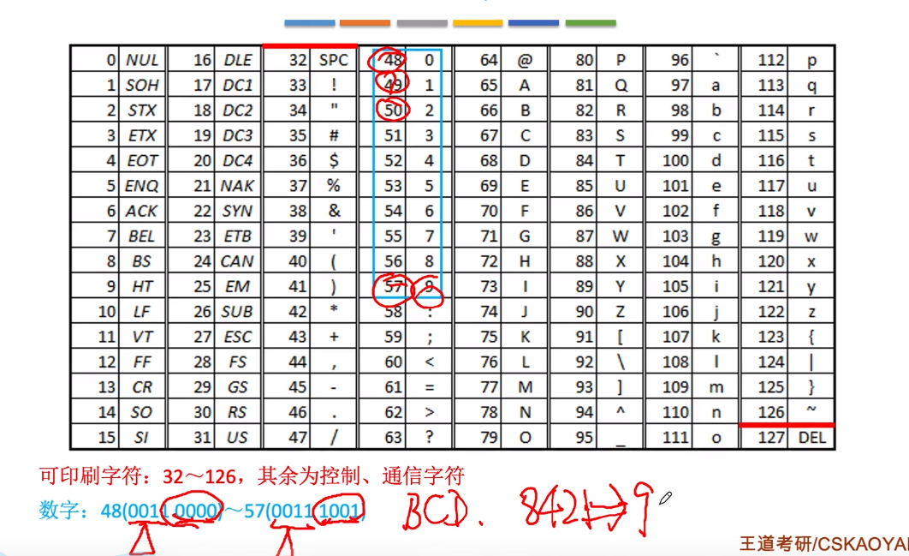

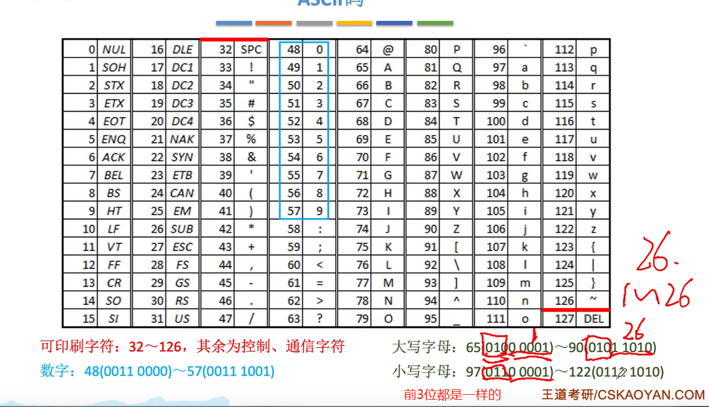

模2除：只要最高位1，商就为1；然后对除了第一位的其他位用模2减

模2减和模2加--都是异或操作

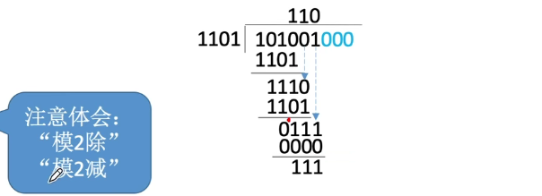

之所有叫循环冗余：

​	可以观察到：对余数001后面添0，执行模2除，就可以得到下一个余数，直到达到余数的位数代表的最大值(8)次之后，又从头开始

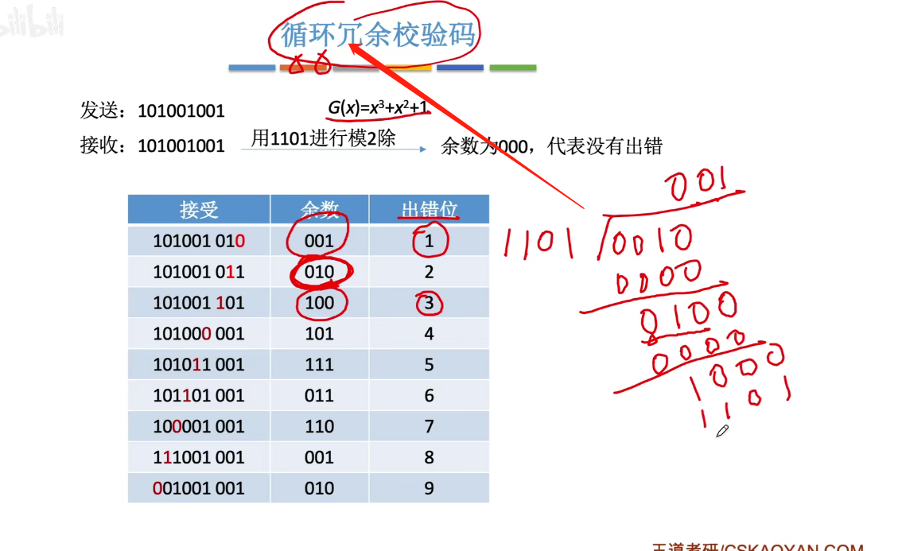

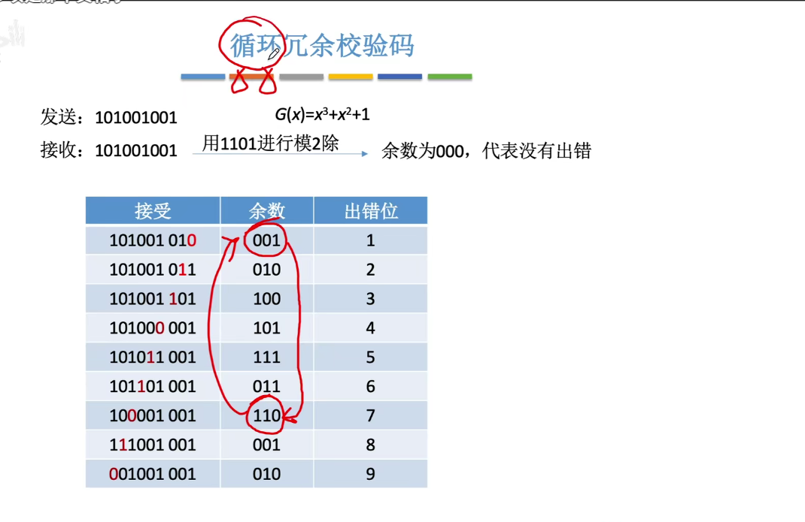

定点无符号数一般只有整数

补码没有正0和负0

补码转原码：对于负数，依然是先反码，再末尾加1

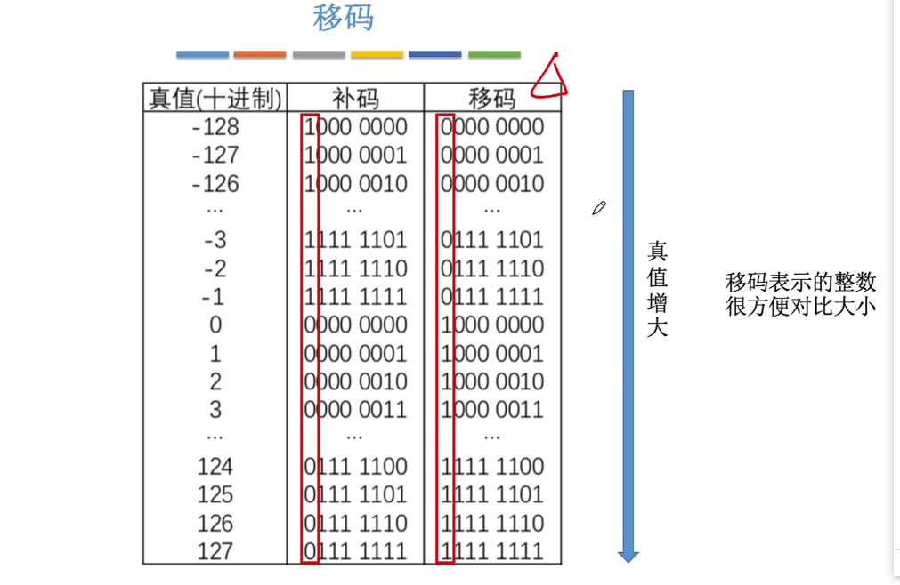

模运算：

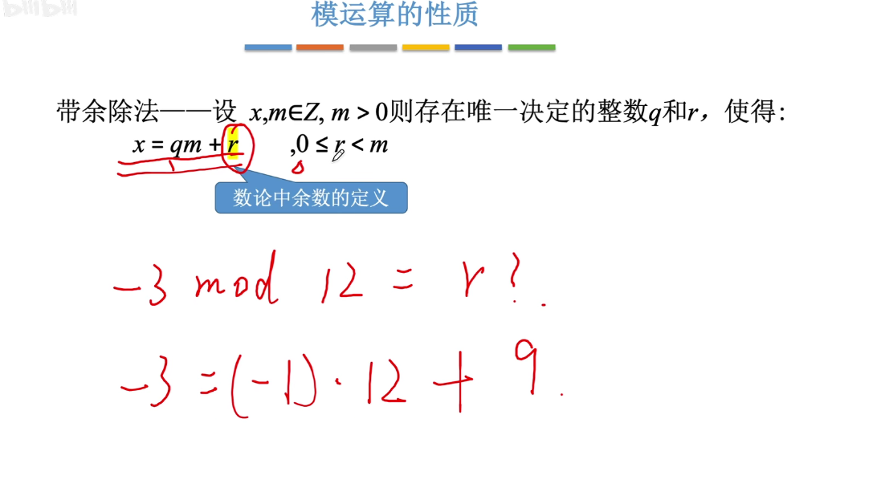

当位数超过了8位，相当于计算机天然地执行了mod 2^8^操作

补码的原生定义是模-a的绝对值

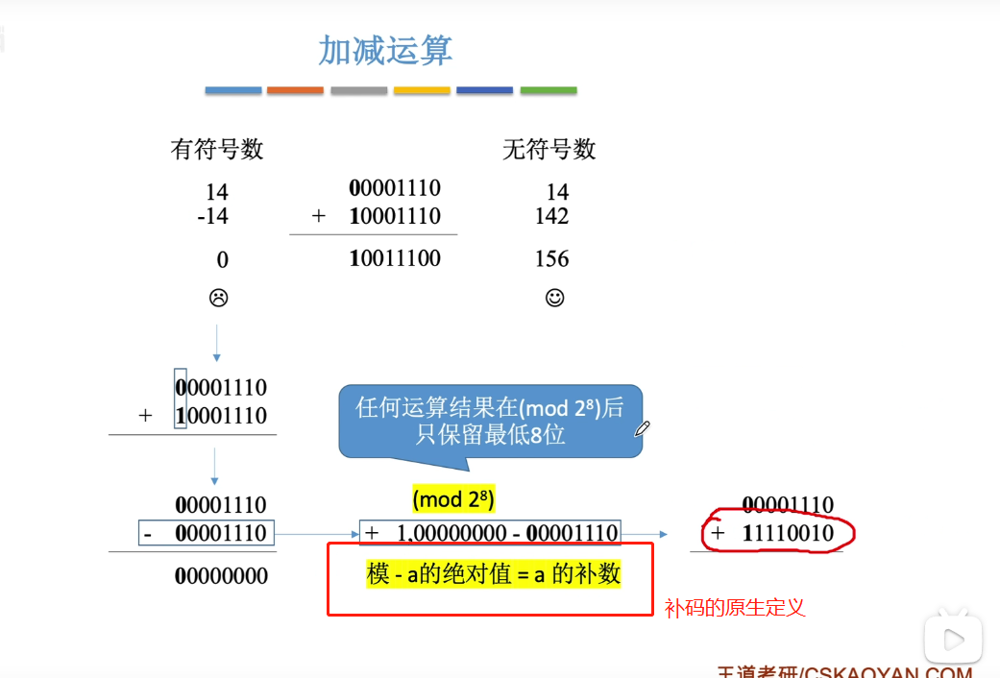

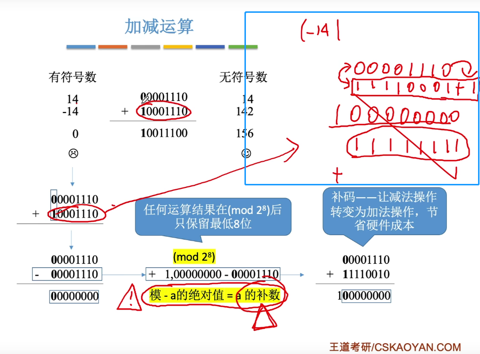

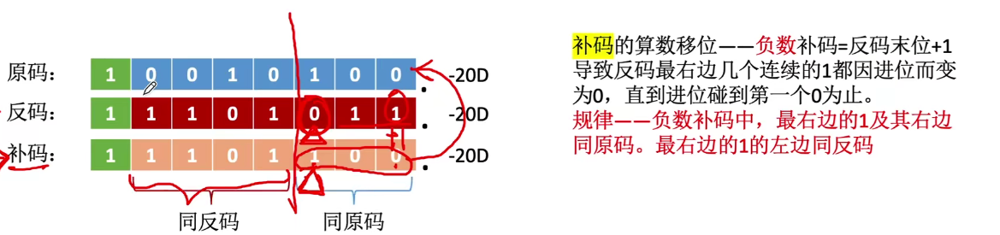

循环移位实现大端和小端的排列。

**负数补码转换为原码**的技巧：利用最后一个1作为分界线，左边与原码相反(除了符号位)，右边以及最右边的1与原码相同

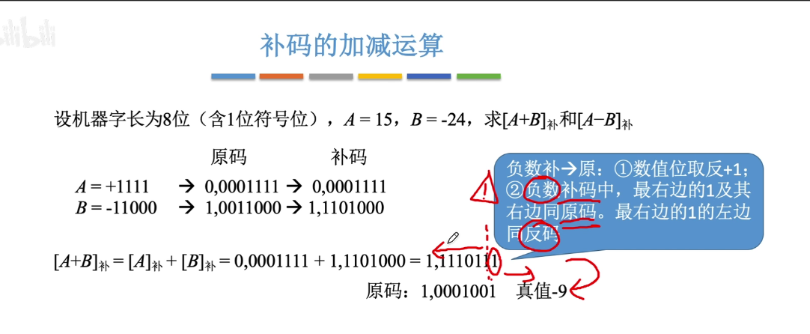

负数的原码转成补码也是类似的，保持最后一个1以及后面的不变，符号位到最后一个1之间的数取反。

对于[B]补转换为[-B]补，可以利用技巧，所有位+符号位取反，再加1

如果已知B为负数，那么就相当于是求原码，再将符号位置为0

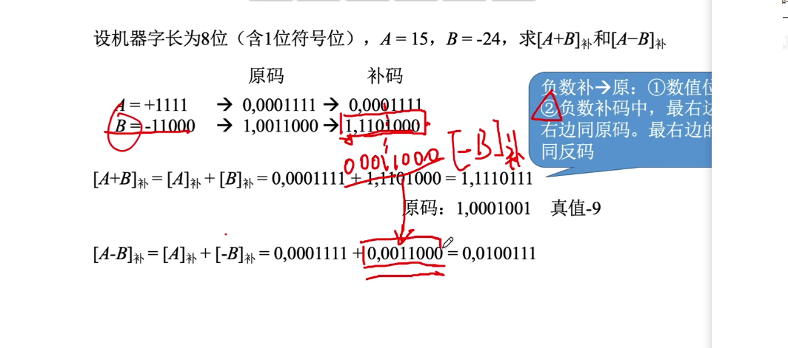

定点小数也是这样的，右边与原码一样，包括最后一个1

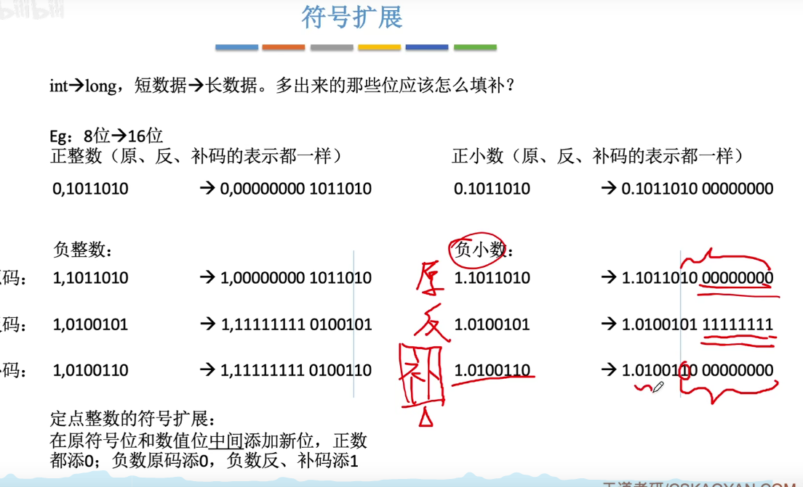

余数的含义：使用一个数乘以除数尽可能的接近余数，但又不超过余数

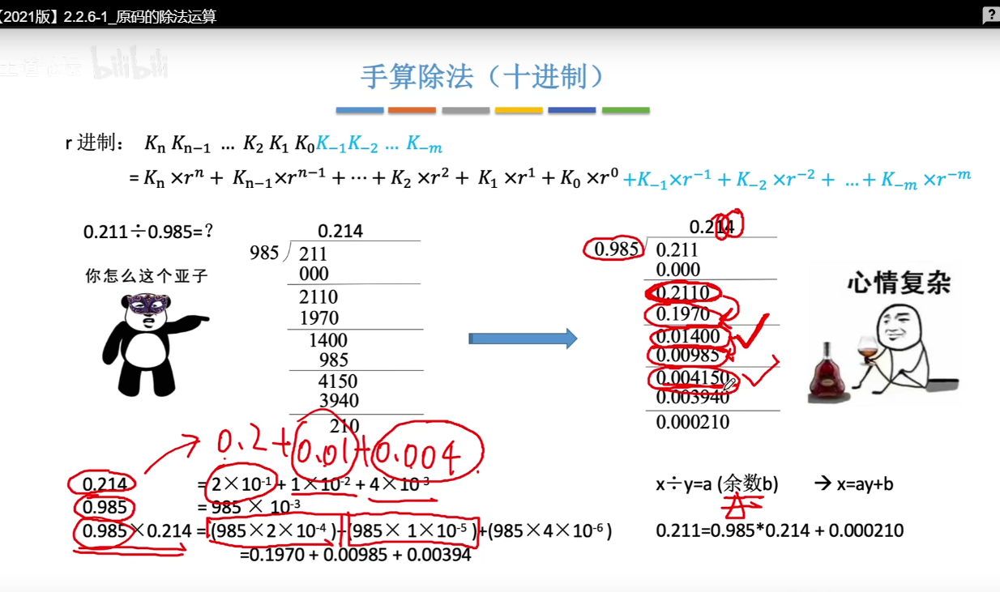

采用双符号位是判断溢出最常用的方式，因为当发生溢出的时候，是可以挽救的

第一个符号位是理应的正确符号位，如果第二个符号位与其不一样，就说明发生了溢出，这时只需要修正为第一个符号位可以了

加减运算背后都默认进行了模2^8^次方运算，所以一个数+2^8^ 实质上等价于该数

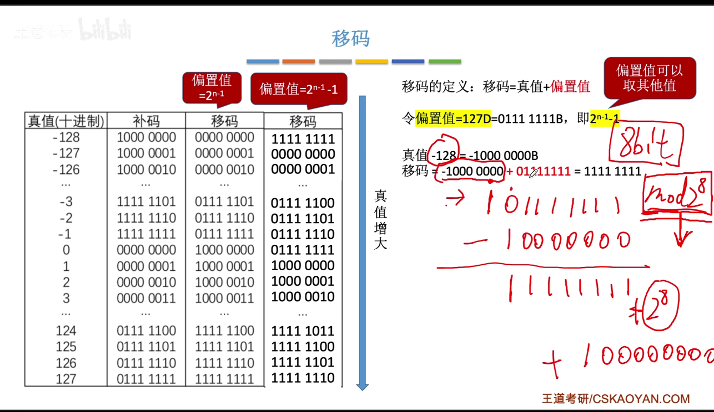
