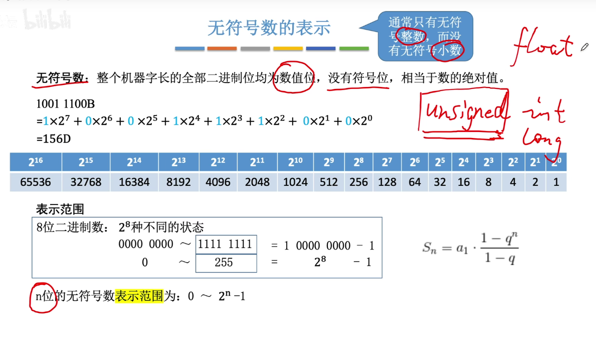
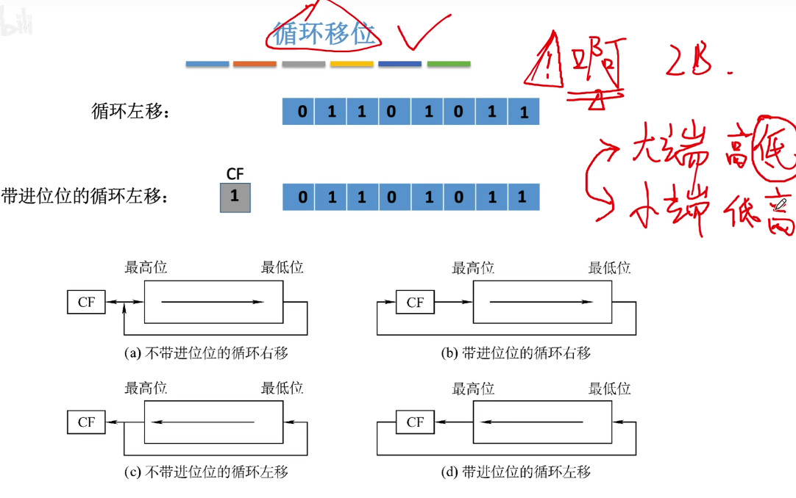

# 第二章

模2除：只要最高位1，商就为1；然后对除了第一位的其他位用模2减

模2减和模2加--都是异或操作

之所有叫循环冗余：

​	可以观察到：对余数001后面添0，执行模2除，就可以得到下一个余数，直到达到余数的位数代表的最大值(8)次之后，又从头开始

定点无符号数一般只有整数

补码没有正0和负0

补码转原码：对于负数，依然是先反码，再末尾加1

模运算：

当位数超过了8位，相当于计算机天然地执行了mod 2^8^操作

补码的原生定义是模-a的绝对值

循环移位实现大端和小端的排列。

**负数补码转换为原码**的技巧：利用最后一个1作为分界线，左边与原码相反(除了符号位)，右边以及最右边的1与原码相同

负数的原码转成补码也是类似的，保持最后一个1以及后面的不变，符号位到最后一个1之间的数取反。

对于[B]补转换为[-B]补，可以利用技巧，所有位+符号位取反，再加1

如果已知B为负数，那么就相当于是求原码，再将符号位置为0

定点小数也是这样的，右边与原码一样，包括最后一个1

余数的含义：使用一个数乘以除数尽可能的接近余数，但又不超过余数

采用双符号位是判断溢出最常用的方式，因为当发生溢出的时候，是可以挽救的

第一个符号位是理应的正确符号位，如果第二个符号位与其不一样，就说明发生了溢出，这时只需要修正为第一个符号位可以了

加减运算背后都默认进行了模2^8^次方运算，所以一个数+2^8^ 实质上等价于该数

机器字长，系统位数 

cpu位数通常与数据总线宽度(机器字长)是一样的。

https://blog.csdn.net/qq_27565063/article/details/53748879

目前都是64位机器字长的机器

https://www.cnblogs.com/fragrant-breeze/p/12307658.html

系统位数是指用的是多少位的指令集，64位指令集兼容32位

导致的影响就是，64位指令集，一次可以处理64位数据，因此可以使用64位的内存地址，所以比32位只能使用4G的内存要大。

https://www.cnblogs.com/little-ytmm/p/5058354.html

先说一下硬件方面的因素，在上面已经提到了地址总线，在计算机中 CPU的地址总线数目 决定了CPU 的寻址范围，这种由地址总线对应的地址称作为物理地址。假如CPU有32根地址总线（一般情况下32位的CPU的地址总线是32位，也有部分32位的CPU地址总线是36位的，比如用做服务器的CPU），那么提供的可寻址物理地址范围 为 232=4GB（在这里要注意一点，我们平常所说的32位CPU和64位CPU指的是CPU一次能够处理的数据宽度，即位宽，不是地址总线的数目）。自从64位CPU出现之后，一次便能够处理64位的数据了，其地址总线一般采用的是36位或者40位（即CPU能够寻址的物理地址空间为64GB或者1T）。CPU访问任何存储单元必须知道其物理地址。

在上面中有提到，用户使用计算机时，直接操纵的只能是逻辑地址，要经过操作系统的转换后才能变换为物理地址。如对于32位的操作系统而言，其**逻辑地址编码采用的地址位数是32位**，那么操作系统所提供的逻辑地址寻址范围为：232 = 22 * 230 = 4GB（所以在32位CPU和32位的操作系统中，最大支持的内存为4G）。但是理论上是4G的内存，在我们真正使用时并不到4G，大约只有3.2G左右。这是因为在intel x86架构下，采用的是**内存映射技术**(Memory-Mapped I/O, MMIO)，也就说将4GB逻辑地址中一部分要划分出来与BIOS ROM、CPU寄存器、I/O设备这些部件的物理地址进行映射，那么逻辑地址中能够与内存条的物理地址进行映射的空间肯定没有4GB了。

https://www.cnblogs.com/arun-python/p/14334363.html

对于32位的windows操作系统，其**逻辑地址编码采用的地址位数是32位**的，那么操作系统所提供的逻辑地址寻址范围是4GB

对于64位的操作系统，其**逻辑地址**编码采用的地址位数是40位，能够最大支持1T的逻辑地址空间。

[关于计算机 32位/64位CPU和3/64位操作系统联系区别](https://zhuanlan.zhihu.com/p/373644172)

64 位 CPU 装载 32 位操作系统，它的寻址能力还是4GB，那是因为32 位操作系统没有对应 64 位的寻址指令。假如32 位操作系统没有对应 64 位的寻址指令，它就不能提供4GB 以上的逻辑地址，所以 64 位 CPU 透过 32 位操作系统，它的寻址能力依旧是 4GB。

https://developer.aliyun.com/article/30317#:~:text=%E6%93%8D%E4%BD%9C%E7%B3%BB%E7%BB%9F%E7%9A%84%E4%BD%8D%E6%95%B0,%E5%B0%B1%E6%98%AF%E6%8C%87%E6%95%B0%E6%8D%AE%E6%80%BB%E7%BA%BF%E5%AE%BD%E5%BA%A6%E3%80%82

**操作系统位数的概念是基于CPU的位数的**

**CPU的位数是指CPU能一次同时寄存和处理二进制数码的位数，这和CPU中寄存器的位数对应**

**操作系统的位数是说其所依赖的指令集的位数**

cpu位数指的是寄存器和总线的位数

cpu位数指的是寄存器和总线的位数

double的有效尾数位为53位

