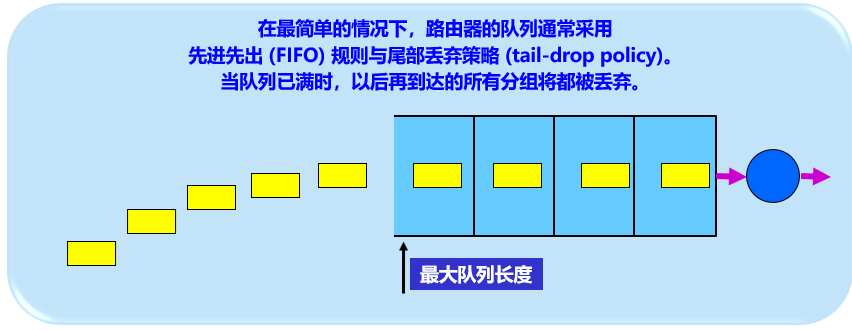
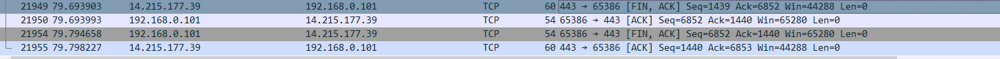
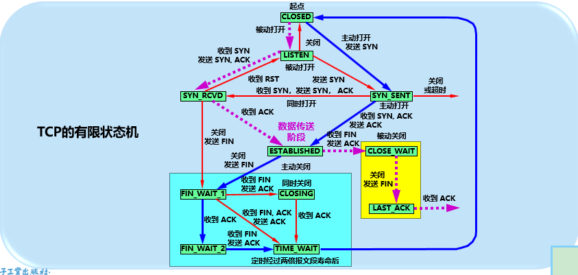

# 运输层

[TOC]

## 一、概述

### 1.1 运输层的作用

提供应用进程之间的逻辑通信（基于端口的复用和分用）；网络层则是为主机之间提供逻辑通信


### 1.2 TCP与UDP对比


​		

| 对比项   | UDP              | TCP                                      |
| -------- | ---------------- | ---------------------------------------- |
| 协议本质 | 无连接           | 面向连接                                 |
| 数据单元 | datagram 数据报  | segment 报文段， 基于字节流              |
| 传输形式 | 点播，多播，广播 | 点播                                     |
| 功能     | 差错检测         | 可靠传输，流量控制，拥塞控制，差错检测等 |
| 协议格式 | 首部8字节        | 首部20-60字节                            |
| 应用     | DNS,DHCP,RIP     | HTTP, STMP, FTP                          |


### 1.3 端口

* 作用：运输层为了使用统一的方法对TCP/IP体系的应用进程进行标识而引入，屏蔽强耦合进程号

* 端口使用16位的端口号来表示，公共允许有65535个端口号。

  > 所以一个主机上最多有65535个socket

* 端口分布：

  

  

## 二、UDP

### 2.1 概述

UDP仅仅在IP协议之上添加了复用和分用功能，以及差错检测功能。

### 2.2 特点：

* 无连接：发送数据前不需要建立连接。

* 尽最大努力交付：不保证可靠性，主机不需要维持复杂的连接状态

* 面向报文：即对于应用层交下来的报文，既不合并，也不拆分；对于网络层提交上来的报文，去除IP首部之后，直接交给引用层。即一次交付一个完整的报文。

  > 应用程序必须选择合适大小的报文。
  >
  > 如果报文太长，网络层IP在传送时可能需要进行分片，降低ip层效率。
  >
  > 如果报文太短，则ip数据报的首部占比达，也降低了ip层效率。

  

* 没有拥塞控制：源主机不会因为网络问题而降低发送速率。这对于实时媒体通信很重要。

* 支持单播，多播，和广播。

* 头部开销小：仅有8个字节。而TCP有20个字节。

### 2.3 协议格式

* 首部格式：8个字节

  > 可以看出端口是实现了分用复用，校验和实现了差错检查，除此之外没有其他功能了.
  >
  > 首部字段的长度，包括了首部和数据部分，因此至少是8字节

  

  在计算校验和的时候，

  * 先将一个12字节**伪首部**和UDP数据报连在一起，看成许多16位二进制数
  * 如果数据部分不是偶数个字节，需要填充0，以凑够偶数个字节
  * 按二进制反码计算出这些二进制数的和
  * 将结果的**反码**写入校验和字段
  * 接收方将接收到的数据(数据部分凑够偶数个字节)，利用二进制反码求和得出结果
  * 结果各位均为1说明无差错，否则有差错。

  > 伪首部：源IP地址(4字节)，目的IP地址(4直接)，保留字段(置为0，1字节)， 协议号(1字节，6是tcp，17是UCP)， 报文长度(UDP报文长度，包括首部和数据部分)
  >
  > 由于接收方校验时的数据部分是带有校验和的，校验和刚好是两个直接，也就是16位，假设没有差错，就相当于是校验和和校验和的反码进行求和运算，最后结果每一位都是1.
  >
  > 为什么需要伪首部？目的是为了让运输层能够确定报文是来源是正确的，而且是发给自己的。
  >
  > ip地址在中间环节可能会被修改，比如NAT网络地址协议的介入，校验和也随之修改，所以运输层还需要进行校验才能确定。
  >
  > 而长度，是为了避免填充的0和没填充0得到一样的结果
  >
  > 协议号则是为了避免收到了其他协议的数据

  校验和的计算：按**二进制反码求和**运算求和，结果再取反码

  > 二进制反码求和运算：
  >
  > 从低位到高位运算，
  >
  > 0+0=10        即产生一个进位
  >
  > 1+0=0+1=1
  >
  > 1+1=0
  >
  > 如果最高位发生了进位，最后得到的结果要加1。

  > **IP/ICMP/TCP/UDP等协议都是采用这种算法来计算校验和**
  >
  > IP数据报只校验首部，且不需要使用伪首部
  >
  > 
  >
  > UDP和TCP则将首部和数据部分一起都校验，需要使用到伪首部
  >
  > UDP的校验不是必须的

  

  > 为什么IP网络层已经校验了IP地址

  

  

## 三、TCP

### 3.1 概述：

在IP协议之上增加了**可靠交付**的的服务。

### 3.2 特点：

* 面向连接

* 提供可靠交付

* 面向字节流

  >  TCP不保证接收方接收到的数据块和发送方发出的数据块大小意义对应，但是可以保证字节流是完全一样的。
  >
  >  TCP对应用程序放入发送缓存中的报文，进行分段，分段的大小由对方的window窗口值和当前网络拥塞程度来决定一个分段有多少直接。

  

  

  

  ​			

  

*  拥塞控制

* 单播，不支持多播和广播

* 全双工通信

  > 全双工在物理层面是指通信线路上可以同时发送和接收数据。
  >
  > 在有线传输中，由于只能存在一种电信号，所以不存在双工之说，也是为什么需要在数据链路层的传输采用载波监听和碰撞检测技术来提高传输效率。
  >
  > 在无线传输中，基于码分复用，可以实现全双工。
  >
  > TCP的全双工通信是一个逻辑的概念，因为TCP基于连接，而在这个连接上客户端和服务器端都可以同时发送数据，所以认为是全双工的。UDP没有连接之说，每次发送都是单向的，所以一般不说UDP是全双工。


### 3.3 Socket

socket，套接字，由IP地址和端口号组成，是运输层进行通信的端点。

socket 其实就是一个五元组，包括：源IP, 源端口, 目的IP, 目的端口, 类型(TCP or UDP) . 这个五元组，即标识了一条可用的连接。

```shell
$ ss -antp | grep 7777
LISTEN   0   10 0.0.0.0:7777        0.0.0.0:*     users:(("ncat",pid=19208,fd=3))
ESTAB    0   0  127.0.0.1:7777   192.168.3.187:8888  users:(("ncat",pid=19208,fd=5))
ESTAB    0   0  127.0.0.1:7777      127.0.0.1:8888 users:(("ncat",pid=19208,fd=4))
ESTAB    0   0  192.168.3.187:8888  127.0.0.1:7777 users:(("a.out",pid=19340,fd=4))
ESTAB    0   0  127.0.0.1:8888      127.0.0.1:7777 users:(("a.out",pid=19340,fd=3))
```


### 3.4 为什么TCP是可靠的，如何实现

* 可靠指的是那些方面：

  * 传输信道不产生差错
  * 不管发送方发送速率多快，接收方总是来得及处理

* 如何保证

  

  * 【方法1】**停止-等待协议**，也叫**自动重传请求ARQ**(Automatic Repeat Request)：

    * 停止等待：发送完一个分组后暂停，等待确认

    * 超时重传---解决A可能无法知道B是否已收到的问题(可能分组有错，或者分组丢失)

      

    * 对分组进行编号---解决B收到重复分组无法区分的问题

      > 即时B已经确认过之前的，收到重复的，丢弃掉重复分组，也应当再次回送确认。
      >
      > B的发送的确认也需要编号，表明是对那个分组的确认。
      >
      > A根据确认及其编号，确认是对哪个分组的确认，避免重复发送；如果是重复的确认，则丢弃。

      

    > 注意，
    >
    > 为了实现超时重发，需要暂时保留已发送分组的副本。
    >
    > 分组和确认分组都需要进行编号。
    >
    > 超时重传时间应当比1次平均RTT时间更长

    停止等待协议的优点是简单，缺点是信道利用率太低。因为需要等待分组确认之后才会发送下一个分组。

    可以通过流水线传输提高效率，即可连续发送多个分组，不必每发完一个分组就等待确认之后再发送。。

    

    

  * 【方法2】**连续ARQ协议**

    * 思想：

      * 一次发送多个分组

        > 这里的分组，等同于字节

      * 使用**滑动窗口**控制发送和接收的数量和编号

        > TCP协议的精髓
        >
        > 位于发送窗口的分组可以连续发送出去，不需要等待确认，随着发送的进行，窗口越来越小，直到收到确认之后，右边界才会右移，允许发送更多的分组。

        

        

        

        

      * 收到确认后，将发送窗口**向前滑动**

        > 注意，编号其实就是字节的序号，实际上不可能在每个字节中保存序号，序号是保存在segment中的，segment包含了很多字节(和MSS有关)。
        >
        > TCP中所有的确认都是基于字节的序号，而不是基于segment。

        

      * 接收方则采用**累积确认**的方式

        > 累积确认，不需要对收到的每一个分组都发送确认，而是**对按序到达的最后一个分组进行确认**。

      * 重传方式为**回退N(Go Back N)**

        > 由于采用的是累积确认的方式，那么发送方无法精确知道接收方那些未收到，所以从上次接收方确认的分组编号之后的N个分组都会重传
        >
        > 这种方式在通信质量不好时，会适得其反。

        

      

### 3.5 TCP可靠传输的实现细节

* 基于**字节的滑动窗口**

  * 发送窗口和接收窗口

    发送窗口：在没有收到确认的情况下，可以连续发送出去

    接收窗口：只允许接收落入窗口的数据(可以不按序接收，会等待未按需到达的数据q)

    > A的发送窗口和B的接收窗口不总是一样大的，因为有时间滞后
    >
    > TCP标准没有规定如何处理为按需到达的数据，通常实现是将其留在接收窗口中，等待缺少的字节到达之后再交付
    >
    > TCP要求接收方有累积确认的功能，以减少传输开销，但不应过分推迟，以免发送方超时重传。
    >
    > 接收方不必单独放确认，可以携带数据。

  * 窗口的变化

    发送窗口：左边界右移---接收到确认     右边界右移---窗口允许情况下

    接收窗口：左边界右移---发送了确认     右边界右移---窗口允许情况下

    

    

    

    

    

    

  * **发送缓存与接收缓存**

     

     

     

* **超时重传时间如何选择**

   计时器是基于报文段segment的，每发送一个报文段，就会为其设置一个计时器。

   时间过短，容易导致不必要的重传，时间过长，网络空闲时间长

   重传时间的选择是最复杂的问题之一，因为

   * 往返时延方差大： 由于IP数据报所选择的路由变化很大，所以往返时间RTT的方差比较大

     

   这就需要一个动态的算法来确定，因此TCP采用自适应算法，动态维护一个超时重传时间RTO(Retransmission time-out)。

   RTO依赖于**RTTs**(RTT的加权平均）和**RTTd**(RTT偏差的加权平均)。
   $$
   RTO = RTT_s + 4 * RTT_d
   $$

   $$
   RTT_s = (1-α) * RTT_s + α * RTT
   $$

   $$
   RTT_d = (1-β) * RTT_d + β * |RTTs-RTT|
   $$

   其中RTTs初始值为第一次计算得出的RTT；RTTd初始值为0.5RTT

   RFC 6298建议α为0.125，即1/8；β为0.25，即1/4

   > 1. 如何得知RTT，报文的选项中记录了，报文发出的时间以及受到相应确认的时间，计算出当时的报文段往返时间。
   >
   > 2. 计算RTT时，如果知道接收到的是对重传之后的确认还是之前的确认？Karn算法采用的是只要重传了，就不会作为样本进行计算。
   >
   > 3. 如果重传了报文，如果网络时延增大了，导致一直接收不到确认，会导致一直重试，而重传时间也得不到更新的死循环。
   >
   > 4. 修正的Karn算法：每重传一次，就RTO增大一次。当没有了重传之后，才会根据上面的公式进行更新RTO。γ一般取2。
   >    $$
   >    RTO= γ * RTO
   >    $$
   >    

   

* **选择确认SACK**：

  解决因为未按序到达，前面因为少数字节未到达而导致重传大量重复的数据。

  发送方和接收方可以商定使用选择性确认，在首部选项中附带上不连续的数据块的左右边界，重传方可以根据此信息选择性重传。

  


### 3.6 TCP的流量控制

TCP采用**可变的滑动窗口**实现流量控制。

所谓流量控制就是让发送方发送速率不要太快，既要接收方来的及接收，也不要使得网络堵塞。

流程：**rwnd** -- Receiver Window


* **零窗口锁死问题**：当接收方的窗口从0恢复到可以接收数据时，可能出现死锁。因为后一次的ACK可能会丢失。

这个问题是使用**持续计时器** **persistence timer**来解决，当发送方接收到接收方的rwnd=0的时候，就会启动这个计时器，当计时器时间到期后，会发送一个**零窗口探测报文段** (仅仅只有1字节)，对方在确认这个报文的时候就会返回rwnd，从而打破死锁


**如何控制TCP报文段的发送时机呢**

> 由于有缓存的存在，可以从空间和时间的方面考虑
>
> 上面两种策略都是被动的，还应当提供主动方式

可能的策略：

* 【时间】计时器期限到了，就将当前缓存中的数据装进报文段(即时比MSS小)进行发送
* 【空间】当缓存中的字节数达到MSS(指的是数据部分)时，就组装成segment进行发送
* 【主动】通过将PUSH标志位置1，实现推送的效果

具体实现：==Nagle算法==  

>  可以设置 TCP_NODELAY 选项 来禁用 Nagle 算法


**发送方糊涂窗口综合征**：每次只发送一个字节的有效数据，即小包发送

> 由于需要考虑拥塞控制，
>
> 时间策略改成收到对前一个报文的确认才会发送下一个报文段
>
> 空间策略改成达到接收窗口的一半或者达到MSS就发送
>


**接收方糊涂窗口综合征**：

> 由于应用进程从接收缓存读取速度太慢，接收方发送窗口大小为1直接的更新报文，发送方就只发送1个字节，然后接受方回复窗口已满，一次循环，降低效率。
>
> 解决办法：让接收方等待一段时间，使得接收缓存有足够的空间容纳一个MSS长度的报文段，或者接收窗口有一半空闲的空间，再发出确认报文(或者回答窗口探测报文)，并向发送方通知当前窗口大小。
>


​	

### 3.7 TCP的拥塞控制

流量控制的背压机制只考虑**接收方**的情况，未考虑整条**全局**链路。

流量控制是点对点通信量的控制，而拥塞控制是一个全局性的过程。


* 拥塞现象：当对网络资源的需求大于所能提供的部分，网络性能就会变坏。

* 拥塞的因素：缓存容量，链路容量，处理机处理速率，拥塞会加剧拥塞

* 增加资源不一定能解决拥塞，反而可能是的网络性能更坏。因为增加网络某个环节的资源增加，会将瓶颈转移到其他地方，而且可能因为该环节的资源增加，给下游更大的压力。

  > 比如增加缓存，但是链路容量和处理机的速度未得到提升，超时的数据会更多。

* 拥塞控制的原理

  * 前提：网络能够承载现有的网络负荷
  * 分组丢失是网络发生拥塞的**征兆**而不是原因
  * 拥塞控制不得当，反而可能是造成网络性能恶化，甚至死锁的原因。
  * 与流量控制一样，拥塞控制也是一个动态问题

* 两种控制方式

  

  * 闭环控制措施：
  
    * 【监控】何时发生，何处发生
  
      路由器：缓存空间不足而丢失分组占比
  
      路由器：平均队列长度
  
      发送方：超时重传分组数
  
      发送方：分组时延平均值，标准差
  
    * 【预警】传递到可采取措施的地方
  
    * 【预案】调整网络系统的运行，以解决问题
  
* ==**TCP 拥塞控制**==

  TCP采用**基于窗口的方法**进行拥塞控制(闭环控制)。

  

  

  TCP发送方维护一个拥塞窗口cwnd(Congestion Window)
  $$
  发送窗口swnd = min(接收窗口rwnd, 拥塞窗口cwnd)
  $$

  * **原则：**

    * 只要没有发生拥塞就增大窗口
    * 只要出现或者可能出现就缩小

  * **判断是否拥塞**

    * 已经发生拥塞-----重传定时器超时
    * 可能会出现拥塞----收到3个重复的ACK

  * **控制算法：RFC 5681**

    * 慢开始 slow start
    * 拥塞避免 congestion avoidance
    * 快重传 fast retransmit
    * 快恢复 fast recovery

  * **控制过程----未发生拥塞**

    * 慢开始 slow start

      * 目的：用于确定网络的负载能力和拥塞程度

      * 思路:  从小到大指数调整窗口数值

      * 实现：两个变量 拥塞窗口 cwnd 和  慢开始门限  ssthres

        每收到一个对新报文的确认(重传报文的确认不算)，cwnd至多增加一个SMSS(sender Maximum Segment Size)的数字。
        $$
        cwnd = cwnd + min(N, SMSS)
        $$
        N是刚收到确认的报文段的字节数。

        为了简单起见，**每一个报文**确认后在之前的基础上加1，经过一个传输轮次(1次RTT时间)后，cwnd就会翻倍，所以慢开始的增长速率呈现指数级别。

        

        

    * 拥塞避免 congestion avoidance

      目的： 使得cwnd缓慢增大，避免拥塞

      思路：线性增大cwnd

      实现：每一个轮次，cwnd = cwnd + 1

      		

  * **控制过程--发生了拥塞**

    不管是在慢启动过程发生了拥塞，还是拥塞避免过程，只要重传定时器超时，就认为网络发生了拥塞。应当迅速减少发送的分组数，使得链路得以处理积压的分组

    两个变量变化如下
    $$
    ssthres = max(cwnd/2,2)
    $$

    $$
    cwnd = 1
    $$

    然后执行慢启动过程。

  * **控制过程----可能发生了拥塞**

    * 可能发生了拥塞的情况----收到基于快重传算法的3次重复的ACK

      * **[快重传  fast retransmission](https://www.isi.edu/nsnam/DIRECTED_RESEARCH/DR_WANIDA/DR/JavisInActionFastRetransmitFrame.html)** 要求接收方不要等待自己发送数据的时候才捎带确认消息，而是要立即发送确认，即时收到了**失序**的报文，也要立即发出对已收到报文段的确认
      * 如果有个别报文段丢失了，后续达到的报文都会使得接收方发送同样的ACK，发送方就可以收到多个重复的ACK
      * 当收到3个重复的ACK时，发送方知道接收方确实没有收到报文，会立即进行重传，避免出现超时的情况使得发送方误认为发生了拥塞。

      > 快重传并没有取消重传计时器，而是可以更快的重传丢失的报文段

      

      * 与此同时，当发送方收到3个重复的ACK时，发送方可以认为网络可能并没有发生拥塞，从而执行快恢复算法：
        $$
        ssthres = cwnd / 2
        $$

        $$
        cwnd = ssthres
        $$

      * 此后执行拥塞避免算法。

      > 拥塞避免为加法增大，快恢复为乘法减小，所以可以合并为AIMD算法

> 由此可见，发送窗口的上限值有以下公式决定
> $$
> swnd = min(rwnd, cwnd)
> $$


### 3.8 AQM (Active Queue Management) 主动队列管理

* 目的：避免网络层出现**全局同步**的现象。

  TCP的拥塞控制是针对全局的，而链路中大部分是由3层路由器来实现数据的转发，所以TCP的拥塞控制与网络层的采取的策略密切相关。

  其一、如果路由器对某些分组处理时间比较长，可能导致发送方超时，而此时网络并未真正拥塞。

  其二、如果路由器采用先进先出队列 + 尾部丢弃策略(tail drop policy)，则可能导致一连串多个TCP连接上的分组同时丢失，引发大规模的拥塞控制，出现全局同步现象，通信量大幅下降。

  

  

  

  


* AQM的思路：不要等到路由器队列长度达到极限才丢弃； 且不要一刀切。要实现智能化管理。

* AQM的实现：

  * 实现1：随机早期检测 RED (Random Early Detection)   效果不是太理想，2015年deprecated

    对每一个到达时的分组都会计算队列的**平均长度L**

    * 当L大于队列长度**最小门限**，直接进入队列排队
    * 当L大于队列最小门限，小于队列最大门限时，按照一定的**概率**进行丢弃
    * 当L大于队列**最大门限**时，直接丢弃

  

  


### 3.9 TCP 报文段segment格式

TCP虽然是面向字节流的，但是传送数据单元是报文段segmenet。

TCP所有的功能都提现在首部各个字段的作用。

* 首部：

  * 固定20个字节 + 4n字节拓展选项。即最小长度是20

    

    | 字段              | 长度                 | 备注                                                         |
    | ----------------- | -------------------- | ------------------------------------------------------------ |
    | 源端口 src port   | 2字节                | 端口就是16位的                                               |
    | 目标端口dest port | 2字节                |                                                              |
    | 序列号seq         | 4字节                | 每个字节都有一个编号<br />序列号就是报文数据部分的第一个字节的编号<br />刚好是一个int32类型 |
    | 确认号ack         | 4字节                | 期望收到对方下一个报文段数据的第一个字节的序号               |
    | 数据偏移offset    | 4位                  | 即首部长度，因为首部可拓展，所以使用offset来标记数据部分距离报文起始处的距离。<br />单位是4字节，如果offset是32，说明从128开始才是数据部分 |
    | 保留字段          | 6位                  | 保留为今后使用，目前置为0                                    |
    | URG               | 1位                  | 紧急标识，等于1表明报文段中有紧急数据，应当尽快传送<br />相当于高优先级数据 |
    | ACK               | 1位                  | 确认标识，等于1表明对对方数据的接收确认，此时ack号才有意义   |
    | PSH               | 1位                  | 推送标识，等于1表明发送方立即创建报文段进行发送；接收方立即交付给应用进程，不再等到缓存填满才向上交付 |
    | RST               | 1位                  | 复位标识，等于1表明TCP连接中出现严重差错(主机崩溃或其他原因)，必须释放连接，重新建立运输连接。 |
    | SYN               | 1位                  | 同步标识，等于1表明请求连接或者接收连接                      |
    | FIN               | 1位                  | 结束标识，等于1表明数据已发送完毕，请求释放连接              |
    | 接收窗口window    | 2字节                | 窗口，用来给对方设置发送窗口的依据，单位是字节。<br />window=8，表示对方应当设置8字节的窗口。最大是64K字节<br />窗口值时动态变化的 |
    | 校验和checksum    | 2字节                | 用伪首部和报文段连接起来进行校验。<br />TCP的校验包括首部和数据。 |
    | 紧急指针          | 2字节                | 表明报文段中紧急数据总共有多少字节。紧急数据总是在数据部分的最前面。 |
    | 选项              | 可变长度，最长40字节 | 见下表                                                       |
    | 填充              |                      | 为了使得头部为4字节的整数倍                                  |

    | 选项字段                                    |            |                                                              |
    | ------------------------------------------- | ---------- | ------------------------------------------------------------ |
    | 最大报文长度 MSS <br />maximum segment size | 4字节      | 告诉对方，我的接收缓存中所能接收的报文的**数据字段**的最大长度。<br />MSS与接收窗口没有关系，太小则tcp头部占比大，太大，ip层会分组，开销都增大。 |
    | 窗口扩大选项<br />window scale              | 3字节      | 为了扩大窗口。<br />1个字节的移位S值：最大为14，可使得窗口值为2^(16+14)-1<br /> |
    | 时间戳选项                                  | 10字节     | 包括时间戳和时间戳回送回答字段。<br />用于计算RTT：报文的发送时间和所确认的上一个报文的发送时间<br />发送用于防止序号绕回：因为序号是4字节，只有2^32个序号，使用完了，就会重复使用。现在的网速很快，为了区分不同的序号。 |
    | 选择确认选项<br />SACK                      | 至多16字节 | 发送方和接收方商定好是否允许SACK，即Selective ACK选择性确认。开启后至多发送4个数据块的左边界和右边界，使得重传方只需要传送缺少的数据，而不需要重传已经到达的数据。 |

    

### 3.10 TCP 建立连接

[参考1](https://www.eet-china.com/mp/a44399.html)

TCP连接是一个抽象的概念，并不是在通信双方建立信号隧道，**本质上是双方各自维护所需的状态**，达到连接的效果。

* 连接建立的目的：

  1. 确认双方收发能力正常
  2. 双方协商参数，比如初始序列号，窗口大小，是否使用窗口扩大选项，MSS选项，时间戳选项，是否使用SACK(选择确认)，服务质量等
  3. 预分配资源(比如缓存大小，连接表的项目)

* 连接建立的方式：客户-服务器方式

* 3次握手过程

  

  * 文字描述
    
    1. 客户端发送SYN报文，进入SYN-SENT状态，等待服务器确认
    
       > SYN=1, seq=x  表明传送数据时的第一个字节序号是x
    
    2. 服务器发送ACK报文，同时发送SYN报文(SYN=1,ACK=1,seq=y,ack=x+1)，进入SYN-REVC状态，等待客户端确认
    
       > SYN=1,ACK=1,seq=y,ack=x+1 表明我的第一个字节序号为y,我期望下一个收到的第一个序号为x+1
       >
       > SYN是为了将自己的初始序列号告诉客户端
    
    3. 客户端发送ACK报文(ACK=1,seq=x+1,ack=y+1)，进入ESTABLISHED状态; 服务器收到ACK报文也进入ESTABLISHED状态
    
       > ACK=1,seq=x+1,ack=y+1 表明我的第一个字节需要为x+1,我期望收到的第一个字节序号为y+1
    
  * 实操：

    

    * SYN
    
      
    
    * SYN+ACK
    
      
    
    * ACK
    
      

  

  * **为什么需要3次握手**：**1.考虑第二次报文可能丢失（无法确认收发能力，序列号无法同步，服务端进入无效连接。所以需要B保持可重传）；2.考虑已经失效的链接请求突然到达（服务端进入无效连接）**


  [参考](https://www.geeksforgeeks.org/tcp-3-way-handshake-process/)

  * **确认双方的收发能力**   即客户端发包收包，服务器发包和收包的能力

    1. 第一次握手：通过收到客户端的SYN请求，服务器确认客户端发包和服务端收包正常

    2. 第二次握手：通过收到服务端的SYN+ACK请求，客户端确认客户端发包，服务端收包、客户端收包、服务端发包正常

       > 因为这个响应是基于SYN请求的，是由服务器收到了SYN才会响应，所以间接确认了客户端发包，服务器收包正常。

    3. 第三次握手：通过收到客户端的ACK请求，服务器确认客户端收包和服务端发包正常

  * **序列号可靠同步**

    如果没有第三次握手，服务器也无法确认客户端是否已经接收到了自己发送的**初始序列号**ISN(Initial Sequence Number)。因为第二次握手可能没有成功，这样客户端没有接收到服务器的初始序号，这样基于序列号的分段传输就不再可靠了。

    > ISN，初始序列号，是TCP发送方的字节数据编号的起始点，告诉对方开始发送数据的初始序列号。
    >
    > 为了安全起见，ISN是动态生成的，为了避免攻击者猜到而发送伪造的RST报文。

  * **阻止已失效的连接请求突然到达服务器**

    由于某种原因，客户端先后发出两次SYN报文，比如说服务器的SYN+ACK延迟了

    * 第二次先到，完成了请求，关闭连接之后，第一次的SYN到达
      * 【没有第三次握手】B直接进入ESTABLISHED，但是A已经没有建立连接的需求，不会理会发过来的SYN+ACK，相当于B建立了无效的连接，浪费服务器资源
      * 【有第三次握手】A不会对旧SYN+ACK进行确认，B就不会建立连接。

  * **避免资源浪费**

    如果服务器发送完SYNC+ACK, 直接进入Established状态，而客户端没有收到报文，那就只有等到服务器超时释放资源，

  

* **三次握手可以携带数据吗？**

  第一次的SYN和第二次的SYN+ACK是不能携带数据的。

  第三次是可以携带数据的。

  > 试想：如果第一次可以携带数据，那么攻击者就可以在SYN中放入大量的数据，服务器需要大量的内存空间来缓存这些报文，加剧洪泛攻击的危害。
  >
  > 对于第三次握手，由于client已经处理ESTABLISHED状态，他已经知道服务器的收发能力都是可以的，所以可以携带数据。
  >
  > 事实上在HTTPs的握手过程中，客户端的ACK和Client Hello就是同步时发送出去的。所以TCP+TL总共是3RTT
  >
  > 


* **TCP 连接队列**

  [参考1](https://www.cnblogs.com/xiaolincoding/p/12995358.html)

  

  

  

  

  * 类型：

    * 半连接队列(SYN队列)：进入SYN-REVC状态的连接会进入半连接队列。
    * 全连接队列(Accept队列)：已经完成3次握手，内核将连接从SYN队列中移除，创建一个新的连接对象放入Accept队列，等待进程调用accept函数，将连接取出来。

  * 大小限制

    SYN队列和Accept队列均有长度限制，超过限制，内核会直接丢弃，或返回RST包

  * 实操：

    * 全连接队列

      * 查看最大长度

        ```shell
        #利用ss，即socket statistics工具来调查socket
        # -l 显示listening的socket
        # -n 不解析服务名称
        # -t 只显示tcp socket
        $ ss -lnt
        State  Recv-Q  Send-Q    Local Address:Port    Peer Address:Port 
        LISTEN 0       50              0.0.0.0:10912        0.0.0.0:*    
        LISTEN 0       50              0.0.0.0:9092         0.0.0.0:*    
        LISTEN 0       50              0.0.0.0:2181         0.0.0.0:*    
        LISTEN 0       128             0.0.0.0:28070        0.0.0.0:*    
        LISTEN 0       50              0.0.0.0:2182         0.0.0.0:*    
        LISTEN 0       50              0.0.0.0:31175        0.0.0.0:*    
        LISTEN 0       128             0.0.0.0:27017        0.0.0.0:*
        ```

        > Revc-Q: 当前队列大小，即完成3次握手并等待服务端accept()的TCP连接个数。
        >
        > Send-Q: 最大队列大小
        >
        > 注意：如果使用ss -nt查看非[listenint]状态的情况，Recv-Q表示已经收到但未被应用程序读取的字节数， Send-Q表示已发送未收到确认的字节数

      * 查看溢出情况

        当超过了TCP的最大全连接队列程度，服务端会放弃后续进来的TCP连接，丢掉的TCP连接的个数会被统计起来

        ```shell
        # 查看TCP全连接队列溢出情况(累计值)
        $ data; netstat -s | grep overflowed
        Sun Nov 28 15:03:56 CST 2021
            733434 times the listen queue of a socket overflowed
        ```

      * 溢出处理策略

        ```shell
        # 查看溢出处理策略
        # 0 表示如果全连接队列满了，server丢掉client发过来的ACK，此时还在半连接队列中
        # 1 表示如果全连接队列满了，server发送一个reset给client，表示废掉这个握手过程和这个连接
        $ cat /proc/sys/net/ipv4/tcp_abort_on_overflow
        0
        ```

        > 如果想知道客户端连接不上服务器，是否是因为全连接队列满的原因，那么可以把tcp_abort_on_overflow设置为1，如果客户端中看到很多connection reset by peer错误，则可以证明是因为TCP连接队列溢出的问题
        >
        > 通常情况，设置为0，可以应对突发流量。因为server求丢弃掉ACK，并没有把半连接也丢掉了，此时客户端为ESTABLISHED状态，客户端会发送请求到服务器，只要server没有为请求回复ACK，客户端就会多次重发。如果服务器上的accept队列有空位了，就会因为接受到请求报文包含有ACK，就会触发服务成功建立连接。
        >
        > 上述情况的客户端的ACK请求有可能包含了应用数据。

      * 调整最大长度

        Accept队列最大长度取决于内核somaxConn配置与函数参数backlog(积压)的最小值。即min(somaxconn, backlog);

        somaxconn是linux内核参数，默认值128

        backlog是应用程序调用listen(int sockfd, int backlog)时候传入的，不同的应用程序的默认值不一样，比如Nginx默认是511

        ```shell
        # 查看somaxconn方式1
        $ cat /proc/sys/net/core/somaxconn
        128
        
        # 查看somaxconn方式2
        # -a 查看全部linux内核配置
        $ sysctl -a | grep net.core.somaxconn
        128
        
        # 修改somaxconn方式1
        $ echo 1024 > /proc/sys/net/core/somaxconn
        
        # 修改somaxconn方式2
        # 立即生效
        $ sysctl -w net.core.somaxconn=1024
        # 永久生效还需要在配置文件上增加配置项
        # vim /etc/sysctl.conf
        net.core.somaxconn=1024
        # -p 使配置生效
        $ sysctl -p
        ```

        > 重新设置全连接队列之后，需要重启调用listen方法才会生效。

    * 半连接队列--- SYN队列

      * 查看最大长度

        无法直接通过ss命令查看，我们可以根据半连接说处于的状态SYN-RECV来统计。

        如果发起洪泛攻击之后，依然是256，说明半连接队列最大长度就是256。

        ```shell
        # 使用netstat 统计tcp 连接处于 SYN-RECV状态的TCP连接个数
        # -n 不解析服务名称
        # -a 包括listening和not listening的socket
        # -t 仅显示tcp 连接
        # -p 显示pid
        # 使用wc 打印输入的new line,word, byte 数量
        # -l newline,打印输入的行数
        $ netstat -antp | grep SYN_RECV | wc -l
        256
        ```

      * 模拟SYN队列溢出：

        客户端只发送SYN包，不发送ACK包，使得服务器存在大量的SYN_RECV状态的TCP连接。

        这就是**SYN洪泛，SYN攻击，DDOS攻击**。

        ```shell
        # 使用hping3工具模拟SYN攻击
        # -S 执行TCP的标志位SYN
        # -p 指定探测的目标端口
        # --flood 以洪泛的方式攻击
        $ hping3 -S -p 8088 --flood 192.168.3.200
        ```

      * 查看溢出情况

        ```shell
        # 使用netstat 查看半连接队列溢出情况（累计值）
        $ netstat -s | grep "SYNCs to LISTEN"
        733740 SYNs to LISTEN sockets dropped
        ```

      * 溢出处理策略

        开启syncookies功能可以在不使用SYN半连接队列的情况下成功建立连接。否则会丢弃。

        > 如果没有开启syncookies功能，则默认会丢弃。如果开启了，那么从SYN+ACK消息总获取到了syncookie的客户端，发送ACK消息会包含syncookie，这样服务器在识别校验合法之后，就可以不经过SYN半连接队列建立连接。
        >
        > syncookies有3个值：
        >
        > 0--表示关闭
        >
        > 1--表示半连接队列放不下时，再启用
        >
        > 2--表示无条件开启

        ```shell
        # 调整synccookies参数
        $ echo 1 > /proc/sys/net/ipv4/tcp_syncookies
        ```

      * 溢出条件

        * 对于linux2.6.32版本

          理论值max_qlen_log= min(max_sync_backlog, min(somaxconn, backlog)) * 2;

          即半连接队列的理论长度为设置的sync backlog与全连接队列最大长度的较小者的两倍。

          队列溢出的条件：

          1. 没有开启tcp_syncookies, 半连接队列溢出，则丢弃
          2. 全连接队列溢出，且还有没有重传SYN+ACK包的连接，则丢弃
          3. 没有开启tcp_syncookies，且当前半连接数超过3/4 max_syn_backlog, 则丢弃

        * 对于linux5.0.0版本

          理论值max_qlen_log=min(somaxconn,backlog)

          队列溢出的条件：

          1. 【相同】没有开启tcp_syncookies, 半连接队列溢出，则丢弃
      
                	  2. 全连接队列溢出，则丢弃
                  	  3. 【相同】没有开启tcp_syncookies，且当前半连接数超过3/4 max_syn_backlog, 则丢弃
      
       * 调整半连接队列
      
         除了调整max_syn_backlog之外，还应当调整全连接队列的长度
      
           ```shell
           # 调整max_syn_backlog
           $ echo 1024 > /proc/sys/net/ipv4/tcp_max_syn_backlog
           # 调整somaxconn
           $ echo 1024 > /proc/sys/net/core/somaxconn
           ```
      
    * 应对SYN攻击
      
      * 开启tcp_syncookies
      
      * 增大半连接队列
      
      * 减少SYN+ACK重试次数
      
        当服务器收到SYN攻击的时候，就会有大量处于SYN_RECV状态的TCP连接，如果没有收到ACK，就会重传SYN+ACK，重试一定次数，才会断开连接
      
          ```shell
          # 调整SYN+ACK重试次数
          $ echo 1 > /proc/sys/net/ipv4/tcp_synack_retries
          ```
      
          

  * **实例：**

    * 实例1：zookeeper 全连接队列50个，一个client默认60个连接

      ```
      # 相关配置
      clientPortListenBacklog：linux上默认50个
      ```

      

    * 实例2：tomcat 连接队列

      > 《tomcat-8.5-doc》
      >
      > Each incoming, non-asynchronous request requires a thread for the duration of that request. If more simultaneous requests are received than can be handled by the currently available request processing threads, additional threads will be created up to the configured maximum (the value of the `maxThreads` attribute). If still more simultaneous requests are received, Tomcat will accept new connections until the current number of connections reaches `maxConnections`. Connections are queued inside the server socket created by the **Connector** until a thread becomes avaialble to process the connection. Once `maxConnections` has been reached the operating system will queue further connections. The size of the operating system provided connection queue may be controlled by the `acceptCount` attribute. If the operating system queue fills, further connection requests may be refused or may time out.

      * [tomcat 线程模型](https://developpaper.com/nio-optimization-principle-and-tomcat-thread-model/)

        [中文翻译](https://segmentfault.com/a/1190000024540660)

        tomcat 自8.0之后采用NIO作为默认的IO线程模型，取代BIO；之后还有AIO(NIO2), ARP。

        > AIO, 适合连接数多，且连接较长(重操作)的架构，比如相册服务器，可以充分调用OS参与并发操作，编程较为复杂。
        >
        > ARP, tomcat 以JNI形式调用http服务器的核心动态链接库来处理文件读取和网络操作，需要编译安装ARP库(即IO操作直接通过调用native代码实现)

        1) tomcat的BIO模型

        		**Acceptor**：负责调用accept方法，接受连接，交给Handler工作线程池处理
    				
        		**Handler**:  针对每一个请求的连接，Handler工作线程池都会分配一个线程，执行后面的步骤(read,decode,process,encode, send)

        > 这种方式的缺点在于等待读写就绪的过程中，cpu是空闲的，

        2) tomcat的NIO模型

          	**Acceptor**：负责调用accept方法，拿到socket对象，然后封装成channel对象，注册到Poller中(注册成pollEvent，放到event队列中)

        ​	**Poller**:  维护了一个Selector对象，当selector从队列中取出连接后，开始阻塞等待读写就绪(read等待就绪，write等待就绪)
        
        ​	**Handler**：selector遍历找出其中就绪的IO操作，通知Handler交给worker线程处理(read内存读,decode,process,encode,send内存写)

  * tomcat connector参数设置

    * minSpareThreads ：工作线程池最小线程：默认10
      
    * maxThread：工作线程最大线程；默认200
      
      > 经验值：1C2G 200线程  4C8G 800线程
      
    * maxConnections：accept的最大连接数；默认8192。accept之后，Poller就会监听事件，相当于在处理请求了。
      
    * acceptCount：最大等待accept的连接数，即全链接队列里面的数量。默认100。仅仅修改这个值不一定有用，还需要需改net.core.somaxconn，两者的最小值生效。

  * 实操：[查看tomcat的线程](https://www.cnblogs.com/kismetv/p/7806063.html )
    

  

### 3. 11 TCP 关闭连接

* 双方都可以发起释放请求

  

* **文字描述**

  * A发送FIN报文给B，进入FIN-WAIT1状态

    > FIN报文发出后，不再发送数据
    >
    > FIN=1,seq=u

  * B发送ACK报文给A，进入CLOSE-WAIT状态；A收到后进入FIN-WAIT2状态

    > ACK报文发出后，通知应用进程，发送剩余的数据。
    >
    > ACK=1,seq=v,ack=u+1

  * B发送FIN+ACK报文给A，进入LAST-ACK状态

    > 待应用进程数据发送完后，发出FIN报文，后续不再发送数据，可以释放连接
    >
    > FIN=1,ACK=1,seq=w,ack=u+1

  * A发送ACK报文给B，进入TIME-WAIT状态；A经过2MSL后，进入CLOSED状态；B收到后进入CLOSED状态

    > ACK=1,seq=u+1,ack=w+1
    >
    > MSL -- Maximum Segment Life 最长报文段寿命， 一个报文段可以存在于互联网系统中的最大时间
    >
    > RFC793建议设置MSL为2分钟，这样一个TCP连接最后还要等待4分钟才能释放，目前的网络环境一般可优化，目前一般设置为60s。
    >
    > ```shell
    > $ cat /proc/sys/net/ipv4/tcp_fin_timeout
    > 60
    > $ echo 120 > /proc/sys/net/ipv4/tcp_fin_timeout
    > # 重新加载配置文件
    > $  sysctl -p /etc/sysctl.conf
    > # 查看
    > $ sysctl -a | grep fin
    > ```

* **实操**

  

  * FIN

    

  * ACK

    

  * FIN+ACK

    

  * ACK

    

  

* **为什么需要第四次挥手**   **1.考虑第3次的Fin报文丢失**（A以为B还有数据要发送，无法进入关闭状态，需要B保持可重传）

  第四次回收是A对B的ACK。

  如果没有这个ACK，服务器直接进入关闭状态，而A没有收到FIN+ACK报文，以为B还有数据要发送，就不会关闭资源。所以**B必须保持可重传FIN**的状态。

  >  因为TCP是全双工的，所以不管是建立连接还是关闭连接，都必须受到对方的确认才能真正的建立和关闭，否则可能因为前面报文的丢失，导致只有一方处于连接或者关闭状态，所以必须受到ACK之后才能真正建立或者释放连接。
  >
  >  如果没有最后一次ACK：
  >
  >  对于建立连接，如果SYN+ACK丢失，就只有服务器建立了连接
  >
  >  对于关闭连接，如果FIN+ACK丢失，就只有服务器关闭了连接

  

* **为什么需要等待2MSL**   1. **考虑ACK报文可能丢失**（需要A保持可重传）  2. **考虑接受到旧连接的报文段**

  * 尽可能保证A的ACK报文可以到达B

    > 如果A的ACK报文丢失，B就可以超时重传FIN+ACK报文，A在2MSL时间内收到这个重传的报文，TIME-WAIT timer 时间等待计时器就会重置2MSL的时间。
    >
    > 1个MSL 是给ACK报文传输，另一个MSL是给超时重传的FIN+ACK传输。
    >
    > 服务器在1MSL没有收到ACK，就会重发FIN+ACK；FIN+ACK最晚到达时间是2MSL。
    >
    > 如果没有等待，A直接进入CLOSED状态，那么B就可能收不到ACK，重传报文得到A的RST报文，==**误认为是有异常发生**==。

    为什么建立连接不需要呢，因为关闭资源更为重要，可以避免浪费，而建立连接的时候，就算ACK丢失了，对服务器的影响并不大。

    实际使用中可以通过设置SO_REUSEADDR来重用地址，而不必等待2MSL才释放端口，适用于解决在服务器重启的时候报Address already in use异常。

    > MSL & RTT & TTL
    >
    > MSL - maximum Segment lifetime 最大报文生存时间
    >
    > RTT - round-trip time 往返时间   单向时延 = 传输时延 + 传播时延+ 排队
    >
    > 		传输时延：从进入节点到传输媒体的事件，等于数据块长度/信道带宽
    > 					
    > 		传播时延：等于信道长度/传播效率 （光纤中电磁波的传播速率约为210^5 km/s，铜缆中2.310^5 km/s）
    > 					
    > 		排队时延：随机噪声，由链路中的每一跳设备以及收发两端的负载情况和吞吐决定。包括互联网设备和传输设备时延。
    >
    > TTL - 针对ip数据报而言，指数据报可以经过的最大路由数。

  * 防止已失效的报文段出现在本连接中。

    > MSL是报文段在互联网中的最大生命，设置2MSL就可以保证经过这个时间后，这条连接持续时间内产生过的报文都不存在与互联网中。
    >
    > 如果没有等待，A直接进入CLOSED, 可能导致前一个连接的数据被新的连接接收，如果序号刚好对上了，就会解析到错误的数据，如果序号不对就会RST掉。
    >
    > 情况1：A接收到B重传的FIN+ACK，返回RST，造成**异常出现**
    >
    > 情况2：B对A以前的SYN回复SYN+ACK，如果A已经开启新的连接，会有**异常出现**。
    >
    > 

  

* **TIME_WATI可能导致什么问题，如何解决**

  [参考1](https://www.cnblogs.com/kevingrace/p/9988354.html)

  > 1万条TIME_WAIT的连接，也就多消耗1M左右的内存.

  * 【场景1】高并发，短连接场景，当服务器请求完后主动关闭连接，服务器可能有大量的TIME_WAIT状态的连接，服务器维护每一个连接都需要一个socket，一个socket对应了一个文件描述符，而文件描述符是有限的，可能导致连接数不够

    解决：
  
    *  修改TIME_WAIT的时间，通过tcp_fin_timeout参数，一般是60s。也就是说现在很多实现的MSL都是30秒了。
  
      
  
      ```shell
      # 统计各种状态TCP连接数量
      $ netstat -n | awk '/^tcp/ {++state[$NF]} END {for(key in state) print key,"\t", state[key]}'
      LAST_ACK 1
      SYN-RECV 14
    ESTABLISHED 79
      FIN_WAIT1 28
      FIN_WAIT2 3
      CLOSING
      TIME_WAIT 1669
      
      # 修改TIME_WAIT timer 时间
      $ cat /proc/sys/net/ipv4/tcp_fin_timeout
      60
      
      # 下面的一般不会修改，可了解
      # tcp_tw_timestamps 用于开启TCP首部时间戳选项，可以计算出RTT
      # tcp_tw_reuse 当主动关闭的一方，再次连接对方，就可以复用socket
      # tcp_tw_recycle  会回收处于timewait状态下的socket
      $ vim /etc/sysctl.conf
      net.ipv4.tcp_tw_reuse = 1
      net.ipv4.tcp_tw_recycle = 1
      net.ipv4.tcp_tw_timestamps = 1
      ```
  
    * 设置[SO_REUSEADDR选项](https://cloud.tencent.com/developer/article/1484223)，使得服务器处于TIME_WAIT状态的socket可以立即被使用，避免重新启动时因为端口还在占用而无法成功。
  
      > 这个也不是没有代价的，带来的[风险](https://stackoverflow.com/questions/3229860/what-is-the-meaning-of-so-reuseaddr-setsockopt-option-linux)是新启动的socket接收到旧数据，或者新的数据被旧的socket收到了。
  
  * 【场景2】如果非高并发场景，单个连接的操作频繁，可以使用长连接，避免tcp的断开和连接
  
  
  
* **CLOSE_WAIT状态过多，如何解决**

  [参考1](https://www.cnblogs.com/kevingrace/p/9988354.html)

  * CLOSE_WAIT可能是网络拥塞，导致数据发送缓慢，可以先排查网络是否发生了拥塞

  * CLOSE_WAIT状态可能是应用程序迟迟没有关闭连接导致，可以排查应用代码, 比如是没有调用close或者响应速度太慢。

  * 除此之外，可以通过调整tcp的参数，缩小CLOSE_WAIT的时间限制
  
    比如调整tcp_keepalive_time，默认值时2个小时，可以调整为1200或者1800秒。
  
    
  
* **保活计时器有什么用**

  为了防止客户端主机崩溃，无法释放连接，造成资源浪费。

  服务器每次接受到客户端的数据，就会重置保活计时器，时间通常是2个小时。

  如果两个小时没有接受到客户端的数据，就会发送探测报文段。此后会每75秒发送一次，如果连续10次没有收到客户端的回应，就会关闭连接。

  ```shell
  # 保活计时器,到时间会触发探测报文
  $ cat /proc/sys/net/ipv4/tcp_keepalive_time
  1200
  # 探测报文发送间隔
  $ cat /proc/sys/net/ipv4/tcp_keepalive_intvl
  75
  # 探测报文发送次数
  $ cat /proc/sys/net/ipv4/tcp_keepalive_probes
  9
  ```


## 四、总结

[总结1](https://writings.sh/post/network-tcp#%E7%A1%AE%E8%AE%A4%E5%8F%B7%E5%92%8C%E7%B4%AF%E8%AE%A1%E7%A1%AE%E8%AE%A4)  [LIVE DEMO](https://www2.tkn.tu-berlin.de/teaching/rn/animations/gbn_sr/)





* **TCP 中的定时器**

  | 序号 | 定时器                            | 时 间 | 任务描述                                                     |
  | ---- | --------------------------------- | ----- | ------------------------------------------------------------ |
  | 1    | 建立连接定时器                    | 3秒   | 用于建立连接过程，重新发送SYN包                              |
  | 2    | 重传定时器                        | RTO   | 用于超时重传机制，时间内没有收到ACK报文，则重新发送          |
  | 3    | 持续计时器<br />persistence timer |       | 用于流量控制过程，当发送方收到接收方的窗口为0后开启，超时，则发送探测报文，避免接收方的窗口扩大后的通知丢失造成死锁 |
  | 4    | 延迟应答计时器                    |       | 用于延迟应答(捎带ACK)。为了提高网络传输效率，当服务器接收到客户端的数据后不是立即回复ACK给客户端，而是等待一段时间，等到服务端有数据需要方给客户，再捎带ACK一起发送给客户端 |
  | 5    | 保活计时器                        |       | 用于探测TCP连接是否还存活，在建立连接时指定SO_KEEPALIVE才会生效。 |
  | 6    | FIN_WAIT2定时器                   |       | 用于避免主动方迟迟无法收到被动方的FIN报文而无法关闭连接的情况。<br />当处于FIN_WAIT2状态下，超时没有收到FIN报文，则会直接释放连接 |
  | 7    | TIME_WAIT定时器                   |       | 用于保证主动方的ACK可以到达被动方；且可以避免旧连接的报文出现在性的连接中。 |

  

* **TCP 如何保证可靠性的**

  由于实际网络存在==**失真，丢包，乱序，延迟**==问题，可靠传输需要解决这些问题，还要考虑使流量控制与拥塞控制，使得==**接收方来得及消费数据，网络链路不至于过载**==问题。

  涉及的实现：ARQ协议(自动重传协议)，滑动窗口协议，AQM协议(自动队列管理)协议，拥塞控制算法等。

  通过TCP的首部就可以看出TCP为了保证可靠性引入的机制。

  * 解决报文传输过程出现差错----**增加差错校验**

    使用12字节的伪首部加TCP报文段利用二进制反码求和再取反码计算校验码，接收方同样添加伪首部进行解码，验证数据无差错

  * 解决乱序问题---**字节序号与确认序号**

    通过Sequence Number序列号解决乱序问题，TCP按照报文字节进行编号。

  * 解决丢包与延迟问题---**超时重传与确认应答**

    通过Acknowledgement Number确认序列号解决丢包问题，用于确认对方已经接收到了那些包，丢失的包会进行重传。

  * 增加流量控制---**滑动的发送窗口与接收窗口**

    通过Window 窗口设置来解决流控问题。双方都有发送缓存和接收缓存，发送窗口和接收窗口。

    双方通过首部字段的接收窗口来沟通当前的接收窗口，发送窗口将考虑对方的接收窗口来发送数据。

  * 增加拥塞控制---**拥塞窗口**

    当刚开始传输以及网络可能发生或者已经发生拥塞时，通过不同的算法控制拥塞窗口，避免向网络中注入过多数据。

    

* **TCP中的确认机制**

  * 累计确认：接收方不需要对每一个报文段进行确认，只需要对按序到达了的最大的序列号进行确认

    * 发送方只需要收到一个ack，就可以确认前面的数据都已经被接收到了
    * 缺点：如果中间miss了某个报文段，发送给对方的确认好就是这个miss的报文段的序号，对方会重传该序号开始往后的报文，即使有些报文已经接收到了。

    > 累计确认与快速重传要求的对每一个报文进行立即确认是[不冲突](https://www.youtube.com/watch?v=TBii-a0XY3o)的，因为如果报文ack丢失了，发送端依然可以根据累计确认的规则，知道前面那些已经接收到了。

  * 延迟确认：未确认的包达到了一定的时间阈值或者达到了一定的量，才会恢复确认。

  * 选择确认：支持根据4个数据块的左右边界来重传缺失的数据。


* **TCP中的重传机制**

  * 超时重传：每发送一个报文段，就设置一个计时器，超时则触发重传。

    > 采用自适应算法，基于加权平均的方法。
    >
    > 重传失败了就会发送复位信号，放弃当前连接。

  * 快速重传 ：如果收到3次重复确认(总共4次ACK)，就会在超时之前立即重传。避免超时，误认为是网络拥塞。

  

* **UDP为什么是不可靠的？bind和Connect 对于UDP的作用是什么**

  * 为什么是不可靠的
    * UDP没有发送缓存，只有接收缓存。只要有数据就发送，新到的数据如果无法进入接收缓存就会丢弃。
    * 没有流量控制与重传机制。
  * bind 和connect
    * UDP中调用connect只是将对端的IP和端口记录下来，而且可以多次调用connect，来指定一个新的IP和端口。将端口记录下来有助于提升效率，增加稳定性。
    * 发送方调用bind操作，可以为套接字指定一个端口，避免内核随机分配端口，从而一定程度上提高效率。

  

* **TCP中的ARQ协议**

  ARQ协议是TCP为了实现可靠传输提出的协议。可以从4个情形来理解。

  * 无差错
  * 出现差错：丢包或者校验失败，发送方超时重传
  * 确认丢失：确认报文丢失，发送方超时重传，接收方再次发送确认报文
  * 确认延迟：确认报文延迟，发送方超时重传，接收方再次发送确认报文，发送方收到重复的确认包会丢弃。

  

* **TCP的最大连接数限制**

  * Client端：client每次发起连接请求都需要一个端口，或者自行指定，或者系统随机选择，端口是16位二进制表示，所以最多可以有65535个端口(0号端口不可用)，其中只有1024到65535是用户使用的端口。

  * Server端：server通常是固定在某个端口进行监听，等待client的请求。即时server有多个ip，端口也是独占的。因此server的TCP连接4元组中只有客户端ip和port是可变的，因此理论上最大的tcp连接数可以是ip数量*端口数量，即2^32 * 2^16 = 2^48个连接。

    但是由于实际环境中，有些ip和端口具有特殊意义而不开放，机器资源和操作系统的限制，是达不到理论值的。

    通过增加内存，修改最大文件描述符个数等参数，可以使得单机并发TCP连接数超过10万是没有问题的。比如Nginx就需要调优使得连接数可以达到10万级别。

    > 限制：文件描述符限制
    >
    > ​	每一个tcp连接都要占用一个文件描述符，否则将会报错“too many files”
    >
    > ```shell
    > # 查看一个进程的文件句柄限制
    > $ ulimit -n
    > 65535
    > # 临时设置最大值10万
    > $ ulimit -n 1000000
    > ```


* **TCP如果接受方窗口满了，发送方会怎么做**

  接收方窗口满了，在首部字段的window为0，告诉发送方我的接收窗口大小为0。此时发送方会等待对方发送非0的接收窗口大小过来。但是接收方的ACK包可能丢失，为了避免因此造成的死锁。发送方会利用持续计时器来周期性的发送探测报文, 一般得知窗口是否变大。


* **TCP拥塞控制的算法**

  * 慢启动：小包探测，每个传播轮次之后，cwnd = 2*cwnd，直到cwnd=ssthres(慢开始门限)
    * 出现超时重传(网络拥塞)，ssthres = cwnd / 2;  cwnd=1； 然后进入慢启动
    * 出现3ACK(网络可能拥塞)时，执行快恢复，ssthres = cwnd/2;  cwnd = ssthres，然后进入拥塞避免
  * 拥塞避免：每个传播轮次后，cwnd=cwnd+1
  * 快重传:  每收到报文段就立即发送确认，即时收到失序的也要发送。当发送方收到3个重复的ACK时，知道数据已经丢失，立即进行重传，而不等到超时才重传
  * 快恢复：结合快重传使用。

  

* **TCP粘包拆包**  读zhan

  * 为什么会发生  **根本原因是TCP基于字节流**

    * 拆包：大包拆包
      1. 应用程序写入数据大于发送缓冲区大小
      2. 应用程序写入数据大于MSS(最大报文段长度)
    * 粘包：小包粘包
      1. 应用程序写入数据小于发送缓存区大小，由于TCP默认使用Nagle算法，收到一个确认或者达到事件阈值或者控制阈值才会发送下一次数据，这些小的数据包积压之后就会粘包放到报文段中进行传输
      2. 由于流量控制导致数据包积压，会基于窗口粘包就行发送。

    > 对应的接收方，如果发现了拆包，粘包之后需要处理之后才交给上层的应用程序

  * 解决方法：

    * 变长消息长度：在消息的头部添加消息长度字段，根据长度字段解析消息
    * 固定消息长度：每次读取固定长度解析消息
    * 设置消息边界：根据分隔符解析消息，比如换行符

  * 什么时候需要处理：

    接收端同时受到多个分组，而且这些分组之间毫无关系时，需要处理；

    如果多个分组属于同一个数据的不同部分，不需要处理。


* MSS与MTU
  
  * MTU maximum transmission Unit 最大传输单元
  
    * 应用于数据链路层，限制了数据链路层上可以传输的数据包大小
  
    * 由硬件规定，比如以太网的是1500字节
  
      
  
  * MSS maximum segment size最大报文段大小
    * 应用于传输层，限制了TCP每次传输的最大报文段的大小。
    * 由TCP连接双方在建立连接的时候协同商定，由 MTU 减去20字节的IP协议头和20字节的TCP协议头，MSS 最多不能超过MTU - 40字节


* **SYN FLOOD是什么，如何防范**

  [参考1](https://dun.163.com/news/p/69294ba2366f49ae9f21d904f661023c)

  SYN FLOOD是一种典型的DDos(拒绝服务)攻击，目的是通过消耗服务器资源使得服务器无法用于处理正常请求。

  * 原理：

    通过重复发送SYN包，将TCP半连接队列塞满，使得正常连接请求无法进行。由于攻击方不会响应SYN+ACK报文，服务器将会默认重试5次重传SYN+ACK报文，重试间隔每次都翻倍，1s + 2s + 4s + 8s +16s = 31s，直到31+32秒之后才会释放该无效连接。

    因此对于一个假的SYN报文，占用服务器1分钟这就，半连接队列长度有限，比如是1024个(查看tcp_max_syn_backlog)，只需要200个请求每秒就可以撑爆队列。

  * 解决：

    * 调整重试间隔，重试次数，减少资源占用
    * 识别恶意ip，设置白名单进行过滤

    上面两种不能从根本上解决，因为都已经分配了传输资源块。

    * 使用syn cache: 用于缓存半连接信息，当收到客户端的ACK之后，才会分配传输资源块。

    * 使用syn cookie：允许服务在SYN队列被填满是避免丢弃连接，表现得好像SYN队列扩大了一样。
      * 原理是在首部序列号字段，设置为通过特定规则生成的cookie，当客户端返回ACK信息时，还原cookie并检查，如果有效则重建SYN队列条目，开始分配传输资源。

    上面两种等到客户端发来了ACK，才会分配传输资源块，带来的问题是由于不保存半开连接状态，就丧失了超时重传的能力。这在一定程度上降低了正常用户的连接成功率。此外，客户端发送给服务端的确认报文存在传输丢失的可能，当 ACK 确认报文丢失时，服务端和客户端会对连接的成功与否产生歧义，此时就需要上层应用采取相应的策略进行处理了

    * 使用syn proxy：部署一个代理服务器，类似防火请，让代理服务器充当客户端将成功建立连接的客户单信息发给服务器，缺点是需要6次握手。


## 五、 待解决问题

* Socket Timeout

  * connect timeout
  * read timeout
  * write timeout

* Connection Reset  Connect refused  connection reset  connection reset by peer

  [参考1](https://blog.csdn.net/BryantLmm/article/details/81671457)

  "Connection Reset"的原因是连接的一方关闭了连接(调用了Socket.close方法)，表示我不会发送也不会接收任何数据，如果内核还接收到数据，就会发送RST标志给对方。

  这个与FIN报文(表示我不会再发送数据了)不一样。

  > RST: reset the connection 用于复位因某种原因引起的错误连接，或者用来拒绝非法数据和请求。

  connection refused 端口不对等，可能是其他异常包装起来的，比如connection timeout， connetion reset by peer,

  但又不像是

   java.net.SocketException: Connection reset by peer (connect failed)

* [I/O 的优化](https://segmentfault.com/a/1190000024540660)

* https://www.eet-china.com/mp/a44399.html
  
* 实操

* [wrk](https://github.com/wg/wrk.git)工具

  `wrk` 工具，它是一款简单的 HTTP 压测工具，它能够在单机多核 CPU 的条件下，使用系统自带的高性能 I/O 机制，通过多线程和事件模式，对目标机器产生大量的负载

  * 实例1：使用wrk对服务端发起tcp连接数压力测试

    ```shell
    # -t 6 表示6个线程, thread
    # -c 30000 表示3万个连接(并发), concurrent
    # -d 60s 表示持续60秒, duration
    $ wrk -t 6 -c 30000 -d 60s http://192.168.3.200:8080
    ```

    

* 如何查看所有内核参数

  sysctl -a

* socket 编程

  [参考1](https://segmentfault.com/a/1190000014044351)  [socket keepalive](https://blog.csdn.net/zhangskd/article/details/44177475)

  * socket是TCP/IP向外提供的编程接口，提供了create，listen，accept，connect， read， write等函数。

  * socket长连接

    连接→数据传输→保持连接(心跳)→数据传输→保持连接(心跳)→……→关闭连接；

    心跳包是自定义的结构体，用于让对方知道自己的状态，以确认连接有效。

  * socket timeout 

* 连接池的具体实现
  
* apache 的common pool实现
  
* 定制应用层协议

  [参考1](https://segmentfault.com/a/1190000014044351)

  * 需要解决的问题
    * 心跳包的定义与处理
    * 报文首部的定义
    * 数据报的格式

  

NIO 

* tomcat NIO vs netty  **源码解析**
  * https://blog.csdn.net/alan_liuyue/article/details/105403984
  * https://segmentfault.com/a/1190000024540660

* TCP 死锁  --- 使用持续计时器来解决

------

* [计算机网络总结较好的博主--xiaolincoding](https://www.cnblogs.com/xiaolincoding/p/12995358.html)