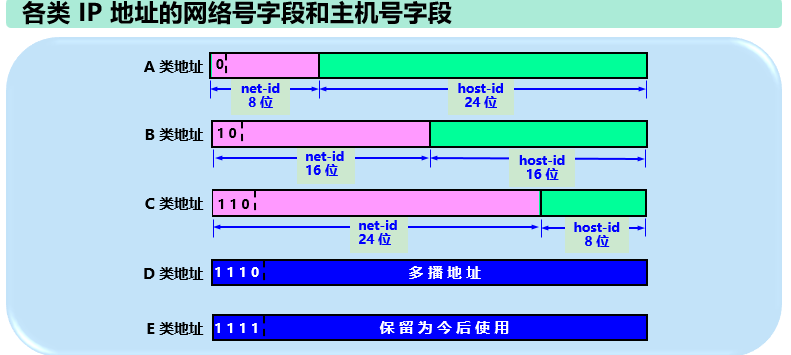
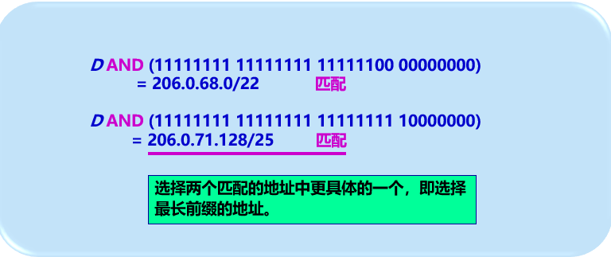
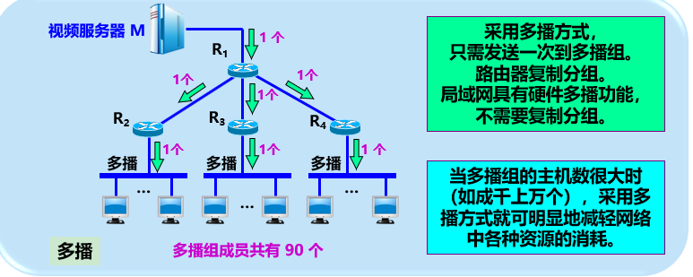

# 网络层

[TOC]

## 一、网络层提供的服务

**网络层只提供简单灵活的，无连接的，尽最大努力交付的数据报服务**


## 二、网际协议IP

### 2.1 网际协议及其配套协议


* 【问题1】 虚拟互联网络是如何互连的

  需要使用到中间设备，不同的层有不同的中间设备，或者成为中继系统。

  * 物理层：转发器 repeater

  * 数据链路层：网桥或桥接器 bridge

  * 网络层：路由器 router

    > 网桥和路由器的混合物：桥路器(brouter)

  * 网络层以上：网关 gateway


### 2.2 IP地址

1. **IP地址表示法**

   IP地址唯一标识互联网上的主机(或路由器)，32位二进制(需要4个字节)，由互联网名字和数字分配机构进行分配

2. **IP地址编址方法**

   * 分类IP地址
   * 子网划分
   * 构成超网

   IP地址 = 网络号 net-id + 主机号 host-id

   

   

   

   

### 2.3 地址解析协议ARP

1. 作用：根据一个主机的IP地址，找出其相应的硬件地址。

   

2. 原理：

   * 每个主机都有一个ARP Cache（ARP高速缓存），里面存放了所在的局域网上个主机和路由器的IP地址到硬件地址的映射表

     

   * 如果ARP告诉缓存中找不到，则在局域网广播发送一个ARP请求分组，收到ARP响应分组后，将得到的MAC地址写入ARP Cache

   * **ARP分组封装在物理网络的帧中传输**

3. ARP报文

   1. 请求分组：发送方硬件地址和IP地址，目标方硬件地址(全部为0)，目标方IP地址
   2. 响应分组：发送方硬件地址和IP地址，目标方硬件地址(全部为0)，目标方IP地址


### 2.4 IP数据报


| 首部字段   | 大小       | 含义                                                         |
| ---------- | ---------- | ------------------------------------------------------------ |
| 版本       | 4位        | IP协议版本，比如4代表ipv4                                    |
| 首部长度   | 4位        | 单位是4字节，因此首部的最大长度是15*4 = 60字节               |
| 区分服务   | 8位        | 用于获得更好的服务，只有在使用区分服务(DiffServ)才起作用，一般都不使用 |
| 总长度     | 16位       | 单位是字节，因此IP数据报的最大长度为65535字节                |
| 标识       | 16位       | 是一个计数器，用来产生IP数据报的标识。                       |
| 标志       | 3位        | 目前只有前两位有意义。<br />最低位MF(more fragment): MF=1表示后面还有分片，MF=0表示最后一个分片<br />第二位为DF(don't fragment): DF=1表示不允许分片，DF=0表示允许分片 |
| 片偏移     | 13位       | 单位是8字节。一个较长的分组被分片后，其中某片在原分组中的相对位置。 |
| 生存时间   | 8位        | 数据报在网络中可以通过的路由器数量                           |
| 协议       | 8位        | 表明该ip数据报的携带的数据是什么协议的，以便交付给上层协议处理。 |
| 首部校验和 | 16位       | 不需要添加伪首部，只校验数据报的首部，不采用CRC校验码        |
| 源地址     | 4字节      |                                                              |
| 目的地址   | 4字节      |                                                              |
| 可选字段   | 最大40字节 | 实际上很少使用。支持排错，测量，安全等。                     |
| 填充       |            | 使得满足为4字节的整数倍                                      |

* IP数据报分片

  

  


* IP首部字段--协议

  


* IP首部校验

  

  > 这里接收方二进制反码运算后还取反码，所以所有二进制位应该都是0，如果不取反码，则所有二进制位都是1


### 2.5 IP层转发分组流程

路由表使用的是主机所在的网络号来制作，而不是使用主机号。

但是允许特例，即基于特定的目的主机指明一个路由。使得网络管理人员能够更方便的控制网络和测试网络。

路由器根据目的网络地址确定下一跳路由器。


路由器通常会采用默认路由，以减少路由表所占的空间和搜索路由表的时间。

​	

 IP报文在转发时，只有目的地址，没有携带下一跳路由的地址。

* IP数据报流转流程

  1. IP数据报根据主机上的路由表，得到需要将数据报发往的ip地址(比如网关路由器)

     > IP数据报上的目的IP并不会更改为网关路由器的IP地址。

  2. 从ARP Cache中查找ip地址对应的MAC地址，封装成MAC帧，发送到(网关路由器)

  3. 路由器收到待转发的数据报，解析IP数据报上的目的IP地址D，得到网络号N
     1. 若网络N与**路由器直接相连**，则将数据报直接交付给主机D
     2. 若路由表中有**目的地址为D的特定路由**，则将数据报传送到指明的下一跳路由器
     3. 若路由表中有**网络N的路由**，则将数据报传送到指明的下一跳路由器
     4. 若路由表中有一个**默认路由**，则将数据报传送给默认路由器
     5. 报告分组出错


## 3. 划分子网与构造超网

### 3.1 从两级IP地址到三级IP地址

​	IP地址中增加了“子网号段”，使得两级IP地址变为三级IP地址，使得地址更加灵活，这种方式称为**划分子网**。

​	划分子网为单位提供了管理多个子网的功能，子网属于一个单位内部的事情，对外依然是没有划分子网的网络

* 基本思路：

  * **从主机号中借用若干位作为子网号 subnet-id，主机号host-id减少了若干位**

  

* 转发流程：

  * 外部路由器仍然是根据目的网络号net-id进行转发，直到交给本单位网络上的路由器
  * 本单位路由器按照目的网络号net-id和子网号subnet-id找到目的子网
  * 将IP数据报交付给目的主机

  

* 如何确定IP地址中的子网部分

  通过subnet-mask 子网掩码可以找出IP的子网部分

  规则：

  * 子网掩码32位
  * 左边的一连串1，代表网络号和子网号
  * 右边的一连串0，对应主机号

  

  计算：**ip_addr & subnet_mask = 网络地址**

  

  默认子网掩码：

  

  实例：

  


* 划分子网情况下，路由器转发分组算法
  1. 从分组头部提取IP地址D
  2. 用该网络的**子网掩码与D逐位相与**，如果得到的网络地址相匹配，则直接交付，不用交给路由器。
  3. 如果路由表由目的地址为D的**特定主机路由**，则交给该路由的下一跳路由器
  4. 对路由表中每一行，将**子网掩码与D逐位相与**。如果得到的网络地址与该行的网络地址相匹配，则交给该路由的下一跳路由器
  5. 如果路由表有默认路由，则将分组交给默认路由器
  6. 报告转发分组出错

### 3.2 无分类编址 CIDR 

CIDR (Classless Inter-domain Routing) 无分类域名路由选择

* 特点：

  * 消除了传统的A,B,C类地址和划分子网的概念
  * 使用网络前缀(network-prefix)代替网络号和子网号
  * IP地址从3级编址变回两级编址

* 作用：

  * 更有效利用ipv4地址空间
  * 路由表中1个项目就可以很多地址，有利于减少路由器之间的路由选择信息交换，提高效率

* 无分类的二级编址

  CIDR不再使用子网掩码，但是仍然使用“掩码”名词。

  

  

  ​	

  

  ​	

  ​	

* 构成超网 supernetting

  * 一个CIDR地址可以表示很多地址，这些地址的聚合通常称为**路由聚合**rout aggregation

    使得路由表中的一个项目就表示很多个传统分类地址的路由

  * 路由聚合也称为构成超网

* CIDR的其他记法

  * 简写：比如 10.0.0.0/10 简写为10/10
  * 带星号：00001010 00* 星号前面为网络前缀，*表示主机号

* **最长前缀匹配**

  使用CIDR时，路由器的每个项目有“地址块”和“下一跳地址组成”。

  查找路由表的时候可能得到不止一个匹配结果

  这时使用“**最长前缀匹配原则**(longest-prefix matching)”。

  因为前缀越长，其地址块就越小，路由就越具体。

  ​				

  ​	

  ​	

  ```shell
  [root@vm61 ~]# route
  Kernel IP routing table
  Destination     Gateway         Genmask         Flags Metric Ref    Use Iface
  default         gateway         0.0.0.0         UG    100    0        0 ens33
  192.168.8.0     0.0.0.0         255.255.255.0   U     100    0        0 ens33
  192.168.122.0   0.0.0.0         255.255.255.0   U     0      0        0 virbr0
  
  ```

* **二叉字典树(binary-trie)**查找路由表

  当路由表的项目很多的时候，需要提高查找效率，这种前缀匹配的，使用了二叉字典树来查找，为了提高二叉字典数的效率，还会附加上一定的压缩算法。

  


## 四、ICMP 网际控制报文协议

### 4.1 概述

ICMP (Internet Control Message Protocol) 网际控制报文协议

* 作用：**提高转发和交付的成功率和效率**
* 原理：允许主机或者路由器报告差错情况和提供异常情况的报告
* 结构：ICMP不是高层协议，而是IP层的协议，尽管其报文是装在IP数据报中的，作为其数据部分


### 4.2 ICMP报文格式


1. 报文种类：

   * 差错报文
     * 终点不可达
     * 时间超过
     * 参数问题
     * 改变路由(重定向)
   * 询问报文
     * 回送请求和回答报文
     * 时间戳请求和回答报文

2. 实例：

   * ping (Packet Internet Groper)
     * 用于探测主机之间的连通性
     * 使用ICMP的回送请求与回送回答报文
     * ping是应用层，直接使用网络层ICMP的例子，没有经过运输层的TCP或者UDP
   * traceroute
     * 跟踪一个分组从原点到终点的路径
     * 利用IP数据报的TTL字段和ICMP时间超过差错报告报文实现

   

## 五、互联网的路由选择协议

### 5.1 基本概念

自治系统(Autonomous System)，存在内部的路由协议和外部的路由协议。


路由选择协议是分层的。两大类路由选择协议

* 内部网关协议IGP(Interior Gateway Protocol)
* 外部网关协议EGP(External Gateway Protocol)


### 5.2 内部网关协议 RIP

RIP (Routing Information Protocol) 路由信息协议， 是分布式，基于**距离向量**的路由选择协议

协议要求网络中的每一个路由器都要维护自己和其他目的网络的距离记录(**最短距离**)。

* 距离的定义：也称为“跳数”

  * 路由器到直接连接的网络的距离为1
  * 路由器到非直接连接网络的距离为经过的路由器数量 + 1

* 限制：由于以下限制，可以看出RIP只适合小型互联网

  * 一条路径只能包含15个路由器
  * 两个网络之间不能同时使用多条路由，因为RIP协议认为最短距离的路径就是最好的。
  * 路由器之间交换的是整个路由表，开销较大
  * 好消息传播得快，坏消息传播得慢。但网络出现故障时，需要较长时间才能将信息传送到所有的路由器

* 特点：

  * 仅和相邻的路由器交换信息
  * 交换的信息就是自己的路由表
  * 按照固定的时间间隔交换路由信息，当网络拓扑变化时，路由器也及时向相邻路由器通过拓扑变化后的路由信息。

* 协议：

  * 基于UDP协议

    

### 5.3 内部网关协议OSPF

​	OSPF (Open Shortest Path First) 开放最短路径优先。

* 特点：
  * 基于Dijkstra提出的最短路径算法SPF
  * 采用分布式的链路状态协议
* 原理：
  * 向自治系统内所有的路由器发送消息，使用的是**洪泛法**
  * 发送的消息是与本路由器相邻的所有路由器的**链路状态**
  * 当链路状态发生变化时，路由器使用**洪泛法**向所有的路由器发送变化消息
  * 为了减少洪泛带来的影响，OSPF 允许划分区域。
* 优点：
  * 更新过程收敛的快
* 协议：
  * 直接使用IP数据报传送

### 5.4 外部网关协议BGP

* 目的：力求寻找一条能够达到目的网络且比较好的路由(不要兜圈子)

* 原理：

  * 每个自治系统至少有一个路由器作为“BGP 发言人”
  * 自治系统之间通过"BGP发言人"交换路由信息
    * 建立TCP连接，交换报文，建立BGP session，在会话中交换路由信息
  * 交换完信息之后，各个自治系统的发言人根据所采用的策略，从收到的路由信息中找出到达各AS的较好路由

  

### 5.5 路由器的构成

* 目的：转发分组

* 结构：

  * 路由选择部分---控制部分
    * 路由选择处理机----路由表(由路由选择协议维护的路由表)
  * 分组转发部分
    * 交换结构---转发表(根据路由表得出的)
    * 输入端口
      * 有网络层的队列，可能溢出，导致分组丢弃
    * 输出端口
      * 同样有网络层队列，可能溢出，导致分组丢弃

  

  

  


## 六、IPV6

### 6.1 IPV6协议格式

IPV6将协议数据单元成为分组，IPV4为数据报

* IPV6的主要变化

  1. **更大的地址空间**，从ipv4的32位增大到了128位

  2. 扩展地址层次结构

  3. 灵活的首部格式。

  4. **扩展首部放在有效载荷中**。允许数据报包含有选项的控制信息，选项放在有效载荷中。

     > 这些首部由源主机和目的主机来处理，提高路由效率

  5. 允许协议继续扩充。

  6. **支持即插即用**(自动配置)。不需要使用DHCP

  7. 支持资源预分配。支持实时视像等要求，保证一定的带宽和时延的应用。

  8. 首部改为8字节对齐。即首部必须是8字节的整数倍，IPV4是4字节。

* 数据报的一般形式

  * 基本首部：40字节
  * 有效载荷：拓展首部

  

  ​          			

| 首部字段                         | 大小  | 含义                                                 |
| -------------------------------- | ----- | ---------------------------------------------------- |
| 版本<br />version                | 4     | 协议版本，6表示IPV6                                  |
| 通信量类<br />traffic class      | 8     | 区分不同的IPV6数据报类别或优先级                     |
| 流标号<br />flow label           | 20位  | 标识从特定源点到特定终点的一系列数据报               |
| 有效载荷长度<br />payload length | 16位  | 除了基本首部的字节数，最大64KB(65535字节)            |
| 下一个首部<br />next header      | 8位   | 相当于IPV4的协议字段，表明包含的数据是什么协议的数据 |
| 跳数限制hop limit                | 8位   | 相当于TTL                                            |
| 源地址                           | 128位 |                                                      |
| 目的地址                         | 128位 |                                                      |


### 6.2 IPV6的地址

* 3种基本类型的目的地址

  * 单播
  * 多播
  * 任播：通常是交付给距离最远的一个主机

* 记法：

  * 冒号16进制记法

    * 每16位使用16进制表示
    * 共8组
    * 每组之间使用冒号分割

    > 支持CIDR 无分类编址 比如**12AB::CD30:0:0:0:0/60** 
    >
    > 允许将数据前面的0省略，比如 **68E6:8C64:FFFF:FFFF:0:1180:960A:FFFF**
    >
    > 允许零压缩(仅一次)，一连串的0，可以使用双冒号代替 **FF05:0:0:0:0:0:0:B3**  => **FF05::B3**

  * 点分十进制记法

    * 每8位用10进制表示
    * 共10组
    * 每组之间使用点分割

    > **0:0:0:0:0:0:128.10.2.1** => **::128.10.2.1**

* 分类

  


### 6.3 过渡到IPV6

* 策略：
  * 双协议栈
    * 路由器装有两个协议栈，一个路由器同时有IPV4和IPV6地址
  * 隧道技术
    * 将IPV6数据报封装成IPV4数据报，在主机端在进行处理


## 七、IP多播

​	在互联网上进行多播，就叫IP多播

​	互联网上的多播需要通过路由器来实现。

​	能够运行**多播协议**的路由器成为多播路由器(multicast router)





* 多播IP地址
  * 数据报的目的地是多播组的标识符
  * 多播组的标识符就是IP地址中的D类地址(多播地址)
* 多播数据报
  * 目的地址为D类IP地址
  * 首部协议字段位为IGMP(网际组管理协议)
  * 也是尽最大努力交付
  * 对多播数据报不产生ICMP差错报文(所以PING 多播地址是不会收到响应的)

### 7.1 网际组管理协议 IGMP 与 多播路由选择协议

*  网际组管理协议IGMP
  * 作用：让路由器知道有哪些成员需要多播
* 多播路由选择协议
  * 作用：局域网的多播路由器需要和互联网上的其他多播路由器协同工作，将多播数据报用最小的代价传送给所有组成员。


## 八、虚拟专用网VPN与网络地址转换NAT

## 8.1 虚拟专用网VPN

1. 专用IP地址---只能作为本地地址，不能作为全球地址(路由器不会转发)

   

2. 专用网---采用专用IP地址的互联网络

   也可称为本地互联网，或者专用互联网

3. 虚拟专用网VPN

   利用公用的互联网作为本机构各专用网之间的通信载体，这样的专用网又称为虚拟专用网(Virtual Private Network)

   * 专用网---指明这种网络是为本机构的主机用于**机构内部**的通信，而不是用于与网络外的非本机构的主机通信。
   * 虚拟---表明实际上并不存在真正的通信专线，而只是在效果上和真正的专用网一样。

* 虚拟专用网的构建

  

  

## 8.2 网络地址转换NAT

​	NAT (Network Address Translation)

* 作用：使得专用网上使用专用地址的主机可以与互联网上的主机通信

* 要求：需要在专用网连接到互联网的路由器上安装NAT软件。这种路由器称为NAT路由器，至少有一个有效的全球IP地址

* 原理：将本地地址转换为全球IP地址，与互联网通信

  * NAT路由器将内部主机发出的数据报的源地址修改为全球地址，并将结果记录到NAT地址转换表中
  * NAT路由器将外部返回的数据报，根据NAT地址转换表的记录，将目标地址转换为内部主机的ip地址。

  

  

* NAPT 网络地址与端口转换

  * 作用：允许多个内部主机同时与互联网进行通信。使用NAT只能轮流使用全球ip

    


## 九、多协议标记交换 MPLS

​	MPLS (Multi Protocol Label Switching) 多协议标记交换

* 概念

  * 多协议：MPLS上层可以使用多种协议，包括网络层协议IP,IPX；数据链路协议 PPP，以太网，ATM协议等
  * 标记：每个分组被打上标记，根据该标记进行转发

* 原理：

  * 当打上标记的分组到达交换机(标记交换路由器)，交换机读取分组的标记，并用标记来检索分组转发表，而不需要查找路由表，效率提高了不少

  * 因为标记在二层，链路层，所以不需要上升到第三层查找路由表。

    


## 十、面试题

1. IP协议的定义和作用

   IP协议为网际协议，作用于网络层，为互联网中的两个节点提供无连接，不可靠，尽最大努力交付的数据传输服务。

   两大主要作用：

   * 寻址与路由：3层路由器根据IP地址，查找路由表进行转发分组
   * 分组与重组：数据传送过程可能经过不同的网络，数据可能会被分片，IP协议提供标识和标志重组得以实现。

   

2. 域名与IP的关系，一个IP可以对应多个域名吗

   域名是为了便于人们记忆和描述产生。

   一个域名可以对应多个IP，一个IP也可以被多个域名解析。

   通过nslookup命令可以解析域名

   

3. IP地址不够如何解决

   * 回收重用：DHCP(Dynamic Host Configuration Protocol)，动态主机配置协议，动态分配IP，并使得空闲的ip得以回收重用

   * 提高利用效率：CIDR(Classless Inter-Domain Route) 无分类编址(无分类域间路由)，取消了传统的A,B,C类地址以及划分子网的概念，因而更加有效的分配IPV4地址空间

   * 本地隔离：NAT(Network Address Transform) 网络地址转换协议，不同局域网的IP可以使用相同的IP地址，在于外网交互的时候，使用NAT或者NAPT进行转换

   * 扩大容量：使用IPV6位数从32位增加到128位，可以从根本上解决地址不够用的问题

     

4. 路由器分组转发流程

   1. 从IP分组中取出IP地址D

   2. 将该网络的子网掩码与D进行位与运算，如果与对应的网络号匹配，则直接交付

   3. 若路由表中有**特定主机路由**，则交付

   4. 将路由表中的各项的子网掩码**逐个**与D进行位与运算，如果与对应的网络号匹配，则交付

      > 如果使用的是分类地址+划分子网，则首个匹配即可交付
      >
      > 如果使用的是CIDR 无分类编址，则按照最长前缀匹配原则，找到匹配的最长的网络号的那项进行交付

   5. 如果路由表有默认路由，则交付

   6. 无法找到合适的路由，向源主机报错


5. 路由器和交换机的区别

   作用层次不一样

   1. 路由器一般基于网络层IP地址转发

      > 路由器使用软件实现转发，能够实现复杂的转发

   2. 交换机一般基于数据链路层，物理层的MAC地址转发

      > 也有3层交换机，但是一般是使用硬件进行转发，速度快，但只能做简单的转发


6. ICMP的概念和作用

   ICMP(Internet Control Message Protocol)  网际控制报文协议，一般配合IP协议使用，允许主机或者路由器发送**差错报文**和**询问报文**，询问或者报告哪里出现了故障，故障的原因，以提高IP数据报传输的**效率和成功率**。

   > 询问报文确认接收方是否成功接收到
   >
   > 如果发生丢包，会通知发送发送方丢包的原因，发送方可以进行相应的处理。


7. ICMP的引用
   * ping(Packet Internet Groper) 包网际探测器
   
     * 用于测试网络是否连通
   
     * 发送**Echo报文**，目的主机收到之后也会发送Echo报文
   
     * ping命令根据时间和成功响应的次数估算出数据包的往返事件以及丢包率从而推断网络是否通畅，运行是否正常。
   
       
   
       
   
   * traceroute
   
     * 用于跟踪一个分组从源点耗费**最少TTL**达到目的地的路径。
   
     * 通过逐渐增大TTL值，并重复发送数据报来实现。
   
     * 步骤：
   
       > linux中可能默认使用udp，可使用traceroute  -I  www.baidu.com 强制使用ICMP
   
       * 源主机发出一个TTL为1的Echo数据报，到达路径上的第一个路由器时，TTL减1，路由器会丢掉，并返回一个TTL超时**差错报文**(Time-To-Live exceeded).
   
         > 有些路由器不会返回这个差错报文，如果发现没有response，也会将TTL增加，然后发送。
   
         
   
         
   
       * 源主机发送一个TTL为2的数据报，重复此过程，直到数据报刚好可以到达目的主机。
   
         > 主机恢复Echo(reply)报文
   
         
   
       * 源主机就可以计算到达目的主机所经过的路由器IP以及到达的路由器的IP地址
   
         

8. 两台电脑连起来后ping不同，可能问题在哪
   1. 检查驱动：网卡驱动是否正确安装
   2. 检查配置：局域网的网络设置(网络号是否相同)，ip地址分配是否正确
   3. 检查防火墙：有些设置会过滤ICMP报文
   4. 检查第三方软件：是否被第三方软件拦截
   5. 检查网络延迟：是否因为延迟太大(路由设置），导致icmp报文无法在规定时间内达到


9. ARP地址解析协议的原理和过程

   ARP地址解析协议提供了根据IP地址解析MAC地址的功能。

   ARP协议作用于网络层，分组封装在物理网络中的帧中传输

   每个主机和路由器都有一个ARP Cache高速缓存，存放了IP地址与MAC地址的映射。

   过程：

   * 当源主机需要发送数据时，先到ARP Cache中查找，如果没有找到，则向同一个子网的所有主机，路由器广播ARP 请求报文(源主机的IP，源主机的MAC，目标主机IP，目标主机MAC(各位置0))
   * 当主机收到ARP数据包，如果IP地址不匹配，则忽略；如果匹配，则将对方的IP和MAC地址映射保存到自己的ARP Cache(如已存在则覆盖)，然后返回响应报文(源主机的IP，源主机的MAC，目标主机IP，目标主机MAC)

   

10. 网络地址转换NAT

    NAT(Network Address Translation) 网络地址转换协议可以将内部私有网络地址转换成公网地址从而与外网通信。

    NAT不仅缓解了IP地址不足的问题，还能隐藏和保护网络内部主机，避免来自外部网络的攻击

    NAT的实现方式有3种：

    * 静态转换：私有IP地址与公有IP地址一一对应，不会发送变化
    * 动态转换:   私有IP地址每次翻译后的公有IP地址是可能变化的，可以满足公网IP略少的情况。但是一个公网IP同时只能被一个私有IP使用，无法达到复用。
    * 端口多路复用 NAPT：不仅转换IP地址，还会把端口进行转换，通过端口的方式，多个私有IP地址可以同时使用一个公网IP地址。还可以隐藏内部主机的端口，更有效避免攻击。


11. TTL是什么，有什么用

    TTL(Time-To-Live) 表明数据包的生存时间，用路由器器的跳数来表示，没进过一个路由器TTL减1，当路由器减1后，TTL为0，会将该包丢弃，并发送ICMP差错报文。

    通过设置TTL，可以有效避免**环形路由，导致数据包不停绕圈的问题**，加重网络拥塞。


12. 运输层协议与网络层协议的区别

    网络层协议主要负责主机与主机之间的逻辑通信

    运输层协议负责进程间的逻辑通信


