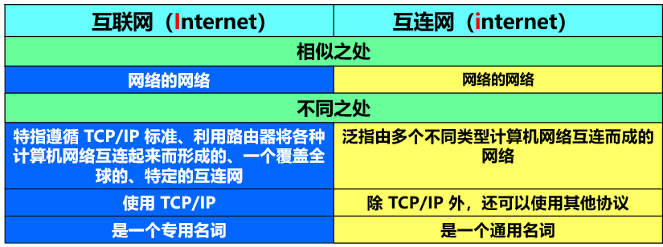
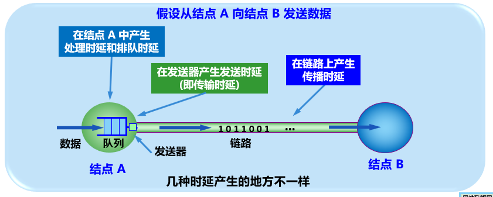
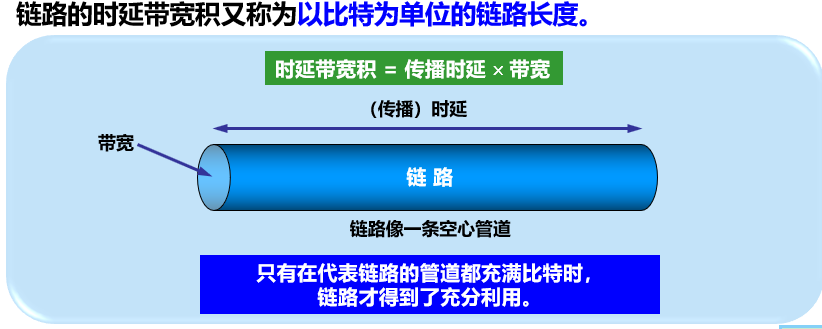
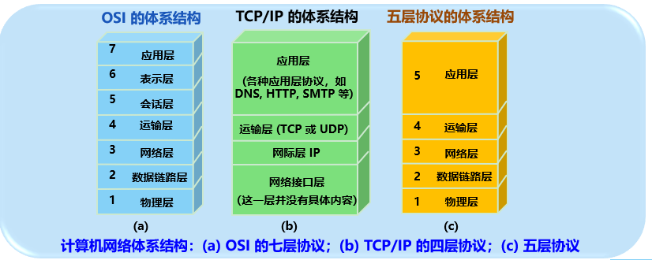
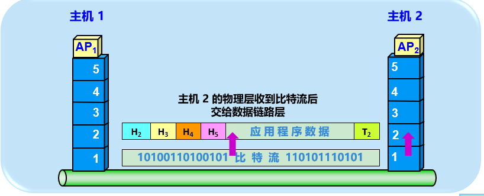
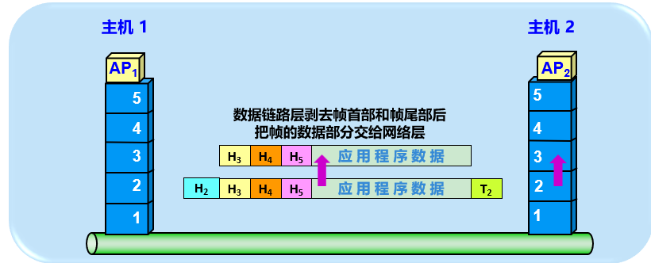
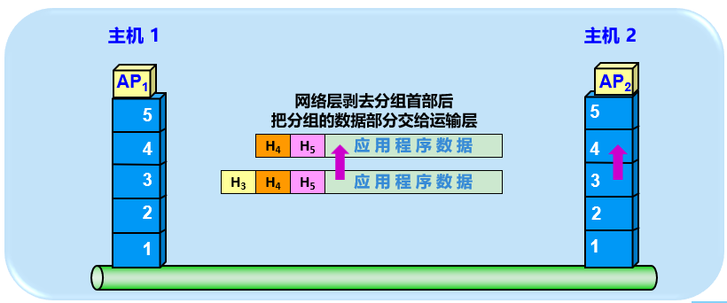
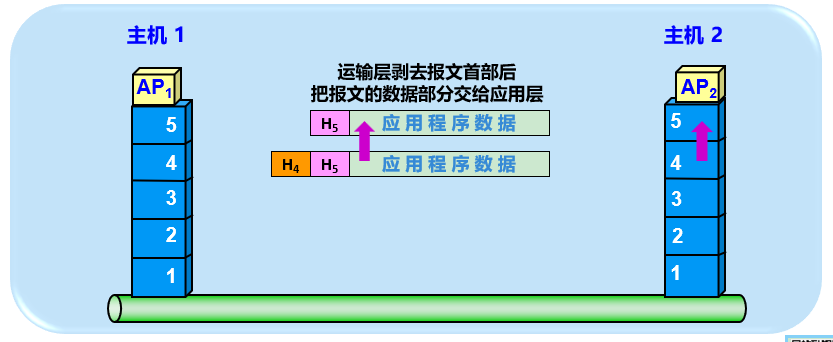
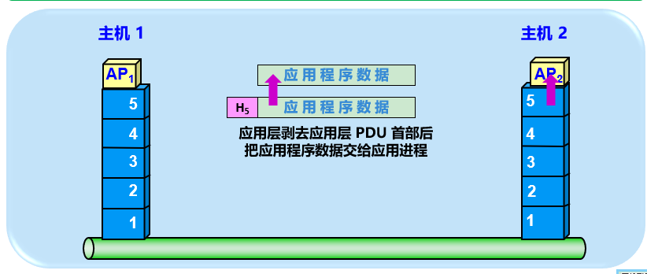
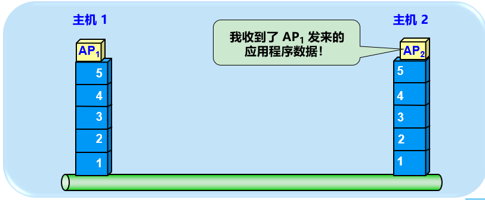

# 计算机网络概述

##  一、 互联网

### 1.1 网络：

* 电信网络：电话，电报，传真
* 有线电视网络：电视节目
* 计算机网络：在计算机之间传送数据

> 慢慢地，电信网络和有线电视网络都融入到计算机网络。


### 1.2 互联网

互联网，Internet，是指有数量极大的各种计算机网络互联起来的网络。

**互联网采用TCP/IP协议族作为通信规则**。

> internet 与 Internet
>
> internet 互连网，是一个通用名词，泛指多个计算机互连形成的网络
>
> Internet 互连网或者**因特网**，专指使用TCP/IP协议族，由众多网络互连而成的计算机网络，前身是ARPANET




### 1.3 计算机网络的分类

1. 按照范围：
   * 广域网 Wide Area Network : 50~几千公里
   * 城域网 Metropolitan Area Network:  5~50km
   * 局域网 Local Area Network: 1km
   * 个人区域网 Personal Area Network :10m


### 1.4 计算机网络的性能

计算机网络性能指标：

* 速率 bit rate：数据传送速率

  * 单位：bit/s
  * 理论值

* 带宽 bandwidth：传输信道的允许的频带宽度

  * 单位：Hz

* 吞吐率 throughput：单位时间内通过的数据量

  * 单位 bit/s
  * 实际测量值

* 时延 delay：

  * 发送时延：数据帧从结点**进入传输媒体**所需要的时间
  * 传播时延:   数据在传输媒体上**传播**所需要的时间
  * 处理时延：在主机或者路由器中，**处理机**为处理分组(比如分析首部，提取数据，差错检验，查找路由)所划分的时间。
  * 排队时延：分组在路由器**输入输出队列**中排队等待处理所经历的时延。

  

  > 对于高速网络链路，我们提高的仅仅是发送速率使得频率提高，从而单位时间内传送更多的数据，减少的是发送时延。
  >
  > 我们并没有提高传播速率，没有降低传播时延。

* 时延带宽积

  * 等于传播时延 * 带宽

    

* 往返时间 RTT

* 利用率

  * 信道利用率：
    * 某信道有百分之几的时间是被利用的，即多少时间是由数据通过的
    * 完全空闲的信道利用率是0
  * 网络利用率
    * 全网络的信道利用的加权平均值

  > 利用率不是越高于浩，当某信道的利用率增大时，该信道引起的时延也就迅速增加。


### 1.5 计算机网络体系结构



数据发送过程

```sequence
主机1->主机1: 应用进程将数据传送给应用层，加上应用层的首部，\n 成为应用层PDU(Protocol Data Unit)
主机1->主机1: 加上运输层首部，成为运输层报文
主机1->主机1: 加上网络层首部，成为IP数据报(或分组)
主机1->主机1: 加上链路层首部和尾部，成为数据链路层帧
主机1->主机1: 传送到物理层，转化为比特流送到物理媒体
主机1->主机2: 电信号或者光信号在物理媒体中传输，从发送端的物理层传送到接收方的物理层
主机2->主机2: 物理层接收到比特流，解析为帧，交给数据链路层
主机2->主机2: 数据链路层剥去首部和尾部，取出数据部分，交给网络层
主机2->主机2: 网络层剥去首部，取出数据部分，交给运输层
主机2->主机2: 运输层剥去首部，取出数据部分，交给应用层
主机2->主机2: 应用层剥去首部，取出应用程序数据上交给应用进程
```














## 二、协议的层次以及他们的服务类型

### 3种模型

* 定义：
  
  
  
  * OSI模型，Open System Interconnection Model,   开发式系统互连参考模型。
    是由国际标准化组织ISO提出的一种标准，没有考虑到具体的时长需求。
  * TCP/IP模型， 面向市场应用的模型，4层模型
    * 由于应用层，表示层和会话层，都是应用程序内部来实现的，程序与程序之间几乎是无法实现代码的抽象共享的，因此很难实现应用程序维度的分层。比如表示层中数据压缩，加密不算是一种协议，而且会话层也很难使用协议来进行描述，所以整合在一起，交给应用程序开发者来实现。
  * TCP/IP 五层模型，结合上面的优点，5层模型。仅仅是逻辑分层，实际应用还是4层模型。

| 层次 | OSI<br />7层模型          | TCP/IP<br />4层模型 | TCP/IP <br />5层模型 | 作用                                                         | 数据单元                      | 实例                                                         |
| ---- | ------------------------- | ------------------- | -------------------- | ------------------------------------------------------------ | ----------------------------- | ------------------------------------------------------------ |
| 7    | 应用层<br />Application   | 应用层              | 应用层               | 定义**应用程序**之间交互的规则                               | 报文<br />message             | 1.域名系统DNS 使用HTTP协议来 完成万维网应用之间的交互<br />2. 电子邮件系统 使用STMP协议来 来完成邮件收发<br />HTTP, FTP,  TFTP,  NFS,  WAIS,  SMTP,  Telnet,  DNS,  SNMP |
| 6    | 表示层<br />Presentation  | 应用层              | 应用层               | 用于**数据加解密，数据压缩与解压，数据描述**<br />屏蔽了应用程序数据在不同操作系统中表示和存储的差异 | 报文                          | GIF, JPEG,PICT,TIFF                                          |
| 5    | 会话层<br />Session       | 应用层              | 应用层               | 用于**建立，管理，终止通信会话**。<br />提供了数据交换和同步的功能，包括建立检查点和恢复方案的方法 | 报文                          | RPC,  SQL,  NFS,  NETBIOS, names,  AppleTalk                 |
| 4    | 传输层<br />Transport     | 传输层              | 传输层               | 负责**交换报文**，为会话提供通信功能.<br />多个应用程序可复用传输层，传输层可分发数据到上一层 | 段segment<br />数据报datagram | 数据传输控制协议TCP<br />用户数据报协议UDP                   |
| 3    | 网络层<br />Network       | 网络层              | 网络层               | 提供寻址和分段功能。用于选择合适的**网间路由**和**交换节点** | 分组/包<br />packet           | 网际协议IP<br />互联网组管理协议IGMP<br />互联网控制报文协议ICMP<br /><br />地址解析协议ARP<br />逆地址解析协议RARP<br />路由信息协议RIP<br />互联网分组交换协议IPX |
| 2    | 数据链路层<br />Data Link | 网络<br />接入层    | 数据链路层           | 控制数据传输，<br />包括**透明传输(**准确标记帧的起始和终止)<br />和**差错检测**(循环冗余检查CRC) | 帧frame                       | **PPP协议(点对点协议)**<br />FDDI, Frame Relay, HDLC, SLIP<br />涉及软件或者硬件：网络适配器 |
| 1    | 物理层<br />Pysical       | 网络<br />接入层    | 物理层               | 用于**比特流**的透明传送<br />屏蔽了传输介质与物理设备的差异 | 比特流bit                     | EIA/TIA-232, EIA/TIA-499, V.35, **802.3**<br />涉及软件或者硬件：光纤，双绞线 |

* 对比：
  * 相同点：
    * 分层
    * 两种通信服务方式，面向连接，无连接
  * 不同点：
    * OSI 7层，TCP/IP 4层。TCP/IP 实现起来更加简易
    * OSI 先定义了分层模型，再定义协议规范；TCP/IP 相反，所以不支持非TCP/IP网络
    * OSI 对数据链路和物理层做了区分；TCP/IP 没有对网络接入层进行细分，只是概念描述

* 数据在各层之间的传输(简易版)

  ```sequence
  应用层->传输层:  应用程序报文
  传输层->网络层: 首部(源端口，目标端口，\n差错检测位等) + 应用程序报文
  网络层->数据链路层: 首部(源地址，目标地址)\n + 传输层数据报
  数据链路层->物理层: 首部(源MAC，目标MAC)\n + 网络层分组
  物理层->对端主机: 比特流
  
  ```

  

## 

