# 无线网络与移动网络

## 一、无线局域网 WLAN

1. 概念：

   1. 便携站：移动过程不能通信(或者速度很慢)
   2. 移动站：移动过程可以通信

2. 分类：

   1. 有固定基础设施：预先建立起来，覆盖一定地理范围的固定基站
   2. 无固定基础设施

3. 无线以太网：

   * 标准：IEEE 802.11，采用这个系列标准的局域网成为Wi-fi(wireless-fidelity) ，意思是**无线保真度**

   * 采用星型拓扑，中心点为接入点AP。基站就是一种接入点。

     > 一个站，无论是和本BSS内部的站通信，还是要和其他BSS的站进行通信，都得通过本BSS的基站。
     >
     > 基站的作用类似与网桥或者交换机。
     >
     > 每一个AP都有一个服务集标识符SSID和一个信道。
     >
     > 我们平时的无线路由器是一种拓展的AP，不仅具有AP的功能，还具有路由功能。

     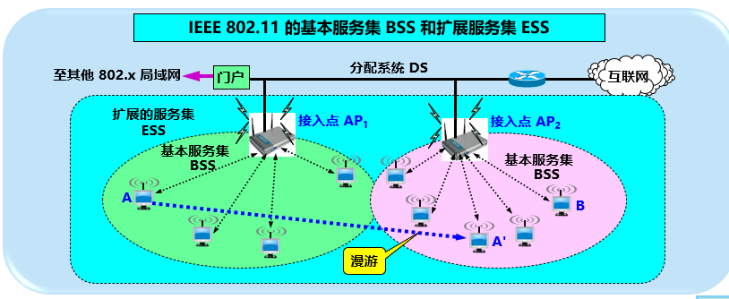

     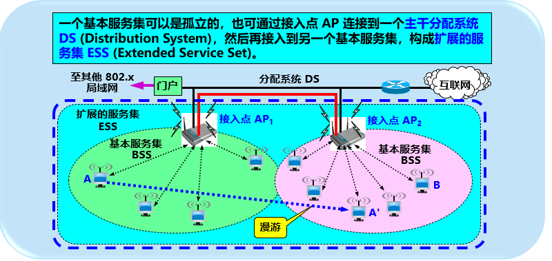

     

     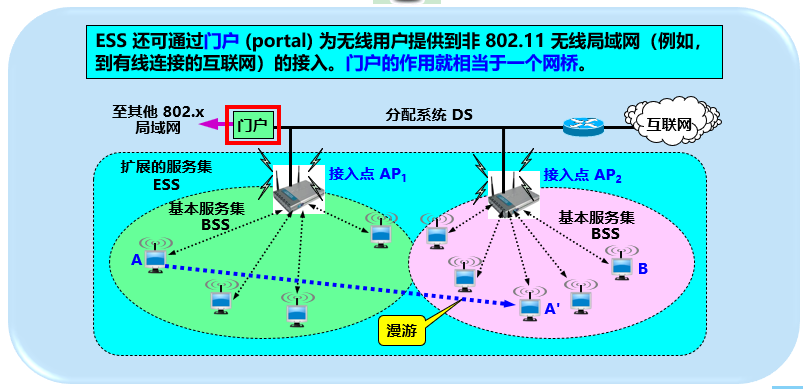

     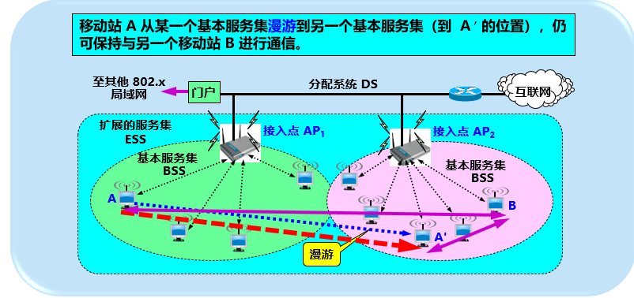

   * 在MAC层使用CSMA/CA (Carrier Sense Multi-Access / Collision **Avoidance**)载波监听多点接入/碰撞**避免**协议

     > 不能简单搬用CSMA/CD协议 ：因为发送时是空闲的，在接收端仍然可能发生碰撞(隐蔽站问题。。不像共线拓扑中，发送时空闲的，可以保证接收端也是空闲的了。

     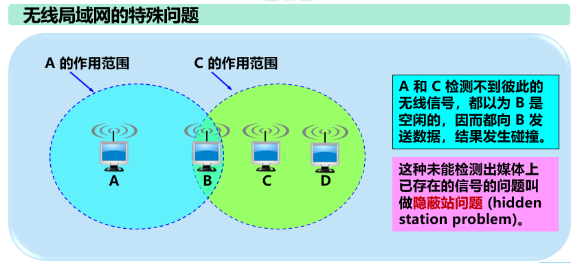

     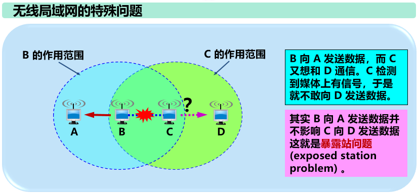

   * 移动站需要与AP建立关联，才能加入选定的AP所属的子网，并和这个AP之间创建了虚拟线路。

     * 建立关联的方式：
       * 被动扫描：移动站等待AP发出的周期性信标帧
       * 主动扫描：移动站主动发出探测请求帧，等待AP发回的探测响应帧

   * 热点

     * 热点就是公众无线入网点(某个特定的地点)
     * 由许多热点和AP连接起来的区域叫热区
     * 用户通过无线信道接入到无线互联网服务提供者WISP，然后经过无线信道接入到互联网。

   * 接入安全：

     * WEP
     * WPQ: WiFi Protected Access
     * WPA2: WIFi Protected Access 目前使用最多

4. 移动自组网络 ad hoc network

   * 特点：没有固定基础设施(AP)，由处于平等状态的移动站之间相互通信组成的临时网络。

     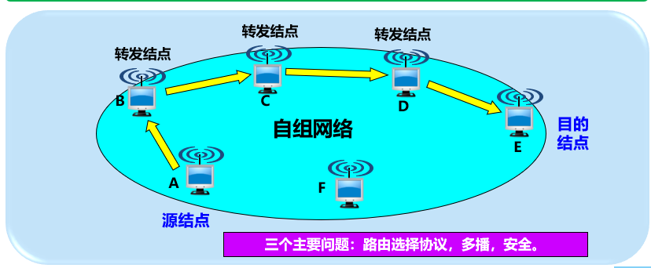

   * 应用：

     * 作战车辆群，坦克群，舰艇群；
     * 抢险救灾时，通过自组网络实现通信

   * 无线传感器网络：由大量传感器节点通过无线通信技术构成的自主网络。

     应用于各种物联网IOT(Internet Of Things)

     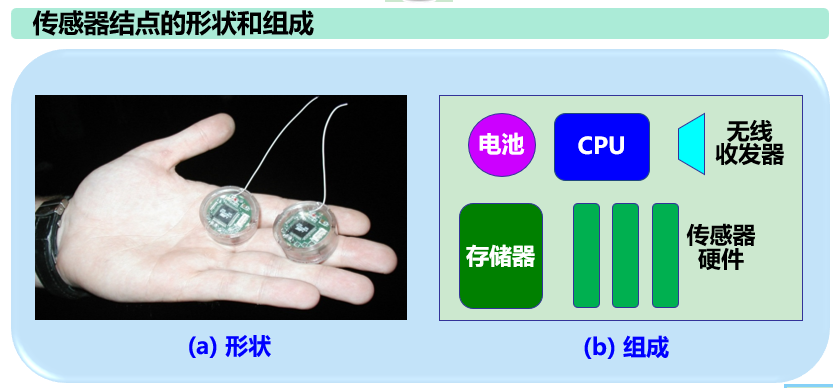

   6.数据帧

   ​	数据帧最特殊的是有4个地址

   ​	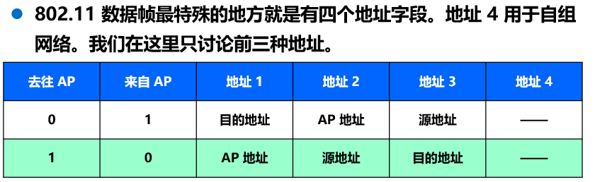

## 二、无线个人局域网 WPAN

无线个人局域网 是在个人工作地方将个人使用的电子设备用无线技术连接起来的网络，不需要使用接入点AP

比如蓝牙技术就是一种WPAN，使用皮可网(piconet 微微网，表示覆盖面积很小)

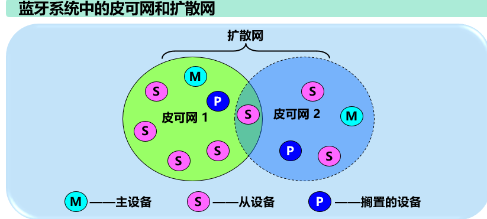

## 三、无线城域网

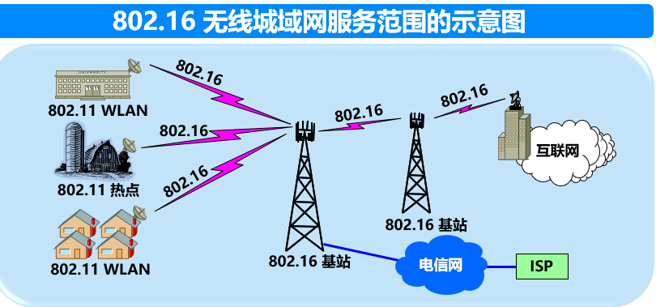

## 四、蜂窝移动通信

1. 历史发展

   * 1G：FDM   通话
   * 2G:   GSM   短信
   * 3G:   GRPS/EDGE  传输数据，兼具通话和短信
   * 4G：LTE/LTE-A

2. GSM 蜂窝通信系统

   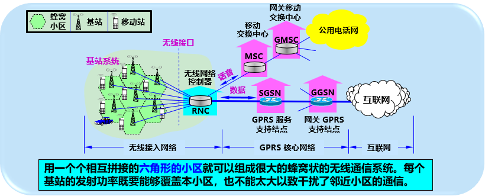

3. 移动IP：允许计算机移动到外地时，仍然保留器原来的IP地址

   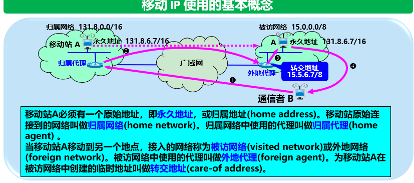

   上图中存在三角问题，即B发完A的数据都要经过归属代理来转发，不免效率低下。

   解决办法：增加一个通信代理，询问归属代理IP地址目前转到哪个区域了，然后采用隧道技术封装数据报，交给目前所在区域的外地代理。

   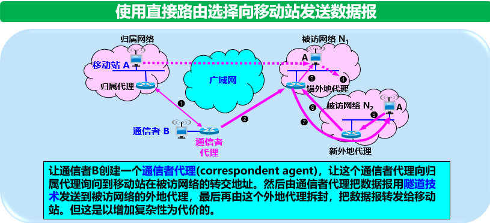

4. 蜂窝移动通信网中对移动用户的路由选择

   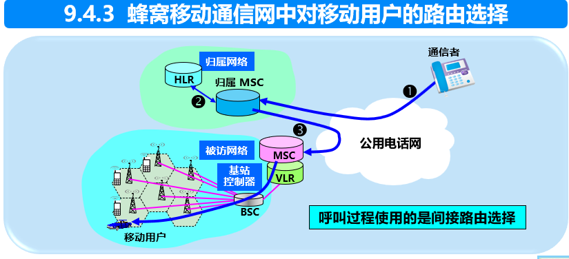

## 五、两种不同的无线上网

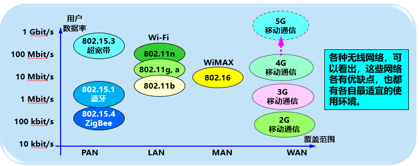

## 六、5G