# 网络安全

## 一、安全问题概述

### 1.1 两类安全问题

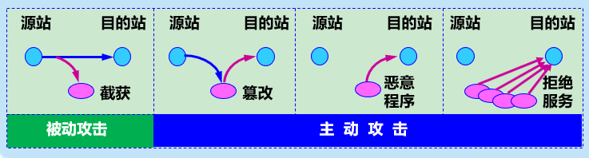

* 被动攻击：**截获**

  * 应对措施：数据加密技术

* 主动攻击：**篡改，恶意程序，拒绝服务**

  > 拒绝服务 Denial of Service：攻击者通过向服务器不停的发送分组，使得服务器无法提供正常服务，甚至完全瘫痪
  >
  > 分布式拒绝服务DDOS：多个主机同时攻击一个网站。

  * 应对措施：**数据加密技术**与**身份鉴别技术**相结合


### 1.2 数据加密

* 数据加密模型

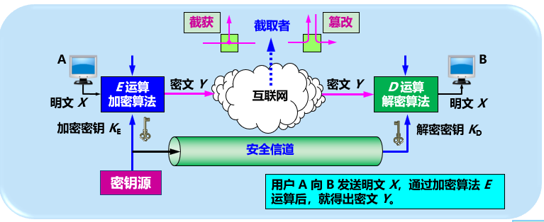


## 二、两类密码体制

### 2.1 对称密钥密码体制

加密密钥和解密密钥相同

* DES (Data Encrypt Standard) 数据加密标准
  * 是一种对称加密算法
  * 是一种分组密码算法。对明文进行分组，每组64位，对每组进行加密得到同样64位的密文，各组密文拼接起来就是整个密文。
  * 算法是公开的，保密性依靠对密钥的保密。
  * 目前即使是56位的DES都不再是安全的了。
* 三重DES
  * 使用两个DES密钥
  * 用密钥1加密，用密钥2解密，在用密钥1加密

### 2.2 公钥密码体制

根据公开的加密密钥无法推导出解密密钥而设计。

产生的原因：

* 对称加密的密钥保管问题

* 数据签名的需求，必须对外提供加密密钥

* 多对一的单向保密通信需求

  > 对称加密仅限于持有该密钥的双方，如果有第三方知道密钥，就失去了保密的意义了。

主要注意：

* 公钥加密算法的开销较大
* 公钥需要密钥分配协议，具体的分配过程不比对称加密方式简单
* 不管是公钥还是私钥，加密和解密都是互逆的，即公共也可以解开私钥加密后的密文

## 三、数字签名

数字签名用于**证明真实性**，证明真实性，证明真实性。

数据签名需要满足三个需求：

* 证明来源----接受者核实发送者的签名，因为只有发送方有这个私钥
* 防否认---发送者事后无法否认签名，通过第三者可以证实
* 防伪造---接收则无法伪造报文，通过第三者可以证实

数据签名依然需要使用到密钥，用**公钥算法**更容易实现。

数据签名与数据加密组合使用。

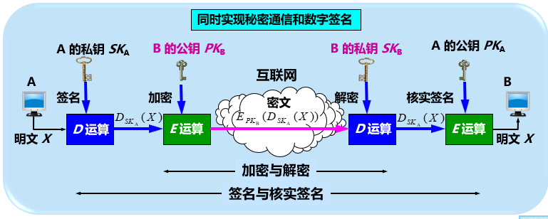

## 四、鉴别

**加密也可以达到报文鉴别的效果。但是许多报文是不需要加密的，可以使用更加简单的方法来鉴别报文的真伪。**

鉴别与授权是不同的。

* 授权：强调过程是否允许，比如是否允许对资源的访问
* 鉴别：鉴别报文的真伪。

## 4.1 报文鉴别

报文鉴别的作用是

1. 端点鉴别：接收方确认收到的报文的确是报文的发送者所发送
2. 报文完整鉴别：让接收方能够验证所收到的报文是没有经过篡改或者伪造的。

> 分别对应了加密和签名。

许多报文不需要加密，但是需要数字签名，以便报文的接收则能够鉴别报文的真伪。

然而对很长的报文进行数字签名会的计算机增加很大的负担(需要很长时间的运算)

因此我们传送不需要加密的报文时，应当使接受者能够用很简单的方法鉴别报文的真伪。

* 密码散列函数 CryPtograhpic hash function

  * 是一种相对简单的对报文鉴别的方法

  * 散列函数的特点：

    * 输入长度可以很长，但输出长度是固定的，且较短。
    * 不同的散列值一定对应不同的输出，反之不成立。

  * 在密码学中使用的散列函数就是密码散列函数

    * 密码散列函数是一种单向函数：要找到两个不同的报文具有相同的密码散列值，在**计算**上是不可能的。

    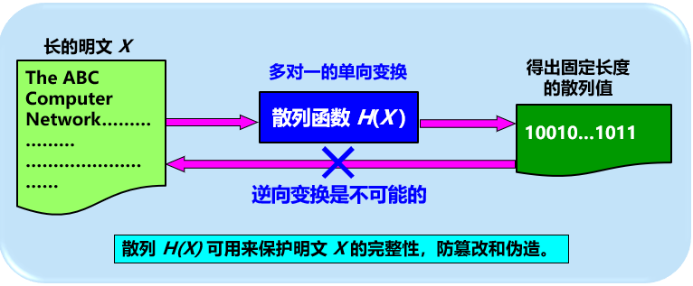

  * 常用的密码散列函数 MD5 和 SHA-1

    * MD5 : Message Digest 报文摘要算法的第5个版本

      * 得到广泛的应用

      * 思想：将报文数据位充分弄乱，摘要中的每一位都和原来的每一位有关。

      * 步骤：

        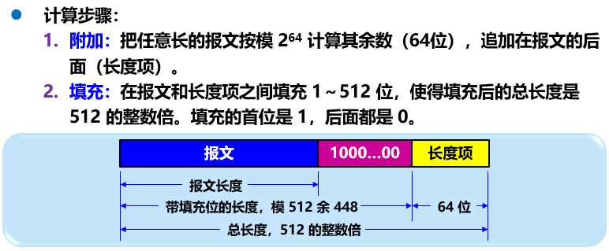

        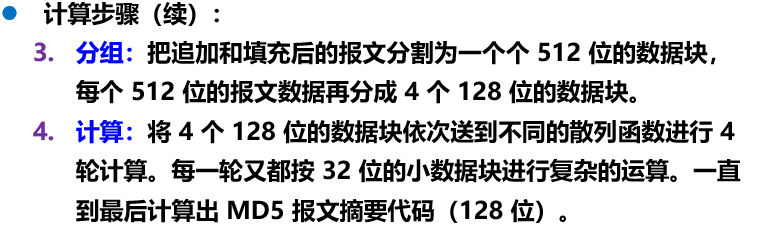

    * SHA-1：Secure Hash Algorithm 安全散列算法

      * 比 MD5更加安全(即抗穷举性)，但是计算要更慢
      * 目前已经有SHA-2, SHA-3等版本, 后面的256表示散列后的长度。
      * 思想：分组得到摘要值，然后每一块和摘要值结合得到中间结果，对中间结果再次分组计算摘要，扫描5遍。

利用密码散列函数只是能够防止篡改，不能防止伪造，即只能验证报文完整性，不能验证端点(或者实体)。

比如：入侵者C冒充A给B伪造了数据，通过密码散列函数是可以得出报文没有被篡改的，但是实际上B误认为是A发送的报文。

因此，**报文鉴别还需要进行一次加密**。

散列加密之后得到的结果称为MAC(Message Authentication Code)报文鉴别码。

这样接收方将对MAC解密后得到散列和计算得到的散列进行对比，就可以知道是否是A发送的数据。

因为只需要对散列值进行加密，而不需要对整个报文进行加密，所以这种鉴别方式要比对原报文加密的方式简单快速。

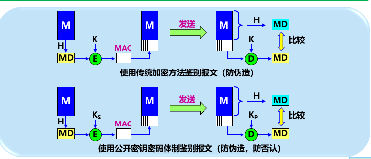

### 4.2 实体鉴别

实体鉴别：仅仅鉴别发送报文的实体，也就是仅仅进行端点鉴别。

与报文鉴别的不同在于实体鉴别在系统接入的全部持续时间内对和自己通信的实体**只需要验证一次**

实现方式：

* 对称密钥机制 + 不重数：

  > 仅仅使用对称加密，具有明显的漏洞：
  >
  > * 重放攻击：中间人C不需要破译报文，截获后发送给B，B向C返回理应给A的报文。
  >
  > * IP欺骗：C还可以冒充A的IP地址，使B更容易受骗。
  >
  > 可以增加不重数nonce，即一个不重复使用的大随机数，这样C在进行重放攻击时就无法重复使用说截获的不重数。

  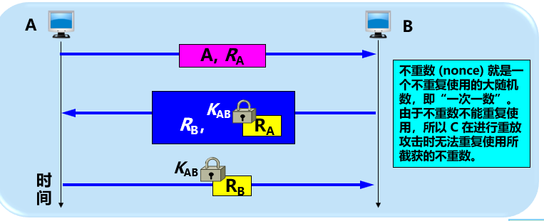

* 公钥机制 + 不重数

  使用公钥机制的时候，可以对不重数进行签名鉴别。

  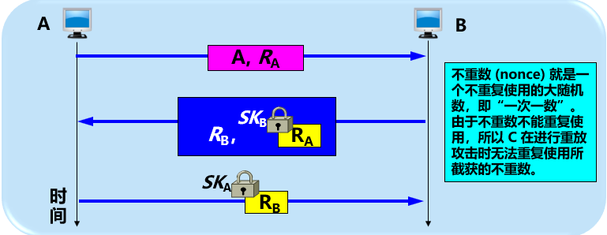

  上图的机制中，依然存在漏洞，因为RA不是加密的，所以RA可能被中间人C截获

  这样的话，身份就得到准确的验证。

  这个就是中间人攻击：

  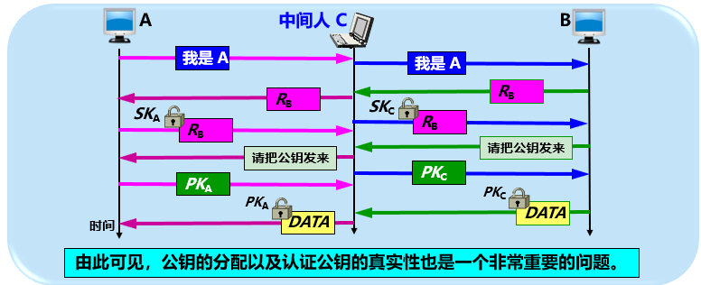

## 五、密钥分配

## 5.1 对称密钥的分配

目前常用的密钥分配方式是设立密钥分配中心 KDC(key distribution center)

KDC是大家都信任的机构，给需要进行秘密通信的用户临时分配一个会话密钥(仅使用一次)

为了防止重放攻击，报文中还会有时间戳。

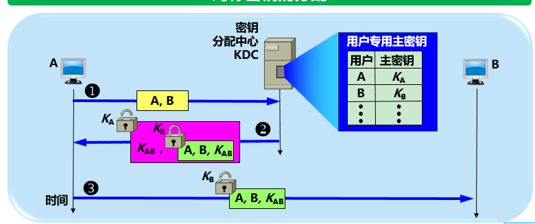

## 5.2 公钥的分配

**为了防止中间人攻击，需要将公钥和对应的实体进行绑定**。否则中间人截获请求后会分别与客户端和服务器建立起连接。

这种绑定需要得到所有人的认可，因此需要一个认证中心CA(Certification Authority)

每一个实体都有CA发来的证书，里面有公钥及其拥有者的信息。

证书会被CA进行了数字签名，因此是不可伪造的。

证书还会进行加密，以确认是来自CA的认证。通过公钥对证书进行解密，对比数字签名就可以知道是否被伪造。

证书是一种身份认证，可以解决信任问题。

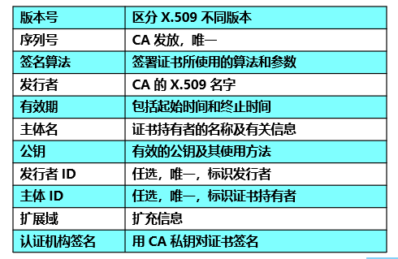

## 六、互联网使用的安全协议

## 6.1 网络层安全协议

### 6.2 运输层安全协议

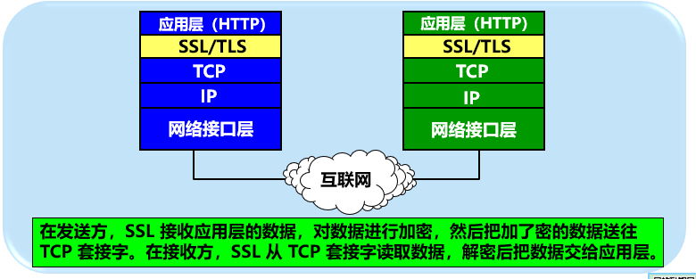

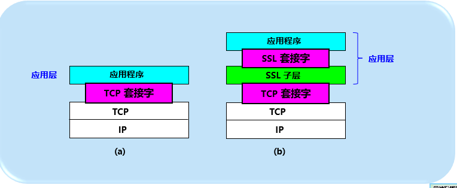

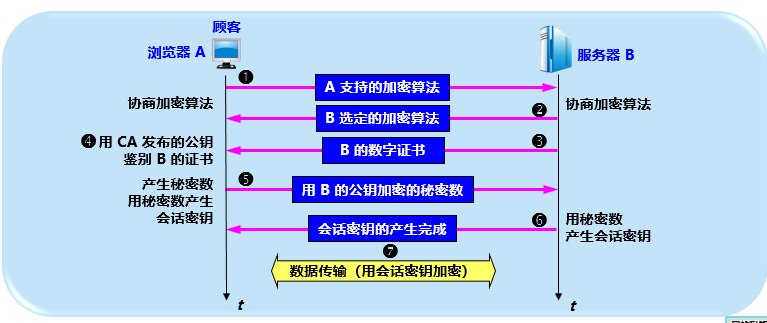

### 6.3 应用层安全协议

接口API安全设计


## 七、系统安全：防火墙与入侵检测

### 7.1 防火墙

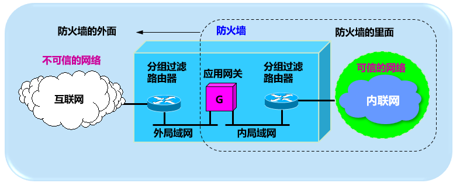

### 入侵检测系统

## 八、未来发展方向


## 六、面试题

1. 安全攻击有哪些, 如何防范

   [可以看看云上的解决方案]()

   * 被动攻击：窃听数据传输。
     * 消息内容泄漏攻击
     * 流量分析攻击
     
   * 主动攻击：
     * 篡改
     
     * 伪造
     
     * 拒绝服务 DOS
     
       
     
   * 常见的攻击

     * 两种形式：
       * 针对网络带宽的**流量攻击**：导致网络带宽被阻塞，淹没合法的网络数据报
       * 针对服务器的**资源耗尽攻击**：cpu，内存，文件描述符等被耗尽。
     * DoS攻击：
       * 常见DoS攻击
         * TCP 洪泛攻击(SYN flood)
         * CC攻击(HTTP flood)：Challenge Collapsar，发出大量http请求，特别是涉及数据库操作的http请求，导致网站响应慢。
         * DRDoS攻击：Distributed Reflection Denial of Service，反射攻击。发送大量数据报给攻击主机，这些数据报用的是受害者的IP地址，这样攻击主机就会对IP地址源做出大量的响应。
       * 解决办法：
         * 单纯通过增加资源是不现实的。
         * 我们需要使用类似WAF(web application firewall 网络应用防火墙)或者RASP(Runtime application self-protection)等安全层措施来抵挡。
     * 应用层：
       * 注入：sql注入，RCE远程代码执行
     * ARP攻击
     * DNS 挟持：在DNS解析环节甚至在DNS记录管理端进行篡改，使得域名对应的IP地址不正确。
     * xxs攻击(cross-site script跨站脚本)：利用浏览器对服务器的信任，浏览器没有对服务器返回的内容做判断，如果服务器返回的数据是用户通过评论等方式植入了脚本，在浏览器渲染或者点击时就会执行，从而拿到浏览器的cookie等关键数据。
     * CSQF(cross-site request forgery 跨站请求伪造)，利用服务器对浏览器的信任， 浏览器存有会话信息，如果攻击者在网页中植入了url，当用户触发到url，就相当于用户进行了操作，比如转账！。
     * SQL 注入：将恶意的sql或者sql片段通过传参等方式进入服务器，服务器将这种参数作为要执行SQL的一部分，Mysql server就会将恶意sql执行了
       * 注入类型：注入数字型，注入字符型
       * 预防：使用preparedStatement预编译语句，将设置到占位符，
         * 其原理是将单引号转义成 \'
           * 不能完全预防，比如like 里面使用%，无法，preparedstatement不发判断是否是合法的。
       * 判断：单引号判断法，字符型还是整型都会因为单引号个数不匹配而报错

   

2. ARP攻击

   1. 原理：主机接收达到ARP报文，不会检查报文的真实性，直接记录到ARP Cache，表项木有过期时间，过期则删除。
   2. 手段：
      1. 洪泛攻击：大量发送使得服务难以响应正常请求。
      2. IP欺骗：攻击者大量发送ARP报文，源地址为攻击者的MAC地址，源IP为被攻击的主机IP，使得主机上的ARP缓存的表项中各主机和网关的IP对应的都是攻击者的MAC地址，从而主机或者网关的数据都发给了攻击者。
      3. IP冲突：篡改ARP Cache表，使得局域网内的主机产生IP冲突。

   

3. 对称加密和非对称加密的区别，以及都有哪些算法

   1. 对称加密：加密和解密使用同一个密钥。
      * 速度快
      * 保管密钥是一大难点，安全性较差
      * 例子：**DES  数字加密标准**、**AES(Advanced Encryption Standard) 高级加密标准**(用于替换DES)
   2. 非对称加密：加密和解密使用不同的密钥。
      * 速度慢
      * 公钥可以通过私钥推导出来，但是反之不行。安全性好。
      * 例子：**RSA(最常用)、D-H、**Elgamal、背包算法、Rabin

   > 注意：
   >
   > * base64 是编码方式，[不是加密算法](https://stackoverflow.com/questions/4070693/what-is-the-purpose-of-base-64-encoding-and-why-it-used-in-http-basic-authentica)。比如HTTP basic authentication就是使用base64进行编码，是一种可以将二进制数据转成成字符串的方式。
   > * SHA1，SHA256等是密文散列函数


1. AES算法

   [参考1](https://www.baeldung.com/java-aes-encryption-decryption)

   AES算法支持使用128位，192位，256位的密钥对每128位一组的数据进行加密。如果数据不足128的整数倍，这需要填充。

   AES有6种[加密模式](https://www.baeldung.com/java-aes-encryption-decryption)

   * ECB(Electronic Code Book) 电子密码本

     > 不推荐。每128位一个组，每组用相同的密钥和算法，所以相同的块，加密出来密文也是一样的。

   * CBC(Cipher Block Chaining) 密码块链

     > 采用初始化向量IV(Initialization Vector)来增强加密。一开始，使用明文 异或  IV; 然后对结果进行加密；后续的组，则使用上一组加密后的结果 异或 明文，然后再加密，一次类推。
     >
     > 这种方式加密过程是不能并行的，但是解密过程是可以并行的。
     >
     > 这种加密方式需要填充

   * CFB (Cipher FeedBack) 密码反馈

   * OFB (Output FeedBack) 输出反馈

   * CTR (Counter)

   * GCM (Galois/Counter Mode)

   最常用的方式是AES/CBC/PKCS5Padding 算法。

   使用JCA(java cryptography architecture)来加解密

   * 生成secretKey 有两种方式可以生成AES密钥 
     * 通过SecureRandom生成密码学安全随机数
     * 从给定的password中提取密钥，需要使用到salt
   * 生成初始向量iv，可以利用SecureRandom生成
   * 加密和解密都需要传入secretKey和iv(因为使用的是CBC)

   

   *AES的具体过程：*

   ​	AES（Advanced Encryption Standard）即密码学的高级加密标准，也叫做 Rijndeal 加密法，是为最为常见的一种对称加密算法，和传统的对称加密算法大致的流程类似，在发送端需要采用加密算法对明文进行加密，在接收端需要采用与加密算法相同的算法进行解密，不同的是， AES 采用分组加密的方式，将明文分成一组一组的，每组长度相等，每次加密一组数据，直到加密完整个明文。在 AES 标准中，分组长度固定为 128 位，即每个分组为 16 个字节（每个字节有 8 位）。而密钥的长度可以是 128 位，192 位或者 256 位。并且密钥的长度不同，推荐加密的轮数也不同。

   我们以 128 位密钥为例（加密轮次为 10），已知明文首先需要分组，每一组大小为16个字节并形成 4 × 4 的状态矩阵（矩阵中的每一个元素代表一个字节）。类似地，128 位密钥同样用 4 × 4 的字节矩阵表示，矩阵中的每一列称为 1 个 32 位的比特字。通过密钥编排函数该密钥矩阵被扩展成一个由 44 个字组成的序列，该序列的前四个字是原始密钥，用于 AES 的初始密钥加过程，后面 40 个字分为 10 组，每组 4 个字分别用于 10 轮加密运算中的轮密钥加。在每轮加密过程中主要包括四个步骤：

   ① 字节代换：AES 的字节代换其实是一个简易的查表操作，在 AES 中定义了一个 S-box 和一个逆 S-box，我们可以将其简单地理解为两个映射表，在做字节代换时，状态矩阵中的每一个元素（字节）的高四位作为行值，低四位作为列值，取出 S-box 或者逆 S-box 中对应的行或者列作为输出。

   ② 行位移：顾名思义，就是对状态矩阵的每一行进行位移操作，其中状态矩阵的第 0 行左移 0 位，第 1 行左移 1 位，以此类推。

   ③ 列混合：列混合变换是通过矩阵相乘来实现的，经唯一后的状态矩阵与固定的矩阵相乘，从而得到混淆后的状态矩阵。其中矩阵相乘中涉及到的加法等价于两个字节的异或运算，而乘法相对复杂一些，对于状态矩阵中的每一个 8 位二进制数来说，首先将其与 00000010 相乘，其等效为将 8 位二进制数左移一位，若原二进制数的最高位是 1 的话再将左移后的数与 00011011 进行异或运算。

   ④ 轮密相加：在开始时我们提到，128 位密钥通过密钥编排函数被扩展成 44 个字组成的序列，其中前 4 个字用于加密过程开始时对原始明文矩阵进行异或运算，而后 40 个字中每四个一组在每一轮中与状态矩阵进行异或运算（共计 10 轮）。

   上述过程即为 AES 加密算法的主要流程，在我们的例子中，上述过程需要经过 10 轮迭代。而 AES 的解密过程的各个步骤和加密过程是一样的，只是用逆变换取代原来的变换

   

2. RSA算法

   RSA , 即 [Rivest–Shamir–Adleman](https://en.wikipedia.org/wiki/RSA_(cryptosystem)),  时非对称加密，通常使用公钥来加密数据，私钥来解密数据。

   使用JCA的RSA api来加解密

   * 生成KeyPairs，可以得到publicKey 和 privateKey
   * 使用RSA算法构建Ciper对象，使用encrytp模式和publicKey初始化
   * 使用doFinal方法来加密得到密文cipherText
   * 解密则使用性的Ciper对象，使用decrypt模式和privateKey初始化
   * 使用doFinal方法来解密得到明文

   

3. Base64

   Base64是一种编码方式，将二进制输入映射成只有A-Za-z0-9，还有'+'和'/'，总共64个字符字符集中的字符构成的字符串，而且不会使用换行符。

   Base64默认会填充，输出的字符串长度必须是3的倍数，所以在最后输出的时候会增加1到两个填充符"="。

   解码的时候会先丢弃填充符。

   可以选择不进行填充。

   > [Base64](https://zh.wikipedia.org/wiki/Base64) 和 URL encoding
   >
   > 当我们需要将二进制数据放到url中传输的时候，我们也可以使用base64来将二进制转成字符串，但是
   >
   > 标准的Base64 不适合直接放到URL中传输，因为有'+'和'/'，这个经过URL编码之后会变成%XX的形式。
   >
   > 为了解决这个问题，可以使用安全的base64字符集，将'+'和'/'使用其他字符来代替。
   >
   > ```java
   > String originalUrl = "https://www.google.co.nz/?gfe_rd=cr&ei=dzbFV&gws_rd=ssl#q=java";
   > String encodedUrl = Base64.getUrlEncoder().encodeToString(originalURL.getBytes());
   > byte[] decodedBytes = Base64.getUrlDecoder().decode(encodedUrl);
   > String decodedUrl = new String(decodedBytes);
   > ```
   >
   > Base64 与 MIME
   >
   > 为了更好的适配MIME，对编码也有微小的调整，使用的这时Base64.getMimeEncoder();

   

4. SHA  Secure Hash Algorithm  

   SHA 安全散列算法，是常用的密码散列函数，通常用于对数据进行签名，因为是单向操作，无法。

   SHA-256 生成基于唯一的256位的hash值。

   SHA2 目前使用最广泛，SHA3会更快速(2015年, JDK9才提供).

   在JAVA中，我们使用MessageDigest类(线程不安全的)来使用SHA进行hash。

   

5. RSA和AES的区别

   * RSA 
     * 非对称加密方式；
     * 公钥可以公开(公钥无法推导出私钥)；
     * 常用与服务器一对多客户端的加密方式。
     * 私钥长度较长，需要进行大数的乘幂求模等运算，运算速度较慢，不适合大量数据文件的加密。
   * AES
     * 对称加密方式
     * 密钥长度最长只有256个比特。加解密都比较快，易于用硬件实现
     * 通信双方需要提前获知加密密钥

   > 通常两者结合使用：利用RSA来传输对称密钥给对方，之后使用AES进行对称加密。

