# 物理层

## 一、数据通信

1. 数据通信系统的模型

数字比特流 -- 模拟信号 -----------------模拟信号--数字比特流

> 调制解调器的作用：将数字信号调变到模拟信号上进行传输，并解调收到的模拟信号得到数字信号。
>
> 随着现在光纤的普及，光纤调制解调器越来多。

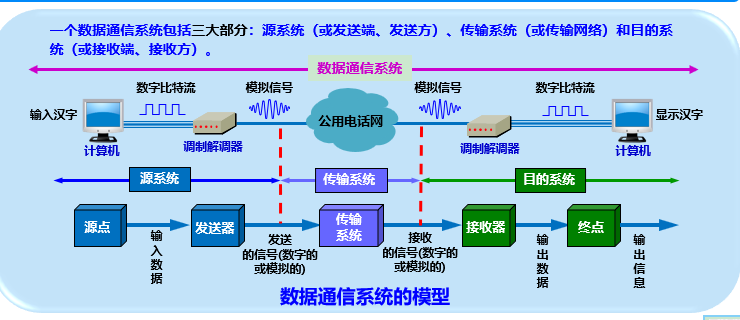

2. 术语

   * 数据data：运送消息的实体
   * 信号signal：数据的电气或者电磁的表现
   * 模拟信号analogous signal：代表消息的参数取值是连续的
   * 数字信号digital signal：代表消息的参数取值是离散的
   * 码元 code：使用时间域的波形表示数字信号时，代表不同离散数字的基本波形

3. 基本概念

   * 信道---传输媒体

   * 基带信号--基本频带信号---来自信源的信号，比如代表文字，图像的数据信号

     > 基带信号中往往包含很多低频成分，甚至直流成分，很多信道不能传输这种低频分量或者直流分量。因此必须对基带信号进行**调制**(modulation).
     >
     > 调制分两大类：
     >
     > * 基带调制：仅对基带信号的波形进行变换，使其适应信道的特性，变换之后依然是**基带信号**。这种过程也称为**编码(coding)**
     >
     >   * **数字信号**编码方式有曼彻斯特编码，差分曼彻斯特编码。这两种具有自同步能力。
     >
     >     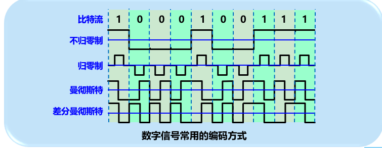
     >
     > * 带通调制：使用载波(carrier) 进行调制，把基带信号的频率范围搬移到较高的频段，并转换为**模拟信号**，使得更好的在模拟信道中传输(即仅在一定频率范围内能够通过信道)。这种模拟信号也称为**带通信号**。
     >
     >   (因为数字信号只有1和0，所以看上起是矩形的波，因此可以通过类似三角函数的波长来表示，上升即出现1，下降即出现0，看上去是三角函数图形)
     >
     >   * 调制方式有
     >     * 调幅：振幅随基带数字信号变化
     >     * 调频：频率随基带数字信号变化
     >     * 调相：初始相位随基带数字信号变化

3. 信道容量

   信道在传输信号时，会产生各种失真以及干扰。

   码元传输速率越高，传输距离越远，传输媒体质量越差，信号失真就越严重。

   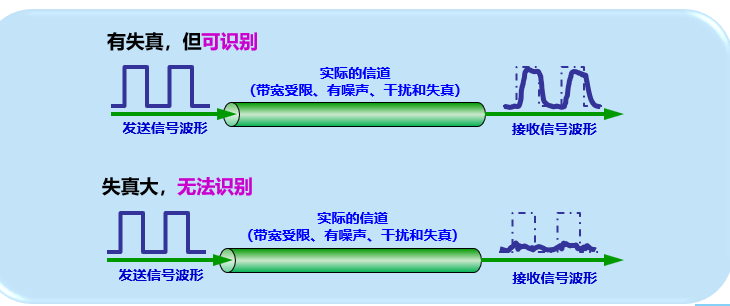

   码元在信道上的传输速率收到以下两个因素限制：

   * 信道能够通过的频率范围：(频率越高，速率越快)

     信道中许多高频分量往往不能通过信道。

     信道中码元传输的速率有上限，超过会出现码间串扰。

     信道的频带越宽，能够通过的信号高频分量越多，就可以使用更高的速率来传送而不出现码间串扰。

   * 信噪比

     噪声存在于所有的电子设备和通信通道。

     噪声是随机产生的，瞬时值有时可能很大，导致接收端对码元的判决错误。

     噪声的影响是相对的，信号越强，噪声的影响就相对较小。

     因此通过信噪比=信号的平均功率 / 噪声的平均功率，单位dB

   香农(shannon)公式给出了两个因素综合影响下的信道极限传输速率公式：
   $$
   C = Wlog_2(1+S/N) \quad \quad (bit/s) \\
   $$
   其中： W为信道的带宽(单位HZ)，S为信号的传输功率，N为信道内部的高斯噪声功率。

   > 我们平常所说的带宽，其实是传输速率，比如100M带宽是100Mbps(bit/s)。
   >
   > 带框实际上是指频率宽度，频率范围越高，允许带通调制之后的频率越高，传输速率就越快。
   >
   > 信噪比越大，传输速率越高。(容易搞反了)
   >
   > 只要传输速率小于信道的极限信息传输速率，就可以找到某种办法来实现无差错传输。
   >
   > 实际上信道上能够达到的传输速率要比香农的低不少

   上面的是信道的传输速率，如果带宽(频带宽度)和信噪比已经确定，如何提升信道的传输效率呢。

   我们可以通过编码的方法，让一个码元携带更多的比特信息。

   

## 二、 传输媒体

电信领域使用的电磁波频谱(光也是电磁波)

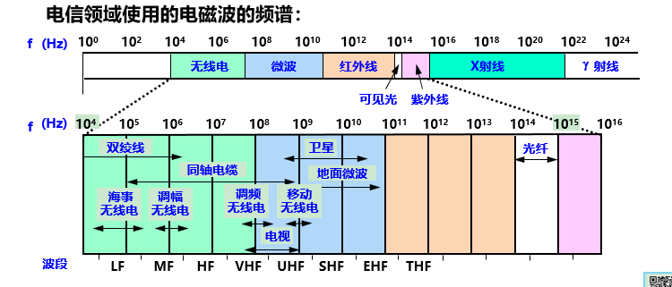

### 2.1 导引型传输媒体

导引型传输媒体：**电磁波**沿着固体媒体(铜线或者光纤)传播

* 双绞线：

  * 最常用的传输媒体。

  * 模拟传输(模拟信号)和数字传输(数字信号)均可用

    > 所以我们室内局域网都是使用双绞线

  * 距离：几到十几公里

  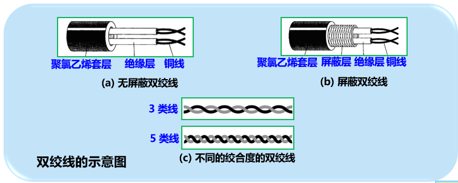

  * 双绞线标准：目前使用最多的是5类线或者超5类

    >  注意极限传输速率，买网线的时候也要注意是否支持500Mbps

    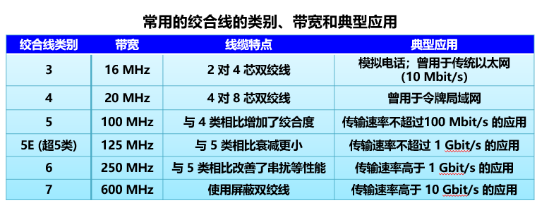

* 同轴电缆：

  * 用于传输较高速率的数据，具有很好的抗干扰特性
  * 带宽决定于电缆的质量
  * 50Ω 同轴电缆 --- LAN(局域网) / 数字传输  
  * 70Ω 同轴电缆 --- 有线电视 / 模拟传输

  

  

* 光纤：

  * 用于光纤通信

  * 可见光的频率非常高，约10^8^MHZ量级，因此其带宽远远大于目前其他传输媒体

    > 常用的3个波段的带宽为2.5~3*10^7^MHZ

  * 利用光线在光纤中的折射来进行传输

    因为光从高折射率射向低折射率媒体时，其折射角将大于入射角。如果入射角足够大，就会出现全反射，光就沿着光纤传输下去

    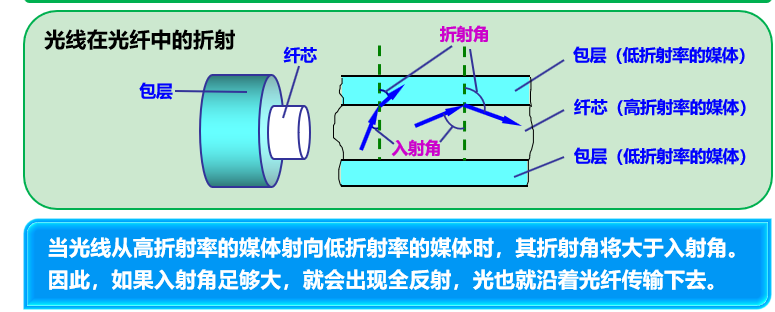

    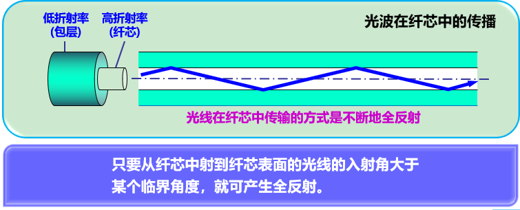

    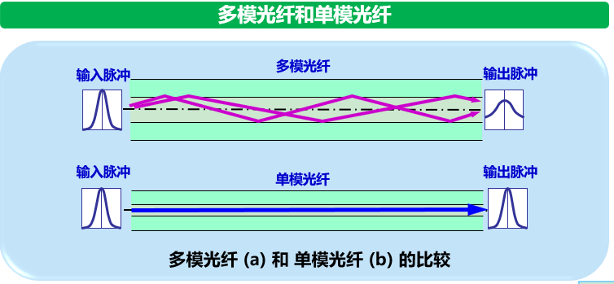

### 2.2 非导引型传输媒体

非导引型传输媒体就是指只有空间，比如无线传输。

无线传输使用的频段很广。

* 短波通信(无线电) 主要依靠电离层的反射，通信质量差，传输效率低

  * 无线局域网的ISM频段

    无线电通信需要征得政府机构的许可，但是有些比如无线局域网的就不需要。

* 微波通信 主要是直线传播。有两种方式：地面微波接力通信和微信通信

### ## 三、 信道复用技术

复用 MultiPlexing

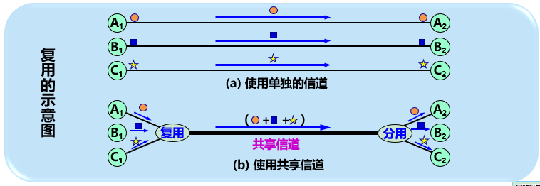

### 3.1 频分复用、时分复用、统计时分复用

1. 频分复用：

   将频带宽度分成多分，所有用户同时占用不同的带宽资源(这里是指频率带宽而不是传输速率)

   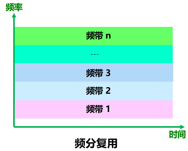

2. 时分复用：

   所有用户在不同的时间占用同样的频带宽度。

   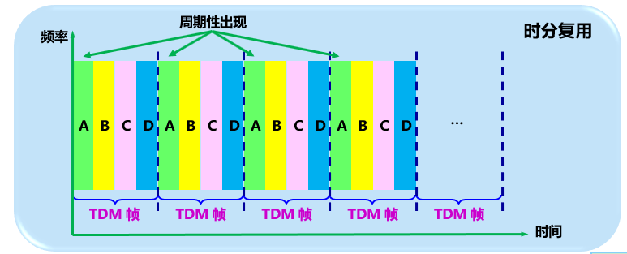

3. 统计时分复用

   时分复用容易造成资源浪费，使用统计时分复用可以按需动态的分配时间片，提高利用率

   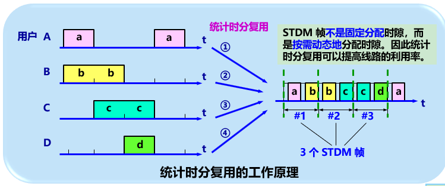

### 3.2 波分复用

波分复用其实就是针对光的频分复用

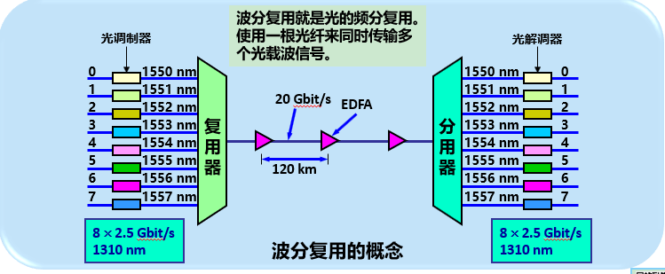

### 3.3 码分复用

又称为**码分多址**(Code Division Multiple Access)

各用户使用经过特殊挑选的不同码型，有很强的抗干扰能力，类似于白噪声，不易被发现。

## 四、数字传输系统

早期电话网中，从市话局到用户电话机的用户线是最廉价的双绞线电缆，长途干线采用的是频分复用FDM的模拟传输方式。

与模拟通信相比，数字通信无论是在传输质量和经济上都有明显优势。

目前，长途干线大都采用时分复用脉码调制PCM的数字传输方式

## 五、宽带接入技术

### 5.1 ADSL技术

用户要连接到互联网，必须先连接到某个ISP

ADSL (Asymmetric Digital Subscriber Line) 非对称数字用户线。

这是利用数字技术对之前的模拟电话用户线进行改造，使其可以承接宽业务。

ADSL 将0-4kHZ低频段给电话使用，将原来没有利用到的高频段给用户上网使用。

DSL 是数字用户线，还有其他DSL种类

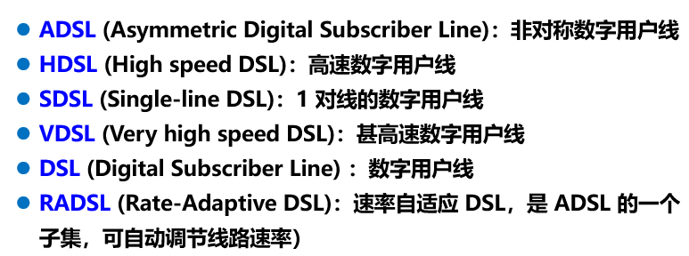

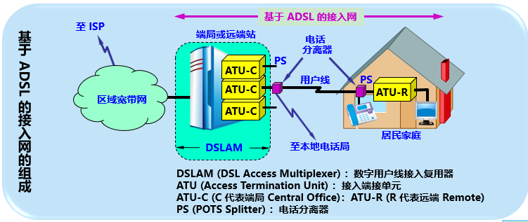

### 5.2 光纤同轴混合网(HFC网)

基于有线电视网络的基础开发的居民宽带接入网

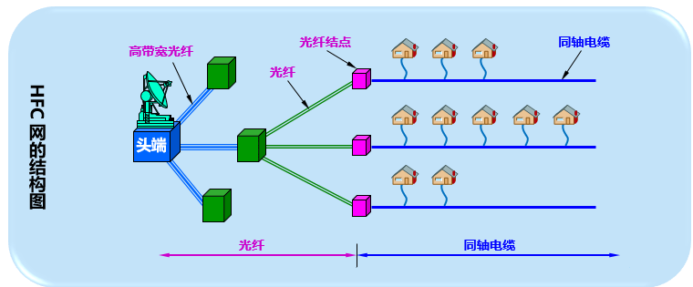

### 5.3 FTTx技术

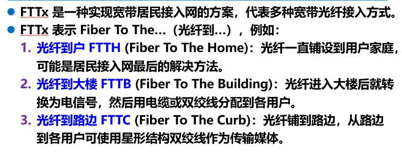

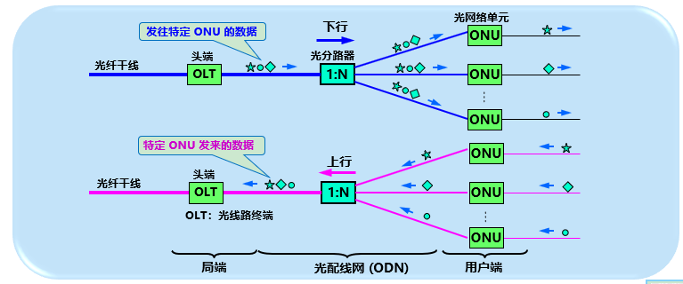

## 六、 面试题

1. 物理层主要做什么事情

   利用传输介质为通信两端建立，管理，释放物理层连接，实现**比特流的透明传输**。

   物理层考虑的问题是**如何才能在各种传输媒体上传输比特流**，尽可能屏蔽掉不同种类传输媒体和通信手段的差异，使得数据链路层只需要考虑如何完成数据链路帧的封装，透明传输和差错检验(3大问题)。

2. 主机之间的通信方式

   * 单工通信：只能单向传输，发送方和接收方是固定的。比如采集气象数据，家庭电费等
   * 半双工通信：也叫双向交替通信，双方都可以发送和接收，但是同一时刻只能单方向发送数据。比如对讲机
   * 全双工：双向通信能力。允许同一时刻双方都在发送数据。比如打电话。

3. 通道复用技术

   1. 频分复用：将带宽按照频率划分，每个用户使用不同的频率发送。

      频分复用将传输信道的总带宽按频率划分为若干个子频带或子信道，每个子信道传输一路信号。用户分到一定的频带后，在数据传输的过程中自始至终地占用这个频带。由于每个用户所分到的频带不同，使得传输信道在同一时刻能够支持不同用户进行数据传输，从而实现复用。除了传统意义上的 FDM 外，目前正交频分复用（OFDM）已在高速通信系统中得到广泛应用。

   2. 时分复用：将传输时间分片，每个用户占用不同的时间片

      顾名思义，时分复用将信道传输信息的时间划分为若干个时间片，每一个时分复用的用户在每一个 TDM 帧中占用固定时隙进行数据传输。用户所分配到的时隙是固定的，所以时分复用有时也叫做同步时分复用。这种分配方式能够便于调节控制，但是也存在缺点，当某个信道空闲时，其他繁忙的信道无法占用该空闲信道，因此会降低信道利用率。

   3. 波分复用：光通信领域，按照波长来划分(光的频率和波长具有单一对应关系）

      在光通信领域通常按照波长而不是频率来命名，因为光的频率和波长具有单一对应关系，因此 WDM 本质上也是 FDM，光通信系统中，通常由光来运载信号进行传输，WDM 是在一条光纤上传输多个波长光信号，其将 1 根光纤看做多条「虚拟」光纤，每条「虚拟」光纤工作在不同的波长上，从而极大地提高了光纤的传输容量。

   4. 码分复用：通过不同的编码方式划分，使用相互正交的码字携带信息

      码分复用是靠不同的编码来区分各路原始信号的一种复用方式，不同的用户使用相互正交的码字携带信息。由于码组相互正交，因此接收方能够有效区分不同的用户数据，从而实现每一个用户可以在同样的时间在同样的频带进行数据传输，频谱资源利用率高。其主要和各种多址接入技术相结合从而产生各种接入技术，包括无线和优先接入

4. 集中宽带接入方式

   速率超过1Mbp的接入称为宽带接入

   * ADSL(Asymmetric Digital Subscriber Line) 非对称数字用户线，是铜线带宽接入技术的一种。非对称体现在上行和下行速率不一样。适合家庭用户。

   * FTTx+LAN  是一种在接入网全部或者部分使用管线传输介质，构成光纤用户路线。速率可达20Mbps。是目前城市中较为普及的宽带接入技术

     FTTx (Fiber To The x) ，x指任何地方。可以理解为光纤可以接入到任何地方。

     LAN(Local Area Network), 局域网。

   * 其他还有无线接入，光纤同轴混合网(HFC)和光接入技术（有源和无源光纤系统）等等

   

