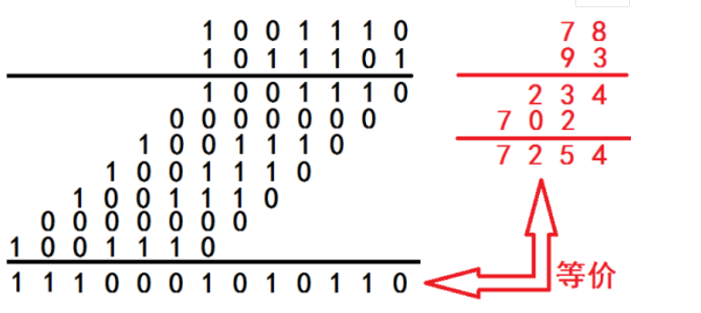

# 数据链路层

[TOC]

## 一、使用点对点信道的数据链路层

数据链路层

【问题1】那些设备需要实现数据链路层

* 网络中的主机，路由器均需要实现数据链路层
* 局域网中的主机，交换器均需要实现数据链路层

数据链路层使用的信道

### 1.1 数据链路和帧

【问题2】什么是数据链路，如何实现

​		数据链路 = 物理线路 + 通信协议

​		适配器(网卡)就是实现数据链路层硬件和软件需求的手段。

​		一般的适配器(网卡)，都包括了数据链路层和物理层这两层的功能		

* 数据链路层的数据传输单元是帧frame

  数据链路层不必考虑物理层的比特传输细节。

  

  

### 1.2 三个基本问题

数据链路层需要解决的3个问题是

* 封装成帧

  * 封装过程会添加首部和**尾部**。首部和尾部的一个重要作用是**帧定界**

    

    可以使用控制字符来进行帧定界。

    SOH(Start Of Header), EOT(End Of Transmission)

    这两个是控制字符，对应[ASCII](https://zh.wikipedia.org/wiki/ASCII)上的01和04(十六进制)

    

* 透明传输

  * 不管上层提供什么比特组合的数据，都可以原样的传输。

    【问题】使用控制字符来定界存在的问题--错误找到边界

    

    【解决办法】：字节填充(byte stuffing) 或 字符填充(char stuffing)

    > 也就是常用的转义字符。
    >
    > 发送方如果发现数据中出现SOH或EOT，则在其前面插入转义字符[“ESC”](https://zh.wikipedia.org/wiki/ASCII)，其十六进制编码为1B；
    >
    > 接收方在将数据送完网络层之前删除插入的转义字符。
    >
    > 如果转义字符也出现在数据中，则连续使用两个转义字符。类似正则一样。

    

* 差错控制

  * 传输过程可能出现比特差错：1可能变成0，0可能变成1

    【如何衡量】误码率BER(Bit Error Rate)，误码率与**信噪比**有很大关系

    

    【解决】使用**循环冗余检验CRC**
    * 循环冗余检验CRC (Cyclic Redundancy Check)

      发送端，将数据划分成组，每组k个比特，构成二进制数M。

      每个分组拼接上n位的**冗余码**(称为**帧检验序列**FCS(Frame Check Sequence），然后发送。

      > CRC循环冗余校验只能做到无差错接收，不能实现“无差错传输”或者可靠传输
      >
      > **无差错接收**是指只要接收方接受了，就可以以近似1的概率任务传输过程没有差错(因为发现差错会丢弃)，也可以理解为实现了**无比特差错传输**
      >
      > **无差错传输或者可靠传输是指发送方发送什么，接收方就收到什么，需要依靠确认和重传机制来实现。**
      >
      > 所以数据链路层协议都是不可靠的传输协议。

      

## 二、 点对点协议PPP

## 三、使用广播信道的数据链路层

## 四、拓展的以太网

## 五、高速以太网

### 待定

二进制乘法，二进制除法 都可以类似十进制一样计算

