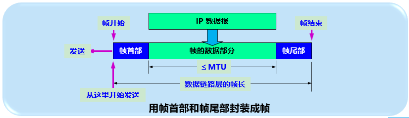
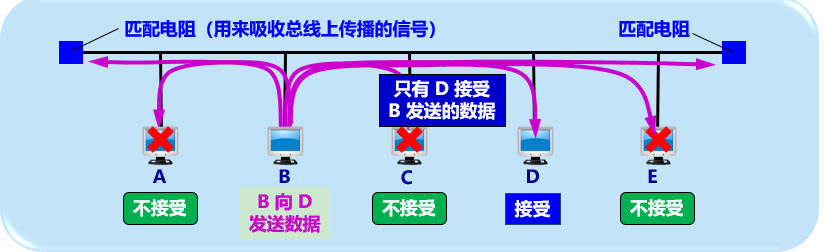
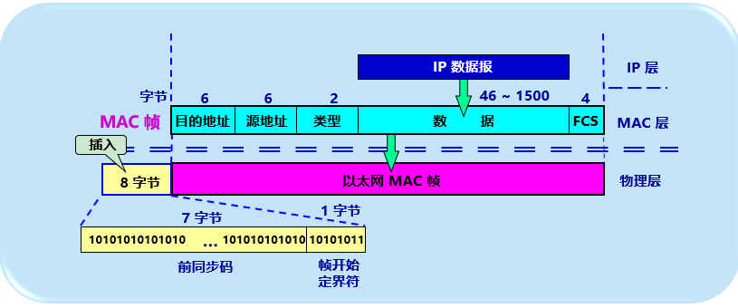
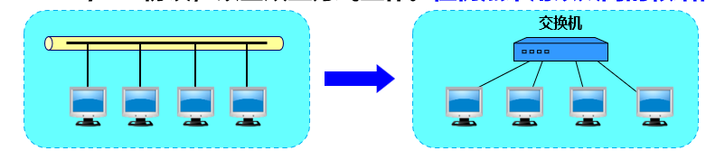
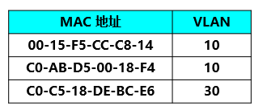

# 数据链路层

[TOC]

## 一、使用点对点信道的数据链路层

数据链路层

【问题1】那些设备需要实现数据链路层

* 网络中的主机，路由器均需要实现数据链路层
* 局域网中的主机，交换器均需要实现数据链路层

数据链路层使用的信道

### 1.1 数据链路和帧

【问题2】什么是数据链路，如何实现

​		数据链路 = 物理线路 + 通信协议

​		适配器(网卡)就是实现数据链路层硬件和软件需求的手段。

​		一般的适配器(网卡)，都包括了数据链路层和物理层这两层的功能		

* 数据链路层的数据传输单元是帧frame

  数据链路层不必考虑物理层的比特传输细节。

  

  

### 1.2 三个基本问题

数据链路层需要解决的3个问题是

* 封装成帧

  * 封装过程会添加首部和**尾部**。首部和尾部的一个重要作用是**帧定界**

    

    可以使用控制字符来进行帧定界。

    SOH(Start Of Header), EOT(End Of Transmission)

    这两个是控制字符，对应[ASCII](https://zh.wikipedia.org/wiki/ASCII)上的01和04(十六进制)

    

* 透明传输

  * 不管上层提供什么比特组合的数据，都可以原样的传输。

    【问题】使用控制字符来定界存在的问题--错误找到边界

    

    【解决办法】：字节填充(byte stuffing) 或 字符填充(char stuffing)

    > 也就是常用的转义字符。
    >
    > 发送方如果发现数据中出现SOH或EOT，则在其前面插入转义字符[“ESC”](https://zh.wikipedia.org/wiki/ASCII)，其十六进制编码为1B；
    >
    > 接收方在将数据送完网络层之前删除插入的转义字符。
    >
    > 如果转义字符也出现在数据中，则连续使用两个转义字符。类似正则一样。

    

* 差错控制

  * 传输过程可能出现比特差错：1可能变成0，0可能变成1

    【如何衡量】误码率BER(Bit Error Rate)，误码率与**信噪比**有很大关系

    

    【解决】使用**循环冗余检验CRC**
    * 循环冗余检验CRC (Cyclic Redundancy Check)

      发送端，将数据划分成组，每组k个比特，构成二进制数M。

      每个分组拼接上n位的**冗余码**(称为**帧检验序列**FCS(Frame Check Sequence），然后发送。

      > CRC循环冗余校验只能做到无差错接收，不能实现“无差错传输”或者可靠传输
      >
      > **无差错接收**是指只要接收方接受了，就可以以近似1的概率任务传输过程没有差错(因为发现差错会丢弃)，也可以理解为实现了**无比特差错传输**
      >
      > **无差错传输或者可靠传输是指发送方发送什么，接收方就收到什么，需要依靠确认和重传机制来实现。**
      >
      > 所以数据链路层协议都是不可靠的传输协议。

      

## 二、 点对点协议PPP

### 2.1 PPP 点对点协议的特点

PPP (Point to Point Protocol) 点对点协议.

用户到ISP的链路采用的是PPP协议

PPP协议的组成

1. 将IP数据报封装到串行链路的方法
2. 链路控制协议LCP(Link Control Protocol)
3. 网络控制协议NCP（Network Control Protocol）

> 可以看到PPP协议已经不是纯粹的数据链路层协议，同时包含了物理层和网络层的内容

### 2.2 PPP 点对点协议的帧格式

### 2.3 PPP点对点协议的工作状态

1. 当用户拨号进入ISP时，路由器的调制解调器对拨号做出确认，并建立一条物理连接

2. PC机向路由器发送一些列LCP链路控制协议分组(封装成多个PPP帧)

3. 这些分组及其响应选择一些PPP参数，并进行网络层配置，NCP给新接入的PC机分配一个临时IP地址，使PC机成为因特网上的一个主机

4. 通信完毕时，NCP释放网络层连接，收回临时IP地址，然后释放数据链路层连接，最后释放物理层连接

   

## 三、使用广播信道的数据链路层

### 3.1 局域网的数据链路层

* 局域网

  * 优点：具有广播能力，共享局域网上的硬件和软件资源

  

  

  

* 媒体共享技术

  * 静态划分信道
    * 频分复用
    * 时分复用
    * 波分复用
    * 码分复用
  * 动态媒体接入控制(多点接入)
    * 随机接入
    * 受控接入，如多点线路探询(polling)，或者轮询

* 以太网 Ethernet

  以太网是采用以太网规约的局域网。是符合DIX Ethernet V2标准的局域网(第一个以太网规约)。

  IEEE 802.3协议是IEEE的以太网标准（与DIX Ethernet V2相差不大），所以也可以将802.3局域网成为以太网。

  > TCP/IP协议体系经常使用的局域网是DIX Ethernet V2而不是802.3标准中的局域网，所以802.3指定的LLC逻辑链路子层作用不打了。
  >
  > 很多厂商的适配器上就只有MAC协议，没有LLC协议

* 数据链路层的两个子层

  * 逻辑链路控制层LLC(Logic Link Control)
  * 媒体接入控制层MAC(Media Access Control)

  > 与接入到传输媒体有关的内容在MAC子层，而LLC子层与传输媒体无关
  >
  > 不管采用何种协议的局域网，对LLC子层都是透明的，LLC在MAC层次之上。

  

* 适配器

  网络接口板又称为**通信适配器adapter**或者**网络接口卡**Network Interface Card(即我们讲的网卡)

  适配器的作用：

  * 进行串行/并行转换
  * 对数据进行缓存
  * 在计算机的操作系统安装设备驱动程序
  * 实现以太网协议

  

### 3.2 CSMA/CD协议

早期的以太网是将很多计算机连接到一根总线上，比较容易实现广播通信

一对一通信也是广播方式，但只有数据帧中的目的地址与适配器的硬件地址匹配，才会接受这个数据帧

总线模式的缺点是，会产生发送碰撞或者冲突

为了通信的方便，以太网采取了两个重要措施

1. 采用较为灵活的无连接工作方式，尽最大努力交付

   * 不必建立连接，即可发送数据
   * 不必对数据帧编号，也不需要对方发送确认
   * 差错校验失败即丢弃
   * 即时是重传的数据，也当成新数据帧来传送

   通过CSMA/CD载波监听多点接入/碰撞检测来解决共享信道的问题

   

2. 采用曼彻斯特编码

   

CSMA/CD 载波监听多点接入/碰撞检测  Carrier Sense Multiple Access with Collision Detection

* 多点接入：允许多计算机以多点接入的方式连接在一根总线上

* 载波监听：每一个主机发送数据之前，先检测总线上是否有其他计算机在发送数据，如果有，则暂时不要发送数据，以免碰撞

  > 检测到空闲之后，还需要等待一个**帧间最小间隔**(9.6us),相当于96bit的发送时间。
  >
  > 这是为了使刚刚收到数据帧的站的接收缓存来得及清理，做好接收下一帧的准备。
  >
  > 总线上并不存在什么“载波”，载波监听指的是利用电子技术检测总线上有没有其他计算机发送的信号

* 碰撞检测：边发送数据，边检测信道上的电压大小

  > 当几个站同时在总线上发送数据时，总线上的信号电压摆动值将会增大(相互叠加)
  >
  > 当一个站检测到的信号电压摆动值超过了一定的门限，就认为总线上至少两个站在同时发送数据，即碰撞了，或者说冲突了
  >
  > 发生了碰撞之后，总线上的信号发生严重的失真，无法恢复出有用的数据。
  >
  > 所以每一个**正在**发送数据的站，检测到碰撞之后，既要立即停止发送，并且会发出人为干扰信号， 然后等待一段时间之后再次发送。
  >
  > 为什么需要碰撞检测，因为仅仅监听载波，由于信号传播有延迟，A监听到的时候可能已经晚了。

CSMA/CD 特性：

* 半双工通信(双向交替通信)
* 发送数据之后的小段时间内，存在遭遇碰撞的可能
* 这种发送不确定性导致平均通信量远低于以太网的最高数据率

**二进制指数类型退避算法**

**备选集合是变化的，与重传次数有关；从集合中选择的时候是随机的。**

* 基本退避时间 = 争用期(端到端的往返时间2τ) (τ读tao)

  > 争用期：如果争用期内没有检测到碰撞，那么就可以肯定这次发送不会发生碰撞
  >
  > 因为这个时间是两倍的端到端的往返时间。
  >
  > 也称为碰撞窗口
  >
  > 对于10Mbit/s的局域网，争用期为51.2us，相当于可以发送512bit，即64字节。
  >
  > 因此如果发生冲突，一定是在发送这前64字节的时候，由于检测到就会停止，所以发送出去的
  >
  > 字节少于64字节，因此以太网规定了最短有效帧长为64字节，少于64字节的帧都是无效帧。
  >
  > 利用单程的时间为25.6us，根据信号在以太网中1km大约5us，所以以太网的最大端到端的长度约为5km。

* 从整数集合中[0, 1, 2, 4, 8, ... 2^k - 1]中**随机**取出一个数r

  > k  = min(重传次数， 10)
  >
  > 重传次数超过16次将会丢弃该帧，并向高层报告

* r * 2τ 就是重传需要等待的随机时间

### 3.3 使用集线器的星形拓扑

以太网的传输介质演变：粗同轴电缆 -> 细同轴电缆 -> 双绞线(发送和接收分别一条线)

采用同轴电缆的以太网采用总线拓扑结构

采用双绞线的以太网采用星形拓扑，在星形的中心增加了一种可靠性高的设备----集线器hub

从此以太网的拓扑就从总线的方式变为更加方便的星形网络，帮助以太网在局域网中占据统治地位

集线器的特点：

* 使用电子器件模拟实际电缆的工作
* 使用集线器的以太网在逻辑上仍是一个总线网，各工作站还是使用CSMA/CD协议，并共享逻辑上的总线
* 集线器很像一个多接口的转发器，工作在物理层
* 采用了专门的芯片，进行自适应串音回波抵消，减少了近端串音

### 3.4 以太网的信道利用率

### 3.5 以太网的MAC层

1. MAC(Media Access Control）媒体接入控制层的硬件地址

   硬件地址又称为MAC地址或者物理地址

   > 如果主机或者路由器装有多个适配器，那么就有多个物理地址
   >
   > 更准确的锁，这个地址是某个接口的标识符

   IEEE的注册管理机构RA负责分配前3个字节(23位，最后一位为I/G)，后面3个字节由厂家执行指派，必须保证生产出来的适配器没有重复地址

   适配器生产出来，6字节的MAC地址已经固化在适配器的ROM中。

   

   IEEE规定地址字段的第1个字节的最低位为I/G位，表示Individual/Group

   * 当I/G位=0，地址字段表示一个单站地址
   * 当I/G位=1，地址字段表示组地址，用于多播。
   * 当48位全部为1时，地址字段表示广播地址，只能用于目的地址。

   IEEE规定地址字段第1个字节倒数第二个字节为G/L位，表示Global/Local

   * 当G/L=0时，表示全球管理，需全球唯一
   * 当G/L=1时，表示本地管理，用户可以任意分配网络上的地址。

   > [IP网络层与物理层MAC的单播unicast，多播multicast，广播broadcast](https://blog.csdn.net/liufuchun111/article/details/90714914)
   >
   > IP：
   >
   > * 单播：具体的主机IP地址
   > * 多播：属于多播组的主机将会被分配一个多播组IP地址，地址范围为224.0.0.0～239.255.255.255。
   > * 广播：IP地址中主机部分全部为1，意味着本地网络广播，比如DHCP协议
   >
   > MAC：
   >
   > * 单播：具体的MAC地址，其中I/G位为0
   >
   > * 多播：前3字节为01-00-5E，余下的根据IP多播组的地址的最后23位转换得出。比如 01-00-5E-0F-64-C5
   >   * 广播：MAC地址全部为1。
   >
   > 如果目标IP地址属于另一个网络，则在帧中使用的目标MAC地址将为与源IP地址位于同一个网络中的路由器接口的MAC地址。

​	适配器从网络上每收到一个MAC帧，首先用硬件检查MAC帧中的MAC地址，如果是本站则手下，否则丢弃(不会重传)。

​	> 以混杂方式工作的以太网适配器只要听到有帧在以太网上传输就都接收下来，便于调试与定位问题

2. **MAC帧格式**

   以太网帧有两个标准，最常用的是以太网V2的格式

   * DIX Ethernet V2
   * IEEE的802.3标准

   格式：

   * 类型：用于标志上一层使用的是什么协议。
   * 数据：MAC客户数据字段，最小是64字节(前面提到) - 18字节首部和尾部 = 46字节；最大1500字节。
   * FCS: Frame Check Sequence 帧检验序列，用于差错检测
   * 前同步码：用于迅速实现MAC帧的比特同步(通信相关了)

   

## 四、拓展的以太网

### 4.1 在物理层拓展

1. 使用光纤拓展

   * 主机使用光纤(通常是一对光纤)和一对光纤调制解调器连接到集线器
   * 很容易使主机和几公里之外的集线器相连接

   

2. 使用集线器拓展：将多个以太网连成更大的，多级星形结构的以太网

   

### 4.2 在数据链路层拓展

拓展以太网更常用的是在数据链路层进行拓展

**使用以太网交换机，代替网桥**

1. 网桥

   网桥工作在数据链路层。根据MAC帧的目的地址对收到的帧进行转发和过滤。

   当网桥接收到一个帧时，不是所有的接口转发，而是先检查此帧的目的MAC地址，然后再确定该帧应该转发到哪个接口，或者丢弃

2. 交换机 switch

   交换机工作在数据链路层，也称为以太网交换机或者第二层交换机

   交换机的特点

   * 交换机实质上就是一个多接口的网桥。

     每个接口都直接与一个单台主机或者另外一个以太交换机下相连，并且都工作在**全双工方式**

     交换机具有**并行性**，即可以同时连通多个接口，使得多台主机可以同时通信。

   

   * 交换机的接口有**存储器**，如果输出端口比较繁忙，可以将帧先缓存起来

   * 交换机可以即插即用，通过内部的**帧交换表**(帧地址表)的**自学习算法**实现

   * 交换机使用专门的**交换结构芯片**，交换机采用**硬件转发**，相比网桥使用软件转发要快很多

   * 以太网交换机的性能远远超过集线器，而且价格不贵。

     > 目前基本没有使用集线器了，局域网都是使用交换机来转发

   交换机的优点：

    * 交换机可以为每个端口提供带宽，这意味着N个用户，每个用户都可以独享带框

      

    * 从共享总线以太网转变到交换式以太网，所有的接入设备的软件，硬件，适配器都不需要改动，切换很方便

   	* 交换机还可以为每个接口设置不同的速率，满足不同用户的带框要求。

   

   交换机的交换方式：

   * 存储转发：利用存储先缓存后再处理

   * 直通转发：cut-through  接收数据帧的同时就立即按数据帧的目的MAC地址决定该帧的转发接口，因而提高了帧的转发速度

     > 在某些场景下，才会基于软件的存储转发，缓存之后，通过软件进行线路速率匹配，协议转换或者差错检测。

   

   交换机的自学习能力

   * 交换机接收到数据帧，就会新建或者更新输入接口的MAC地址
   * 交换机如果没有查找到MAC地址对应的接口，就会广播到每一个接口(除输入接口)
   * 帧交换表的每项都有一定的有效时间，在主机更换了适配器或者换接口更换了主机，都可以失效后得到更新。

   

   

   交换机为了避免回路的情况，采用了生成树协议STP(Spanning Tree Protocol)

   * 不改变网络的实际拓扑，在逻辑上切断某些链路

     > S1中的E可能对应5，也可能对应6，采用生成树协议之后就，就会只保留一个，使得拓扑图不会产生环路。

     

3. 从总线以太网到星形以太网

   早期，以太网使用无源的总线结构，采用CSMA/CD载波监听多点接入和碰撞检测，以半双工的方式工作。

   现在采用以太网交换机的星形结构成为首选，没有碰撞问题，不需要使用CSMA/CD协议，以全双工方式工作。但是依然使用以太网的帧结构。

   

   

   

### 4.3 虚拟局域网

利用**以太网交换机**，可以很方便的实现虚拟局域网

虚拟局域网VLAN: 由一些局域网段构成的与物理位置无关的**逻辑组**，每个VLAN的帧都有一个明确的标识符，指明发送这个帧的计算机所属的VLAN。

虚拟局域网不是一种新型的局域网，是用户和网络资源的逻辑组合，可以按照需要将有关的设备和资源非常方便地重新组合，使用户从不同的服务器或者数据库中存储所需的资源。

没有VLAN标记的情况下，划分局域网有多少种方法

* 基于交换机端口：最常用的方式，第一层划分

  维护交换机接口与所属VLAN的映射关系

  缺点：不允许用户移动

  

* 基于计算机网卡的MAC地址：第二层划分

  维护MAC地址和所属VLAN的映射关系。

  缺点：需要管理大量的MAC地址，如果MAC地址变了，需要管理员重新配置VLAN

  

  

* 基于协议类型：第二层划分

  基于以太网帧的第三个字段“类型”字段确定所属的VLAN。

  

  

* 基于IP子网地址：第三层划分

  基于IP子网来划分。

  

  

* 基于高层应用或者服务

  比如基于应用层协议

  

  

有了VLAN标记(4字节)，就可以利用该标记指明所属的虚拟局域网。

## 五、高速以太网

### 5.1 100BASE-T 以太网

高速以太网：超过100Mbit/s

可半双工(使用CSMA/CD)，可全双工

### 5.2 吉比特以太网

超过1Gbit/s

可半双工(使用CSMA/CD)，可全双工

### 5.3 10GE以太网和更快的以太网

### 5.4 使用以太网进行宽带接入

以太网的工作范围已经从局域网(校园网，企业网)扩大到城域网和广域网，实现了端到端的以太网传输。

这样做的好处有：

* 技术成熟
* 互操作性好
* 在广域网中使用以太网时价格便宜
* 采用统一的**以太网帧格式**，简化了操作和管理
* 可以根据用户对宽带的需求灵活的进行**带宽升级**

但是不支持用户身份鉴别。这就是PPPoE的由来。

* PPPoE, 意思是在以太网上运行PPP，将PPP协议与以太网协议结合起来。

* 具体实现：将PPP帧再封装到以太网中来传输。
* 现在的光纤宽带接入FTTx都要使用PPPoE的方式来接入。在PPPoE弹出的窗口中键入网络运营商购买的用户名和密码，尽可以进行宽带上网。
* 使用ADSL进行宽带上网，从用户个人电脑到家中的ADSL调制解调器之间，也是使用RJ-45和5类线(即以太网使用的网线)进行连接，并且也是通过PPPoE弹出的窗口进行拨号连接的。

## 六、面试题

1. MAC地址和IP地址有什么用

   MAC地址是媒体接入控制子层的地址，固化在网络适配器(网卡)的ROM中，48位，前3个字节由IEEE相关部门分配，后3位由制造商分配。属于硬件地址。

   IP地址是网络层的逻辑地址，是基于网络层的路由器转发的根据。

2. 有了MAC地址为什么还需要IP地址

   MAC地址是硬件地址，没有**地域**的概念，相邻的MAC地址的主机可能在世界的两个尽头；转发设备在寻址过程，必须需要记住每一个MAC地址，才能正确的找到目标主机。MAC地址48位，这意味理论上有2^48^个MAC地址。这需要2^48^*6字节 = 2^8^ * 6 T = 256 * 6 T。

   IP地址是逻辑地址，而且与地域是相关的，在一个子网的设备，其网络号或者网络前缀都是一样的，这样路由器就可以根据IP地址找到设备当前处于哪个子网，然后将数据转发到该子网所在**地域**的路由器。

3. 有了IP地址，为什么还需要MAC地址

   只有设备联网了，才具有IP地址，在还没有联网时，需要根据MAC地址来区分不同的设备。

   IP地址是网络层的逻辑地址，单不通过IP地址转发时，需要MAC地址，比如二层交换机。

4. 私网地址和公网地址之间进行转换：同一个局域网内的两个私网地址，经过转换之后外面看到的一样吗

   如果采用的是NAT协议，公网ip只能被一个私网IP占用，如果是同时的话，经过转换之后看到的是不一样的；

   如果采用的是端口复用的的方式，那么一个公网IP就可以被多个私网IP共享，只是使用的端口不一样。

5. 以太网中的CSMA/CD协议

   CSMA/CD为载波监听多点接入/碰撞检测协议，是运用于总线拓扑结构的以太网中。因为总线结构的以太网在同一个信道中进行数据传输，CSMA/CD协议解决了信道共享上的问题，原理主要包括：

   * 载波监听：发送数据之前先根据监听的结果判断当前信道是否有信号在传输，如果没有，等待一个帧间最小间隔之后开始发送数据。
   * 碰撞检测：当共享信道上出现多个主机同时发送数据，就会发生碰撞，使得数据失真，失去了传输的意义。当某个发送数据的主机监听到发生了碰撞之后，会**立即停止发送**，**发出冲突信号**(确保其他主机也能发现), 并且根据二进制指数退避算法随机等待一段时间后重试。

6. 数据链路的3个基本问题：

   1. 封装成帧：添加首部和尾部，构成帧。首部和尾部提供了帧定界，以及一些控制信息。每一种数据链路协议都规定了帧数据部分的最大长度。
   2. 透明传输：帧使用首部和尾部来进行定界，定界符需要和转义字符配合使用，使得上层感知不到进行数据处理。
   3. 差错检测：采用循环冗余检验CRC来检查是否出现比特差错

7. PPP协议

   互联网用户通常需要连接到某个ISP之后才能接入互联网。PPP(点对点)协议是用户计算机与ISP通信时使用的协议。

   PPP协议的目的是让用户通过拨号或者专线的方式来与ISP建立点对点连接，从而进行通信。

   PPP协议的特点：

   * 支持多种协议，TCP/IP协议族或者其他协议族
   * 支持动态分配IP地址的能力，允许在连接时协商IP地址。
   * 支持身份验证。这也是为什么城域网或者广域网使用PPPoE来弹窗拨号接入互联网。
   * 无重传，网络开销小
   * 具有差错检测能力，无纠错能力，是不可靠协议

8. 为什么PPP不使用序号和确认机制

   1. IETF在设计因特网体系结构时吧最复杂的部分放在TCP协议中，而网际协议IP则相对较简单，提供的是不可靠的数据报服务，在这种情况下，越底层，复用性越强，数据链路层没有必要提供比IP协议更多的功能，如果实现可靠传输，开销就要增大，而不是所有的场景都需要这个可靠性。
   2. 即时数据链路层实现了可靠传输，由于路由器是基于网络层的，网络层提供的是不可靠传输，即IP分组可能会因为拥塞而丢弃。
   3. PPP协议通过FCS帧校验序列，对收到的帧都具有差错检测功能。